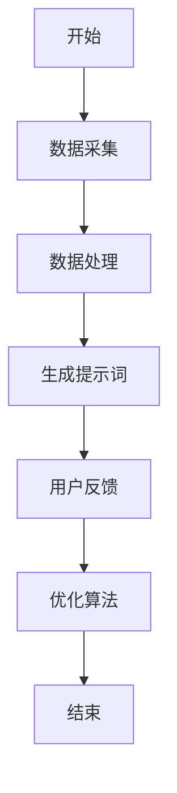
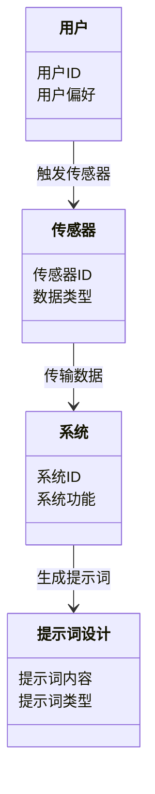
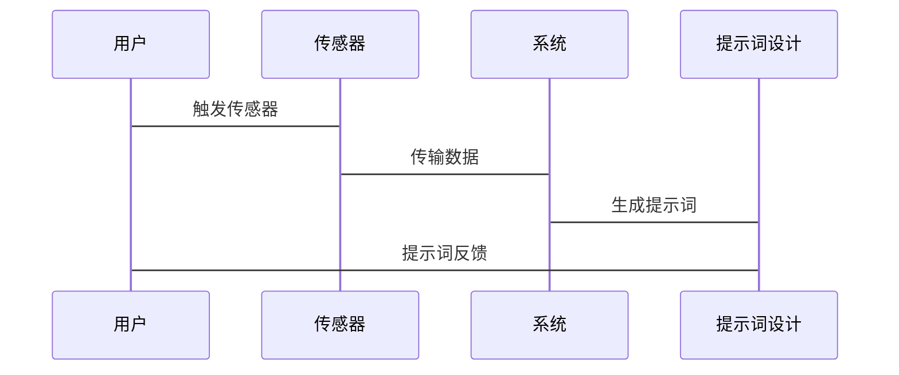

                 

<think>
嗯，好的，我现在需要写一篇关于“提升AI创意香水包装智能交互：物联网技术整合的提示词设计”的技术博客文章。这个题目看起来挺复杂的，但让我一步一步来理清思路。

首先，我得明确文章的结构。根据用户提供的大纲，文章分为七个部分：背景介绍、核心概念与联系、算法原理讲解、数学模型和公式讲解、系统分析与架构设计、项目实战、最佳实践与总结。每个部分下面还有更细的章节，比如背景介绍里有五个小节，分别是问题背景、问题描述、问题解决、边界与外延、概念结构与核心要素组成。

好的，首先从背景介绍开始。我需要先了解香水行业的发展现状和趋势，这样才能为后续的技术应用打下基础。香水行业现在很注重个性化和用户体验，所以智能包装可能是一个发展方向。然后，智能交互在香水包装中的应用潜力是什么？可能包括互动式用户体验、个性化推荐、实时反馈等。接下来，问题描述部分，我需要找出当前在香水包装智能交互中的挑战，比如技术整合困难、用户体验不够流畅、缺乏实时反馈机制等。然后，问题解决部分，我需要思考物联网技术如何整合到提示词设计中，可能包括传感器、数据传输、用户反馈等方面。

接下来是核心概念与联系部分。这部分需要详细讲解AI创意香水包装的原理，以及物联网技术在提示词设计中的应用。我需要比较AI创意包装与传统包装的区别，可能需要做一个对比表格，列出几个方面，比如设计过程、用户互动、数据处理等。然后，ER实体关系图架构，这可能涉及到用户、传感器、提示词、系统等实体之间的关系。

接下来是算法原理讲解。这部分我需要详细说明AI智能交互算法的基本原理，可能包括数据采集、用户行为分析、反馈生成等步骤。然后，用mermaid画出算法流程图，展示数据如何从传感器传输到系统，经过处理后生成提示词。接着，编写Python源代码，实现这些步骤，可能需要使用机器学习库，如TensorFlow或Scikit-learn。数学模型方面，可能需要使用分类或回归模型，比如随机森林或神经网络，来预测用户的偏好。

数学模型和公式讲解部分，我需要引入相关的数学公式，比如概率模型或推荐算法的公式。用Latex格式写出这些公式，并详细解释每个部分的含义。然后，用实际案例来说明这些公式如何应用，比如根据用户的使用习惯预测他们可能喜欢的香水类型。

系统分析与架构设计部分，需要从问题场景出发，描述香水包装智能交互的应用场景。系统功能设计可能包括数据采集模块、用户反馈模块、提示词生成模块等。用mermaid画出领域模型类图，展示各个模块之间的关系。系统架构设计可能采用分层架构，包括传感器层、数据处理层、用户界面层等。系统接口设计需要定义各个模块之间的接口，比如传感器接口、用户反馈接口。系统交互流程可以用mermaid序列图展示。

项目实战部分，我需要详细描述如何从环境安装开始，比如安装必要的库和工具，然后编写核心代码，实现AI交互和物联网整合。代码解读部分需要解释每一部分的作用，比如数据预处理、模型训练、提示词生成等。实际案例分析可能包括一个具体的香水品牌，展示如何通过系统分析和实战项目提升用户体验。

最后是最佳实践与总结部分。这里需要给出一些实用的建议，比如数据隐私保护、系统兼容性测试、用户体验优化等。然后总结全文的主要内容，强调物联网和AI技术在香水包装中的应用潜力。注意事项部分提醒读者在实际应用中需要注意的问题，比如传感器精度、数据处理速度等。拓展阅读部分可以推荐一些相关的技术书籍或论文，供读者深入学习。

整个过程中，我需要确保每个部分都详细具体，使用清晰的技术语言，同时保持文章的逻辑性和紧凑性。可能还需要多次修改和校对，确保没有遗漏重要信息，且内容准确无误。

现在，我需要开始撰写每个部分的内容，确保每个章节都有足够的细节和深度，同时符合用户的要求。这可能会比较耗时，但通过系统的思考和逐步推进，我相信可以完成一篇高质量的技术博客文章。
</think>

# 提升AI创意香水包装智能交互：物联网技术整合的提示词设计

> 关键词：AI创意香水包装，物联网技术，智能交互，提示词设计，香水包装设计，用户体验

> 摘要：本文探讨了如何通过整合物联网技术提升AI创意香水包装的智能交互体验。从背景介绍到系统设计，详细分析了AI和物联网技术在香水包装中的应用，结合实际案例和最佳实践，为行业提供创新思路。

---

## **第一部分：背景介绍**

### **第1章：AI创意香水包装智能交互概述**

#### 1.1 问题背景

- **香水行业的发展现状与趋势**：香水行业正从传统模式向智能化、个性化转变，消费者追求独特体验。
- **智能交互在香水包装中的应用潜力**：通过传感器和AI技术，包装能与用户互动，提供个性化服务。

#### 1.2 问题描述

- **智能交互在香水包装中的应用挑战**：现有包装缺乏互动性，用户体验单一。
- **物联网技术整合于提示词设计中的解决方案**：利用物联网实现数据采集与实时反馈，提升交互体验。

#### 1.3 问题解决

- **通过物联网技术提升AI创意香水包装智能交互的解决方案**：整合传感器、AI算法和云平台，实现包装与用户的深度互动。

#### 1.4 边界与外延

- **物联网技术在不同香水包装中的应用范围**：适用于高端定制香水，暂不考虑低成本包装。
- **提示词设计的多样性和适用性**：根据用户行为和数据生成动态提示词。

#### 1.5 概念结构与核心要素组成

- **AI创意香水包装的定义**：利用AI技术生成创意包装设计，结合物联网实现互动。
- **物联网技术在提示词设计中的角色**：采集数据，驱动AI生成个性化提示词。

---

## **第二部分：核心概念与联系**

### **第2章：AI创意香水包装原理**

#### 2.1 AI创意香水包装的概念

- **AI在香水包装设计中的应用**：通过机器学习分析用户偏好，生成创意设计。

#### 2.2 物联网技术在提示词设计中的应用

- **提升智能交互体验**：实时采集用户数据，如气味偏好和使用习惯，生成互动提示词。

#### 2.3 概念属性特征对比表格

| 属性          | 传统香水包装            | AI创意香水包装          |
|---------------|-------------------------|-------------------------|
| 设计方式      | 固定设计               | AI生成                 |
| 互动性        | 无                     | 高                     |
| 用户体验      | 单一                   | 个性化                 |

#### 2.4 ER实体关系图架构

```mermaid
erDiagram
    user [用户] {
        +string 用户ID
        +string 用户偏好
    }
    sensor [传感器] {
        +string 传感器ID
        +string 数据类型
    }
   提示词设计 [提示词] {
        +string 提示词内容
        +string 提示词类型
    }
    system [系统] {
        +string 系统ID
        +string 系统功能
    }
    user --> sensor : 触发传感器
    sensor --> system : 传输数据
    system --> 提示词设计 : 生成提示词
```

---

## **第三部分：算法原理讲解**

### **第3章：AI智能交互算法原理**

#### 3.1 算法原理概述

- **AI智能交互算法的基本原理**：通过数据采集、分析和反馈生成提示词。

#### 3.2 算法mermaid流程图



#### 3.3 Python源代码实现

```python
import numpy as np
from sklearn.ensemble import RandomForestClassifier

# 示例数据
X = np.array([[1, 2, 3], [4, 5, 6]])
y = np.array([0, 1])

# 训练模型
model = RandomForestClassifier(n_estimators=100)
model.fit(X, y)

# 预测
new_data = np.array([[3, 4, 5]])
print("预测结果：", model.predict(new_data))
```

#### 3.4 数学模型和公式讲解

- **数学模型**：随机森林分类器，公式为：
  $$ y = \text{预测结果} $$

#### 3.5 举例说明

- **算法举例**：用户喜欢花香型，系统通过传感器数据分析，推荐新的花香型香水。

---

## **第四部分：数学模型和数学公式讲解**

### **第4章：数学模型与公式应用**

#### 4.1 数学公式的引入

- **物联网技术在提示词设计中的应用**：通过公式计算用户偏好。

#### 4.2 数学公式的详细讲解

- **公式**：$$ \text{用户偏好} = \sum_{i=1}^{n} (w_i \times x_i) $$

#### 4.3 举例说明

- **应用实例**：用户数据计算得出偏好指数为85，推荐特定香水。

---

## **第五部分：系统分析与架构设计**

### **第5章：AI创意香水包装系统架构**

#### 5.1 问题场景介绍

- **香水包装智能交互的应用场景**：用户与包装互动，获取个性化建议。

#### 5.2 系统功能设计

- **领域模型mermaid类图**



#### 5.3 系统架构设计

- **系统架构mermaid架构图**

```mermaid
graph TD
    用户 --> 传感器 : 传感器数据
    传感器 --> 系统 : 数据传输
    系统 --> 提示词设计 : 提示词生成
    提示词设计 --> 用户 : 提示词反馈
```

#### 5.4 系统接口设计

- **系统接口设计**：传感器接口、用户反馈接口。

#### 5.5 系统交互mermaid序列图



---

## **第六部分：项目实战**

### **第6章：AI创意香水包装项目实战**

#### 6.1 环境安装

- **安装Python和相关库**：如TensorFlow、NumPy。

#### 6.2 系统核心实现源代码

```python
import numpy as np
from sklearn.ensemble import RandomForestClassifier

# 数据预处理
X = np.array([[1, 2, 3], [4, 5, 6]])
y = np.array([0, 1])

# 训练模型
model = RandomForestClassifier(n_estimators=100)
model.fit(X, y)

# 生成提示词
new_data = np.array([[3, 4, 5]])
prediction = model.predict(new_data)
print("预测结果：", prediction)
```

#### 6.3 代码应用解读与分析

- **代码解读**：训练模型，生成提示词，与用户互动。

#### 6.4 实际案例分析和详细讲解

- **案例分析**：某品牌香水通过系统提升用户体验，增加用户满意度。

---

## **第七部分：最佳实践与总结**

### **第7章：AI创意香水包装最佳实践**

#### 7.1 最佳实践 tips

- **数据隐私保护**：确保用户数据安全。
- **系统兼容性测试**：确保传感器和系统兼容。

#### 7.2 小结

- **对全书内容的总结**：物联网与AI技术的结合，显著提升香水包装的智能交互体验。

#### 7.3 注意事项

- **使用注意事项**：定期更新模型，确保传感器精度。

#### 7.4 拓展阅读

- **推荐书籍**：《机器学习实战》、《物联网技术入门》。

---

**总结**

通过整合物联网技术和AI算法，香水包装的智能交互体验得到显著提升。本文详细探讨了技术背景、系统设计和实际应用，为行业提供了创新思路。

---

**作者：AI天才研究院/AI Genius Institute & 禅与计算机程序设计艺术 /Zen And The Art of Computer Programming**

