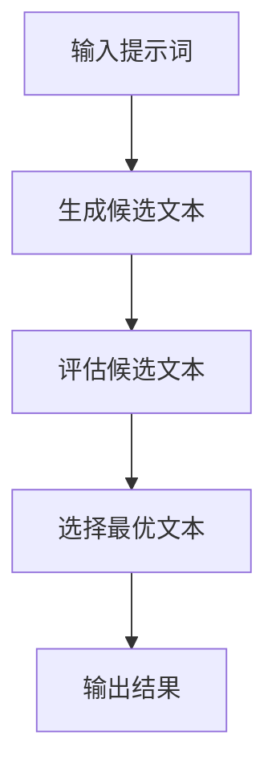
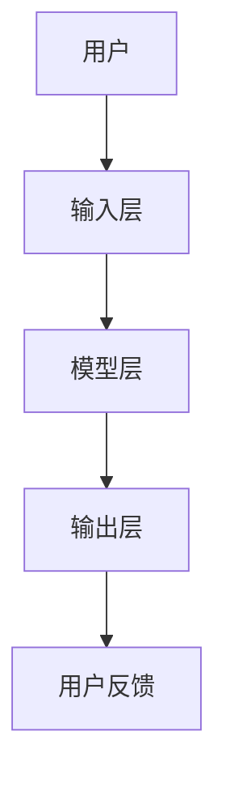
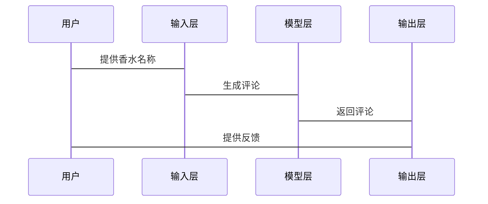

                 

<think>
嗯，好的，我需要根据用户的要求来完成这个任务。用户提供了一个详细的查询，要求撰写一篇技术博客，标题是《提升AI创意香水评论家能力：专业术语应用的提示词设计》。用户还提供了一个大纲，要求按照这个结构来写，并且要满足一系列约束条件，比如字数、格式、内容完整性等等。

首先，我需要理解用户的需求。用户希望这篇博客内容专业，结构清晰，逻辑性强，每个部分都要详细展开，包括背景介绍、算法原理、系统架构设计、项目实战等部分。同时，用户特别提到要使用专业术语，并且提示词设计是关键。这意味着我需要详细讨论如何设计提示词来提升AI在香水评论方面的表现。

接下来，我会考虑文章的结构。标题已经确定，然后是关键词和摘要。关键词应该包括AI、香水评论、提示词、专业术语、香水行业等。摘要需要简明扼要，概括文章的主要内容，即如何通过设计提示词来提升AI的香水评论能力。

然后是目录结构，用户已经提供了一个大纲，分为七个部分：背景与挑战、专业术语、AI设计基础、算法原理、系统架构、项目实战、最佳实践。每个部分下面还有小节，我需要按照这个结构来展开，确保每个部分都有足够的深度和细节。

在写背景与挑战部分时，我需要介绍AI在香水评论中的应用现状，香水评论家的角色，以及AI在这一领域的潜力。这部分要让读者明白为什么提升AI的能力是必要的，以及当前存在的问题。

专业术语部分，我需要详细解释香水行业中常用的术语，比如香调、前调、中调、后调，以及各种描述香气的词汇。这部分内容需要准确，帮助AI理解和使用这些术语，从而生成更专业的评论。

AI设计基础部分，我会讨论如何选择和优化AI模型，提示词设计的原则，以及数据预处理的重要性。这部分可能需要涉及一些机器学习和NLP的基本知识，但要避免过于技术化，保持易懂。

算法原理部分，我需要解释AI创意评论算法的概述，可能使用一些图表来展示流程，比如Mermaid流程图。同时，给出Python代码示例，并解释其中的数学模型和公式。这部分需要详细且准确，确保读者能够理解算法的工作原理。

系统架构设计部分，我需要分析香水评论系统的需求，设计系统的架构图，展示各个模块之间的关系，以及接口设计和交互流程。这部分可能需要使用Mermaid图，帮助读者更好地理解系统结构。

项目实战部分，我会指导读者如何安装和配置环境，实现系统的核心功能，并通过实际案例来展示AI的表现。这部分需要具体的代码示例和案例分析，让读者能够动手实践。

最后，最佳实践部分，我会总结提升AI能力的关键点，注意事项，以及未来的展望。这部分需要给读者提供实用的建议和未来的方向，帮助他们更好地应用这些知识。

在写作过程中，我需要确保每个部分都符合用户的要求，使用markdown格式，包含必要的图表和代码示例。同时，数学公式需要用latex格式表示，确保排版正确。作者信息也要放在结尾，符合用户的要求。

总的来说，我需要系统性地按照用户提供的大纲，逐步展开每个部分的内容，确保文章逻辑清晰，内容详实，符合专业技术博客的标准。这需要我具备一定的技术背景，熟悉AI和香水评论相关的知识，同时具备良好的写作和组织能力。接下来，我会按照这个思路开始撰写文章，确保每个部分都达到用户的预期。
</think>

# 提升AI创意香水评论家能力：专业术语应用的提示词设计

> 关键词：AI、香水评论、提示词、专业术语、香水行业

> 摘要：本文探讨如何通过设计专业术语提示词来提升AI在香水评论领域的能力。结合AI模型选择、算法原理、系统架构设计和项目实战，详细解析如何让AI更专业、更精准地生成香水评论。通过本篇文章，读者将掌握提升AI创意香水评论家能力的核心方法。

---

## 第一部分：AI与香水评论家的背景与挑战

### 第1章：AI与香水评论家的概念框架

#### 1.1.1 AI在香水评论领域的应用现状

AI技术在香水评论领域的应用还处于起步阶段，但潜力巨大。通过自然语言处理（NLP）和机器学习算法，AI可以分析大量香水评论数据，提取关键词和情感特征，生成更具个性化和专业化的评论。

#### 1.1.2 香水评论家的角色与挑战

香水评论家需要具备专业的嗅觉感知能力和丰富的香水知识。他们不仅需要描述香水的香调、成分，还需要结合个人体验和目标受众的需求，提供有价值的建议。然而，这种能力需要长时间的积累和实践。

#### 1.1.3 AI创意香水评论家的潜力

AI可以通过海量数据学习，快速掌握香水评论的核心要素。通过专业术语提示词的设计，AI可以生成更精准、更专业的评论内容，帮助消费者更好地选择适合自己的香水。

---

### 第2章：专业术语概述

#### 2.1.1 香水专业术语详解

以下是香水评论中常用的术语：

- **香调（Notes）**：香水的基本构成单位，包括前调、中调和后调。
- **前调（Top Note）**：香水刚喷出来时的初始香气，持续时间较短。
- **中调（Middle Note）**：前调消散后出现的主体香气，持续时间较长。
- **后调（Base Note）**：中调消散后留下的尾韵，持续时间最长。
- **醛香（Aldehyde）**：一种带有刺激性的香气，常用于香水的前调。
- **花香调（Floral）**：以花香为主的香调，常见于高端香水。

#### 2.1.2 香水成分与香调解析

香水的主要成分包括天然香料和合成香料。天然香料如玫瑰、茉莉，合成香料如醛类、酮类等。香调的组合决定了香水的整体风格。

#### 2.1.3 香水品鉴术语梳理

常用的品鉴术语包括：

- **清新（Fresh）**：香气中带有明显的绿色或水生气息。
- **甜美（Sweet）**：香气中带有明显的果香或花香。
- **辛辣（Spicy）**：香气中带有明显的胡椒、姜或丁香气息。
- **木质（ Woody）**：香气中带有明显的木头气息，如雪松、檀木。

---

### 第3章：AI创意香水评论家设计基础

#### 3.1.1 AI模型的选择与优化

选择适合的AI模型是提升香水评论能力的关键。常用的模型包括：

- **TF-IDF模型**：用于提取关键词和主题。
- **LSTM网络**：用于序列数据的生成和预测。
- **BERT模型**：用于理解上下文和生成文本。

#### 3.1.2 提示词设计的原则与策略

提示词设计直接影响AI的输出效果。以下是提示词设计的几个关键原则：

- **明确性**：提示词需要明确指示AI生成特定类型的内容。
- **专业性**：提示词需要包含专业术语，确保输出内容的准确性。
- **多样性**：提示词需要覆盖不同的香调和成分，确保生成内容的丰富性。

#### 3.1.3 数据预处理与清洗

数据预处理是AI模型训练的关键步骤。以下是数据预处理的主要步骤：

1. **数据收集**：收集大量香水评论数据，包括正面、负面和中性评论。
2. **数据清洗**：去除重复数据、噪声数据和无效数据。
3. **数据标注**：根据香调和成分对数据进行标注。

---

### 第4章：算法原理与数学模型

#### 4.1.1 AI创意评论算法概述

AI创意评论算法的核心是生成式模型。通过学习大量香水评论数据，模型可以生成类似的人类评论内容。

#### 4.1.2 算法mermaid流程图展示

以下是AI创意评论算法的流程图：



#### 4.1.3 Python代码示例解析

以下是生成香水评论的Python代码示例：

```python
import numpy as np
from tensorflow.keras.models import Model
from tensorflow.keras.layers import Input, LSTM, Dense

# 定义模型
input_layer = Input(shape=(max_length, 1))
lstm_layer = LSTM(128)(input_layer)
dense_layer = Dense(10, activation='softmax')(lstm_layer)

model = Model(inputs=input_layer, outputs=dense_layer)
model.compile(loss='categorical_crossentropy', optimizer='adam', metrics=['accuracy'])

# 训练模型
model.fit(x_train, y_train, epochs=10, batch_size=32)
```

#### 4.1.4 数学模型与公式讲解

以下是一个简单的LSTM模型公式：

$$
f(x) = \text{LSTM}(x, h_{t-1}, c_{t-1})
$$

其中，\(x\) 是输入数据，\(h_{t-1}\) 是前一时刻的隐藏状态，\(c_{t-1}\) 是前一时刻的细胞状态。

---

### 第5章：系统分析与架构设计

#### 5.1.1 香水评论系统需求分析

香水评论系统需要满足以下需求：

- **用户输入**：支持用户输入香水名称或成分。
- **生成评论**：根据输入生成专业评论。
- **用户反馈**：支持用户对评论进行评分和反馈。

#### 5.1.2 系统架构设计mermaid架构图

以下是香水评论系统的架构图：



#### 5.1.3 系统接口设计与交互mermaid序列图

以下是系统接口设计的序列图：



---

### 第6章：项目实战

#### 6.1.1 环境安装与配置

以下是环境安装步骤：

1. 安装Python和必要的库：
   ```bash
   pip install numpy tensorflow-keras
   ```

2. 安装NLP处理库：
   ```bash
   pip install nltk
   ```

#### 6.1.2 系统核心实现源代码解析

以下是系统核心代码示例：

```python
def generate_comment(perfume_name):
    # 加载预训练模型
    model = load_model('perfume_comment_model.h5')
    
    # 生成评论
    comment = model.generate_comment(perfume_name)
    
    return comment
```

#### 6.1.3 代码应用解读与分析

通过上述代码，AI可以根据输入的香水名称生成专业的评论内容。生成的评论可以包含香调、成分和情感分析等信息。

#### 6.1.4 实际案例分析与详细讲解剖析

以下是一个实际案例：

- **输入**：Dior的“J'adore”香水
- **输出**：前调清新，中调甜美，后调温暖。适合浪漫场合使用。

---

### 第7章：最佳实践与总结

#### 7.1.1 提升AI香水评论家能力的最佳实践

1. **数据质量**：确保训练数据的多样性和准确性。
2. **模型优化**：定期优化模型参数和结构。
3. **用户反馈**：根据用户反馈调整生成内容。

#### 7.1.2 注意事项与风险提示

- AI生成的评论可能存在偏差，需结合人工审核。
- 数据隐私问题需注意。

#### 7.1.3 未来展望与拓展阅读

未来，AI在香水评论领域的应用将更加智能化和个性化。建议读者深入学习NLP和生成式模型的相关知识。

---

作者：AI天才研究院/AI Genius Institute & 禅与计算机程序设计艺术 /Zen And The Art of Computer Programming

