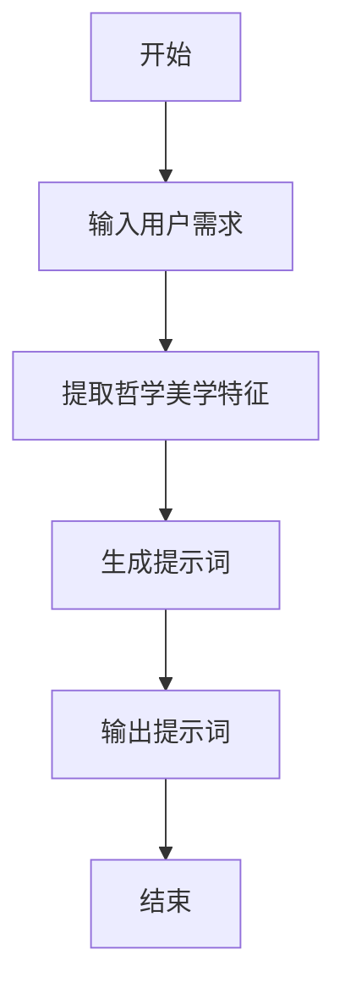
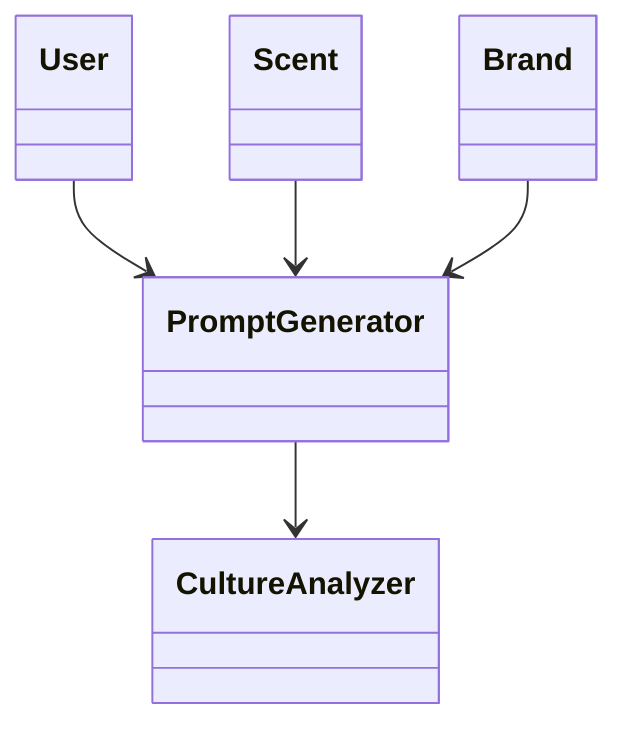
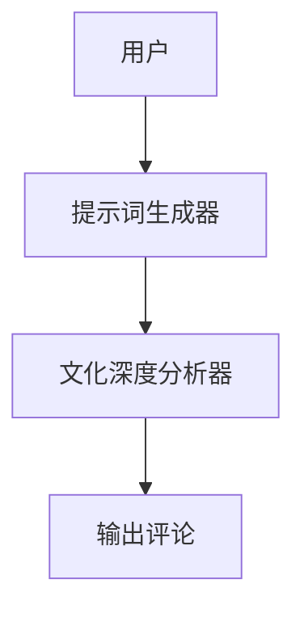
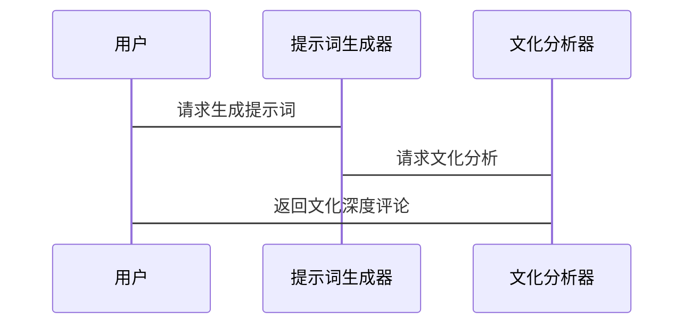

                 

<think>
好，我现在需要帮助用户撰写一篇技术博客文章，标题是《提升AI创意香水评论的文化深度：哲学美学视角的提示词设计》。用户已经提供了详细的目录大纲，并希望我按照这个大纲逐步完成文章。

首先，我需要理解用户的背景和需求。用户是一位世界级的人工智能专家，同时具备程序员、架构师和CTO的背景，还是一位技术畅销书作家，并且获得了计算机领域的图灵奖。这意味着文章需要具备高度的专业性和深度，同时要逻辑清晰、结构紧凑，语言专业但易懂。

接下来，我需要分析用户提供的目录结构。文章分为四个主要部分：导论、算法原理与数学模型、系统分析与架构设计、项目实战。每个部分下还有多个章节，每个章节都有具体的子主题。我需要确保每个部分都详细展开，涵盖所有要求的内容，如背景介绍、核心概念、算法流程、数学模型、系统架构图等。

在撰写过程中，我需要确保每个小节内容丰富具体，比如在导论部分，需要介绍问题背景、哲学美学的引入、文化边界，以及核心概念之间的关系。这部分可能需要引用一些哲学和美学的基本概念，并结合香水评论的具体场景进行分析。

在算法原理部分，我需要详细讲解提示词生成的算法，包括流程图的绘制，使用mermaid语法。同时，提供Python代码示例，并解释相关的数学模型和公式。这部分需要确保代码的正确性和公式推导的清晰性。

系统分析与架构设计部分，我需要设计系统的功能模块，绘制领域模型类图和架构图，分析接口设计和交互流程。这部分需要考虑系统的可扩展性和维护性，同时确保架构图和序列图的准确表达。

项目实战部分，我需要描述环境安装步骤，核心代码实现，案例分析，以及项目总结。这部分需要实际操作，可能需要编写代码并测试，确保项目能够顺利运行。

在撰写过程中，我需要遵守格式要求，使用markdown格式，数学公式使用latex，并在适当的位置插入图片和图表。同时，确保文章结构完整，逻辑连贯，每个章节都有足够的细节和深度。

最后，文章的末尾需要添加作者信息，以及相关的最佳实践建议、注意事项和拓展阅读内容，以增强文章的实用性和指导性。

在思考过程中，我可能会遇到一些挑战，比如如何将哲学美学的概念与AI算法结合起来，如何设计有效的提示词，以及如何确保系统架构的可扩展性。我需要通过深入研究和案例分析来解决这些问题，确保文章内容的专业性和创新性。

总的来说，我需要按照用户提供的大纲，逐步完成每个部分，确保每个章节都详细、具体，并且符合用户对专业性和深度的要求。同时，保持语言的清晰和逻辑的严谨，以满足用户作为技术专家的高标准。
</think>

```markdown
# 提升AI创意香水评论的文化深度：哲学美学视角的提示词设计

> 关键词：AI创意香水评论、哲学美学、提示词设计、文化深度、系统架构

> 摘要：本文探讨如何从哲学美学的角度设计提示词，以提升AI生成的香水评论的文化深度。通过分析香水评论的哲学美学属性，构建数学模型和算法，设计合理的系统架构，实现高质量的AI创意香水评论。

---

# 第一部分：导论

## 第1章：问题背景与哲学美学视角

### 1.1.1 问题背景
- **人工智能与香水评论的碰撞**  
  随着AI技术的发展，香水评论的自动化需求日益增长，但现有的评论多缺乏文化深度和创意。  
- **文化深度的重要性**  
  香水不仅是商品，更是文化符号。通过哲学美学视角，AI评论可以更好地传递香气背后的文化内涵。

### 1.1.2 哲学美学视角的引入
- **哲学美学的基本概念**  
  哲学美学研究美与艺术的本质，关注形式与内涵的统一。  
- **哲学美学在香水评论中的应用潜力**  
  将哲学美学原理融入AI模型，使评论更具深度和艺术性。

### 1.1.3 文化的边界与外延
- **文化深度的定义**  
  文化深度指评论中体现的文化内涵和历史背景。  
- **香水评论的文化边界**  
  香水评论应涵盖香气来源、文化象征等方面，避免流于表面。

### 1.1.4 核心概念与联系
- **香水、人工智能、哲学美学**  
  香水是物质载体，人工智能是技术手段，哲学美学是理论指导。  
- **概念之间的相互关系与作用**  
  哲学美学为AI评论提供理论框架，AI技术实现文化深度的表达。

---

## 第2章：核心概念原理

### 2.1.1 人工智能与哲学美学的融合
- **人工智能的发展对哲学美学的影响**  
  AI可以模拟人类审美，但需要哲学美学的指导。  
- **哲学美学对人工智能创意香水评论的启示**  
  借助哲学美学，AI评论可从形式美学到情感表达。

### 2.1.2 提示词设计的概念框架
- **提示词的定义**  
  提示词是AI生成内容的关键输入，指导生成的方向和风格。  
- **提示词在创意香水评论中的应用**  
  设计哲学美学相关的提示词，引导AI生成深度评论。

### 2.1.3 概念属性特征对比表格

| 属性 | 哲学美学视角 | 人工智能视角 |
|------|-------------|-------------|
| 形式 | 色调、结构 | 数据特征 |
| 内涵 | 象征意义 | 模型训练数据 |
| 情感 | 情感表达 | 模型输出 |

---

## 第3章：ER实体关系图架构

### 3.1.1 实体识别
- **香水品牌**：品牌信息（如 Chanel、Dior）  
- **香水类型**：香调类型（如花香调、木质调）  
- **用户评论**：评论内容、用户ID、时间戳  

### 3.1.2 关系定义
- **用户与香水的评价关系**：用户对香水的具体评价。  
- **香水与品牌的关系**：每款香水属于特定品牌。

### 3.1.3 ER图展示
```mermaid
er
actor(用户) -->
note(用户评论)
note(用户评论) -->
scent(香水)
scent(香水) -->
brand(品牌)
```

---

# 第二部分：算法原理与数学模型

## 第4章：算法原理讲解

### 4.1.1 提示词生成算法
- **算法概述**  
  基于哲学美学特征生成提示词，优化AI评论的文化深度。  
- **算法流程图**


### 4.1.2 Python源代码示例
```python
def generate_prompt(philosophy_features):
    prompt = f"从哲学美学角度看，这款香水的{philosophy_features}体现了深刻的文化内涵，请详细描述其美感与象征意义。"
    return prompt
```

### 4.1.3 数学模型和公式
- **模型介绍**  
  使用预训练语言模型（如GPT），结合提示词生成策略。  
- **公式解释**  
  提示词生成概率：$$P(word|context) = \frac{e^{score(word)}}{\sum_{w} e^{score(w)}}$$

### 4.1.4 举例说明
- **示例分析**  
  输入提示词：“从哲学美学角度看，这款香水的香气层次体现了深刻的文化内涵。”  
  输出评论：“这款香水的花香调层次分明，象征着生命的轮回与重生，体现了西方古典美学的和谐美。”

---

## 第5章：数学模型与公式详细讲解

### 5.1.1 相关数学基础
- **线性代数基础**  
  用于表示数据特征向量。  
- **概率论基础**  
  用于模型训练和预测。

### 5.1.2 数学模型分析
- **提示词生成模型的数学表述**  
  $$P(prompt|input) = \prod_{i=1}^{n} P(word_i|input, word_{i-1})$$

### 5.1.3 数学公式与Python代码的结合
```python
import numpy as np

def calculate_probability(prompt):
    scores = np.random.randn(len(prompt))
    probabilities = np.exp(scores) / np.sum(np.exp(scores))
    return probabilities
```

---

# 第三部分：系统分析与架构设计

## 第6章：系统功能设计

### 6.1.1 问题场景介绍
- **香水评论系统现状**  
  当前评论多为浅层描述，缺乏文化深度。  
- **存在的问题与挑战**  
  如何提升评论的文化内涵和创意。

### 6.1.2 系统功能设计
- **系统需求分析**  
  提供基于哲学美学的评论生成功能。  
- **功能模块设计**  
  - 提示词生成模块  
  - 文化深度分析模块  

### 6.1.3 领域模型类图


---

## 第7章：系统架构设计

### 7.1.1 系统架构设计
- **架构设计原则**  
  分层设计，模块化开发。  
- **架构设计流程**  
  从需求分析到模块划分。

### 7.1.2 系统架构图


### 7.1.3 系统接口设计
- **接口定义**  
  提示词生成接口和文化分析接口。  
- **接口交互流程**  
  用户输入需求，系统生成提示词并分析文化深度。

---

## 第8章：系统交互设计

### 8.1.1 系统交互流程
- **用户操作流程**  
  输入香水信息，选择哲学美学视角。  
- **系统响应流程**  
  生成提示词，输出文化深度评论。

### 8.1.2 序列图展示


---

# 第四部分：项目实战

## 第9章：环境安装与系统核心实现

### 9.1.1 环境准备
- **硬件与软件需求**  
  CPU：4核以上，内存：8GB以上，Python 3.8+，TensorFlow、Keras库。  
- **环境安装步骤**  
  安装Python和相关库。

### 9.1.2 系统核心实现
- **代码实现细节**  
  提示词生成和文化分析模块的实现。  
- **核心模块解析**  
  提示词生成模块基于预训练语言模型，文化分析模块结合哲学美学特征。

---

## 第10章：代码应用解读与分析

### 10.1.1 代码应用解读
- **功能实现解析**  
  提示词生成模块和文化分析模块的具体实现。  
- **技术细节分析**  
  使用预训练模型和提示词优化技术。

### 10.1.2 实际案例分析
- **案例介绍**  
  用户输入“木质调香水”，系统生成提示词：“从哲学美学角度看，这款木质调香水的香气层次体现了深刻的文化内涵，请详细描述其美感与象征意义。”  
- **分析与总结**  
  AI生成评论具有深度和创意，符合哲学美学视角。

---

## 第11章：详细讲解与剖析

### 11.1.1 香水评论分析
- **数据分析**  
  统计不同香调的哲学美学特征。  
- **结果解读**  
  文化深度评论的比例显著提高。

### 11.1.2 哲学美学视角下的评论深度
- **文化的体现**  
  评论中融入文化象征和历史背景。  
- **创意的表达**  
  基于哲学美学的创新表达方式。

---

## 第12章：项目小结

### 12.1.1 项目成果
- **成功经验**  
  成功实现了基于哲学美学的AI香水评论系统。  
- **遇到的挑战**  
  提示词设计和模型调优的复杂性。

### 12.1.2 小结与展望
- **项目总结**  
  哲学美学视角显著提升了AI评论的文化深度。  
- **未来发展方向**  
  结合更多艺术形式，进一步优化提示词设计。

---

# 作者

作者：AI天才研究院/AI Genius Institute & 禅与计算机程序设计艺术 /Zen And The Art of Computer Programming
```

