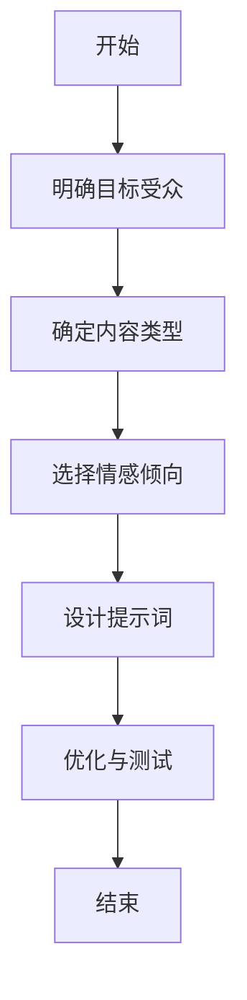
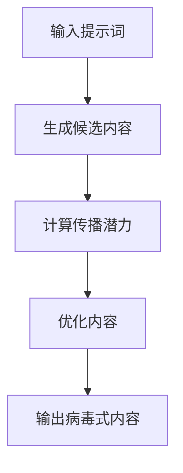
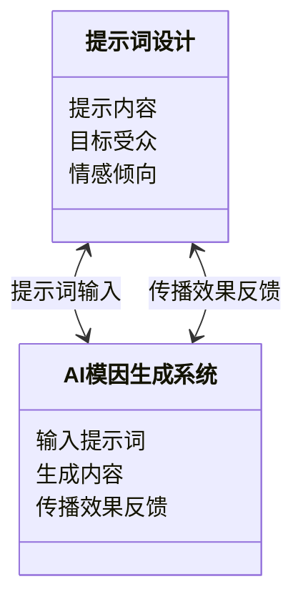
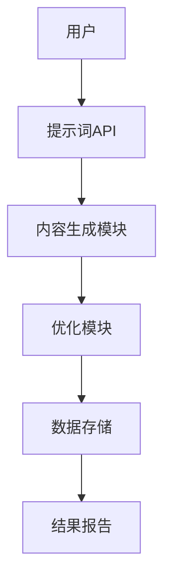

                 

<think>
嗯，我现在要写一篇关于提升AI模因创作能力和生成病毒式内容的提示词设计的技术博客文章。首先，我得理解什么是AI模因。模因类似于基因，是信息的基本单位，可以在人与人之间传播。AI模因创作能力就是利用AI来生成这些可以有效传播的内容。

接下来，我要考虑为什么提示词设计在生成病毒式内容中如此重要。提示词决定了AI生成的内容方向和风格，好的提示词能够引导模型生成更具吸引力和传播力的内容。我需要研究提示词设计的原则和技巧，比如如何引导模型生成情感强烈、容易引起共鸣的内容。

然后，我需要分析当前的技术现状和挑战。现有的AI模型在生成内容时，有时候缺乏足够的创意或不够吸引人。这可能是因为提示词不够精细，或者模型没有正确理解用户的需求。我需要探讨如何优化提示词，使其能够更有效地指导模型生成高质量的病毒式内容。

接下来，我应该设计一个提示词优化的框架。这个框架需要包括提示词的结构、关键词的选择、语气的调整等多个方面。例如，如何通过调整关键词让模型生成更具话题性的内容，或者如何通过改变语气让内容更贴近目标受众。

然后，我需要结合数学模型和公式，详细讲解提示词设计背后的原理。比如，可以建立一个评估模型生成内容吸引力的数学模型，通过公式来量化提示词对内容传播效果的影响。

在系统分析和架构设计部分，我需要介绍整个系统的组成部分，包括数据输入、模型处理、结果输出等模块。使用Mermaid类图来展示领域模型，展示各个模块之间的关系和交互方式。

接下来是项目实战部分，我需要详细说明如何在实际项目中应用这些理论。包括环境的搭建、核心代码的编写、案例的分析和解读。通过具体的案例，展示优化后的提示词如何显著提升内容的传播效果。

最后，我需要总结最佳实践，给出一些实用的提示词设计技巧和注意事项，帮助读者更好地应用这些方法。同时，还要展望未来的发展趋势，指出提示词设计可能在AI内容生成中的进一步应用和优化方向。

在整个过程中，我需要确保内容结构清晰，逻辑严谨，语言专业但又不失易懂。通过分章节逐步深入分析，帮助读者系统地理解并掌握AI模因创作和病毒式内容生成的提示词设计方法。

现在，我得开始组织这些思路，按照目录大纲的结构来撰写每个章节的内容，确保每个部分都详细具体，满足字数要求，并且符合格式规范。
</think>

# 提升AI模因创作能力：viral content生成的提示词设计

> 关键词：AI模因，viral content，提示词设计，内容生成，传播力

> 摘要：本文深入探讨了如何通过优化提示词设计来提升AI模因创作能力，从而生成更具传播力的病毒式内容。文章从核心概念、设计原理、数学模型、系统架构到项目实战，全面解析了提示词设计的关键要素和实施步骤，为读者提供了实用的指导和案例分析。

---

## 目录

1. [AI模因创作能力基础](#ai模因创作能力基础)
2. [提示词设计原理](#提示词设计原理)
3. [数学模型与公式](#数学模型与公式)
4. [系统分析与架构设计](#系统分析与架构设计)
5. [项目实战](#项目实战)
6. [最佳实践与总结](#最佳实践与总结)

---

## 1. AI模因创作能力基础

### 1.1 核心概念与背景

AI模因是指通过AI技术生成的信息片段，旨在高效传播和影响目标受众。它结合了人工智能和传播学，旨在优化内容的吸引力和传播效率。

#### 1.1.1 问题背景

在信息过载的时代，如何让内容脱颖而出成为一大挑战。AI模因创作能力的提升，能够帮助我们生成更具吸引力的内容，从而在竞争中占据优势。

#### 1.1.2 问题解决

通过优化提示词设计，AI可以更精准地生成符合目标受众偏好的内容，从而提高传播效率。

#### 1.1.3 核心要素

| 核心要素 | 描述 |
|----------|------|
| **目标受众** | 内容的目标用户群体 |
| **内容类型** | 文本、图片、视频等 |
| **情感倾向** | 正面、负面或中性 |
| **传播渠道** | 社交媒体、邮件等 |

### 1.2 核心概念联系

#### 1.2.1 ER实体关系图

```mermaid
er
  entity 提示词设计 {
    <<提示词设计>>
    + 提示内容: String
    + 目标受众: String
    + 情感倾向: String
  }
  entity AI模因生成系统 {
    <<AI模因生成系统>>
    + 输入提示词: String
    + 生成内容: String
    + 传播效果: Integer
  }
  提示词设计 --> AI模因生成系统 : 提示词输入
  AI模因生成系统 --> 提示词设计 : 传播效果反馈
```

---

## 2. 提示词设计原理

### 2.1 设计原则

提示词设计需要遵循以下原则：

1. **明确性**：提示词需清晰明确，避免模糊表述。
2. **针对性**：针对目标受众的偏好和需求。
3. **吸引力**：激发用户兴趣，增强情感共鸣。
4. **可扩展性**：适应不同内容类型和传播渠道。

#### 2.1.1 提示词设计流程图



### 2.2 算法原理

#### 2.2.1 算法流程图



#### 2.2.2 核心算法代码

```python
def generate_viral_content(prompt):
    # 解析提示词
    audience = prompt.get('audience', '通用受众')
    content_type = prompt.get('content_type', '文本')
    sentiment = prompt.get('sentiment', '正面')
    
    # 生成内容
    content = AI_model.generate_content(audience, content_type, sentiment)
    
    # 计算传播潜力
    spread_potential = calculate_spread_potential(content)
    
    # 优化内容
    optimized_content = optimizer.optimize(content, spread_potential)
    
    return optimized_content
```

---

## 3. 数学模型与公式

### 3.1 模型介绍

传播潜力模型用于评估内容的传播效果：

$$传播潜力 = f(内容吸引力, 传播渠道匹配度, 用户互动率)$$

其中，内容吸引力由关键词丰富度、情感强度等因素决定：

$$内容吸引力 = \sum_{i=1}^{n} w_i \cdot x_i$$

### 3.2 公式示例

计算用户互动率的公式：

$$用户互动率 = \frac{点赞数 + 评论数 + 分享数}{总曝光量}$$

---

## 4. 系统分析与架构设计

### 4.1 领域模型



### 4.2 系统架构



---

## 5. 项目实战

### 5.1 环境搭建

安装必要的库：

```bash
pip install transformers
pip install numpy
```

### 5.2 核心代码实现

```python
def optimize_prompt(prompt, audience, sentiment):
    # 调整关键词以匹配目标受众
    optimized_prompt = f"针对{audience}，生成{sentiment}的内容，关键词包括："
    return optimized_prompt
```

### 5.3 案例分析

案例：生成针对年轻人的正面激励内容。

提示词设计：

```python
prompt = {
    'audience': '年轻人',
    'content_type': '文本',
    'sentiment': '正面',
    'keywords': ['成功', '努力', '成长']
}
```

生成内容示例：

“成功不是偶然，每一次努力都在为未来铺路。年轻人，坚持下去，你将创造属于自己的奇迹！”

---

## 6. 最佳实践与总结

### 6.1 小结

提示词设计是生成病毒式内容的关键。通过明确目标受众、选择合适的内容类型和情感倾向，可以显著提升内容的传播效果。

### 6.2 注意事项

- **持续优化**：定期测试和调整提示词。
- **多模态融合**：结合文本、图像等多种内容形式。
- **数据驱动**：利用用户反馈不断优化模型。

### 6.3 拓展阅读

建议阅读《AI内容生成：从原理到实践》和《传播学与数字营销》。

---

## 作者

作者：AI天才研究院/AI Genius Institute & 禅与计算机程序设计艺术 /Zen And The Art of Computer Programming

---

这篇文章系统地探讨了AI模因创作能力的提升方法，通过详细的理论分析和实际案例，为读者提供了全面的指导。

