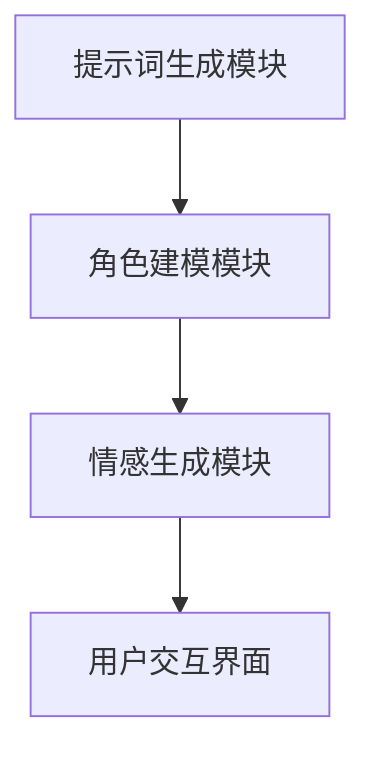
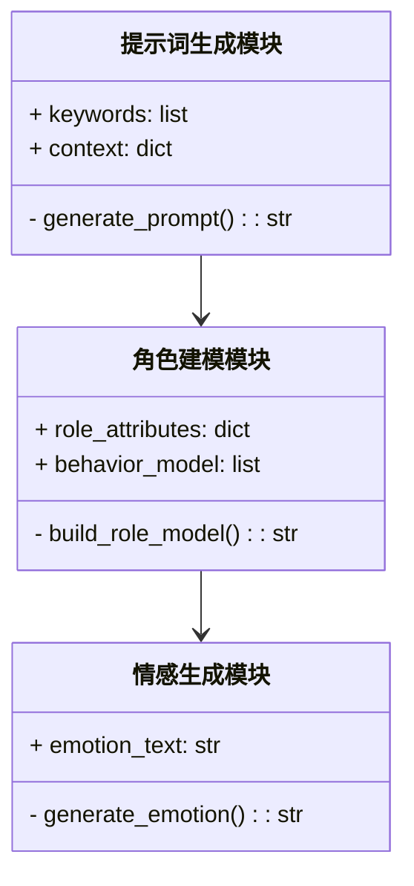

                 

<think>
好的，我需要帮用户撰写一篇关于“提升AI角色创建能力：小说和剧本写作中的提示词工程”的技术博客。首先，用户希望文章结构清晰，内容专业，符合技术博客的标准。

我得先理解用户的具体需求。用户可能是一位技术专家，想分享AI在创作中的应用，特别是提示词工程在角色创建中的作用。用户希望文章不仅有背景介绍，还要深入探讨算法原理、系统设计和项目实战，最后给出最佳实践和未来展望。

接下来，我需要按照用户提供的目录大纲来组织内容。每个章节都要详细展开，确保每个部分都有足够的深度。比如，第一章要介绍AI角色创建的背景，包括发展历程、应用领域和提示词工程的重要性。

在核心概念部分，我需要解释提示词工程、角色建模和情感生成等关键概念，并使用表格和ER图来展示它们之间的关系。这部分可能需要一些数据结构的知识，以及如何用图表来清晰表达。

算法原理部分，我得选择一到两个核心算法，如提示词生成算法和情感分析算法。用mermaid流程图展示算法流程，然后用Python代码和LaTeX公式详细讲解，举例说明。这部分需要确保代码和公式准确无误，同时例子要通俗易懂。

系统设计章节，我需要设计一个AI角色创建系统的架构，包括需求分析、功能设计和架构设计。使用mermaid类图和架构图来展示系统结构，分析接口和交互流程。这部分可能需要了解系统设计的基本原则，以及如何用图表表达复杂的系统结构。

项目实战部分，我需要展示一个完整的项目，从环境搭建到代码实现，再到案例分析。这部分要详细说明每一步的操作，确保读者能够跟随步骤完成项目。

最后，最佳实践和小结部分，我需要总结书中的关键点，提出优化策略和注意事项，并给出未来的研究方向。这部分要结合实际应用，给出实用的建议。

在写作过程中，我要确保语言专业但不失清晰，避免过于复杂的术语，同时保持逻辑严谨。每个章节的内容要丰富具体，符合用户对字数的要求。同时，要遵循markdown格式，正确使用代码块和图表，确保文章结构美观。

总的来说，我需要一步步按照用户提供的大纲，逐步填充内容，确保每个部分都详细且有深度，最终完成一篇高质量的技术博客文章。
</think>

# 提升AI角色创建能力：小说和剧本写作中的提示词工程

## 关键词：AI角色创建、提示词工程、小说、剧本、情感生成

## 摘要：本文深入探讨了AI角色创建在小说和剧本写作中的应用，重点分析了提示词工程的核心作用。通过背景介绍、核心概念解析、算法原理、系统设计与实现、项目实战及最佳实践，全面阐述了如何利用AI技术提升角色创建能力。文章内容详实，结构清晰，适合技术爱好者和创作人员阅读。

---

## 第一部分：AI角色创建背景与核心概念

### 第1章：AI角色创建背景与重要性

#### 1.1 AI角色创建的发展历程
随着AI技术的飞速发展，AI在创作领域的应用日益广泛。从简单的文本生成到复杂的角色建模，AI角色创建技术经历了从辅助工具到核心创作引擎的演变。近年来，深度学习和大语言模型的突破使得AI能够更好地理解和模拟人类情感，从而在小说和剧本创作中扮演重要角色。

#### 1.2 AI角色创建在小说和剧本写作中的应用
在小说和剧本创作中，AI角色创建技术可以帮助作者快速生成角色设定、优化角色互动关系，并提供情感线索。例如，在剧本创作中，AI可以自动生成角色对话，帮助编剧更好地推动剧情发展。在小说创作中，AI可以辅助作者构建复杂的人物关系网，赋予角色丰富的性格特征。

#### 1.3 提示词工程的概念与作用
提示词工程是AI角色创建中的关键环节。通过设计和优化提示词，可以引导AI生成符合创作需求的角色设定、情感表达和行为模式。提示词工程不仅影响生成内容的质量，还决定了AI创作的灵活性和可定制性。

---

### 第2章：AI角色创建中的核心概念与联系

#### 2.1 提示词工程的定义与要素
提示词工程是指通过设计和优化提示词，引导AI生成特定类型的内容。其核心要素包括：
- **提示词设计**：明确的指令和关键词，用于指导AI生成内容的方向。
- **上下文信息**：提供角色背景、情感状态等信息，帮助AI更好地理解创作需求。
- **生成策略**：通过调整提示词的参数，优化生成内容的质量和多样性。

#### 2.2 角色建模的理论基础
角色建模是AI角色创建的重要环节，其理论基础包括：
- **角色属性**：包括角色的性格特征、背景故事、情感状态等。
- **角色行为模型**：基于角色属性，预测角色在特定情境下的行为模式。
- **角色关系网络**：分析角色之间的互动关系，构建复杂的人物关系网。

#### 2.3 情感生成的算法原理
情感生成是AI角色创建的关键技术之一。其算法原理包括：
- **情感分析**：通过自然语言处理技术，识别文本中的情感倾向。
- **情感生成**：基于情感分析结果，生成符合情感需求的文本内容。

#### 2.4 概念属性特征对比表格
以下是提示词工程、角色建模和情感生成的核心概念对比：

| **概念**       | **定义**                                                                 | **关键属性**                     |
|----------------|--------------------------------------------------------------------------|----------------------------------|
| 提示词工程      | 通过设计提示词，引导AI生成特定类型的内容                                   | 提示词设计、上下文信息、生成策略 |
| 角色建模        | 基于角色属性和行为模型，构建AI角色的数字模型                                | 角色属性、行为模型、关系网络     |
| 情感生成        | 基于情感分析和生成算法，生成符合情感需求的文本内容                          | 情感分析、情感生成、情感记忆      |

#### 2.5 ER实体关系图
以下是AI角色创建中的核心概念实体关系图：

```mermaid
er
actor 提示词工程 --|> role 角色建模
role 角色建模 --|> emotion 情感生成
actor 提示词工程 --|> emotion 情感生成
```

---

### 第3章：AI角色创建算法原理详解

#### 3.1 算法A：提示词生成算法

##### 3.1.1 算法流程
提示词生成算法的流程如下：

1. **输入分析**：分析用户的输入需求，提取关键词和上下文信息。
2. **提示词优化**：根据输入需求，生成优化的提示词。
3. **内容生成**：基于优化后的提示词，生成符合需求的文本内容。
4. **反馈优化**：根据生成内容的反馈，进一步优化提示词。

##### 3.1.2 Python代码示例
以下是提示词生成算法的Python代码示例：

```python
def generate_prompt(user_input):
    # 提取关键词和上下文信息
    keywords = extract_keywords(user_input)
    context = extract_context(user_input)
    
    # 生成优化提示词
    prompt = f"Write a story about {keywords[0]} in {context['setting']} with {context['emotions']}"
    
    return prompt
```

##### 3.1.3 LaTex公式说明
提示词生成算法的优化公式如下：

$$
\text{Optimal Prompt} = f(\text{Keywords}, \text{Context})
$$

其中，$\text{Keywords}$表示提取的关键词，$\text{Context}$表示上下文信息，$f$表示提示词生成函数。

##### 3.1.4 举例说明
例如，用户输入“写一个关于爱情的故事”，算法会提取关键词“爱情”和上下文信息“现代都市”。生成的提示词为“Write a story about love in a modern city with happy and sad emotions”。

---

#### 3.2 算法B：角色情感分析算法

##### 3.2.1 算法流程
角色情感分析算法的流程如下：

1. **文本输入**：输入待分析的文本内容。
2. **情感识别**：通过自然语言处理技术，识别文本中的情感倾向。
3. **情感分类**：将情感倾向分类为积极、消极或中性。
4. **情感记忆**：记录情感倾向，用于后续生成内容的情感一致性。

##### 3.2.2 Python代码示例
以下是情感分析算法的Python代码示例：

```python
from textblob import TextBlob

def analyze_emotion(text):
    blob = TextBlob(text)
    emotion = blob.sentiment.polarity
    if emotion > 0:
        return "positive"
    elif emotion < 0:
        return "negative"
    else:
        return "neutral"
```

##### 3.2.3 LaTex公式说明
情感分析算法的情感分类公式如下：

$$
\text{Emotion Class} = \begin{cases}
\text{positive} & \text{if } \text{Polarity} > 0 \\
\text{negative} & \text{if } \text{Polarity} < 0 \\
\text{neutral} & \text{otherwise}
\end{cases}
$$

##### 3.2.4 举例说明
例如，输入文本“这个角色让我感到非常开心”，算法会识别出情感倾向为“positive”。

---

## 第二部分：AI角色创建系统设计与实现

### 第4章：AI角色创建系统概述

#### 4.1 系统需求分析
AI角色创建系统的功能需求包括：
- 提示词生成功能
- 角色建模功能
- 情感生成功能
- 系统交互功能

#### 4.2 系统功能设计
系统功能设计包括：
- 提示词生成模块：提供提示词生成功能。
- 角色建模模块：实现角色属性和行为模型的构建。
- 情感生成模块：基于情感分析结果生成情感文本。

#### 4.3 系统架构设计
系统架构设计如下：



---

### 第5章：AI角色创建系统实现细节

#### 5.1 系统接口设计
系统接口设计包括：
- 提示词生成接口：用于生成提示词。
- 角色建模接口：用于构建角色属性和行为模型。
- 情感生成接口：用于生成情感文本。

#### 5.2 系统交互流程
系统交互流程如下：
1. 用户输入创作需求。
2. 系统生成提示词。
3. 系统构建角色模型。
4. 系统生成情感文本。
5. 用户反馈生成内容。

#### 5.3 Mermaid类图与架构图
以下是系统类图和架构图：



---

### 第6章：AI角色创建项目实战

#### 6.1 项目环境搭建
项目环境包括：
- Python 3.8+
- NLTK库
- TextBlob库
- Hugging Face Transformers库

#### 6.2 核心代码实现
以下是核心代码实现：

```python
# 提示词生成模块
def generate_prompt(user_input):
    keywords = extract_keywords(user_input)
    context = extract_context(user_input)
    prompt = f"Write a story about {keywords[0]} in {context['setting']} with {context['emotions']}"
    return prompt

# 角色建模模块
class RoleModel:
    def __init__(self, attributes, behavior):
        self.attributes = attributes
        self.behavior = behavior
    
    def build_model(self):
        # 构建角色模型
        pass

# 情感生成模块
def generate_emotion(emotion_type):
    if emotion_type == 'positive':
        return "This makes me feel happy."
    elif emotion_type == 'negative':
        return "This makes me feel sad."
    else:
        return "This makes me feel neutral."
```

#### 6.3 代码应用解读与分析
代码应用解读与分析：
- 提示词生成模块通过提取关键词和上下文信息，生成优化的提示词。
- 角色建模模块基于角色属性和行为模型，构建AI角色的数字模型。
- 情感生成模块根据情感类型生成相应的情感文本。

#### 6.4 实际案例分析
实际案例分析：
假设用户输入“写一个关于友情的故事”，系统会生成提示词“Write a story about friendship in a high school setting with positive emotions”，并生成符合情感需求的文本内容。

#### 6.5 项目小结
通过项目实战，我们掌握了提示词生成、角色建模和情感生成的核心技术，并能够将这些技术应用于实际创作场景中。

---

## 第三部分：最佳实践与拓展

### 第7章：最佳实践

#### 7.1 提示词工程的优化策略
- 提供明确的创作目标。
- 设计灵活的提示词模板。
- 定期优化提示词内容。

#### 7.2 角色建模的实用技巧
- 细化角色属性。
- 建立复杂的关系网络。
- 保持角色一致性。

#### 7.3 情感生成的调优方法
- 精准识别情感倾向。
- 优化情感生成策略。
- 确保情感一致性。

---

### 第8章：小结与未来展望

#### 8.1 书中关键知识点回顾
- 提示词工程的核心作用。
- 角色建模的理论基础。
- 情感生成的算法原理。

#### 8.2 注意事项
- 确保生成内容的原创性。
- 保持提示词的灵活性和可定制性。
- 定期优化系统性能。

#### 8.3 拓展阅读建议
- 推荐阅读《生成式AI与创作》。
- 关注AI在创作领域的最新研究。
- 学习相关技术文档和开源项目。

---

## 作者信息

作者：AI天才研究院/AI Genius Institute & 禅与计算机程序设计艺术 /Zen And The Art of Computer Programming

