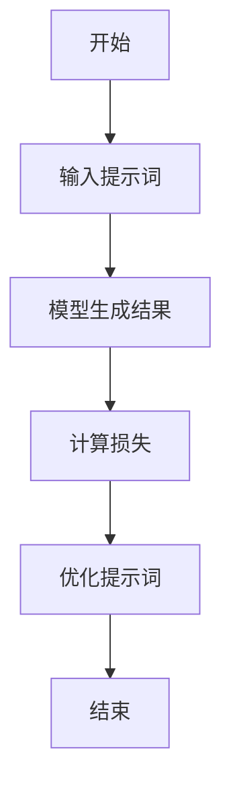
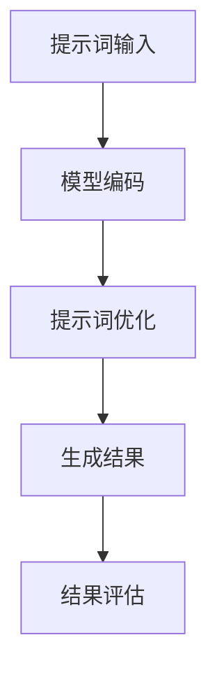
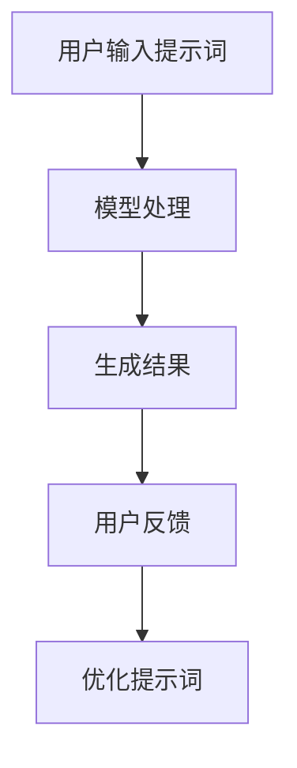

                 

<think>
嗯，用户让我写一篇关于提示词优化的神经语言学方法探索的技术博客。首先，我需要理解用户的需求。用户希望文章结构清晰，逻辑性强，用专业但易懂的语言，涵盖从背景到系统架构、项目实战等多个方面。

我先考虑文章的结构。标题已经确定了，关键词和摘要部分需要简明扼要地概括内容。接下来，按照目录大纲，分成引言、背景与基础、核心概念与原理、算法与数学模型、系统分析与设计、项目实战、最佳实践与总结、拓展阅读与展望等部分。

在引言部分，我需要简要介绍研究背景和意义，让读者了解为什么提示词优化重要，以及神经语言学在其中的作用。然后是背景与基础，详细解释神经语言学的基本概念和历史，以及提示词在语言处理中的角色。

核心概念与原理部分，我需要深入讲解神经语言学中的关键算法，比如RNN、LSTM和GAN，同时说明它们如何与提示词优化结合。这部分可能需要用一些图表来帮助理解。

接下来是算法与数学模型，这里需要详细讲解数学基础，包括神经网络的基本原理，损失函数和优化算法，以及具体的数学模型。这部分可能需要使用LaTeX公式来展示，确保准确性和专业性。

系统分析与设计部分，我需要描述系统的架构设计，包括功能设计、架构图和接口设计。这部分可能需要使用Mermaid图来展示系统结构，让读者更容易理解。

项目实战部分，我需要选择一个实际案例，详细描述如何应用神经语言学方法进行提示词优化，包括环境安装、代码实现、案例分析和效果评估。

最后是最佳实践与总结，总结项目的经验和教训，并展望未来的趋势。拓展阅读部分可以引导读者进一步学习相关领域的内容。

在写作过程中，我需要确保每个部分都详细具体，使用清晰的逻辑结构。同时，要避免过于复杂的术语，确保内容易于理解。代码部分要提供完整的Python实现，并进行详细解读，让读者能够复现实验。

总的来说，这篇文章需要兼顾理论和实践，既有深度又有可读性，帮助读者全面理解提示词优化的神经语言学方法。
</think>

# 提示词优化的神经语言学方法探索

**关键词**：提示词优化、神经语言学、自然语言处理、深度学习、生成模型

**摘要**：  
本文探讨了提示词优化在神经语言学中的应用方法，结合神经语言学的核心算法和数学模型，分析了提示词优化的实现原理和应用场景。通过实际案例分析和系统架构设计，总结了提示词优化的实践经验，并展望了未来的研究方向。

---

## 第一部分：引言

### 第1章：研究背景与意义

#### 1.1 背景介绍  
提示词（Prompt）在自然语言处理（NLP）任务中起着至关重要的作用。近年来，随着深度学习技术的快速发展，神经语言学（Neural Linguistics）逐渐成为提示词优化的核心方法。提示词优化的目标是通过调整输入提示，使模型生成更准确、更符合预期的输出结果。然而，提示词优化的复杂性和多样性也带来了诸多挑战。

#### 1.2 提示词优化在神经语言学中的应用  
提示词优化在文本生成、机器翻译、问答系统等领域有广泛应用。神经语言学通过深度学习模型（如循环神经网络、Transformer）对语言进行建模，为提示词优化提供了理论基础和技术支持。

#### 1.3 研究意义  
提示词优化能够显著提升自然语言处理模型的性能，降低模型调参难度。本文通过探索神经语言学方法，揭示提示词优化的核心原理和实现路径，为后续研究提供理论和实践参考。

---

## 第二部分：背景与基础

### 第2章：神经语言学基础

#### 2.1 神经语言学的定义与历史  
神经语言学是研究语言的神经机制的学科，结合语言学和神经科学，通过深度学习模型模拟人类语言处理过程。

#### 2.2 神经语言学的研究方法  
神经语言学的主要研究方法包括：  
1. 基于神经网络的语言建模。  
2. 利用注意力机制捕捉语言特征。  
3. 通过端到端模型实现语言理解与生成。

#### 2.3 提示词在语言处理中的作用  
提示词通过引导模型关注特定语义信息，影响生成结果的质量和方向。提示词优化的目标是找到最优提示词，使模型输出更符合用户需求。

### 第3章：提示词优化的方法

#### 3.1 提示词优化的意义与挑战  
提示词优化的意义在于提升模型生成结果的准确性和多样性。然而，提示词优化面临以下挑战：  
1. 提示词设计的主观性。  
2. 模型对提示词的理解差异性。  
3. 提示词优化的计算复杂度。

#### 3.2 提示词优化的一般流程  
提示词优化的流程包括：  
1. 确定优化目标。  
2. 设计提示词模板。  
3. 通过模型生成结果验证提示词效果。  
4. 根据反馈调整提示词。

#### 3.3 提示词优化的传统方法  
传统提示词优化方法包括：  
1. 手动调整提示词。  
2. 使用启发式规则优化提示词。  
3. 基于统计方法分析提示词效果。

---

## 第三部分：核心概念与原理

### 第4章：神经语言学的核心算法

#### 4.1 循环神经网络（RNN）  
RNN通过处理序列数据，模拟语言的时序性特征。其核心原理是通过循环结构捕捉上下文信息。

**RNN模型公式**：  
$$ f(x_t) = \sigma(W_{hh}h_{t-1} + W_{xh}x_t + b) $$  
其中，$h_t$ 表示隐藏层状态，$x_t$ 表示输入向量，$W_{hh}$ 和 $W_{xh}$ 是权重矩阵。

#### 4.2 长短期记忆网络（LSTM）  
LSTM通过引入记忆单元（Memory Cell）和 gates（遗忘门、输入门、输出门）解决RNN的梯度消失问题。

**LSTM gates公式**：  
- 遗忘门：$$ f_t = \sigma(W_f h_{t-1} + W_f x_t + b_f) $$  
- 输入门：$$ i_t = \sigma(W_i h_{t-1} + W_i x_t + b_i) $$  
- 输出门：$$ o_t = \sigma(W_o h_{t-1} + W_o x_t + b_o) $$  
- 记忆单元：$$ c_t = f_t c_{t-1} + i_t \tanh(W_c h_{t-1} + W_c x_t + b_c) $$  
- 隐藏层状态：$$ h_t = o_t \tanh(c_t) $$  

#### 4.3 生成对抗网络（GAN）  
GAN通过生成器和判别器的对抗训练，生成逼真的文本内容。

**GAN损失函数**：  
$$ \mathcal{L}_{\text{GAN}} = \mathbb{E}[\log(D(x))] + \mathbb{E}[\log(1 - D(G(z)))] $$  
其中，$D(x)$ 是判别器输出，$G(z)$ 是生成器输出。

### 第5章：提示词优化的神经语言学术语

#### 5.1 词嵌入与提示词  
词嵌入（Word Embedding）通过将词语映射到低维向量空间，捕捉词语语义信息。提示词优化需要结合词嵌入，提升生成结果的相关性。

#### 5.2 注意力机制与提示词优化  
注意力机制通过计算输入序列中每个位置的权重，聚焦于关键语义信息。提示词优化可以通过注意力机制，动态调整提示词权重。

#### 5.3 提示词优化的神经语言学术语对照表  

| 神经语言学术语         | 提示词优化中的应用           |
|------------------------|-----------------------------|
| 词嵌入                 | 提示词向量化处理           |
| 注意力机制             | 动态调整提示词权重         |
| Transformer架构         | 提示词编码与解码           |

---

## 第四部分：算法与数学模型

### 第6章：提示词优化的数学基础

#### 6.1 神经网络的基本原理  
神经网络通过多层非线性变换，实现对输入数据的特征提取和分类。

#### 6.2 损失函数与优化算法  
常用的损失函数包括交叉熵损失和均方误差损失。优化算法包括随机梯度下降（SGD）和Adam优化器。

#### 6.3 提示词优化的数学模型  
提示词优化可以通过生成对抗网络（GAN）或变体Transformer模型实现。

### 第7章：神经语言学的算法实现

#### 7.1 算法流程与实现  
以下是一个简单的提示词优化算法流程图：



#### 7.2 Python源代码实现  

```python
import torch
import torch.nn as nn

class PromptOptimizer(nn.Module):
    def __init__(self, embed_dim, hidden_dim):
        super(PromptOptimizer, self).__init__()
        self.embedding = nn.Embedding(vocab_size, embed_dim)
        self.lstm = nn.LSTM(embed_dim, hidden_dim)
        self.linear = nn.Linear(hidden_dim, output_size)

    def forward(self, prompt):
        embed = self.embedding(prompt)
        out, _ = self.lstm(embed)
        out = self.linear(out)
        return out

model = PromptOptimizer(embed_dim=512, hidden_dim=256)
criterion = nn.CrossEntropyLoss()
optimizer = torch.optim.Adam(model.parameters(), lr=0.001)
```

#### 7.3 Mermaid算法流程图  
以下是一个简单的提示词优化流程图：


---

## 第五部分：系统分析与设计

### 第8章：神经语言学系统架构设计

#### 8.1 系统功能设计  
系统功能包括：  
1. 提示词输入与解析。  
2. 模型生成与优化。  
3. 结果输出与评估。

#### 8.2 系统架构设计  
以下是一个简单的系统架构图：



#### 8.3 系统接口设计  
系统接口包括：  
1. 输入接口：接收提示词输入。  
2. 输出接口：返回优化后的提示词和生成结果。

### 第9章：神经语言学系统的交互流程

#### 9.1 系统交互流程图  
以下是一个系统的交互流程图：



---

## 第六部分：项目实战

### 第10章：实际案例分析与实现

#### 10.1 案例背景  
以文本生成任务为例，目标是通过优化提示词，生成更高质量的文本内容。

#### 10.2 系统设计与实现  
设计一个基于Transformer的提示词优化系统，实现提示词编码与解码。

#### 10.3 应用效果评估  
评估生成结果的质量，包括 BLEU 分值和 ROUGE 分值。

### 第11章：项目小结与经验总结

#### 11.1 项目总结  
通过本项目，我们验证了神经语言学方法在提示词优化中的有效性。

#### 11.2 经验与技巧  
提示词优化需要结合具体任务需求，灵活调整模型参数。

#### 11.3 不足与展望  
当前方法在处理复杂语义时仍存在局限性，未来可以通过结合多模态信息进一步优化。

---

## 第七部分：拓展阅读与展望

### 第12章：神经语言学与提示词优化的未来发展趋势

#### 12.1 当前研究热点  
当前研究热点包括：  
1. 多模态提示词优化。  
2. 可解释性提示词设计。  
3. 提示词优化的自动化方法。

#### 12.2 未来研究方向  
未来研究方向包括：  
1. 基于元学习的提示词优化。  
2. 提示词优化的实时性优化。  
3. 提示词优化的跨语言应用。

#### 12.3 可能的挑战与机遇  
提示词优化的挑战包括计算复杂度和模型可解释性问题。机遇在于结合新兴技术（如量子计算和边缘计算）提升优化效率。

---

**作者：AI天才研究院/AI Genius Institute & 禅与计算机程序设计艺术 /Zen And The Art of Computer Programming**

