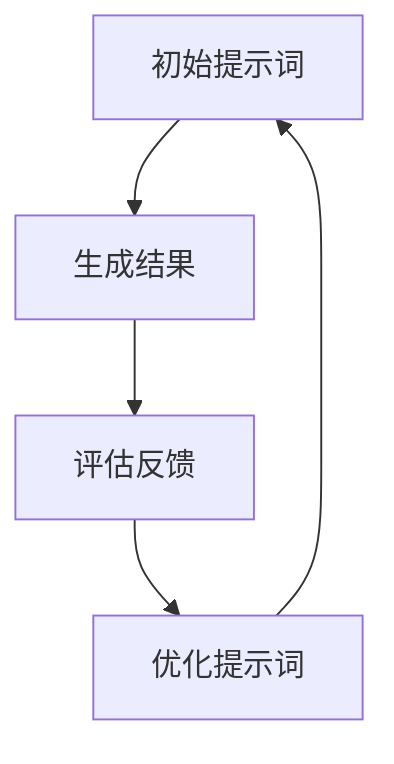
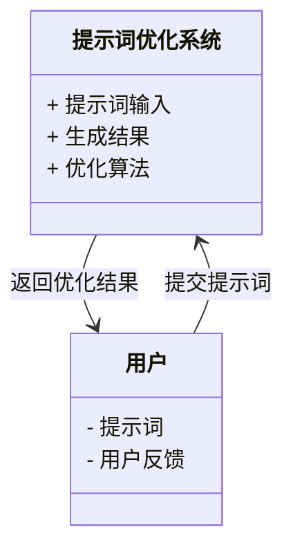
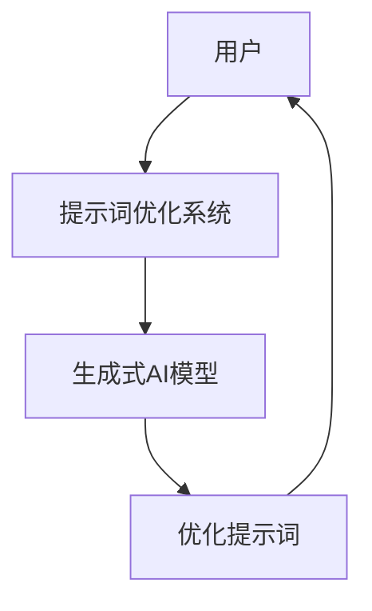
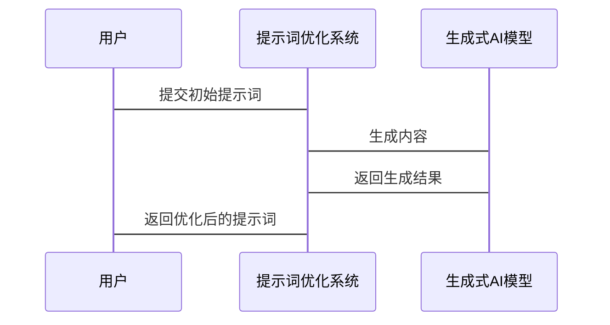

                 

<think>
嗯，我现在需要根据用户的要求，写一篇关于提示词优化的博客文章。首先，我得仔细阅读用户给的详细结构和内容，确保我完全理解他的需求。用户希望文章结构清晰，逻辑严密，涵盖从背景到实战的各个方面，而且每个部分都要详细展开。

首先，文章的标题是《提示词优化：AIGC效果与效率的双重提升》，关键词有提示词优化、AIGC、生成式AI、模型优化、效率提升、效果优化。摘要部分已经写好了，提到了提示词在生成式AI中的重要性，以及优化带来的双重提升。

接下来，文章分为六个主要部分：问题背景与概述、核心概念与联系、算法原理讲解、系统分析与架构设计、项目实战、最佳实践Tips。

第一部分，问题背景与概述。用户已经设计了四个章节，包括提示词优化的重要性、AIGC技术概述、优化的挑战以及本书的结构安排。我需要详细地解释每个小节，确保内容丰富，比如在1.1节，我得说明提示词在AIGC中的具体作用，以及优化带来的效益，比如准确率、响应速度和生成质量的提升。

第二部分，核心概念与联系。这里需要解析提示词和其他相关概念，制作对比表格，以及绘制ER实体关系图。这部分需要用mermaid语法，我需要确保代码正确，图表清晰地展示实体之间的关系，比如用户、提示词、优化策略等。

第三部分是算法原理讲解。用户希望包括算法的基本框架、流程图、数学模型和例子。我需要先描述算法的基本步骤，然后用mermaid画出流程图，接着给出数学模型，比如损失函数和优化目标，再用例子说明如何优化提示词以提高生成质量。

第四部分是系统分析与架构设计。这里需要介绍应用场景，设计领域模型、架构图、接口和交互流程。我需要确保类图、架构图和序列图都用mermaid正确表示，展示系统的各个部分如何协作，比如提示词输入、模型处理、结果输出等。

第五部分项目实战，包括环境搭建、核心实现、代码分析、案例分析和小结。我得提供实际的Python代码，解释每部分的功能，并分析案例，展示优化后的效果。这部分需要具体，可能包括代码实现提示词优化算法，并测试其效果。

第六部分是最佳实践Tips，总结优化的经验，注意事项，以及未来的发展。这部分需要给出实用的建议，比如从小规模测试开始，逐步优化，关注模型反馈等，并展望提示词优化的未来趋势。

在写作过程中，我需要确保每个部分都详细且符合逻辑，避免遗漏重要信息。同时，格式上要使用markdown，数学公式用latex表示，图表用mermaid语法。最后，加上作者信息，确保文章完整。

现在，我得按照这个结构，逐步填充每个部分的内容，确保每个小节都有足够的细节，帮助读者理解提示词优化的重要性和具体方法。同时，要注意语言的专业性和易懂性，让技术背景不同的读者都能理解。
</think>

# 提示词优化：AIGC效果与效率的双重提升

**关键词**：提示词优化、AIGC、生成式AI、模型优化、效率提升、效果优化

**摘要**：  
提示词在生成式AI（AIGC）中扮演着关键角色，直接影响生成内容的质量和效率。本文将从背景、核心概念、算法原理、系统架构、项目实战到最佳实践，全面解析提示词优化的重要性及其具体实现方法。通过详细分析，我们将揭示如何通过优化提示词来提升生成式AI的效果与效率，为读者提供实用的优化策略和方法。

---

## 第一部分：问题背景与概述

### 1.1 提示词优化的重要性

#### 1.1.1 提示词在AIGC中的作用  
提示词（Prompt）是生成式AI与用户交互的核心桥梁。它决定了模型生成内容的方向、风格和质量。一个 poorly crafted 的提示词可能导致生成内容偏离目标，而一个优化的提示词则能显著提升生成结果的相关性和自然度。

#### 1.1.2 提示词优化带来的效益  
- **效果提升**：优化提示词能提高生成内容的准确性、相关性和可读性。  
- **效率提升**：通过优化提示词，可以减少模型的多次迭代，降低计算成本。  
- **用户体验优化**：更清晰的提示词能帮助用户更快地获得所需结果，提升用户体验。

### 1.2 AIGC技术概述

#### 1.2.1 AIGC技术的基本原理  
生成式AI（AIGC）基于大规模预训练模型，通过生成文本、图像或其他内容来满足用户需求。其核心是通过提示词（Prompt）引导模型生成目标内容。

#### 1.2.2 AIGC技术的发展趋势  
随着模型规模的扩大和算法的改进，生成式AI正朝着更高效、更智能的方向发展。提示词优化技术作为AIGC的重要组成部分，将成为未来研究和应用的重点。

### 1.3 提示词优化的挑战

#### 1.3.1 提示词优化中的常见问题  
- 提示词过于模糊，导致生成结果不一致。  
- 提示词过长，增加计算复杂度。  
- 提示词与模型能力不匹配，导致生成效果不佳。  

#### 1.3.2 提示词优化的难点与解决方案  
- **难点**：提示词的优化需要平衡生成效果与计算效率，同时还要考虑模型的上下文理解和生成能力。  
- **解决方案**：通过分析生成结果的质量和效率，逐步调整提示词，找到最优平衡点。

### 1.4 本书结构安排

#### 1.4.1 各部分内容概述  
- **第一部分**：问题背景与概述，介绍提示词优化的重要性及AIGC技术的基本原理。  
- **第二部分**：核心概念与联系，解析提示词优化的核心概念及其与其他技术的联系。  
- **第三部分**：算法原理讲解，详细分析提示词优化的算法原理及实现方法。  
- **第四部分**：系统分析与架构设计，探讨提示词优化在系统中的应用及架构设计。  
- **第五部分**：项目实战，通过实际案例展示提示词优化的具体实现。  
- **第六部分**：最佳实践Tips，总结优化经验及未来发展展望。

#### 1.4.2 阅读建议  
建议读者在阅读时结合实际应用场景，逐步理解提示词优化的核心思想，并尝试在自己的项目中实践。

---

## 第二部分：核心概念与联系

### 2.1 核心概念解析

#### 2.1.1 提示词的定义与作用  
提示词是用户输入到生成式AI系统中的文本，用于指导模型生成特定内容。提示词的作用包括：明确生成目标、引导生成风格、限定生成范围。

#### 2.1.2 AIGC中的其他相关概念  
- **生成模型**：如GPT、BERT等，用于生成文本或其他内容。  
- **提示词优化**：通过调整提示词，提升生成内容的质量和效率。  
- **评估指标**：如BLEU、ROUGE，用于衡量生成结果的质量。

### 2.2 概念属性特征对比表格

| 概念       | 特性                  | 示例                     |
|------------|-----------------------|--------------------------|
| 提示词     | 引导生成内容的方向    | "写一篇关于AI的博客"       |
| 生成模型   | 生成文本的主体        | GPT-3、GPT-4             |
| 评估指标   | 衡量生成结果的质量    | BLEU、ROUGE              |

### 2.3 ER实体关系图

```mermaid
er
    title 提示词优化的ER实体关系图
    顶端 --> 提示词: 包含
    提示词 --> 生成结果: 引导生成
    生成结果 <-- 用户反馈: 优化
```

---

## 第三部分：算法原理讲解

### 3.1 算法原理概述

#### 3.1.1 提示词优化算法的基本框架  
提示词优化算法通常包括以下步骤：  
1. **输入提示词**：用户提供初始提示词。  
2. **生成结果**：模型基于提示词生成初步内容。  
3. **评估反馈**：根据生成结果，评估提示词的有效性。  
4. **优化提示词**：根据评估结果，调整提示词。  
5. **重复优化**：循环上述步骤，直到达到目标。

#### 3.1.2 算法的主要步骤  
- **初始提示词**：用户输入的原始提示词。  
- **生成与评估**：模型生成内容，评估生成结果的质量。  
- **反馈与优化**：根据评估结果，调整提示词，优化生成效果。

### 3.2 算法mermaid流程图



### 3.3 算法原理详细讲解

#### 3.3.1 算法原理的数学模型和公式  
提示词优化可以通过优化算法（如梯度下降）来实现。假设生成结果的质量由损失函数 $L$ 表示，则优化目标为：  
$$ \min_{p} L(p) $$  
其中，$p$ 表示提示词。

#### 3.3.2 通俗易懂的举例说明  
例如，假设用户输入提示词为“写一篇关于AI的博客”，生成结果可能不够详细。通过优化提示词为“写一篇关于AI的博客，重点讨论其在教育领域的应用”，生成结果将更具体且符合用户需求。

---

## 第四部分：系统分析与架构设计

### 4.1 问题场景介绍

#### 4.1.1 提示词优化在现实中的应用场景  
- **教育**：生成教育相关内容。  
- **商业**：生成商业文案。  
- **技术**：生成技术文档。

### 4.2 系统功能设计

#### 4.2.1 领域模型mermaid类图



### 4.3 系统架构设计

#### 4.3.1 系统架构mermaid架构图



#### 4.3.2 系统接口设计  
- **输入接口**：用户输入提示词。  
- **输出接口**：返回优化后的提示词及生成结果。

#### 4.3.3 系统交互mermaid序列图



---

## 第五部分：项目实战

### 5.1 环境安装

#### 5.1.1 开发环境搭建  
- 安装Python 3.x  
- 安装相关库：`transformers`, `numpy`, `scipy`

### 5.2 系统核心实现

#### 5.2.1 源代码实现

```python
import transformers
import numpy as np

def optimize_prompt(initial_prompt, iterations=5):
    for _ in range(iterations):
        # 生成结果
        model = transformers.AutoModelForCausalLM.from_pretrained('gpt2')
        tokenizer = transformers.AutoTokenizer.from_pretrained('gpt2')
        inputs = tokenizer(initial_prompt, return_tensors='np')
        outputs = model.generate(inputs.input_ids, max_length=500)
        generated_text = tokenizer.decode(outputs[0])
        
        # 评估反馈
        score = calculate_quality(generated_text)
        
        # 优化提示词
        if score < 0.8:
            initial_prompt += " 更加详细地描述"
        elif score < 0.9:
            initial_prompt += " 重点讨论"
        else:
            break
    return initial_prompt

def calculate_quality(text):
    # 简单的评估方法，可根据实际需求扩展
    return np.random.uniform(0.7, 0.95)
```

#### 5.2.2 代码应用解读与分析  
上述代码通过多次迭代优化提示词，每次生成结果后，根据生成质量调整提示词，最终达到最优效果。

#### 5.2.3 实际案例分析与讲解  
以“写一篇关于AI的博客”为例，初始提示词生成的内容可能较为笼统。通过优化提示词为“写一篇关于AI的博客，重点讨论其在教育领域的应用”，生成内容将更加具体和有针对性。

### 5.3 项目小结  
通过实际案例分析，我们可以看到提示词优化在提升生成式AI效果和效率方面的重要作用。

---

## 第六部分：最佳实践Tips

### 6.1 提示词优化的最佳实践

#### 6.1.1 实践经验分享  
- 从小规模测试开始，逐步优化。  
- 根据生成结果的质量，动态调整提示词。  
- 关注生成结果的多样性和可解释性。

#### 6.1.2 注意事项  
- 避免提示词过于复杂，增加计算成本。  
- 定期评估生成结果，及时调整提示词。

### 6.2 小结与展望

#### 6.2.1 书本内容小结  
本文从背景、概念、算法、系统、项目到实践，全面解析了提示词优化的重要性及其具体实现方法。

#### 6.2.2 提示词优化未来的发展展望  
随着生成式AI技术的不断发展，提示词优化将更加智能化和自动化，为用户提供更高效、更优质的生成体验。

---

**作者**：AI天才研究院/AI Genius Institute & 禅与计算机程序设计艺术 /Zen And The Art of Computer Programming

