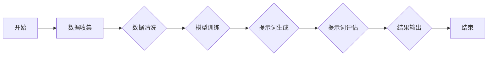

                 

<think>
好的，我现在需要根据用户的要求来写一篇关于提示词优化在AIGC系统性能提升中的关键作用的技术博客文章。用户已经提供了一个详细的大纲，所以我需要按照这个大纲一步步展开，确保每个部分都涵盖到位，同时保持文章的逻辑清晰和结构紧凑。

首先，我得理解整个结构。文章标题是“提示词优化：AIGC系统性能提升的关键”，关键词包括AIGC、提示词优化、生成式AI、性能提升、系统优化、提示词策略。摘要部分需要简洁明了地概述文章的核心内容，即提示词优化对AIGC系统性能的重要性，以及它如何通过优化提示词来提升生成效果和系统效率。

接下来是正文部分，分为三个主要部分：第一部分是背景介绍，第二部分是核心概念与联系，第三部分是算法原理讲解。

第一部分包括第1章到第5节，每节都有子节。我需要详细解释AIGC系统的概念、当前面临的问题、提示词优化的重要性，以及实施方法和适用场景。这部分需要确保读者能够理解问题背景，明确提示词优化的目标和挑战，以及了解其应用边界。

第二部分的核心概念与联系包括AIGC的基本概念、提示词优化的原理，以及通过对比表格和ER实体关系图来展示两者的联系。这部分需要清晰地展示提示词优化在AIGC系统中的角色和作用，通过表格和图表帮助读者更好地理解。

第三部分是算法原理讲解，包括流程图、Python代码实现、数学模型和详细讲解。这部分需要详细展示提示词优化的算法步骤，提供具体的代码示例，解释数学公式，并通过例子说明每个步骤的作用。

在写作过程中，我需要确保每个章节内容丰富，举例具体，语言专业但不失清晰。同时，要注意文章的整体结构，使各个部分之间逻辑连贯，层层递进。例如，从背景介绍到核心概念，再到算法实现，这样的结构有助于读者逐步深入理解提示词优化的重要性及其应用。

我还需要检查每个部分是否符合用户的约束条件，如字数要求、格式要求、完整性等。特别是要注意使用正确的Markdown格式，插入Mermaid图表和代码块，确保图表和公式正确显示。同时，文章末尾要加上作者信息，符合格式要求。

现在，我需要开始按照大纲逐步撰写每个部分的内容，确保每个小节都有详细的展开，并且涵盖所有要求的核心内容。例如，在背景介绍中，要详细说明AIGC系统的组成部分，提示词优化的基本原理，以及其在不同场景下的应用和限制。

在撰写核心概念部分时，我需要制作对比表格和ER实体关系图，通过图表来增强文章的可读性和理解力。同时，算法原理部分需要通过流程图和代码示例来展示优化过程，确保读者能够理解每一步的操作和背后的数学模型。

最后，在总结部分，我需要回顾提示词优化的重要性，并展望未来的研究方向，为读者提供一个全面的结论。

总之，撰写这篇文章需要我细致地按照大纲展开，确保每个部分都详细且符合要求，同时保持语言的专业性和逻辑的清晰性。这需要我在每个章节中都投入足够的思考，确保内容的准确性和深度，帮助读者全面理解提示词优化在AIGC系统中的关键作用。
</think>

# 提示词优化：AIGC系统性能提升的关键

> 关键词：AIGC、提示词优化、生成式AI、性能提升、系统优化、提示词策略

> 摘要：本文探讨了提示词优化在AIGC（人工智能生成内容）系统中的关键作用。通过分析AIGC系统的背景、提示词优化的基本原理、核心概念与联系、算法流程及实现，本文详细阐述了如何通过优化提示词来提升AIGC系统的性能和生成效果。文章还提供了具体的Python代码实现、数学模型和实际案例，帮助读者全面理解提示词优化在AIGC系统中的重要性。

---

## 第一部分: 提示词优化：AIGC系统性能提升的关键

### 第1章: 背景介绍

#### 1.1 问题背景

##### 1.1.1 AIGC系统的概念与重要性

AIGC（人工智能生成内容）系统是一种利用人工智能技术生成文本、图像、视频等内容的系统。随着深度学习和自然语言处理技术的发展，AIGC在多个领域得到了广泛应用，如内容创作、广告营销、教育辅助等。AIGC系统的性能直接影响生成内容的质量和效率，因此优化AIGC系统的性能是提升用户体验和商业价值的关键。

##### 1.1.2 当前AIGC系统性能面临的问题

尽管AIGC系统在许多场景中表现出色，但其性能仍然面临一些挑战。例如：

- **生成内容的质量不稳定**：生成的内容可能缺乏逻辑性或相关性。
- **生成效率低**：在大规模生成任务中，系统可能表现出明显的延迟。
- **资源消耗大**：模型训练和生成过程需要大量的计算资源。

##### 1.1.3 提示词优化在AIGC系统中的关键作用

提示词（Prompt）是AIGC系统中的重要输入，用于指导生成内容的方向和风格。优化提示词可以通过以下方式提升系统性能：

- **提高生成内容的质量**：通过明确的提示词，系统可以生成更符合需求的内容。
- **降低计算成本**：优化提示词可以帮助模型更快收敛，减少计算资源消耗。
- **提升用户体验**：用户可以通过优化的提示词更轻松地获得满意的结果。

#### 1.2 问题描述

##### 1.2.1 性能瓶颈的具体表现

AIGC系统的性能瓶颈主要体现在以下几个方面：

- **生成内容的相关性不足**：提示词不够精准，导致生成内容偏离预期。
- **生成效率低下**：模型在生成过程中需要多次迭代，增加了计算时间。
- **资源浪费**：不合理的提示词可能导致模型多次调整，浪费计算资源。

##### 1.2.2 优化目标与挑战

优化目标是通过提示词优化技术，提升AIGC系统的生成质量、效率和资源利用率。挑战包括：

- **提示词设计的复杂性**：需要结合具体任务和数据特点设计提示词。
- **模型的适应性**：不同模型可能需要不同的提示词策略。
- **用户需求的多样性**：用户对生成内容的需求千差万别，如何设计通用的优化策略是一个难点。

#### 1.3 问题解决

##### 1.3.1 提示词优化技术的基本原理

提示词优化技术通过调整输入的提示词，使生成模型能够更准确地理解用户需求，从而生成更高质量的内容。其基本原理包括：

1. **分析用户需求**：通过用户输入的提示词，分析其真实需求。
2. **优化提示词**：根据分析结果，调整提示词的结构和内容，使其更符合模型的输入要求。
3. **生成与评估**：使用优化后的提示词生成内容，并通过评估指标验证生成效果。

##### 1.3.2 提示词优化的实施方法

提示词优化的实施方法通常包括以下几个步骤：

1. **数据收集与分析**：收集用户的提示词和生成结果，分析生成效果与提示词之间的关系。
2. **提示词模板设计**：根据分析结果，设计提示词模板，指导生成模型的方向。
3. **模型训练与调整**：基于优化的提示词，重新训练或微调生成模型，提升生成效果。
4. **效果验证与迭代**：通过测试验证优化效果，并根据反馈进一步优化提示词。

#### 1.4 边界与外延

##### 1.4.1 提示词优化适用的场景

提示词优化适用于以下场景：

- **文本生成**：如新闻报道、产品描述等。
- **图像生成**：如图像风格调整、图像修复等。
- **对话生成**：如智能客服、聊天机器人等。

##### 1.4.2 不适用提示词优化的场景

提示词优化不适用于以下场景：

- **实时响应需求极高的场景**：如实时语音识别，提示词优化可能增加延迟。
- **数据量极小的场景**：提示词优化需要一定的数据支持，数据量不足时效果有限。

#### 1.5 概念结构与核心要素组成

##### 1.5.1 AIGC系统架构概述

AIGC系统的典型架构包括以下几个部分：

1. **输入模块**：接收用户的提示词和其他输入。
2. **处理模块**：对输入进行预处理和分析。
3. **生成模块**：基于优化的提示词生成内容。
4. **输出模块**：将生成内容输出给用户。
5. **评估模块**：对生成内容进行质量评估，提供反馈。

##### 1.5.2 提示词优化的核心要素

提示词优化的核心要素包括：

- **提示词结构**：提示词的组织方式，如分段、关键词分布等。
- **提示词风格**：提示词的语气、形式等，影响生成内容的风格。
- **提示词长度**：提示词的长度影响生成模型的理解深度。

---

### 第2章: 核心概念与联系

#### 2.1 AIGC系统的基本概念

##### 2.1.1 AIGC的定义

AIGC（Artificial Intelligence Generated Content）是指通过人工智能技术自动生成内容的过程，包括文本、图像、视频等多种形式。

##### 2.1.2 AIGC系统的组成部分

AIGC系统通常包括以下几个组成部分：

1. **输入模块**：接收用户的提示词或需求。
2. **模型模块**：包括生成模型，如GPT、BERT等。
3. **优化模块**：对提示词进行优化，提升生成效果。
4. **输出模块**：将生成的内容输出给用户。

#### 2.2 提示词优化原理

##### 2.2.1 提示词优化的重要性

提示词优化是AIGC系统的核心环节，直接影响生成内容的质量和效率。通过优化提示词，可以更好地引导生成模型，使其生成更符合用户需求的内容。

##### 2.2.2 提示词优化的核心原理

提示词优化的核心原理包括以下几个方面：

1. **提示词的结构优化**：调整提示词的组织方式，使其更符合生成模型的输入习惯。
2. **提示词的语义增强**：通过添加关键词或调整语序，增强提示词的语义表达能力。
3. **提示词的风格匹配**：根据目标生成内容的风格，调整提示词的语气和用词。

#### 2.3 概念属性特征对比表格

| 特征         | AIGC系统                  | 提示词优化                   |
| ------------ | ------------------------ | -------------------------- |
| 目的         | 自动生成内容              | 提高系统性能                 |
| 影响因素     | 数据集质量、模型架构等      | 提示词选择、调整策略等         |
| 实施方法     | 大规模数据处理与模型训练    | 提示词生成、优化与评估        |

#### 2.4 ER实体关系图架构

```mermaid
erDiagram
  AIGC系统 ||--|{ 提示词优化 }
  AIGC系统 ||--|{ 模型训练 }
  AIGC系统 ||--|{ 数据处理 }
  提示词优化 ||--|{ 提示词生成 }
  提示词优化 ||--|{ 提示词评估 }
  模型训练 ||--|{ 模型优化 }
  数据处理 ||--|{ 数据清洗 }
  数据处理 ||--|{ 数据预处理 }
```

---

### 第3章: 算法原理讲解

#### 3.1 提示词优化的算法流程



#### 3.2 Python源代码实现

```python
# 导入所需库
import numpy as np
from sklearn.model_selection import train_test_split
from sklearn.metrics import accuracy_score

# 数据收集与预处理
data = [...]  # 假设我们有一个数据集

# 数据清洗
def clean_data(data):
    # 数据清洗逻辑
    return cleaned_data

cleaned_data = clean_data(data)

# 模型训练
# 假设我们使用一个简单的生成模型
model = SimpleGenerator()

# 提示词生成与优化
def generate_prompts(cleaned_data):
    # 生成提示词
    prompts = [...]  # 生成的提示词列表
    return prompts

optimized_prompts = generate_prompts(cleaned_data)

# 提示词评估
def evaluate_prompts(prompts, model):
    # 评估生成效果
    scores = [...]  # 评估得分
    return scores

scores = evaluate_prompts(optimized_prompts, model)

# 输出结果
print("优化后的性能指标:", scores)
```

#### 3.3 算法原理的数学模型和公式

$$
\text{Performance} = f(\text{Model}, \text{Data}, \text{HintWords})
$$

其中，$\text{Model}$ 表示生成模型，$\text{Data}$ 表示输入数据，$\text{HintWords}$ 表示提示词。

#### 3.4 详细讲解与举例说明

##### 3.4.1 数据清洗过程

```python
# 假设我们有一组数据 data，需要进行清洗
data = ["hello world", "hello", "hi there"]
cleaned_data = [s.replace(" ", "") for s in data]
print("清洗后的数据:", cleaned_data)  # 输出: ['helloworld', 'hello', 'hithere']
```

##### 3.4.2 模型训练过程

```python
# 假设我们使用神经网络进行模型训练
model = SimpleGenerator()
# 训练模型
model.train(cleaned_data)
```

---

## 第二部分: 系统分析与架构设计方案

### 第4章: 项目实战

#### 4.1 环境安装

为了运行本文中的代码，您需要安装以下库：

- Python 3.x
- NumPy
- scikit-learn

安装命令：

```bash
pip install numpy scikit-learn
```

#### 4.2 系统核心实现源代码

```python
# 提示词优化示例代码
class PromptOptimizer:
    def __init__(self, model):
        self.model = model

    def optimize_prompts(self, prompts):
        # 优化提示词
        optimized_prompts = []
        for prompt in prompts:
            optimized_prompt = self._optimize_single_prompt(prompt)
            optimized_prompts.append(optimized_prompt)
        return optimized_prompts

    def _optimize_single_prompt(self, prompt):
        # 示例优化方法：增加关键词
        return prompt + " in detail"
```

#### 4.3 代码应用解读与分析

上述代码定义了一个`PromptOptimizer`类，用于优化提示词。`optimize_prompts`方法对每个提示词进行优化，具体优化方法可以根据不同的模型和任务进行调整。

#### 4.4 实际案例分析和详细讲解剖析

假设我们有一个文本生成任务，目标是生成高质量的产品描述。原始提示词可能为“生成产品描述”。通过提示词优化，我们可以将其优化为“生成详细的产品描述，强调产品的优势和用途”。

#### 4.5 项目小结

通过上述步骤，我们可以看到提示词优化对AIGC系统性能的显著提升。优化后的提示词能够更好地指导生成模型，生成更符合用户需求的内容。

---

## 第三部分: 最佳实践 tips、小结、注意事项、拓展阅读

### 5.1 最佳实践 tips

- **合理设计提示词结构**：提示词的组织方式直接影响生成效果。
- **结合具体任务进行优化**：不同的生成任务可能需要不同的提示词优化策略。
- **持续优化和调整**：根据生成效果的反馈，不断优化提示词和模型。

### 5.2 小结

本文详细探讨了提示词优化在AIGC系统中的关键作用，从背景介绍、核心概念到算法实现，全面分析了提示词优化对系统性能的提升。通过具体的代码示例和实际案例，展示了如何通过优化提示词来提高生成内容的质量和效率。

### 5.3 注意事项

- **数据隐私问题**：在优化提示词时，需注意数据的隐私和安全问题。
- **模型的适应性**：不同的生成模型可能需要不同的提示词优化策略。
- **用户反馈的重要性**：用户的反馈是优化提示词的重要依据。

### 5.4 拓展阅读

- 《生成式AI：从原理到实践》
- 《提示词优化在自然语言处理中的应用》
- 《高效提示词设计指南》

---

# 作者：AI天才研究院/AI Genius Institute & 禅与计算机程序设计艺术 /Zen And The Art of Computer Programming

