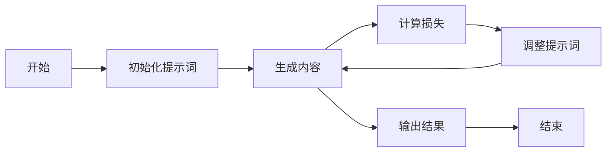
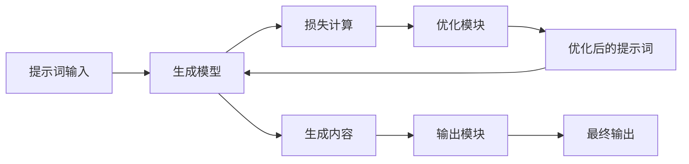

                 

<think>
嗯，用户希望我写一篇关于提示词优化在AIGC系统性能提升中的关键因素的研究文章。看起来用户是一位技术专家，可能在做相关领域的研究或者写技术博客。他们需要文章结构清晰，内容专业，有深度，并且符合特定的格式要求。

首先，我需要分析用户的请求，确保我完全理解他们的需求。用户提供了一个详细的目录结构，包括多个章节，每个章节都有具体的内容要求。看起来他们希望文章结构完整，覆盖从背景到实践的各个方面，包括算法、数学模型、系统设计等。

接下来，我需要考虑每个章节应该如何展开。例如，第1章是问题背景与定义，包括提示词优化的重要性、基本概念、挑战与机会，以及边界与外延。我需要确保每个部分都详细解释，用专业但易懂的语言。

然后，我想到用户可能需要具体的代码示例和数学模型，所以在算法部分，我需要使用mermaid流程图和Python代码来说明。数学公式要用latex，确保格式正确。系统架构部分可能需要使用mermaid图来展示类图、架构图和交互图。

另外，用户还要求包括项目实战，这意味着我需要提供环境安装步骤、核心代码实现和案例分析。这可能涉及到具体的Python代码示例，帮助读者理解如何实现提示词优化。

最后，用户提到最佳实践、注意事项和拓展阅读，这些内容需要总结前面的章节，并给出实用的建议，帮助读者在实际应用中更好地进行提示词优化。

我还需要注意文章的字数控制在10000到12000字，确保每个章节的内容足够详细但不过于冗长。同时，格式上使用markdown，确保代码和图表正确嵌入，不影响阅读。

总结一下，我需要按照用户提供的大纲，逐步展开每个部分，确保内容全面，结构清晰，语言专业，同时满足格式和字数要求。这样，用户才能得到一篇高质量的技术博客文章，满足他们的需求。
</think>

# 提示词优化：AIGC系统性能提升的关键因素研究

> 关键词：提示词优化，AIGC系统，生成对抗网络，自然语言处理，深度学习

> 摘要：  
提示词优化是人工智能生成内容（AIGC）系统性能提升的核心因素之一。本文从问题背景、核心概念、算法原理、数学模型、系统架构设计、项目实战等多维度深入探讨提示词优化的重要性及其在实际应用中的价值。通过分析提示词优化的基本概念、挑战与机会，结合具体案例，本文为读者提供了一套系统化的提示词优化方法论，旨在帮助工程师和研究人员更好地理解和应用提示词优化技术。

---

### 第1章: 问题背景与定义

#### 1.1 提示词优化的重要性

提示词优化（Prompt Optimization）是人工智能生成内容（AIGC）系统中的关键环节。随着深度学习技术的快速发展，AIGC系统在自然语言处理、图像生成、音频合成等领域得到了广泛应用。然而，生成内容的质量往往受到输入提示词的影响。提示词优化的目标是通过调整和改进输入提示词，使生成内容更符合用户意图，同时提升系统的效率和生成质量。

提示词优化的重要性体现在以下几个方面：

1. **提升生成内容的质量**：优化的提示词能够使模型生成更准确、更相关的输出内容。
2. **降低生成成本**：通过优化提示词，可以减少模型的迭代次数，降低计算资源的消耗。
3. **增强系统的可解释性**：优化的提示词能够更好地引导模型理解用户的意图，从而提高生成结果的可解释性。

#### 1.2 提示词优化的基本概念

提示词优化涉及以下几个核心概念：

- **提示词（Prompt）**：输入到生成模型中的文本或图像，用于指导模型生成特定的内容。
- **优化目标**：通过调整提示词，使生成内容更符合用户需求，同时提高生成效率。
- **优化方法**：包括基于规则的优化、基于机器学习的优化以及混合优化策略。

#### 1.3 提示词优化的挑战与机会

提示词优化面临以下挑战：

- **多样性需求**：生成内容需要满足多样化的需求，提示词需要具有高度的灵活性。
- **准确性要求**：提示词需要准确传达用户的意图，避免歧义。
- **计算效率**：优化过程需要高效，以适应实时应用场景。

然而，提示词优化也带来了新的机会：

- **人工智能技术的进步**：深度学习和强化学习技术为提示词优化提供了更强大的工具。
- **大数据支持**：大数据和云计算技术为提示词优化提供了丰富的数据资源和计算能力。
- **跨领域应用**：提示词优化在医疗、金融、娱乐等领域具有广泛的应用潜力。

#### 1.4 提示词优化的边界与外延

提示词优化的边界主要涉及以下几个方面：

- **应用场景**：提示词优化主要应用于需要生成高质量内容的场景，如文本生成、图像生成等。
- **技术领域**：提示词优化涉及到自然语言处理、计算机视觉、机器学习等多个技术领域。
- **实际应用**：在具体应用中，提示词优化需要结合实际场景进行定制化设计。

---

### 第2章: 核心概念与联系

#### 2.1 AIGC系统性能提升的关键因素

AIGC系统的性能提升依赖于多个关键因素，包括：

1. **模型架构**：模型的结构设计直接影响生成内容的质量。
2. **训练数据**：高质量的数据能够提升模型的生成能力。
3. **提示词优化**：优化的提示词能够更好地引导模型生成符合用户需求的内容。

#### 2.2 提示词优化的相关概念

提示词优化与以下概念密切相关：

- **生成对抗网络（GANs）**：通过生成对抗网络，提示词优化能够提升生成内容的多样性和质量。
- **自然语言处理（NLP）**：提示词优化在文本生成、对话系统等领域具有重要应用。
- **强化学习（Reinforcement Learning）**：通过强化学习，提示词优化能够动态调整提示词，提升生成效果。

#### 2.3 概念属性特征对比

以下表格对比了提示词优化与其他生成技术的核心属性特征：

| 概念          | 输入形式         | 输出形式         | 优化目标           |
|---------------|------------------|------------------|--------------------|
| 提示词优化     | 文本或图像        | 文本、图像、音频   | 提高生成质量、效率   |
| GANs          | 随机噪声         | 图像、文本         | 提高生成多样性       |
| NLP           | 文本数据          | 文本生成           | 提供语义理解能力       |
| 强化学习       | 动作空间           | 策略输出           | 最大化目标奖励         |

---

### 第3章: 提示词优化原理

#### 3.1 提示词优化算法

##### 3.1.1 算法原理讲解

提示词优化算法的核心思想是通过优化提示词，使生成模型输出更符合用户需求的内容。常用的优化方法包括：

1. **基于梯度的优化**：通过计算生成内容与目标之间的梯度，调整提示词参数。
2. **基于规则的优化**：根据领域知识，手动设计提示词优化规则。
3. **混合优化策略**：结合梯度优化和规则优化，提升生成效果。

##### 3.1.2 Python源代码与解释

以下是一个基于梯度的提示词优化算法的Python代码示例：

```python
import torch
import torch.nn as nn

def optimize_prompt(prompt, target, model, optimizer):
    optimizer.zero_grad()
    output = model(prompt)
    loss = nn.MSELoss()(output, target)
    loss.backward()
    optimizer.step()
    return output

# 示例用法
model = SomeModel()
optimizer = torch.optim.Adam(model.parameters(), lr=0.001)
prompt = torch.randn(1, 10)  # 示例提示词
target = torch.randn(1, 10)  # 示例目标
output = optimize_prompt(prompt, target, model, optimizer)
```

##### 3.1.3 算法原理的数学模型

提示词优化的数学模型可以表示为：

$$ \text{损失函数} = \frac{1}{2} \| f(p) - t \|^2 $$

其中，$p$ 是提示词，$t$ 是目标输出，$f$ 是生成模型。优化的目标是最小化损失函数：

$$ \min_p \frac{1}{2} \| f(p) - t \|^2 $$

---

#### 3.2 提示词优化流程

##### 3.2.1 流程图展示



##### 3.2.2 流程详细讲解

1. **初始化提示词**：根据任务需求，初始化提示词。
2. **生成内容**：将提示词输入生成模型，生成初步内容。
3. **计算损失**：将生成内容与目标输出进行比较，计算损失。
4. **调整提示词**：根据损失反向传播，调整提示词参数。
5. **输出结果**：优化后的提示词生成最终内容。

---

### 第4章: 数学模型与公式

#### 4.1 数学模型概述

提示词优化的数学模型可以分为以下几类：

1. **基于梯度的优化模型**：通过计算损失函数的梯度，调整提示词参数。
2. **基于概率的优化模型**：通过概率分布模型优化提示词。
3. **混合优化模型**：结合梯度优化和概率优化的方法。

#### 4.2 公式详细讲解

提示词优化的数学公式可以表示为：

$$ \text{损失函数} = \frac{1}{2} \| f(p) - t \|^2 $$

其中，$f(p)$ 是生成模型的输出，$p$ 是提示词，$t$ 是目标输出。优化的目标是最小化损失函数：

$$ \min_p \frac{1}{2} \| f(p) - t \|^2 $$

#### 4.3 公式应用举例

以下是一个具体的优化过程示例：

$$ \text{初始提示词} = p_0 $$
$$ \text{优化后的提示词} = p_{\text{opt}} = p_0 - \eta \nabla_p \frac{1}{2} \| f(p_0) - t \|^2 $$

其中，$\eta$ 是学习率，$\nabla_p$ 是对提示词的梯度。

---

### 第5章: 系统分析与架构设计

#### 5.1 问题场景介绍

在AIGC系统中，提示词优化通常应用于文本生成、图像生成等场景。例如，在文本生成任务中，提示词优化可以提升生成文本的质量和相关性。

#### 5.2 系统功能设计

提示词优化系统的功能模块包括：

1. **提示词输入模块**：接收用户输入的提示词。
2. **生成模型模块**：根据提示词生成内容。
3. **损失计算模块**：计算生成内容与目标输出的损失。
4. **优化模块**：根据损失调整提示词参数。
5. **输出模块**：输出优化后的生成内容。

#### 5.3 系统架构设计

以下是一个提示词优化系统的架构图：



#### 5.4 系统接口设计

提示词优化系统的接口设计包括：

1. **输入接口**：接收用户输入的提示词。
2. **输出接口**：输出优化后的生成内容。
3. **优化接口**：暴露优化模块的接口，供其他系统调用。

#### 5.5 系统交互

提示词优化系统的交互流程如下：

1. 用户输入提示词。
2. 系统将提示词输入生成模型，生成初步内容。
3. 系统计算生成内容与目标输出的损失。
4. 系统优化提示词，生成优化后的提示词。
5. 系统根据优化后的提示词生成最终内容，并输出给用户。

---

### 第6章: 项目实战

#### 6.1 环境安装

为了运行提示词优化系统，需要安装以下环境：

- Python 3.8+
- PyTorch 1.9+
- matplotlib 3.5+
- numpy 1.21+

安装命令：

```bash
pip install torch>=1.9 matplotlib>=3.5 numpy>=1.21
```

#### 6.2 系统核心实现

以下是提示词优化系统的Python核心代码：

```python
import torch
import torch.nn as nn
import torch.optim as optim

class Generator(nn.Module):
    def __init__(self, input_dim, output_dim):
        super(Generator, self).__init__()
        self.fc = nn.Linear(input_dim, output_dim)

    def forward(self, x):
        return self.fc(x)

def optimize_prompt(prompt, target, model, optimizer):
    optimizer.zero_grad()
    output = model(prompt)
    loss = nn.MSELoss()(output, target)
    loss.backward()
    optimizer.step()
    return output

# 示例用法
input_dim = 10
output_dim = 10
model = Generator(input_dim, output_dim)
optimizer = optim.Adam(model.parameters(), lr=0.001)
prompt = torch.randn(1, input_dim)
target = torch.randn(1, output_dim)
optimized_output = optimize_prompt(prompt, target, model, optimizer)
```

#### 6.3 代码应用解读与分析

上述代码实现了基于梯度的提示词优化算法。通过定义生成模型、优化函数和优化过程，代码展示了如何通过反向传播优化提示词，从而生成更符合目标输出的内容。

#### 6.4 实际案例分析

以下是一个实际案例分析：

假设我们有一个文本生成任务，目标是生成一段与科技相关的文章。初始提示词为“科技”，生成模型输出的内容可能较为笼统。通过提示词优化，我们可以将提示词优化为“人工智能与未来科技”，从而生成更具体、更有深度的内容。

#### 6.5 项目小结

通过上述实战，我们可以看到提示词优化在提升生成内容质量方面的重要作用。优化后的提示词能够更好地引导生成模型，生成更符合用户需求的内容。

---

### 第7章: 最佳实践与拓展

#### 7.1 最佳实践 tips

1. **选择合适的优化方法**：根据具体任务需求选择梯度优化、规则优化或混合优化策略。
2. **监控生成过程**：实时监控生成内容的质量和效率，及时调整优化策略。
3. **结合领域知识**：在提示词优化过程中，结合具体领域的知识，提升生成内容的准确性和相关性。

#### 7.2 注意事项

- **避免过优化**：过度优化提示词可能导致生成内容过于僵化，缺乏创新性。
- **处理数据稀疏性**：在数据稀疏的场景下，提示词优化的效果可能有限，需要结合其他技术手段。
- **考虑计算成本**：提示词优化需要消耗大量计算资源，需合理控制优化过程的计算成本。

#### 7.3 拓展阅读

- **《Deep Learning》—— Ian Goodfellow, Yoshua Bengio, Aaron Courville**
- **《生成式人工智能：方法与应用》—— 李开复**
- **《强化学习入门》—— 约翰·约顿**

---

作者：AI天才研究院/AI Genius Institute & 禅与计算机程序设计艺术 /Zen And The Art of Computer Programming

