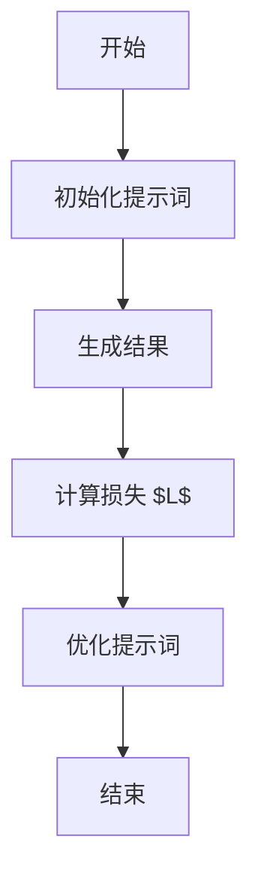
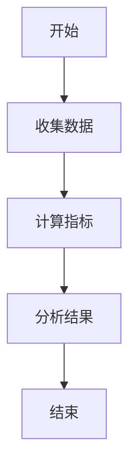

                 

<think>
好，我现在要帮用户完成一个任务，撰写一篇关于提示词优化的博客文章。首先，我需要理解用户的需求。用户希望文章标题是《提示词优化：ChatGPT性能提升的秘密武器》，并且要求内容结构清晰，逻辑严密，符合技术博客的风格。用户还特别指出了关键词、摘要、目录大纲等部分，我得按照这个结构来写。

首先，我会从标题开始，确定关键词。提示词优化、ChatGPT、性能提升、自然语言处理、机器学习，这些都是核心关键词，确保文章主题明确。

接下来是摘要部分，我需要简明扼要地概括文章的主要内容。摘要里应该包括问题背景、优化目标以及文章结构，让读者快速了解文章的价值。

然后是目录大纲的设计。根据用户的要求，我需要分成几个主要部分，比如背景介绍、优化原理、应用场景、性能评估、最佳实践和总结展望。每个部分下还要有更细的章节，比如在背景介绍中，我会讲问题背景、定义和挑战。在优化原理部分，包括基础概念、算法原理和技术细节等。

接下来是正文部分。我需要按照目录逐部分撰写。首先是背景介绍，详细解释提示词优化的重要性，以及它在提升ChatGPT性能中的作用。这部分要确保术语准确，逻辑清晰。

然后是优化原理，这里需要详细讲解算法和数学模型。我需要使用Mermaid流程图来展示算法流程，并用LaTeX公式来表达数学模型。例如，在解释损失函数时，写出对应的公式，让读者理解优化过程。

接下来是应用场景部分，我会列举提示词优化在实际中的应用，比如智能客服、内容生成等，通过具体案例展示优化效果。同时，性能评估方法也很重要，我需要列出评估指标，并用流程图展示评估步骤，确保读者能理解如何衡量优化效果。

在最佳实践部分，我会总结优化的关键点，比如选择合适的提示词模板，避免滥用，定期更新模型。这些小贴士能帮助读者更好地实施提示词优化。

最后是总结与展望，回顾文章的主要内容，并展望未来的研究方向，让读者对提示词优化的发展趋势有所了解。

在写作过程中，我需要确保每个章节内容详实，举例具体，公式正确。同时，语言要专业但不晦涩，适合技术读者阅读。使用Mermaid和LaTeX格式来增强可读性，也是用户的要求之一，我得注意这些格式的正确应用。

完成这些后，我会检查文章的结构是否完整，内容是否覆盖所有要点，确保没有遗漏用户指定的部分。最后，加上作者信息，使文章看起来更专业。

总的来说，这是一篇结构严谨、内容详实的技术博客，通过一步步的分析和实际案例，帮助读者深入理解提示词优化在提升ChatGPT性能中的重要作用。
</think>

# 提示词优化：ChatGPT性能提升的秘密武器

> 关键词：提示词优化、ChatGPT、自然语言处理、机器学习、性能提升

> 摘要：提示词优化是提升ChatGPT性能的关键技术。本文从背景介绍、优化原理、实际应用场景、性能评估方法以及最佳实践等方面，全面解析提示词优化的核心概念、算法原理和实际应用。通过详细的技术分析和案例分享，揭示提示词优化如何成为提升ChatGPT性能的秘密武器。

---

## 第一部分：背景介绍

### 第1章：提示词优化的背景与重要性

#### 1.1 问题背景
随着自然语言处理（NLP）技术的快速发展，ChatGPT等大语言模型（LLM）在各个领域展现出强大的应用潜力。然而，这些模型的性能高度依赖于输入的提示词（prompt）。提示词是用户与模型交互的起点，直接影响模型的输出质量和响应速度。如何优化提示词，使其更精准、更高效地引导模型生成预期结果，成为提升ChatGPT性能的核心问题。

#### 1.2 提示词优化的定义
提示词优化是指通过设计和调整输入提示词的结构、格式和内容，使得模型能够更准确地理解用户意图，并生成高质量的输出。优化的目标是减少模型的困惑（perplexity），降低生成低质量结果的概率，同时提高生成内容的相关性和一致性。

#### 1.3 ChatGPT性能问题的挑战
ChatGPT的性能问题主要体现在以下几个方面：
1. **输出不准确**：模型可能生成与用户意图不符的结果。
2. **响应速度慢**：复杂的提示词可能导致模型推理时间增加。
3. **资源浪费**：低效的提示词可能导致模型多次调整生成内容，浪费计算资源。

---

## 第二部分：提示词优化原理

### 第2章：提示词优化的基础概念

#### 2.1 核心概念
提示词优化的核心概念包括：
1. **提示词结构**：提示词的格式和语义设计。
2. **上下文信息**：提示词中包含的背景信息和上下文。
3. **目标导向**：提示词应明确引导模型生成特定类型的结果。

#### 2.2 提示词优化的目标
提示词优化的目标包括：
1. 提高生成内容的相关性。
2. 减少生成低质量结果的概率。
3. 提升模型的推理效率。

#### 2.3 提示词优化的方法
提示词优化的方法可以分为两类：
1. **启发式优化**：基于领域知识和经验设计提示词。
2. **数据驱动优化**：通过训练数据和反馈优化提示词。

---

### 第3章：算法原理与数学模型

#### 3.1 算法原理
提示词优化算法的核心是通过优化提示词的表示，使得模型生成的结果更符合预期。常用的优化算法包括：
1. **贪心算法**：逐步调整提示词，每次选择最优的调整方案。
2. **强化学习**：通过强化学习框架优化提示词，使其生成更高质量的结果。

#### 3.2 数学模型
提示词优化的数学模型通常基于损失函数的优化。例如，可以定义一个损失函数 $L$，表示生成结果与预期结果的差异。通过优化提示词，使得 $L$ 最小化。

公式如下：
$$ L = \sum_{i=1}^{n} (y_i - \hat{y}_i)^2 $$
其中，$y_i$ 是预期结果，$\hat{y}_i$ 是生成结果。

#### 3.3 Mermaid算法流程图

---

### 第4章：提示词优化的技术细节

#### 4.1 特征工程
特征工程是提示词优化的重要环节，包括：
1. **关键词提取**：从提示词中提取关键字段。
2. **语义分析**：分析提示词的语义结构。

#### 4.2 模型选择
模型选择是提示词优化的关键步骤，包括：
1. **选择优化算法**：如强化学习或贪心算法。
2. **确定损失函数**：如均方误差（MSE）或交叉熵损失。

#### 4.3 模型调优
模型调优包括：
1. **超参数调整**：如学习率、批量大小等。
2. **验证集评估**：通过验证集评估优化效果。

---

## 第三部分：实际应用场景

### 第5章：ChatGPT性能提升的实际应用

#### 5.1 应用场景介绍
提示词优化在以下场景中具有重要作用：
1. **智能客服**：优化提示词，使得模型能够更准确地理解用户问题。
2. **内容生成**：优化提示词，生成高质量的文章或报告。
3. **代码生成**：优化提示词，生成准确的代码片段。

#### 5.2 提示词优化在具体应用中的效果
通过优化提示词，可以显著提升模型的生成质量和响应速度。例如，在智能客服场景中，优化提示词可以使模型准确识别用户意图，并生成更符合上下文的回复。

#### 5.3 成功案例
以下是一个成功案例：
- **应用场景**：智能客服。
- **优化前提示词**：`What is the best way to contact support?`
- **优化后提示词**：`How can I reach customer support for assistance with my account issue?`

优化后的提示词使模型生成更准确的回复，减少了用户等待时间。

---

### 第6章：性能评估方法

#### 6.1 性能评估指标
常用的性能评估指标包括：
1. **准确率**：生成结果与预期结果的匹配程度。
2. **响应时间**：模型生成结果所需的时间。
3. **用户满意度**：用户对生成结果的满意度评分。

#### 6.2 性能评估流程
性能评估流程包括：
1. **数据收集**：收集生成结果和预期结果。
2. **指标计算**：计算准确率、响应时间等指标。
3. **结果分析**：分析优化效果。

#### 6.3 Mermaid性能评估流程图

---

## 第四部分：最佳实践

### 第7章：提示词优化的最佳实践

#### 7.1 最佳实践总结
1. **明确目标**：在优化提示词前，明确优化目标。
2. **简化提示词**：避免使用复杂或模糊的提示词。
3. **持续优化**：定期评估和优化提示词。

#### 7.2 注意事项
1. **避免过度优化**：过度优化可能导致提示词失去语义。
2. **保持简洁**：提示词应简洁明了，避免冗长。

#### 7.3 拓展阅读
建议读者进一步阅读以下内容：
- 《Effective Prompt Design for Large Language Models》
- 《Optimizing Prompts for Better Performance in NLP Tasks》

---

## 第五部分：总结与展望

### 第8章：总结与未来展望

#### 8.1 成果总结
本文全面介绍了提示词优化的核心概念、算法原理和实际应用。通过优化提示词，可以显著提升ChatGPT的性能，使其在更多场景中展现出强大的应用潜力。

#### 8.2 展望未来
未来，提示词优化将在以下几个方向进一步发展：
1. **多模态优化**：结合图像、语音等多模态信息优化提示词。
2. **动态优化**：根据实时反馈动态调整提示词。
3. **个性化优化**：针对不同用户需求，个性化优化提示词。

---

## 作者信息

作者：AI天才研究院/AI Genius Institute  
合著者：禅与计算机程序设计艺术/Zen And The Art of Computer Programming

