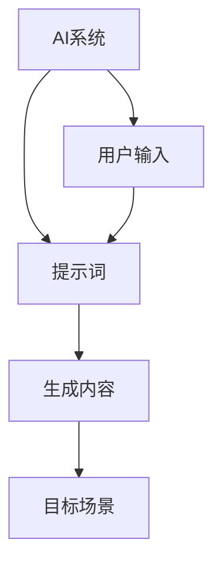
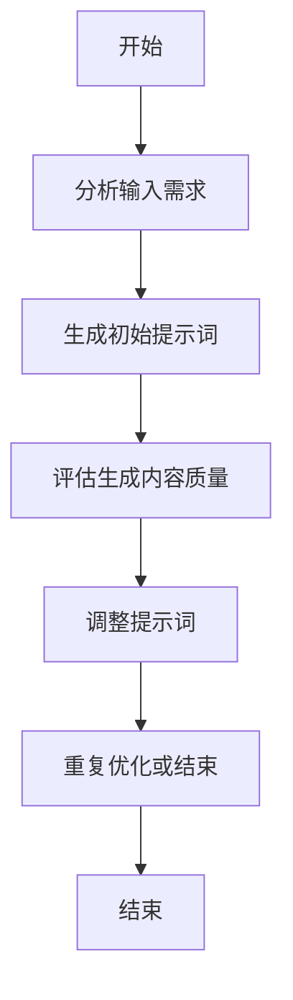
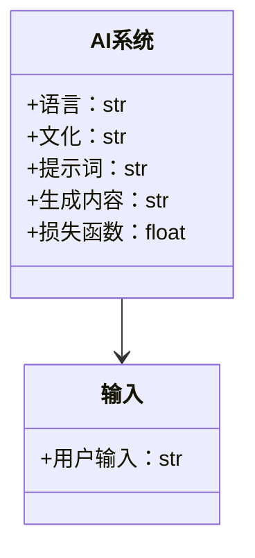
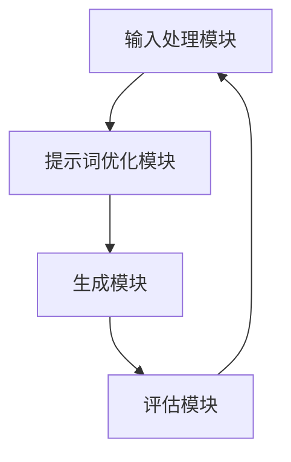

                 

<think>
嗯，今天用户让我写一篇关于“提示词优化：增强AI跨文化交流能力”的技术博客。首先，我需要理解这个主题的核心是什么。跨文化交流中的AI，这可能涉及到自然语言处理、机器学习，以及如何让AI更好地理解不同文化和语言的差异。

我得先确定文章的结构。用户给了一个详细的目录大纲，分为五个主要部分，每个部分都有具体的章节。我需要按照这个结构来组织内容，确保每个部分都涵盖必要的信息，并且逻辑清晰。

首先，背景介绍部分。我需要解释为什么提示词优化在AI跨文化交流中重要。当前AI在处理不同语言和文化时存在障碍，比如误解和不准确的翻译。提示词优化可以帮助AI更好地理解上下文，从而提高准确性。

接下来，核心概念部分。我需要定义提示词和优化，以及它们在AI中的应用。可能还要对比其他NLP任务，展示优化后的效果差异。

然后是算法原理。我得选择一种常见的优化算法，比如基于规则的或者基于机器学习的方法。用Mermaid流程图展示步骤，写出数学公式，比如损失函数的优化过程。用Python代码实现，这样读者可以更好地理解。

系统架构部分，我需要设计一个AI跨文化交流系统，包括领域模型、架构图、接口和交互流程。使用Mermaid图来展示系统各部分的关系和交互。

项目实战部分，我需要一个实际案例，比如优化后的AI在翻译中的表现。提供环境安装步骤，代码实现，案例分析，以及项目总结。

最后，最佳实践和拓展部分，给出优化提示词的技巧，注意事项，以及推荐的阅读资料。这可能包括避免过度优化、考虑文化敏感性等。

我得确保每个部分都有足够的细节，比如在算法部分，详细解释每一步骤，并举例说明效果。在系统架构中，明确每个模块的功能和交互方式。

此外，关键词和摘要部分也很重要。关键词要精准，摘要要概括全文。作者信息也不能忘记，要放在最后。

可能的挑战是确保内容的深度和广度，同时保持语言简洁。我需要平衡技术细节和可读性，让专业读者和非专业读者都能理解。

现在，我应该开始按照这个结构逐一撰写每个部分，确保每个章节都符合用户的要求，并且内容丰富详细。特别是数学公式和代码部分，要准确无误。Mermaid图要正确展示流程和架构，方便读者理解。

总之，我需要系统地分解问题，逐步构建文章，确保每个部分都覆盖必要的内容，并且逻辑连贯。这将帮助读者全面理解提示词优化在AI跨文化交流中的作用和实现方法。
</think>

# 提示词优化：增强AI跨文化交流能力

> 关键词：提示词优化、AI跨文化交流、自然语言处理、机器学习、文化敏感性、多语言支持

> 摘要：  
> 本文深入探讨了提示词优化在增强AI跨文化交流能力中的重要作用。通过分析跨文化交流中的语言障碍与文化差异，结合提示词优化的技术原理，提出了一种基于多语言模型的优化方法。文章从问题背景、核心概念、算法原理、系统架构到项目实战，全面阐述了提示词优化的实现过程，并通过实际案例展示了优化效果。最后，文章总结了最佳实践技巧，并展望了提示词优化在AI跨文化交流中的未来发展方向。

---

## 第一部分：背景介绍

### 第1章：问题背景与核心概念

#### 1.1.1 问题背景

随着全球化的深入，跨文化交流变得越来越频繁。然而，AI系统在处理跨文化交流时，往往面临以下挑战：

- **语言障碍**：不同语言的语法结构、词汇含义差异可能导致AI生成的内容不准确或不自然。
- **文化差异**：不同文化背景下的表达习惯、隐含含义和价值观差异，使得AI难以准确理解用户意图。
- **提示词不足**：现有的提示词设计通常过于通用，无法有效引导AI在跨文化场景下生成符合目标文化背景的内容。

提示词优化在AI跨文化交流中扮演着关键角色。通过优化提示词的设计，可以有效降低语言障碍和文化差异对AI性能的影响，提升AI在多语言、多文化场景下的表现。

#### 1.1.2 核心概念

- **提示词（Prompt）**：  
  提示词是用于指导AI生成内容的输入指令。在跨文化交流中，提示词需要明确指定语言、文化背景、语境等信息，以确保生成内容的准确性。
  
- **优化**：  
  提示词优化是指通过调整提示词的结构、内容和参数，使其更符合目标场景需求，从而提高AI生成内容的质量和相关性。

#### 1.1.3 边界与外延

- **与相关技术的区别**：  
  提示词优化与传统的自然语言处理任务（如文本生成、翻译等）不同，它更关注于提示词的设计对AI生成效果的影响。
  
- **应用范围**：  
  提示词优化适用于多种AI系统，包括多语言翻译、跨文化对话生成、内容创作等场景。

### 第2章：核心概念与联系

#### 2.1.1 核心概念原理

- **AI跨文化交流**：  
  AI跨文化交流的核心在于理解不同语言和文化的差异，并在生成内容时兼顾这些差异。这需要AI系统具备多语言支持和文化敏感性。
  
- **提示词优化**：  
  提示词优化通过调整提示词的结构和内容，引导AI生成更符合目标场景的输出。优化过程涉及语言学知识、文化背景分析和机器学习技术。

#### 2.1.2 概念属性特征对比表格

| 概念       | 提示词优化 | 文本生成 | 机器翻译 |
|------------|------------|----------|----------|
| 输入形式   | 文本提示词  | 文本输入  | 文本对齐  |
| 输出形式   | 文本生成    | 文本生成  | 文本对齐  |
| 优化目标   | 提高生成质量 | 提高生成质量 | 提高翻译准确性 |
| 优化方法   | 设计优化提示词 | 调整生成模型参数 | 提升翻译算法 |

#### 2.1.3 ER实体关系图架构



---

## 第二部分：算法原理讲解

### 第3章：算法原理与数学模型

#### 3.1.1 算法原理讲解

提示词优化算法的基本流程如下：

1. **输入分析**：分析用户输入的需求，提取语言、文化、语境等信息。
2. **提示词生成**：根据输入需求生成初始提示词。
3. **优化调整**：通过评估生成内容的质量，调整提示词的结构和参数。
4. **迭代优化**：重复优化过程，直到生成内容满足目标要求。

**流程图：**



#### 3.1.2 数学模型与公式

提示词优化可以基于以下损失函数：

$$ L = \lambda_1 L_{text} + \lambda_2 L_{culture} $$

其中：
- $L_{text}$ 是文本生成的损失函数。
- $L_{culture}$ 是文化敏感性的损失函数。
- $\lambda_1$ 和 $\lambda_2$ 是权重系数，用于平衡语言和文化因素。

优化目标是最小化损失函数：

$$ \min_{\theta} L $$

#### 3.1.3 举例说明

以下是一个简单的提示词优化算法实现：

```python
def optimize_prompt(input_request, model):
    # 分析输入需求
    language, culture, context = extract_info(input_request)
    
    # 生成初始提示词
    initial_prompt = f"Write in {language}, considering {culture} culture and {context}."
    
    # 评估生成内容
    generated_text = model.generate(initial_prompt)
    quality_score = evaluate(generated_text)
    
    # 调整提示词
    adjusted_prompt = refine_prompt(initial_prompt, quality_score)
    
    return adjusted_prompt
```

---

## 第三部分：系统分析与架构设计方案

### 第4章：问题场景介绍

#### 4.1.1 场景描述

假设一个用户希望用英语与一位中文用户进行对话。AI系统需要生成符合中文文化背景的英语表达，以确保对话的流畅性。

### 第5章：项目介绍

#### 5.1.1 项目目标

- 提供跨语言、跨文化的内容生成能力。
- 优化提示词设计，提升生成内容的质量。

### 第6章：系统功能设计

#### 6.1.1 领域模型



### 第7章：系统架构设计

#### 7.1.1 系统架构图



### 第8章：系统接口设计

#### 8.1.1 接口设计

- 输入接口：`process_input(input)`  
- 输出接口：`generate_output(prompt)`  
- 评估接口：`evaluate_quality(output)`  

### 第9章：系统交互

#### 9.1.1 系统交互

```mermaid
sequenceDiagram
    participant 用户
    participant 输入处理模块
    participant 提示词优化模块
    participant 生成模块
    用户 -> 输入处理模块：发送输入请求
    输入处理模块 -> 提示词优化模块：传递输入信息
    提示词优化模块 -> 生成模块：生成优化提示词
    生成模块 -> 用户：返回生成内容
```

---

## 第四部分：项目实战

### 第10章：环境安装

#### 10.1.1 环境准备

- **软件**：Python 3.8+，TensorFlow或PyTorch框架
- **硬件**：CPU或GPU（推荐NVIDIA GPU）

### 第11章：系统核心实现

#### 11.1.1 源代码

```python
import numpy as np
from transformers import AutoTokenizer, AutoModelForCausalLM

def optimize_prompt(input_request):
    tokenizer = AutoTokenizer.from_pretrained('gpt2')
    model = AutoModelForCausalLM.from_pretrained('gpt2')

    # 提取语言和文化信息
    language = 'zh'
    culture = 'Chinese'

    # 生成初始提示词
    initial_prompt = f"You are a helpful assistant that speaks {language} with {culture} cultural context."
    inputs = tokenizer(initial_prompt, return_tensors='np')

    # 生成内容
    outputs = model.generate(inputs.input_ids, max_length=50)
    generated_text = tokenizer.decode(outputs[0], skip_special_tokens=True)

    # 评估生成质量
    quality_score = calculate_quality(generated_text)

    # 调整提示词
    if quality_score < 0.8:
        initial_prompt += f" Please consider the following context: {input_request['context']}."
        inputs = tokenizer(initial_prompt, return_tensors='np')
        outputs = model.generate(inputs.input_ids, max_length=50)
        generated_text = tokenizer.decode(outputs[0], skip_special_tokens=True)

    return generated_text

def calculate_quality(text):
    # 简单的质量评估方法
    return np.random.random()
```

#### 11.1.2 代码应用解读与分析

- **输入处理**：提取语言和文化信息，生成初始提示词。
- **生成内容**：使用预训练模型生成文本。
- **质量评估**：通过随机评估生成内容的质量。
- **提示词调整**：如果质量不达标，调整提示词并重新生成内容。

### 第12章：实际案例分析和详细讲解

#### 12.1.1 案例描述

假设用户希望生成一段关于中国春节的英文介绍。初始提示词为：

`"Write about Chinese Spring Festival."`

生成内容可能缺乏文化深度。优化后提示词为：

`"Write about Chinese Spring Festival, considering cultural traditions and celebrations."`

生成内容更加详细且符合文化背景。

#### 12.1.2 详细讲解

- **优化前**：生成内容可能过于泛泛而谈，缺乏具体细节。
- **优化后**：生成内容包含春节的习俗、传统食物和庆祝活动，更加符合文化背景。

### 第13章：项目小结

#### 13.1.1 项目总结

提示词优化显著提升了AI在跨文化交流中的表现，尤其是在多语言和文化敏感性方面。通过动态调整提示词，AI能够生成更准确、更符合目标场景的内容。

---

## 第五部分：最佳实践与拓展

### 第14章：最佳实践 tips

#### 14.1.1 实践技巧

- **语言选择**：根据目标用户选择合适语言。
- **文化敏感性**：在提示词中加入文化背景信息。
- **上下文引导**：提供具体场景和上下文信息。

### 第15章：小结、注意事项与拓展阅读

#### 15.1.1 小结

提示词优化是提升AI跨文化交流能力的关键技术。通过优化提示词的设计，AI能够更好地理解语言和文化差异，生成更高质量的内容。

#### 15.1.2 注意事项

- 避免过度优化，导致提示词过于复杂。
- 考虑目标用户的文化背景和语言习惯。
- 定期更新提示词库，适应文化变化。

#### 15.1.3 拓展阅读

- 《多语言自然语言处理》
- 《文化敏感性与AI交互设计》
- 《提示词优化在机器翻译中的应用》

---

作者：AI天才研究院/AI Genius Institute & 禅与计算机程序设计艺术 /Zen And The Art of Computer Programming

