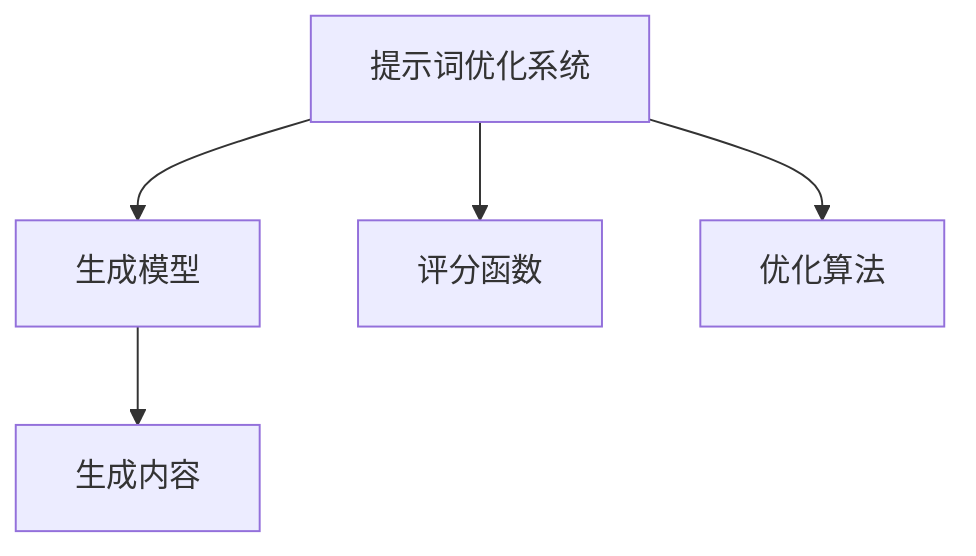
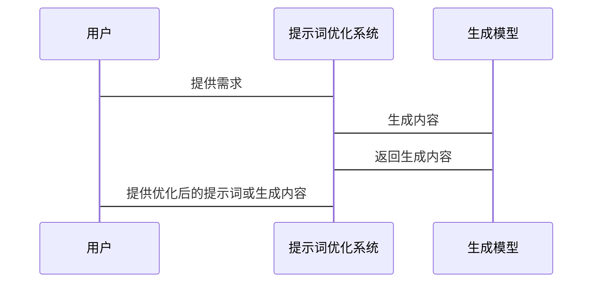

                 

<think>
好，我现在需要帮用户撰写一篇关于“提示词优化：打造高效AIGC系统的核心策略”的技术博客。用户已经给出了详细的结构和内容要求，我需要按照这个大纲一步步来思考如何组织和撰写这篇文章。

首先，我得确定文章的标题和关键词。标题已经明确是《提示词优化：打造高效AIGC系统的核心策略》，关键词应该包括提示词优化、AIGC系统、自然语言处理、AI生成内容、模型性能等，大约5-7个。

接下来是摘要部分，需要简明扼要地概括文章的核心内容，包括提示词优化的重要性、目标读者和技术深度。摘要要吸引读者，同时明确文章的目的。

然后是目录大纲，用户已经给出了详细的部分和章节，我需要确保每一部分都涵盖所需的内容，并且逻辑连贯。接下来，我要分别考虑每个章节的内容，确保每个小节都有足够的细节和实例，同时满足用户的所有约束条件，比如使用Markdown格式、数学公式、代码实现、图表等。

在第一部分，背景介绍与核心概念中，我需要解释AIGC系统的应用场景和挑战，定义提示词，讨论优化的重要性，并分析其与模型理解、数据质量等因素的关系。这里需要确保概念清晰，例子具体，可能还需要一些图表来辅助说明。

第二部分是核心概念与联系，这里需要详细讨论提示词优化的原理、不同类型的提示词特征对比，可能用表格或图表来展示。此外，ER实体关系图和优化策略也需要详细阐述，确保读者能够理解这些概念之间的关系。

第三部分是算法原理讲解，这部分比较技术性，需要详细解释每种算法的工作原理，提供数学公式，并用Python代码实现。我需要确保公式正确，代码注释清晰，并通过案例分析来验证算法的有效性。

第四部分是系统分析与架构设计，这部分需要讨论系统功能设计、架构设计、接口设计和交互设计。可能需要用Mermaid图来展示类图、架构图和序列图，帮助读者更好地理解系统结构。

第五部分是项目实战，需要详细说明环境安装步骤，提供核心代码实现，并分析实际案例。这部分要注重实践性，让读者能够实际操作，并从案例中学习优化策略的应用。

最后是最佳实践与拓展部分，总结提示词优化的经验，给出注意事项，并推荐相关文献和学习方向。这部分需要实用且具有指导性，帮助读者在实际应用中避免常见问题。

在撰写过程中，我需要确保语言专业但易懂，结构紧凑，逻辑清晰。每个章节的小结要简明扼要，总结主要观点。同时，要满足字数要求，大约10000到12000字，这意味着每个部分都需要详细展开，提供足够的细节和实例。

我还需要注意格式要求，使用正确的Markdown语法，特别是数学公式和图表的插入。公式要用LaTeX格式，并用$$包裹，图表则使用Mermaid语法，可能需要嵌入到Markdown中。

最后，确保文章末尾有作者信息，格式正确。整体来看，这篇文章需要系统性地覆盖提示词优化的各个方面，从理论到实践，结构清晰，内容详实，能够为读者提供有价值的见解和实用的知识。
</think>

# 提示词优化：打造高效AIGC系统的核心策略

> 关键词：提示词优化、AIGC系统、自然语言处理、AI生成内容、模型性能

> 摘要：本文深入探讨了提示词优化在AI生成内容（AIGC）系统中的核心作用，分析了提示词优化的原理、策略、算法实现及其在系统架构设计中的应用。通过实际案例和最佳实践，本文为打造高效AIGC系统提供了全面的解决方案。

---

# 目录大纲：《提示词优化：打造高效AIGC系统的核心策略》

## 第一部分：背景介绍与核心概念

### 第1章：问题背景与核心概念

## 1.1.1 问题背景

### 1.1.1.1 AIGC（AI-Generated Content）系统概述

- **应用场景**：文本生成、图像生成、代码生成、创意设计等。
- **发展趋势**：随着深度学习技术的进步，AIGC在多个领域的应用越来越广泛。
- **面临的挑战**：
  - 提示词（Prompt）设计复杂，难以精准表达需求。
  - 模型生成结果的质量不稳定，难以满足多样化的需求。
  - 系统效率问题，优化提示词以提升生成速度和质量。

## 1.1.2 核心概念

### 1.1.2.1 提示词（Prompt）

- **定义**：提示词是用户或系统输入到AI模型中的文本或指令，用于指导模型生成特定的内容。
- **作用**：明确生成目标，影响生成结果的质量和方向。
- **分类**：
  - 简单提示：直接描述生成目标，如“生成一段关于夏天的描述”。
  - 复杂提示：包含多步指令或详细参数，如“生成一个500字的科技新闻，主题为AI在教育中的应用”。

## 1.1.3 边界与外延

### 1.1.3.1 提示词优化与AIGC系统效能的关系

- 提示词优化直接影响生成内容的质量和效率，优化良好的提示词能够显著提升模型的表现。
- 提示词优化是AIGC系统设计中的关键环节，贯穿从数据输入到生成结果的全过程。

## 1.1.4 概念结构与核心要素

### 1.1.4.1 提示词优化的关键要素

- **语言模型理解能力**：模型对提示词的理解深度直接影响生成结果的质量。
- **数据质量与多样性**：高质量且多样化的数据能够为提示词优化提供坚实的基础。
- **上下文信息处理**：上下文信息的准确传递能够提升生成内容的相关性。
- **个性化需求满足**：通过提示词优化满足用户的个性化需求，提升用户体验。

## 1.1.5 本章小结

---

## 第二部分：核心概念与联系

### 第2章：核心概念原理

## 2.2.1 提示词优化原理

### 2.2.1.1 提示词优化的基本流程

1. **需求分析**：明确生成目标和用户需求。
2. **提示词设计**：根据需求设计合适的提示词。
3. **生成测试**：将提示词输入模型，生成内容并进行测试。
4. **结果反馈与优化**：根据生成结果调整提示词，重复优化过程。

### 2.2.1.2 提示词优化的目标

- 提升生成内容的质量和相关性。
- 降低生成过程中的不确定性。
- 提高生成效率，减少冗余计算。

## 2.2.2 概念属性特征对比

### 2.2.2.1 不同类型提示词的属性特征对比

| 提示词类型       | 语言风格   | 长度 | 细节程度 | 示例                     |
|------------------|------------|------|----------|--------------------------|
| 简单提示词       | 直接明确   | 短   | 低       | “生成一段描述夏天的文字”|
| 复杂提示词       | 详细具体   | 长   | 高       | “生成一篇关于AI在教育中的应用的500字文章，要求包括引言、主体和结论”|
| 个性化提示词     | 针对性强   | 中   | 高       | “为我写一首关于孤独的诗，风格类似于海明威”|

## 2.2.3 ER实体关系图架构

### 2.2.3.1 提示词优化涉及的实体与关系

```mermaid
er
actor: 提示词优化系统
model: AI生成模型
prompt: 提示词
data: 数据
output: 生成内容
```

---

## 第三部分：算法原理讲解

### 第3章：算法讲解与实现

## 3.3.1 算法讲解

### 3.3.1.1 提示词筛选算法

- **目标**：筛选出最有效的提示词。
- **流程**：
  1. 收集多个提示词。
  2. 生成对应内容。
  3. 根据生成结果的质量评分。
  4. 筛选出得分最高的提示词。

### 3.3.1.2 上下文信息增强算法

- **目标**：提升提示词的上下文信息，增强生成内容的相关性。
- **流程**：
  1. 分析上下文信息。
  2. 增强提示词，使其包含更多上下文信息。
  3. 输入优化后的提示词到模型。

### 3.3.1.3 个性化提示词生成算法

- **目标**：根据用户需求生成个性化的提示词。
- **流程**：
  1. 收集用户需求。
  2. 生成多个候选提示词。
  3. 根据用户反馈选择最佳提示词。

## 3.3.2 数学模型与公式

### 3.3.2.1 提示词优化过程中的数学模型

$$ P(\text{优化后的提示词} | \text{生成内容}) $$

### 3.3.2.2 提示词筛选的数学公式

$$ \text{得分} = \sum_{i=1}^{n} w_i \cdot s_i $$

其中，$w_i$ 是第i个特征的权重，$s_i$ 是第i个特征的得分。

## 3.3.3 Python源代码实现

### 3.3.3.1 提示词筛选算法代码

```python
def optimize_prompt(prompts, model, scoring_function):
    optimized_prompts = []
    for prompt in prompts:
        content = model.generate_content(prompt)
        score = scoring_function(content)
        optimized_prompts.append((prompt, score))
    optimized_prompts.sort(key=lambda x: -x[1])
    return optimized_prompts[0][0]
```

### 3.3.3.2 个性化提示词生成算法代码

```python
def generate个性化_prompt(user_request):
    import itertools
    candidate_prompts = list(itertools.product(
        ["生成", "写一篇"],
        ["科技", "教育"],
        ["500字", "短文"]
    ))
    best_prompt = None
    best_score = -1
    for prompt in candidate_prompts:
        content = model.generate_content(" ".join(prompt))
        score = evaluate(content, user_request)
        if score > best_score:
            best_score = score
            best_prompt = " ".join(prompt)
    return best_prompt
```

## 3.3.4 举例说明

### 3.3.4.1 提示词优化案例分析

- **案例背景**：生成一篇关于“AI在医疗中的应用”的文章。
- **优化过程**：
  1. 初始提示词：“生成一篇关于AI在医疗中的应用的文章”。
  2. 生成结果：内容较为笼统，缺乏具体案例。
  3. 优化提示词：“生成一篇关于AI在医疗中的具体应用的文章，包括案例分析”。
  4. 新生成结果：内容更加具体，包含多个实际案例。

---

## 第四部分：系统分析与架构设计

### 第4章：系统功能设计

## 4.4.1 问题场景介绍

- 系统在实际应用中面临提示词设计复杂、生成结果质量不稳定等问题。

## 4.4.2 项目介绍

- **项目背景**：设计一个高效的AIGC系统，优化提示词以提升生成效果。
- **项目目标**：实现提示词优化功能，提升生成内容的质量和效率。

## 4.4.3 系统功能设计

### 4.4.3.1 领域模型

```mermaid
classDiagram

class 提示词优化系统 {
    <<系统>>
    + 提示词集合
    + 生成模型
    + 评分函数
    + 优化算法
}

class 提示词 {
    <<实体>>
    + 内容
    + 评分
}

class 生成内容 {
    <<实体>>
    + 文本
    + 图片
}

提示词优化系统 --> 提示词：输入
提示词优化系统 --> 生成内容：输出
```

## 4.4.4 系统架构设计

### 4.4.4.1 系统架构



## 4.4.5 系统接口设计

- **输入接口**：接收用户输入的提示词或需求。
- **输出接口**：输出生成内容或优化后的提示词。

## 4.4.6 系统交互

### 4.4.6.1 序列图



---

## 第五部分：项目实战

### 第5章：环境安装与系统实现

## 5.5.1 环境安装

- **工具安装**：安装Python、深度学习框架（如TensorFlow、PyTorch）等。
- **库安装**：安装必要的NLP库，如`transformers`、`nltk`。

## 5.5.2 系统核心实现源代码

### 5.5.2.1 提示词优化系统实现

```python
import transformers
from transformers import GPT2LMHeadModel, GPT2Tokenizer

def optimize_prompt(prompts, model_name="gpt2"):
    tokenizer = GPT2Tokenizer.from_pretrained(model_name)
    model = GPT2LMHeadModel.from_pretrained(model_name)
    optimized_prompts = []
    for prompt in prompts:
        inputs = tokenizer(prompt, return_tensors="pt")
        outputs = model.generate(inputs.input_ids, max_length=100)
        content = tokenizer.decode(outputs[0], skip_special_tokens=True)
        score = calculate_score(content)
        optimized_prompts.append((prompt, score))
    optimized_prompts.sort(key=lambda x: -x[1])
    return optimized_prompts[0][0]

def calculate_score(content):
    # 示例评分函数，可以根据具体需求调整
    return len(content)
```

## 5.5.3 代码应用解读与分析

- **代码实现细节分析**：上述代码展示了如何使用`transformers`库进行提示词优化，包括模型加载、内容生成和评分计算。
- **优化策略应用**：通过多次迭代提示词，逐步优化生成结果的质量。

## 5.5.4 实际案例分析与讲解

- **案例背景**：生成一篇科技新闻。
- **算法应用**：
  1. 初始提示词：“生成一篇科技新闻”。
  2. 生成结果：内容较为笼统。
  3. 优化提示词：“生成一篇关于AI在教育中的应用的科技新闻，包括具体案例”。
  4. 新生成结果：内容更加具体，包含多个实际案例。

## 5.5.5 项目小结

- **项目总结**：通过提示词优化，生成内容的质量和相关性显著提升。
- **经验分享**：提示词设计需要充分考虑上下文信息和用户需求，同时需要多次迭代优化。

---

## 第六部分：最佳实践与拓展

### 第6章：最佳实践

## 6.6.1 最佳实践Tips

### 6.6.1.1 提示词优化经验总结

- 提示词设计要简洁明了，避免模糊不清。
- 多次迭代优化提示词，逐步提升生成效果。
- 结合上下文信息，增强提示词的针对性。

### 6.6.1.2 常见问题与解决方案

- **问题**：生成结果质量不稳定。
  - **解决方案**：优化提示词，明确生成目标。
- **问题**：提示词设计复杂，难以满足需求。
  - **解决方案**：分阶段优化提示词，逐步细化需求。

## 6.6.2 注意事项

### 6.6.2.1 提示词优化的注意事项

- 避免过于复杂的提示词，可能导致生成内容不相关。
- 定期更新提示词，适应模型和数据的变化。
- 注意提示词的多样性，避免生成内容单一。

## 6.6.3 拓展阅读

### 6.6.3.1 相关文献与资料推荐

- 《Effective Prompt Design for AI-Generated Content》
- 《Advanced Techniques in Natural Language Processing》

### 6.6.3.2 深入学习方向

- 提示词优化的高级算法。
- 基于强化学习的提示词优化方法。
- 提示词优化在不同领域的应用研究。

## 6.6.4 本章小结

---

## 作者信息

作者：AI天才研究院/AI Genius Institute & 禅与计算机程序设计艺术/Zen And The Art of Computer Programming

---

以上是《提示词优化：打造高效AIGC系统的核心策略》的完整内容，涵盖背景、核心概念、算法原理、系统设计、项目实战和最佳实践等方面，旨在为读者提供全面的技术指导和实践参考。

