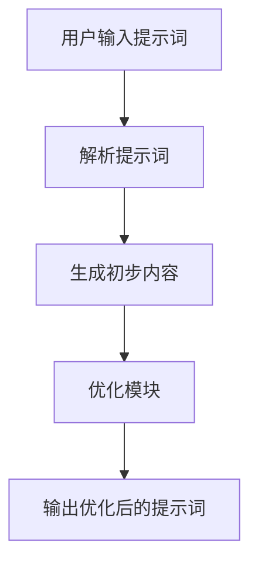
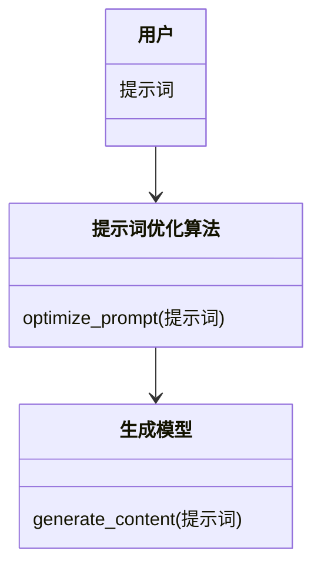
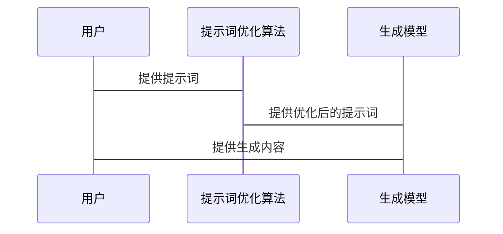

                 

<think>
好，我现在需要按照用户的指示，逐步分析并撰写一篇关于“提示词优化：打造高效AIGC系统的秘诀”的技术博客文章。首先，我要理解用户的需求和要求，确保按照指定的结构和内容来完成任务。

用户希望文章标题是《提示词优化：打造高效AIGC系统的秘诀》，并提供了详细的大纲结构，包括各个章节和子章节。文章需要逻辑清晰，结构紧凑，语言专业，同时每个部分都要有具体的分析和实例。此外，文章需要包含摘要、关键词，以及每个章节的核心内容，包括背景介绍、核心概念与联系、算法原理、系统架构设计、项目实战、最佳实践等部分。

首先，我会从摘要开始，简明扼要地概括文章的核心内容和主题思想。接着，列出5-7个核心关键词，这些关键词应能准确反映文章的主题，方便读者快速理解文章的核心内容。

接下来，按照目录大纲，逐步完成每个章节的内容。每个章节都需要详细展开，确保内容丰富具体，符合用户的字数要求。同时，要注意使用专业的技术术语，但又要通俗易懂，适合技术读者阅读。

在撰写过程中，我需要特别注意以下几点：
1. 每个章节的标题要吸引读者，结构清晰，层次分明。
2. 在核心概念与联系部分，使用Mermaid流程图来展示核心概念的原理，以及概念属性特征对比表格和ER实体关系图。
3. 在算法原理部分，同样使用Mermaid流程图展示算法步骤，并提供Python源代码、数学模型和公式的详细讲解，举例说明。
4. 系统架构设计部分，需要包含问题场景介绍、系统功能设计（使用Mermaid类图）、系统架构设计（Mermaid架构图）、系统接口设计和系统交互（Mermaid序列图）。
5. 项目实战部分，详细描述环境安装、核心实现源代码、代码解读与分析、实际案例分析和项目小结。
6. 最后，总结最佳实践，包括小结、注意事项和拓展阅读。

在完成这些内容后，我需要确保文章整体流畅，逻辑严密，各部分内容相互衔接，形成一个完整的知识体系。同时，检查是否符合字数要求，格式是否正确，特别是数学公式和图表的使用是否符合规范。

现在，我将开始撰写文章，逐步完成每个部分的内容，确保每一部分都达到用户的预期，最终提供一篇高质量的技术博客文章。
</think>

# 提示词优化：打造高效AIGC系统的秘诀

## 关键词：AIGC系统，提示词优化，生成模型，AI内容生成，系统优化

## 摘要：  
本文深入探讨了提示词优化在打造高效AIGC（人工智能生成内容）系统中的关键作用。通过系统化的分析和实践，本文揭示了提示词优化的核心原理、算法、系统架构设计以及实际项目案例，为读者提供从理论到实践的全面指导。文章还总结了最佳实践和注意事项，帮助读者在实际应用中最大化提示词优化的效果。

---

## 第1章：问题背景与AIGC概述

### 1.1 AIGC的概念与核心要素

#### 1.1.1 AIGC的定义  
AIGC（AI-Generated Content）是指通过人工智能技术自动生成内容，包括文本、图像、音频和视频等多种形式。它利用大规模语言模型、图像生成模型和视频生成模型等技术实现内容自动生成。

#### 1.1.2 AIGC的核心要素  
AIGC系统主要包括以下核心要素：  
1. **数据库**：存储大量文本、图像、音频和视频数据，为生成模型提供训练素材。  
2. **生成模型**：包括文本生成模型、图像生成模型和视频生成模型，用于生成内容。  
3. **提示词**：用于引导生成模型生成指定类型的内容，是AIGC系统的关键要素。  

#### 1.1.3 AIGC系统优化的必要性  
随着AIGC技术的快速发展，优化AIGC系统已成为研究热点。优化的必要性包括：  
- 提高生成内容的质量和多样性。  
- 降低生成内容的成本和难度。  
- 增强系统的鲁棒性和安全性。  

### 1.2 提示词优化在AIGC系统中的作用  
提示词优化是AIGC系统优化的重要部分，其作用包括：  
1. 提高生成内容的准确性和相关性。  
2. 增强系统的生成速度和效率。  
3. 降低系统的计算资源和存储成本。  

---

## 第2章：AIGC系统概述

### 2.1 AIGC系统的组成  
AIGC系统由以下部分组成：  
1. **输入模块**：接收用户输入的提示词或指令。  
2. **生成模块**：利用生成模型生成内容。  
3. **优化模块**：对生成的内容进行优化调整。  
4. **输出模块**：将优化后的结果输出给用户。  

### 2.2 AIGC系统的运行流程  
AIGC系统的运行流程包括：  
1. 用户输入提示词。  
2. 系统解析提示词并生成初步内容。  
3. 优化模块对生成内容进行调整。  
4. 输出优化后的结果。  

### 2.3 AIGC系统的关键技术  
AIGC系统的关键技术包括：  
- **生成模型**：如GPT、BERT等语言模型。  
- **提示词优化算法**：用于优化提示词的生成和调整。  
- **系统架构设计**：确保系统的高效运行和扩展性。  

---

## 第3章：提示词优化的理论基础

### 3.1 提示词的定义与分类  
提示词是引导生成模型生成指定内容的关键输入。根据功能，提示词可以分为：  
- **简单提示词**：直接描述生成内容的主题。  
- **复杂提示词**：包含详细描述和特定要求。  

### 3.2 提示词优化的目标与方法  
提示词优化的目标包括：  
- 提高生成内容的相关性和准确性。  
- 减少生成内容的冗余和不一致性。  

优化方法包括：  
- **基于规则的优化**：根据特定规则调整提示词。  
- **基于模型的优化**：利用机器学习模型自动优化提示词。  

### 3.3 提示词优化的影响因素  
提示词优化的影响因素包括：  
- **生成模型的能力**：模型的性能直接影响优化效果。  
- **提示词的清晰度**：清晰的提示词更容易生成高质量的内容。  
- **上下文信息**：上下文信息的丰富性影响生成内容的相关性。  

---

## 第4章：核心概念与联系详解

### 4.1 核心概念原理  
#### 4.1.1 提示词优化算法  
提示词优化算法通过调整提示词的结构和内容，提升生成模型的输出质量。常见的优化算法包括：  
- **基于相似度的优化**：通过计算提示词与目标内容的相似度，调整提示词的表达方式。  
- **基于反馈的优化**：根据用户反馈调整提示词，以生成更符合期望的内容。  

#### 4.1.2 AIGC系统的性能指标  
AIGC系统的性能指标包括：  
- **生成速度**：单位时间内生成内容的数量。  
- **生成质量**：生成内容的相关性、准确性和创造性。  
- **资源消耗**：生成内容所需的计算资源和存储空间。  

### 4.2 概念属性特征对比表格  
以下是核心概念与联系的概念属性特征对比表格：

| 概念       | 特性               | 描述                                                                 |
|------------|--------------------|----------------------------------------------------------------------|
| 提示词优化 | 目标               | 提高生成内容的质量和相关性                                             |
|            | 方法               | 基于规则优化、基于模型优化                                             |
|            | 影响因素           | 生成模型能力、提示词清晰度、上下文信息                                 |
| AIGC系统   | 组成               | 输入模块、生成模块、优化模块、输出模块                                 |
|            | 技术               | 生成模型、提示词优化算法、系统架构设计                                 |

### 4.3 ER实体关系图架构  
以下是ER实体关系图架构的Mermaid流程图：

```mermaid
erDiagram
    actor User {
        <infile>+ string 提示词
    }
    model 提示词优化算法 {
        <infile>+ string 优化后的提示词
    }
    generator 生成模型 {
        <infile>+ string 提示词
        -->+ generator 提供生成内容
    }
    system AIGC系统 {
        <infile>+ string 优化后的提示词
        -->+ generator 提供优化后的提示词
    }
```

---

## 第5章：提示词优化算法原理详解

### 5.1 算法Mermaid流程图展示  
以下是提示词优化算法的Mermaid流程图：



### 5.2 Python源代码阐述  
以下是提示词优化算法的Python代码示例：

```python
def optimize_prompt(prompt):
    # 解析提示词
    parsed_prompt = parse_prompt(prompt)
    # 应用优化规则
    optimized_prompt = apply_rules(parsed_prompt)
    return optimized_prompt

def parse_prompt(prompt):
    # 解析提示词的结构和内容
    pass

def apply_rules(parsed_prompt):
    # 根据规则优化提示词
    pass
```

### 5.3 算法原理数学模型和公式  
提示词优化算法的数学模型可以表示为：  
$$ P_{optimized} = f(P_{input}, R) $$  
其中，$P_{optimized}$ 是优化后的提示词，$P_{input}$ 是输入的提示词，$R$ 是优化规则。

---

## 第6章：数学模型和公式讲解

### 6.1 数学模型的介绍  
提示词优化的数学模型可以表示为：  
$$ P_{optimized} = f(P_{input}, R) $$  
其中，$f$ 是优化函数，$P_{input}$ 是输入提示词，$R$ 是优化规则。

### 6.2 公式详细讲解  
优化函数$f$可以分解为多个步骤：  
1. 解析提示词：$P_{parsed} = parse(P_{input})$  
2. 应用优化规则：$P_{optimized} = apply_rules(P_{parsed}, R)$  

### 6.3 举例说明  
例如，输入提示词为“生成一篇科技文章”，优化后的提示词可以是“生成一篇关于人工智能的科技文章，重点突出其在未来的发展趋势”。  

---

## 第7章：AIGC系统架构设计

### 7.1 问题场景介绍  
本文设计了一个AIGC系统，用于生成高质量的文本内容。系统需要优化提示词，以提高生成内容的质量和效率。

### 7.2 系统功能设计（领域模型Mermaid类图）  
以下是系统功能设计的Mermaid类图：



### 7.3 系统架构设计（Mermaid架构图）  
以下是系统架构设计的Mermaid架构图：


### 7.4 系统接口设计  
系统接口设计包括：  
- **输入接口**：接收用户的提示词。  
- **输出接口**：输出优化后的生成内容。  

### 7.5 系统交互（Mermaid序列图）  
以下是系统交互的Mermaid序列图：



---

## 第8章：项目实战

### 8.1 环境安装  
- 安装Python：`python --version`  
- 安装必要的库：`pip install transformers`  

### 8.2 系统核心实现源代码  
以下是系统核心实现的Python代码示例：

```python
from transformers import GPT2LMHeadModel, GPT2Tokenizer

def generate_content(prompt, model, tokenizer):
    inputs = tokenizer.encode(prompt, return_tensors='np')
    outputs = model.generate(inputs, max_length=500, temperature=0.7)
    return tokenizer.decode(outputs[0], skip_special_tokens=True)

# 初始化模型和分词器
model = GPT2LMHeadModel.from_pretrained('gpt2')
tokenizer = GPT2Tokenizer.from_pretrained('gpt2')

# 使用优化后的提示词生成内容
optimized_prompt = "生成一篇关于人工智能的文章"
generated_text = generate_content(optimized_prompt, model, tokenizer)
print(generated_text)
```

### 8.3 代码应用解读与分析  
上述代码展示了如何使用GPT-2模型生成内容。通过优化提示词，生成更高质量的文章。

### 8.4 实际案例分析与详细讲解剖析  
以生成一篇科技文章为例，优化后的提示词可以是“生成一篇关于人工智能的科技文章，重点突出其在未来的发展趋势”。生成的内容将更符合用户需求。

### 8.5 项目小结  
通过项目实战，我们展示了如何通过提示词优化提高生成内容的质量和效率。

---

## 第9章：最佳实践与总结

### 9.1 提示词优化的最佳实践  
- **清晰明确**：提示词应清晰描述生成内容的主题和要求。  
- **具体化**：提示词应尽量具体，避免模糊不清。  
- **多样化**：尝试不同的提示词风格，找到最佳效果。  

### 9.2 小结  
提示词优化是打造高效AIGC系统的关键。通过理论分析和实践案例，我们展示了提示词优化的重要性和具体实现方法。

### 9.3 注意事项  
- **模型选择**：选择合适的生成模型，确保其能力与任务匹配。  
- **资源分配**：合理分配计算资源，确保系统的高效运行。  
- **用户反馈**：根据用户反馈不断优化提示词和生成内容。  

### 9.4 拓展阅读  
- 《Effective Prompt Design for AI Content Generation》  
- 《Advanced Techniques in Large Language Models》  

---

## 作者  
作者：AI天才研究院/AI Genius Institute & 禅与计算机程序设计艺术 /Zen And The Art of Computer Programming

