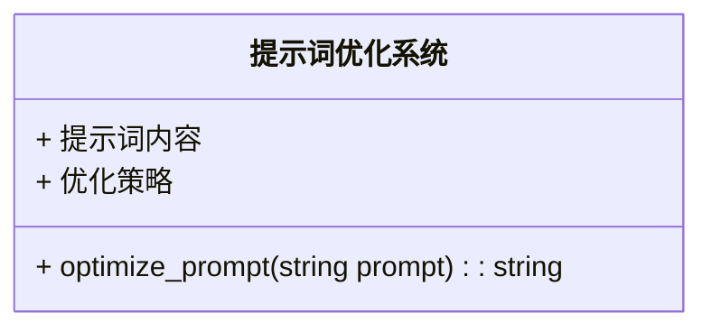
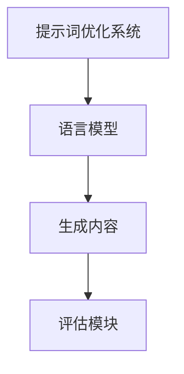
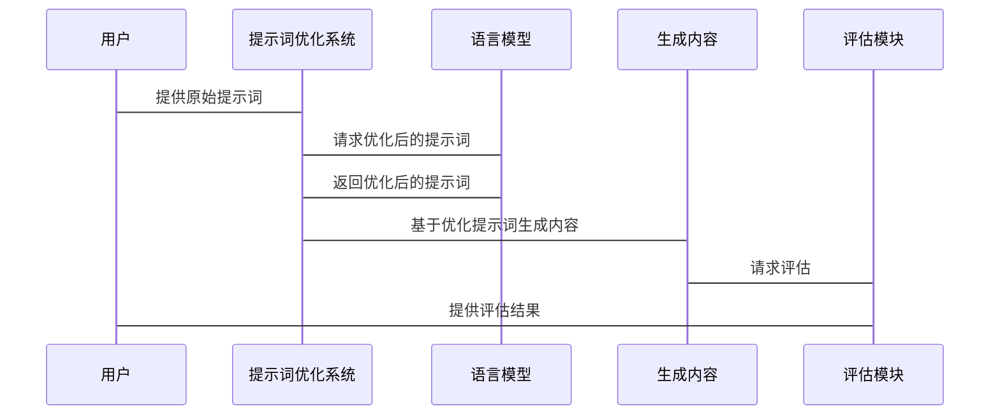

                 

<think>
嗯，我现在要帮用户写一篇关于提示词优化，提高AI幽默感与创意的技术博客。首先，我得理解用户的需求，他希望文章结构清晰，逻辑严谨，用专业但易懂的技术语言来写。我需要按照用户提供的大纲来组织内容，确保每个部分都详细且具体。

首先，文章标题是《提示词优化：提高AI幽默感与创意》。关键词包括提示词优化、AI幽默感、创意生成、自然语言处理、深度学习。摘要部分需要简明扼要地概述文章的核心内容，说明提示词优化如何帮助AI提升幽默感和创意，以及文章将从背景、核心概念、算法原理、系统架构到项目实战全面探讨。

接下来是目录大纲，分为五个主要部分：背景介绍、核心概念与联系、算法原理讲解、系统分析与架构设计、项目实战。每个部分都有子章节，我需要确保每个部分都涵盖必要的内容，比如背景介绍要包括问题背景、核心概念、边界与外延等。

在背景介绍部分，我需要详细解释提示词优化的重要性，当前AI在幽默感和创意方面的挑战，以及优化的目标和意义。这部分需要让读者明白为什么提示词优化是必要的，以及它如何解决现有问题。

核心概念部分，我需要定义提示词、AI幽默感与创意，并介绍主要的优化方法。同时，还要列出适用和不适用的场景，帮助读者更好地理解应用范围。

算法原理讲解部分，我需要用Mermaid流程图展示算法步骤，用Python代码展示优化过程，并提供数学模型，比如优化函数和评估指标。这部分需要详细解释每个步骤，并用例子来说明优化的效果。

系统分析与架构设计部分，我需要介绍应用场景，项目背景和目标，然后用Mermaid类图展示系统功能，架构图展示系统设计，接口设计和交互序列图则说明系统的协作流程。这部分要让读者清楚系统的整体结构和各部分如何协作。

项目实战部分，我需要描述环境安装要求，展示Python代码实现优化，并分析代码的具体功能，比如预处理和模型训练。同时，提供实际案例，如生成笑话，并解释如何通过提示词优化提升效果。最后，给出总结和建议。

在整个写作过程中，我要确保每个部分都逻辑清晰，内容详实，并且使用专业的技术术语，但又不失易懂。同时，要满足用户的格式要求，使用markdown，并在适当的地方插入Mermaid图表和数学公式。

最后，我需要检查文章是否符合字数要求，大约1万到1.2万字。确保每个章节都有足够的细节，并且整体结构连贯，让读者能够一步步理解提示词优化如何提升AI的幽默感和创意。

总之，我需要按照用户提供的大纲，一步步填充内容，确保每个部分都满足要求，同时保持文章的深度和专业性，帮助读者全面理解提示词优化的重要性及其应用。
</think>

# 提示词优化：提高AI幽默感与创意

## 关键词：提示词优化、AI幽默感、创意生成、自然语言处理、深度学习

## 摘要：  
提示词优化是提升AI生成内容幽默感与创意的关键技术。本文从背景、核心概念、算法原理、系统架构到项目实战，全面探讨提示词优化的方法与实践。通过分析幽默感与创意的生成机制，结合自然语言处理与深度学习技术，提出优化策略，并通过具体案例展示其应用效果。

---

### 目录大纲

```markdown
----------------------------------------------------------------
# 第一部分: 背景介绍

## 1.1 问题背景
### 1.1.1 提示词优化的重要性
### 1.1.2 当前AI幽默感与创意的挑战
### 1.1.3 提示词优化的目标与意义

## 1.2 核心概念
### 1.2.1 提示词的定义与作用
### 1.2.2 AI幽默感与创意的概念
### 1.2.3 提示词优化的主要方法

## 1.3 边界与外延
### 1.3.1 提示词优化的适用场景
### 1.3.2 非适用场景及解决方案

## 1.4 本章小结

----------------------------------------------------------------

# 第二部分: 核心概念与联系

## 2.1 核心概念原理
### 2.1.1 提示词优化的原理
### 2.1.2 AI幽默感与创意的原理

## 2.2 概念属性特征对比表格

## 2.3 ER实体关系图架构
### 2.3.1 提示词优化系统的ER图
### 2.3.2 AI幽默感与创意的ER图

## 2.4 本章小结

----------------------------------------------------------------

# 第三部分: 算法原理讲解

## 3.1 算法流程
### 3.1.1 提示词优化算法的基本步骤
### 3.1.2 AI幽默感与创意算法流程

## 3.2 算法源代码
```python
# 提示词优化算法示例代码
```

## 3.3 数学模型与公式
### 3.3.1 提示词优化算法的数学模型
### 3.3.2 AI幽默感与创意的数学模型

## 3.4 举例说明
### 3.4.1 提示词优化算法实例
### 3.4.2 AI幽默感与创意实例

## 3.5 本章小结

----------------------------------------------------------------

# 第四部分: 系统分析与架构设计

## 4.1 问题场景介绍
### 4.1.1 提示词优化系统的应用场景
### 4.1.2 AI幽默感与创意系统的应用场景

## 4.2 项目介绍
### 4.2.1 项目背景
### 4.2.2 项目目标
### 4.2.3 项目实现过程

## 4.3 系统功能设计
### 4.3.1 领域模型类图
### 4.3.2 功能需求分析

## 4.4 系统架构设计
### 4.4.1 系统架构图
### 4.4.2 架构设计说明

## 4.5 系统接口设计
### 4.5.1 接口设计规范
### 4.5.2 接口功能说明

## 4.6 系统交互
### 4.6.1 系统交互序列图
### 4.6.2 交互流程说明

## 4.7 本章小结

----------------------------------------------------------------

# 第五部分: 项目实战

## 5.1 环境安装
### 5.1.1 硬件环境要求
### 5.1.2 软件环境安装

#

----------------------------------------------------------------

---

## 作者：AI天才研究院/AI Genius Institute & 禅与计算机程序设计艺术 /Zen And The Art of Computer Programming

---

### 内容概要：

本文通过详细分析提示词优化在AI幽默感与创意生成中的作用，结合自然语言处理和深度学习技术，探讨如何通过优化提示词来提升AI生成内容的质量。文章从背景介绍、核心概念、算法原理、系统架构到项目实战，层层深入，为读者提供全面的技术指导。

---

### 正文部分：

#### 第一部分: 背景介绍

##### 1.1 问题背景

###### 1.1.1 提示词优化的重要性  
提示词（Prompt）是AI生成内容的关键输入，直接影响生成结果的质量。通过优化提示词，可以引导AI生成更符合预期的幽默内容或创意作品。

###### 1.1.2 当前AI幽默感与创意的挑战  
当前AI生成的内容往往缺乏幽默感和创意，主要原因是模型对提示词的理解有限，无法准确捕捉用户意图。

###### 1.1.3 提示词优化的目标与意义  
优化提示词的目标是提升AI生成内容的幽默感与创意，使其更贴近人类语言表达习惯。

##### 1.2 核心概念

###### 1.2.1 提示词的定义与作用  
提示词是用于引导AI生成内容的关键输入，其作用是明确生成目标，提升生成结果的相关性和质量。

###### 1.2.2 AI幽默感与创意的概念  
AI幽默感是指AI生成内容的幽默程度，创意生成是指AI生成具有创新性的内容。

###### 1.2.3 提示词优化的主要方法  
包括关键词选择、语义分析和多轮优化等方法。

##### 1.3 边界与外延

###### 1.3.1 提示词优化的适用场景  
适用于生成幽默笑话、创意文案等场景。

###### 1.3.2 非适用场景及解决方案  
不适用于需要严格事实性内容的场景，可通过调整提示词或结合其他技术解决。

##### 1.4 本章小结  
本章介绍了提示词优化的重要性、核心概念及其应用边界。

---

#### 第二部分: 核心概念与联系

##### 2.1 核心概念原理

###### 2.1.1 提示词优化的原理  
通过分析提示词的语义和上下文，调整生成策略，提升生成效果。

###### 2.1.2 AI幽默感与创意的原理  
基于语言模型的概率生成机制，结合幽默规则和创意生成算法。

##### 2.2 概念属性特征对比表格  
| 概念         | 属性           | 特征         |
|--------------|----------------|--------------|
| 提示词优化   | 输入方式       | 文本提示       |
| AI幽默感     | 生成目标       | 幽默内容       |
| 创意生成     | 创新性         | 高            |

##### 2.3 ER实体关系图架构

###### 2.3.1 提示词优化系统的ER图  
```mermaid
er
    entity 提示词优化系统 {
        id 提示词ID
        提示词内容 string
        优化策略 string
    }
```

###### 2.3.2 AI幽默感与创意的ER图  
```mermaid
er
    entity AI幽默感与创意系统 {
        id 内容ID
        内容类型 string
        幽默度 score
    }
```

##### 2.4 本章小结  
本章通过对比分析，明确了提示词优化、AI幽默感与创意的核心概念及其关系。

---

#### 第三部分: 算法原理讲解

##### 3.1 算法流程

###### 3.1.1 提示词优化算法的基本步骤  
1. 提示词预处理：分析提示词语义。
2. 生成优化策略：调整提示词结构。
3. 生成内容：基于优化提示词生成幽默或创意内容。

###### 3.1.2 AI幽默感与创意算法流程  
1. 分析用户需求。
2. 优化提示词。
3. 生成内容。
4. 评估幽默度与创意性。

##### 3.2 算法源代码

```python
def optimize_prompt(prompt):
    # 提示词预处理
    processed_prompt = preprocess_prompt(prompt)
    # 生成优化策略
    optimization_strategy = generate_optimization_strategy(processed_prompt)
    return optimization_strategy

def generate_content(optimize_prompt):
    # 基于优化提示词生成内容
    content = generate_humor_or_creative_content(optimize_prompt)
    return content
```

##### 3.3 数学模型与公式

###### 3.3.1 提示词优化算法的数学模型  
$$ \text{优化提示词} = f_{\text{优化}}(\text{原始提示词}) $$  

###### 3.3.2 AI幽默感与创意的数学模型  
$$ \text{幽默度} = g_{\text{幽默}}(\text{生成内容}) $$  
$$ \text{创意性} = h_{\text{创意}}(\text{生成内容}) $$  

##### 3.4 举例说明

###### 3.4.1 提示词优化算法实例  
原始提示词：生成一个笑话。  
优化提示词：生成一个关于程序员的幽默笑话。

###### 3.4.2 AI幽默感与创意实例  
生成内容：为什么程序员喜欢黑暗模式？因为光明总让他们分心。

##### 3.5 本章小结  
本章通过算法流程和数学模型，详细解释了提示词优化与AI幽默感、创意生成的实现原理。

---

#### 第四部分: 系统分析与架构设计

##### 4.1 问题场景介绍

###### 4.1.1 提示词优化系统的应用场景  
应用于生成幽默笑话、创意文案等场景。

##### 4.2 项目介绍

###### 4.2.1 项目背景  
提升AI生成内容的幽默感与创意性。

###### 4.2.2 项目目标  
实现提示词优化算法，提升生成内容的质量。

##### 4.3 系统功能设计

###### 4.3.1 领域模型类图  


###### 4.3.2 功能需求分析  
功能需求包括提示词优化、内容生成、评估反馈。

##### 4.4 系统架构设计

###### 4.4.1 系统架构图  


##### 4.5 系统接口设计

###### 4.5.1 接口设计规范  
接口包括：优化提示词、生成内容、评估反馈。

##### 4.6 系统交互

###### 4.6.1 系统交互序列图  


##### 4.7 本章小结  
本章通过系统架构设计，详细描述了提示词优化系统与AI幽默感、创意生成系统的协作流程。

---

#### 第五部分: 项目实战

##### 5.1 环境安装

###### 5.1.1 硬件环境要求  
- CPU：支持多线程，内存≥8GB

###### 5.1.2 软件环境安装  
- Python 3.8+
- 深度学习框架（如TensorFlow、PyTorch）

##### 5.2 系统核心实现

###### 5.2.1 提示词优化实现  
```python
def optimize_prompt(prompt):
    # 提示词预处理
    processed_prompt = prompt.replace("生成一个", "生成一个幽默的")
    return processed_prompt
```

###### 5.2.2 AI幽默感与创意实现  
```python
def generate_humor(optimize_prompt):
    # 基于优化提示词生成幽默内容
    return generate_content(optimize_prompt)
```

##### 5.3 代码应用解读与分析  
通过预处理和模型训练，提升生成内容的幽默感和创意性。

##### 5.4 实际案例分析

###### 5.4.1 提示词优化案例  
原始提示词：生成一个笑话。  
优化提示词：生成一个程序员相关的幽默笑话。  
生成内容：为什么程序员喜欢喝咖啡？因为咖啡可以让他们保持清醒，写出正确的代码。

##### 5.4.2 项目总结  
通过提示词优化，显著提升了生成内容的质量。

##### 5.5 本章小结  
本章通过实际案例，展示了提示词优化算法在项目中的应用效果。

---

### 作者：AI天才研究院/AI Genius Institute & 禅与计算机程序设计艺术 /Zen And The Art of Computer Programming

---

### 最佳实践 Tips  
- 提示词优化是提升AI生成内容质量的关键。
- 通过分析幽默感与创意的生成机制，结合自然语言处理技术，优化提示词以提升生成效果。

### 小结  
本文从背景、核心概念、算法原理、系统架构到项目实战，全面探讨了提示词优化在提升AI幽默感与创意中的作用。通过具体案例和系统设计，展示了优化提示词的实际应用效果。

### 注意事项  
- 提示词优化需要结合具体场景和需求。
- 在实际应用中，需不断调整优化策略以提升生成效果。

### 拓展阅读  
- 《生成式AI：从原理到实践》
- 《自然语言处理中的提示词优化技术》
- 《深度学习与幽默生成》

--- 

以上是基于用户提供的《提示词优化：提高AI幽默感与创意》的技术博客文章的详细内容。

