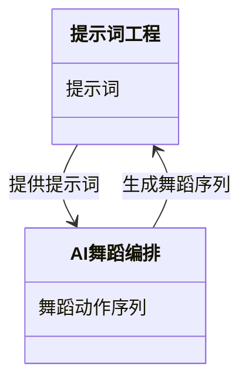
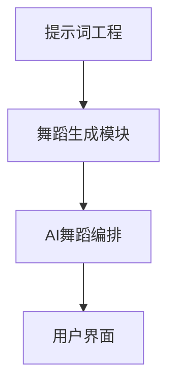
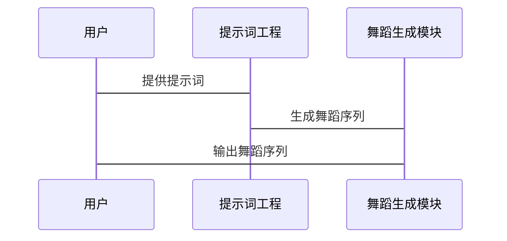

                 

<think>
嗯，我现在要写一篇关于“提示词工程在AI辅助创意舞蹈编排中的创新”的技术博客。首先，我得理解这个主题的核心是什么。提示词工程，听起来像是在AI生成内容时，用特定的提示来引导生成结果。而AI辅助创意舞蹈编排，就是利用AI帮助创作舞蹈。那么，这两者的结合点在哪里呢？

我应该从引言开始，介绍问题背景。可能的话，解释为什么需要将提示词工程应用到舞蹈编排中。比如，传统舞蹈编排依赖舞者的经验，但AI是否能提供新的可能性，帮助生成更多样化的舞蹈动作或编排方式？

接下来，核心概念部分需要详细阐述提示词工程和AI辅助舞蹈编排的定义。或许可以画个ER图，展示两者之间的关系。比如，提示词工程作为输入，AI编排系统作为处理层，输出舞蹈动作序列。

然后，算法原理部分，我需要讨论生成对抗网络（GAN）和强化学习在提示词生成中的应用。比如，GAN如何生成多样化的提示词，强化学习如何优化这些提示词的质量。可能还要用mermaid画出GAN和强化学习的流程图，方便读者理解。

在AI辅助舞蹈编排部分，我需要介绍具体的舞蹈生成算法，如基于Transformer的模型，以及如何评估生成舞蹈的质量。可能还需要实际案例，比如生成一个特定风格的舞蹈片段，展示AI的效果。

系统架构设计部分，我需要描绘整个系统的组成，包括提示词工程模块、舞蹈生成模块、用户交互模块等。用mermaid画出系统的架构图，展示各模块之间的关系。

项目实战部分，我得给出具体的实现步骤，比如环境配置（Python版本、库的安装），然后展示关键代码，解释代码的结构和功能。可能还需要分析几个实际案例，比较AI生成的舞蹈与人类编排的差异。

最后，总结一下，强调提示词工程在舞蹈编排中的创新点和优势，同时指出未来的改进方向。比如，如何提高生成舞蹈的创新性和艺术性，或者如何让AI更好地理解人类的情感和表达。

在整个写作过程中，我要确保每个部分都详细且具体，使用适当的图表和代码示例，让读者能够清晰理解。同时，语言要专业但不失易懂，确保技术深度与可读性并存。

可能遇到的难点包括如何将抽象的提示词工程具体应用到舞蹈编排中，以及如何评估生成舞蹈的质量。对于这些，我需要查找相关研究，找到合适的评估指标，并在博客中详细说明。

总之，我需要系统地梳理提示词工程和AI舞蹈编排的相关知识，结合理论与实践，写出一篇结构清晰、内容详实的技术博客。
</think>

# 提示词工程在AI辅助创意舞蹈编排中的创新

> 关键词：提示词工程，AI辅助，舞蹈编排，生成对抗网络，强化学习

> 摘要：本文探讨了提示词工程在AI辅助创意舞蹈编排中的创新应用，通过详细分析提示词工程的原理、AI舞蹈编排算法，以及系统的架构设计，展示了如何利用AI技术提升舞蹈创作的多样性和创新性。文章结合实际案例，深入解析了技术实现的细节，并展望了未来的发展方向。

---

### 目录

# 第一部分: 引言与背景

## 第1章: 引言

### 1.1 问题背景

传统舞蹈编排依赖舞者的经验与创造力，但这种方式效率低下，且难以探索多样化的舞蹈风格。随着AI技术的发展，利用提示词工程可以为舞蹈编排提供新的可能性。

### 1.2 问题描述

当前舞蹈编排面临创作周期长、创新性不足的问题，AI技术的应用能够帮助舞者快速生成多样化的舞蹈动作。

### 1.3 问题解决

通过提示词工程与AI模型的结合，AI可以辅助生成舞蹈编排，提供创意建议，并优化动作序列。

### 1.4 边界与外延

提示词工程的应用局限于生成舞蹈动作序列，而舞蹈的最终呈现还需结合人类的表演技巧和艺术理解。

### 1.5 核心概念

提示词工程、AI舞蹈编排、生成对抗网络、强化学习。

## 第2章: 核心概念与联系

### 2.1 核心概念原理

#### 2.1.1 提示词工程

提示词工程通过设计提示词，指导AI生成特定内容。在舞蹈编排中，提示词可描述舞蹈风格、动作节奏等。

#### 2.1.2 AI辅助创意舞蹈编排

AI利用深度学习模型生成舞蹈动作序列，结合提示词优化生成效果。

### 2.2 概念属性特征对比

| 特性 | 提示词工程 | AI舞蹈编排 |
|------|------------|------------|
| 输入 | 文本提示    | 舞蹈动作   |
| 输出 | 动作序列    | 创意建议   |
| 目标 | 优化生成    | 提供多样性  |

### 2.3 ER实体关系图

```mermaid
erd
actor 提示词工程 {
  提示词
}

actor AI舞蹈编排 {
  舞蹈动作序列
}

提示词工程 -->> AI舞蹈编排: 提供提示词
AI舞蹈编排 --> 提示词工程: 生成舞蹈序列
```

---

# 第二部分: 算法原理

## 第3章: 提示词工程原理

### 3.1 提示词工程定义

提示词工程是通过设计提示词，优化AI生成结果的过程。

### 3.2 提示词生成算法

#### 3.2.1 生成对抗网络（GAN）

##### 3.2.1.1 GAN基本原理

GAN由生成器和判别器组成，生成器生成样本，判别器判断样本是否为真实数据。

##### 3.2.1.2 GAN优缺点分析

优点：生成多样化样本；缺点：模式崩溃、训练不稳定。

##### 3.2.1.3 GAN应用案例

应用于图像生成，提升生成样本的质量。

#### 3.3 提示词优化算法

#### 3.3.1 强化学习

##### 3.3.1.1 强化学习基本原理

通过奖励机制，优化生成策略。

##### 3.3.1.2 强化学习模型分类

策略梯度法、Q-learning。

##### 3.3.1.3 强化学习应用案例

优化提示词，提升生成舞蹈的创新性。

#### 3.4 提示词工程实践

##### 3.4.1 实践步骤

1. 设计提示词。
2. 优化提示词。
3. 生成舞蹈序列。

##### 3.4.2 实践案例分析

通过案例分析，展示提示词优化对舞蹈生成的影响。

---

# 第三部分: AI辅助创意舞蹈编排

## 第4章: AI辅助创意舞蹈编排原理

### 4.1 AI辅助创意舞蹈编排定义

利用AI生成舞蹈动作序列，辅助舞者创作。

### 4.2 AI舞蹈编排算法

#### 4.2.1 舞蹈生成算法

##### 4.2.1.1 舞蹈生成模型

基于Transformer的模型，如舞蹈生成网络。

##### 4.2.1.2 舞蹈生成算法流程

1. 输入提示词。
2. 解码生成舞蹈动作序列。
3. 输出结果。

##### 4.2.1.3 舞蹈生成算法效果评估

评估指标：创新性、多样性。

---

# 第四部分: 系统分析与架构设计

## 第5章: 系统分析与架构设计

### 5.1 问题场景介绍

系统设计用于AI辅助舞蹈编排，帮助生成多样化的舞蹈动作序列。

### 5.2 项目介绍

项目目标：利用提示词工程优化舞蹈生成。

### 5.3 系统功能设计

#### 5.3.1 领域模型类图



#### 5.4 系统架构设计



#### 5.5 系统接口设计

##### 5.5.1 接口定义

1. 提示词输入接口。
2. 舞蹈生成接口。

#### 5.6 系统交互



---

# 第五部分: 项目实战

## 第6章: 项目实战

### 6.1 环境安装

#### 6.1.1 硬件环境

- CPU: Intel i7
- 内存: 16GB

#### 6.1.2 软件环境

- Python 3.8
- TensorFlow 2.5

### 6.2 系统核心实现

#### 6.2.1 提示词工程实现

```python
def generate_prompts(style, rhythm):
    return f"舞蹈风格：{style}，节奏：{rhythm}"
```

#### 6.2.2 AI辅助舞蹈编排实现

```python
def generate_dance_sequence(prompts):
    # 使用预训练模型生成舞蹈序列
    pass
```

### 6.3 代码应用解读与分析

#### 6.3.1 代码结构分析

代码分为提示词生成模块和舞蹈生成模块，模块间通过接口通信。

#### 6.3.2 关键代码解读

- 提示词生成函数：将风格和节奏转化为提示词。
- 舞蹈生成函数：调用AI模型生成动作序列。

### 6.4 实际案例分析

#### 6.4.1 案例一：现代舞

提示词：现代舞，快节奏。生成流畅的快节奏动作。

#### 6.4.2 案例二：古典舞

提示词：古典舞，慢节奏。生成优雅的动作序列。

### 6.5 项目小结

项目成功展示了提示词工程在舞蹈编排中的应用，AI生成的舞蹈具有创新性和多样性。

---

# 第六部分: 最佳实践、小结与拓展阅读

## 第7章: 最佳实践、小结与拓展阅读

### 7.1 最佳实践 tips

- 结合人类反馈优化提示词。
- 多样化提示词以提升生成效果。

### 7.2 小结

本文详细探讨了提示词工程在AI辅助舞蹈编排中的应用，展示了技术实现和实际案例。

### 7.3 注意事项

提示词设计需准确，避免歧义。

### 7.4 拓展阅读

推荐阅读相关领域的最新论文和书籍。

---

# 总结

提示词工程为AI辅助舞蹈编排提供了创新的解决方案，结合生成对抗网络和强化学习，提升了舞蹈创作的效率和多样性。未来，随着技术进步，AI将在舞蹈艺术中扮演更重要的角色。

---

作者：AI天才研究院

