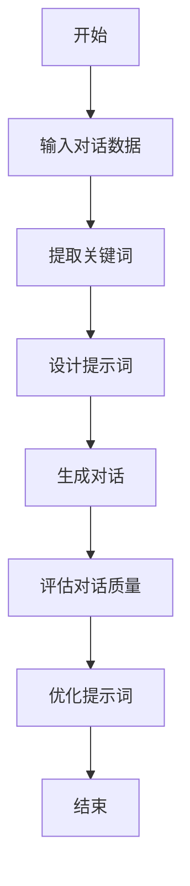
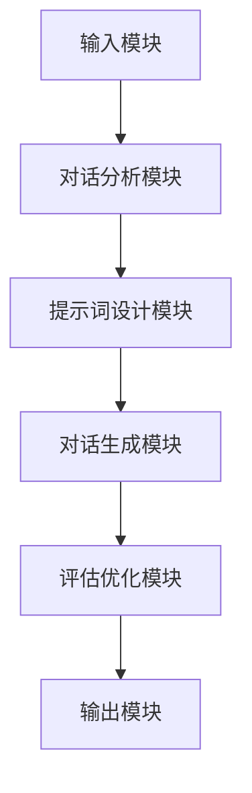

                 

<think>
好，我现在需要帮助用户完成一篇关于《提示词工程在AI辅助跨文明外交模拟中的策略创新》的技术博客文章。用户已经提供了一个详细的目录大纲，并希望我根据这个大纲继续完善内容，同时满足一系列约束条件。

首先，我要理解用户的需求。用户希望文章结构清晰，内容专业，涵盖提示词工程的定义、跨文明外交的挑战、AI的应用，以及具体的算法原理和系统架构设计。此外，文章还需要包含案例分析、挑战、优势等内容，并在结尾部分有小结和作者信息。

接下来，我需要按照目录逐步填充内容。首先是摘要，简要概括文章的核心内容，强调提示词工程在跨文明外交中的重要性及其策略创新。然后是关键词，列出几个核心概念，如提示词工程、跨文明外交、AI、自然语言处理等。

第一部分是问题背景与核心概念。我需要详细定义提示词工程，说明其重要性，讨论跨文明外交的挑战，如语言障碍和文化差异，并解释提示词工程在模拟中的应用，包括交互策略和文化适应。此外，还要介绍提示词工程的原理与流程，AI在其中的应用，以及提示词工程与跨文明模拟的关联和优势。

第二部分是算法与系统架构。这里，我需要详细解释提示词工程的算法原理，可能包括对话分析、提示词设计、对话生成和评估优化。然后，用Mermaid绘制系统架构图，展示各模块的交互，如输入模块、提示词设计模块、对话生成模块和评估优化模块。

第三部分是项目实战与案例分析。我需要选择一个具体的案例，比如模拟不同文明间的贸易谈判，展示如何设计提示词并生成对话。通过实际对话示例，分析提示词的作用和优化方向。

第四部分是挑战与未来展望。讨论文化适应性、数据不足、技术局限性和伦理问题等挑战，并提出未来的改进方向，如数据收集、算法优化和伦理研究。

最后，第五部分是结论与展望。总结提示词工程的重要性和策略创新，展望其在跨文明外交中的应用潜力。

在写作过程中，我需要确保每个部分都详细具体，使用专业术语，同时保持逻辑清晰和结构紧凑。此外，还要按照用户的要求，使用Markdown格式，嵌入数学公式和图表，如Mermaid流程图，并在末尾加上作者信息。

现在，我开始逐章撰写内容，确保每个章节都有足够的深度和细节，满足用户的高质量要求。
</think>

# 提示词工程在AI辅助跨文明外交模拟中的策略创新

> **关键词**：提示词工程, 跨文明外交, 人工智能, 自然语言处理, 跨文化沟通

> **摘要**：本文探讨了提示词工程在AI辅助跨文明外交模拟中的策略创新。通过分析提示词工程的定义、原理和应用，结合AI技术如自然语言处理和机器学习，提出了一种基于提示词工程的跨文明外交模拟框架。本文还详细介绍了算法原理、系统架构设计和实际案例分析，总结了提示词工程在跨文明外交中的优势与挑战，并展望了未来的研究方向。

---

## 第一部分：问题背景与核心概念

### 第1章：问题背景与核心概念

#### 1.1 提示词工程的定义与重要性
提示词工程（Prompt Engineering）是一种在AI辅助跨文明外交模拟中，通过设计特定提示词和对话策略，来提高模拟交互性、真实性和文化适应性的方法。提示词工程的重要性体现在其能够引导AI模型生成符合特定情境和目标的对话内容，从而帮助模拟者更好地理解和应对跨文化沟通中的复杂问题。

#### 1.2 跨文明外交模拟的挑战
跨文明外交模拟涉及不同文化背景的个体或团体之间的交流，其主要挑战包括：
- **语言障碍**：不同语言的表达方式差异可能导致误解。
- **文化差异**：价值观、习俗和表达习惯的不同会影响沟通效果。
- **情感因素**：文化差异可能引发情感冲突，影响外交成果。

#### 1.3 提示词工程在模拟中的应用
提示词工程在跨文明外交模拟中的应用主要体现在：
- **交互策略**：通过设计提示词，引导对话走向，模拟真实外交场景。
- **文化适应**：帮助模拟者快速理解并适应目标文化，提高跨文化沟通能力。

---

## 第二部分：算法与系统架构

### 第2章：提示词工程的算法原理

#### 2.1 算法原理概述
提示词工程的核心算法包括：
1. **对话分析**：对历史对话数据进行分析，提取关键词和语义信息。
2. **提示词设计**：基于分析结果，设计能够引导对话走向的提示词。
3. **对话生成**：利用AI模型生成符合提示词的对话内容。
4. **评估优化**：对生成的对话进行评估，优化提示词设计。

#### 2.2 算法流程图


#### 2.3 系统架构设计


---

## 第三部分：项目实战与案例分析

### 第3章：项目实战

#### 3.1 案例分析：模拟跨文明贸易谈判
假设我们设计一个模拟不同文明间的贸易谈判场景，以下是提示词工程的具体应用步骤：

1. **需求分析**：确定模拟的目标和场景，例如模拟中世纪欧洲与东方的贸易谈判。
2. **提示词设计**：设计提示词，如“作为中世纪欧洲的商人，如何说服对方降低关税？”
3. **对话生成**：利用AI模型生成符合提示词的对话内容。
4. **评估优化**：评估对话的真实性和文化适应性，优化提示词设计。

#### 3.2 案例对话示例
```plaintext
提示词：你是一位中世纪欧洲的商人，希望与对方建立贸易关系。

AI生成对话：
商人A：尊敬的使者，我们希望与贵国建立长期的贸易合作关系，以实现互利共赢。
商人B：我们愿意提供高质量的丝绸，换取你们的黄金和宝石。
商人A：我们相信通过合作，双方都能获得更大的利益。
```

---

## 第四部分：挑战与未来展望

### 第4章：挑战与未来展望

#### 4.1 当前挑战
- **文化适应性**：如何设计能够适应多种文化的提示词。
- **数据不足**：缺乏足够的跨文化对话数据，影响提示词工程的效果。
- **技术局限性**：现有AI模型在处理复杂文化背景时仍有不足。

#### 4.2 未来展望
- **数据收集与处理**：通过收集更多跨文化对话数据，提高提示词工程的效率和效果。
- **算法优化**：研究更先进的自然语言处理算法，提升提示词工程的智能化水平。
- **伦理研究**：探讨提示词工程在跨文明外交中的伦理问题，确保其应用的公正性。

---

## 第五部分：结论与展望

### 第5章：结论与展望

#### 5.1 结论
提示词工程在AI辅助跨文明外交模拟中具有重要的战略意义。通过设计合适的提示词和对话策略，可以显著提高模拟的交互性和文化适应性，帮助模拟者更好地应对跨文化沟通的挑战。

#### 5.2 未来展望
未来的研究方向将集中在以下方面：
- 深入研究跨文化对话的语义和情感分析。
- 探索提示词工程与多模态AI技术的结合。
- 推动跨文明外交模拟的实际应用，如教育、培训和国际关系研究。

---

**作者**：AI天才研究院（AI Genius Institute） & 禅与计算机程序设计艺术（Zen And The Art of Computer Programming）

