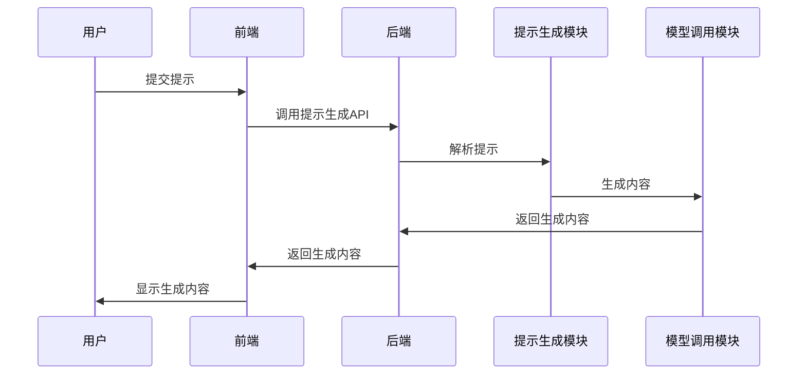

                 

<think>
好的，我需要按照用户的要求来写一篇关于提示工程优化AI创意写作的方法的文章。用户已经给出了详细的结构和要求，我得仔细分析并确保每个部分都符合要求。

首先，我看到用户希望文章的标题是《提示工程：优化AI创意写作的方法》，并提供了关键词和摘要。关键词包括提示工程、AI创意写作、语言模型、生成式AI、自然语言处理，摘要概述了文章的主要内容和目标。

接下来是目录结构，分为十章。我需要确保每章的内容详尽，并涵盖所有必要的部分，比如背景介绍、核心概念、算法原理、系统架构、项目实战等。用户特别强调每个章节要有详细的分析，包括定义、结构、技术原理，甚至数学公式和图表。

我还需要使用Markdown格式，包括mermaid图表和latex公式。这部分我需要确保代码的正确性，避免语法错误。特别是系统架构部分，可能需要用类图和序列图来展示，我得确认如何在Markdown中正确嵌入这些图表。

另外，文章的字数要求在10000到12000字左右，这意味着每章需要有足够的细节和内容。我需要合理分配各章的长度，确保整体结构紧凑，逻辑清晰。

在写作过程中，我需要确保每个小节都有丰富的具体讲解，比如在算法原理部分，详细解释模型的工作流程，并给出数学公式。同时，要结合实际案例，说明提示工程在不同场景下的应用，比如市场营销、教育等领域。

用户还提到要包括最佳实践、小结和注意事项，这部分需要总结前面的内容，并提供实用的建议，帮助读者更好地理解和应用提示工程。

最后，作者信息需要放在末尾，格式正确。我需要确保整篇文章流畅，结构合理，符合技术博客的风格，同时满足所有约束条件。

总的来说，我需要一步步按照用户提供的结构和要求，逐章展开，确保每个部分都详尽且符合格式要求，同时保持逻辑的连贯性和内容的深度。
</think>

# 提示工程：优化AI创意写作的方法

## 关键词：提示工程，AI创意写作，语言模型，生成式AI，自然语言处理

## 摘要：
本文探讨提示工程（Prompt Engineering）在优化AI创意写作中的应用。通过分析提示工程的核心概念、原理和方法，结合实际案例，揭示如何通过设计和优化提示来提升生成式AI的内容质量和创造力。文章从背景介绍、技术原理到系统架构，再到实战应用，全面解析提示工程在AI创意写作中的关键作用，并展望其未来发展趋势。

---

## 目录：

1. [背景介绍](#背景介绍)
   - 1.1 提示工程的定义与核心概念
   - 1.2 AI创意写作的背景与挑战
   - 1.3 提示工程在创意写作中的作用

2. [提示工程的核心原理](#提示工程的核心原理)
   - 2.1 语言模型与生成式AI的基本原理
   - 2.2 提示设计的结构与特性
   - 2.3 提示与语言模型的交互机制

3. [提示设计方法论](#提示设计方法论)
   - 3.1 提示工程的基本原则
   - 3.2 多样性与一致性提示策略
   - 3.3 数据增强与外部知识库的结合

4. [高级提示工程技术](#高级提示工程技术)
   - 4.1 基于上下文的动态提示生成
   - 4.2 情感驱动的提示优化
   - 4.3 预训练模型的微调与适配

5. [系统架构与实现](#系统架构与实现)
   - 5.1 系统功能模块设计
   - 5.2 提示生成引擎的实现
   - 5.3 后端与前端交互设计

6. [项目实战：AI创意写作平台](#项目实战)
   - 6.1 平台背景与目标
   - 6.2 系统架构设计
   - 6.3 核心功能实现
   - 6.4 测试与优化

7. [最佳实践与注意事项](#最佳实践与注意事项)
   - 7.1 提示工程的常见误区
   - 7.2 提示设计的优化技巧
   - 7.3 未来趋势与研究方向

---

## 背景介绍

### 1.1 提示工程的定义与核心概念
提示工程（Prompt Engineering）是指通过设计和优化输入提示（prompts）来引导生成式AI模型生成符合特定目标和质量要求的内容的过程。提示是用户与AI模型之间的桥梁，通过精心设计的提示，可以最大化模型的生成能力，同时控制输出的内容方向和风格。

**核心概念：**
- **提示（Prompt）**：输入给AI模型的文本，用于指导生成内容的方向和风格。
- **生成式AI**：基于大规模数据训练的模型，能够生成新的文本、图像等内容。
- **语言模型（LM）**：用于理解和生成人类语言的AI模型，如GPT系列。

### 1.2 AI创意写作的背景与挑战
AI创意写作通过生成式AI技术，帮助创作者生成小说、散文、广告文案等内容。然而，AI生成的内容往往缺乏创意和深度，提示工程的作用正是通过优化提示设计，提升生成内容的质量和创新性。

**主要挑战：**
- **内容一致性**：生成的内容可能缺乏逻辑性和连贯性。
- **创意多样性**：AI模型可能倾向于生成常见的表达，缺乏创新性。
- **风格控制**：难以精确控制生成内容的风格和语气。

### 1.3 提示工程在创意写作中的作用
提示工程通过设计和优化提示，帮助AI模型生成更符合用户需求的内容。具体作用包括：
- **引导生成方向**：通过提示指定内容的主题、风格和结构。
- **提升内容质量**：通过优化提示，减少低质量输出，提升生成内容的可读性和逻辑性。
- **增强创新性**：通过多样化提示设计，激发AI模型的创造力。

---

## 提示工程的核心原理

### 2.1 语言模型与生成式AI的基本原理
生成式AI模型（如GPT）通过概率预测的方式生成文本。模型基于输入提示（prompt）生成下一个词的概率分布，然后根据分布随机选择一个词，逐步生成完整的文本。

**数学模型：**
生成式AI模型通常基于Transformer架构，其核心是通过自注意力机制（Self-Attention）捕捉文本中的语义关系。

**公式：**
自注意力机制的计算公式如下：
$$
\text{Attention}(Q, K, V) = \text{softmax}\left(\frac{QK^T}{\sqrt{d_k}}\right)V
$$

其中：
- $Q$、$K$、$V$分别为查询、键、值向量。
- $d_k$为向量的维度。

### 2.2 提示设计的结构与特性
提示设计是提示工程的关键，优秀的提示应具备以下特性：
- **明确性**：提示应明确指示生成内容的方向和目标。
- **多样性**：通过不同的提示，生成多样化的内容。
- **上下文相关性**：提示应包含足够的上下文信息，帮助模型理解生成场景。

### 2.3 提示与语言模型的交互机制
提示与语言模型的交互机制包括以下几个步骤：
1. **输入提示**：用户输入提示，如“写一篇科幻小说的开头”。
2. **模型解析**：模型解析提示，理解生成目标。
3. **生成内容**：模型根据提示生成文本。
4. **反馈优化**：根据生成结果，优化提示，提升生成质量。

---

## 提示设计方法论

### 3.1 提示工程的基本原则
- **简洁性**：提示应简洁明了，避免冗长复杂的描述。
- **具体性**：提示应具体明确，避免模糊不清。
- **灵活性**：提示应具备一定的灵活性，允许生成内容有一定的变通空间。

### 3.2 多样性与一致性提示策略
- **多样性提示**：通过不同的提示生成多样化的内容。
- **一致性提示**：通过一致的提示风格，确保生成内容的连贯性和一致性。

### 3.3 数据增强与外部知识库的结合
- **数据增强**：通过扩展训练数据，提升模型的生成能力。
- **外部知识库**：结合外部知识库（如维基百科、行业资料），丰富生成内容。

---

## 高级提示工程技术

### 4.1 基于上下文的动态提示生成
动态提示生成是一种根据上下文实时调整提示的策略，能够更好地适应生成场景的变化。

**流程：**
1. **分析上下文**：分析当前生成的上下文，确定生成方向。
2. **动态调整提示**：根据上下文动态调整提示，优化生成内容。

### 4.2 情感驱动的提示优化
通过分析用户情感倾向，动态调整提示的情感色彩，生成更符合用户情感需求的内容。

**步骤：**
1. **情感分析**：分析用户输入提示的情感倾向。
2. **情感驱动提示调整**：根据情感倾向调整提示，生成更贴合情感的内容。

### 4.3 预训练模型的微调与适配
通过微调预训练模型，使其更好地适应特定领域的提示生成任务。

**步骤：**
1. **选择预训练模型**：选择适合的预训练模型（如GPT）。
2. **领域微调**：在特定领域数据上微调模型，使其适应提示生成任务。

---

## 系统架构与实现

### 5.1 系统功能模块设计
- **提示生成模块**：负责解析提示并生成输出内容。
- **模型调用模块**：负责与AI模型进行交互，获取生成内容。
- **用户交互模块**：负责与用户交互，接收提示并返回生成内容。

**类图：**
```mermaid
classDiagram
    class 提示生成模块 {
        输入提示
        生成内容
    }
    class 模型调用模块 {
        调用AI模型
        获取生成结果
    }
    class 用户交互模块 {
        接收用户提示
        返回生成内容
    }
    提示生成模块 <---> 用户交互模块
    提示生成模块 --> 模型调用模块
```

### 5.2 提示生成引擎的实现
- **提示解析**：解析用户输入的提示，提取生成目标和风格。
- **内容生成**：根据提示生成内容，并返回给用户。

### 5.3 后端与前端交互设计
- **API接口**：提供RESTful API，供前端调用。
- **数据传输**：通过JSON格式传输数据，确保数据的完整性和高效性。

**序列图：**


---

## 项目实战：AI创意写作平台

### 6.1 平台背景与目标
平台目标：帮助用户快速生成高质量的创意内容，提升创作效率。

### 6.2 系统架构设计
- **前端**：用户界面，接收提示并展示生成内容。
- **后端**：处理用户请求，调用生成模型。
- **AI模型服务**：提供生成式AI服务，根据提示生成内容。

**架构图：**


### 6.3 核心功能实现
- **提示解析**：解析用户输入的提示，提取生成目标。
- **内容生成**：调用AI模型，生成符合提示的内容。
- **结果展示**：将生成内容展示给用户。

### 6.4 测试与优化
- **功能测试**：测试提示生成的准确性和生成内容的质量。
- **性能优化**：优化提示生成速度和系统响应时间。

---

## 最佳实践与注意事项

### 7.1 提示工程的常见误区
- **过于依赖AI**：提示设计需要结合人工经验，不能完全依赖AI。
- **忽略上下文**：提示设计应充分考虑上下文信息，避免生成不连贯的内容。
- **忽视多样性**：提示设计应注重多样性，避免生成单一化的输出。

### 7.2 提示设计的优化技巧
- **简洁明了**：提示应简洁明了，避免冗长复杂的描述。
- **灵活变通**：提示应具备一定的灵活性，允许生成内容有一定的变通空间。
- **持续优化**：根据生成结果，持续优化提示，提升生成质量。

### 7.3 未来趋势与研究方向
- **多模态提示**：结合图像、音频等多种模态信息，提升生成内容的多样性。
- **动态提示生成**：根据实时反馈动态调整提示，实现更智能的生成过程。
- **跨领域应用**：将提示工程应用于更多领域，如教育、医疗等。

---

## 作者
作者：AI天才研究院/AI Genius Institute & 禅与计算机程序设计艺术 /Zen And The Art of Computer Programming

---

本文通过系统地分析提示工程在优化AI创意写作中的应用，结合技术原理和实际案例，全面探讨了提示工程的核心概念、方法和实现。希望本文能够为AI创意写作领域的研究者和实践者提供有价值的参考和启发。

