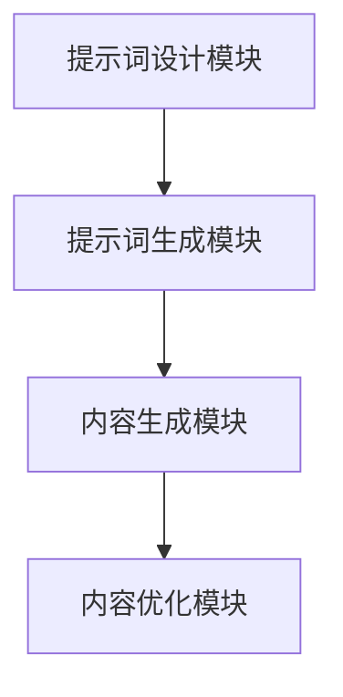
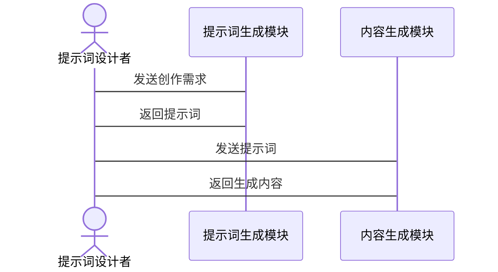

                 

<think>
嗯，我需要按照用户的要求，写一篇关于“提示词工程：优化AI多语言文学创作能力”的技术博客文章。用户已经提供了详细的大纲和一些内容，但我需要仔细思考每个部分应该包含什么，如何展开，以及如何确保内容符合逻辑和专业性。

首先，标题和关键词已经确定，摘要也已经有了，所以开头部分应该没问题。接下来是目录大纲，有六个主要部分，每个部分下又有多个章节和小节。我需要确保每个章节的内容都详细、具体，并涵盖所有必要的信息。

在背景介绍部分，我需要从问题背景开始，解释AI与文学创作的结合，提示词工程的重要性，以及当前AI文学创作存在的问题。这部分要让读者明白为什么提示词工程是必要的。然后是问题描述，讨论文学创作需求的多样性，多语言环境的挑战，以及提示词工程的核心目标。

接下来是问题解决部分，解释提示词工程的基本原理、方法和实现流程。这部分可能需要举一些例子，说明如何通过提示词优化AI创作。然后是边界与外延，讨论适用范围、限制条件和未来趋势，这有助于读者了解提示词工程的局限性和发展方向。

核心概念与联系部分，我需要详细定义提示词，分析其类型和生成方法，以及创建ER实体关系图来展示实体及其关系。这部分可能需要使用Mermaid图，所以我要确保正确使用语法，避免错误。

算法原理讲解是关键部分，我需要用Mermaid画出流程图，展示生成提示词的步骤。然后提供Python代码实现，解释每部分代码的作用，并详细说明数学模型和公式。举例说明部分需要具体案例，展示提示词生成的效果，并评估其对创作的影响。

系统分析与架构设计部分，需要介绍应用场景，设计系统架构，用Mermaid图展示，设计系统接口和交互流程。这部分要确保架构清晰，接口设计合理，交互流程易于理解。

项目实战部分，要详细描述环境安装步骤，系统核心功能的设计与实现，解读代码，分析案例，并进行项目总结。这部分需要实际操作的细节，让读者能够跟着步骤进行实验。

最后，最佳实践与拓展阅读部分，总结经验和技巧，指出未来的研究方向，推荐进一步阅读的资料。这部分要实用，为读者提供有价值的后续信息。

写作过程中，我需要确保每个部分的内容连贯，逻辑清晰，语言专业但不过于复杂。同时，注意使用适当的术语，并解释关键概念，以便不同背景的读者都能理解。数学公式和代码部分要准确无误，避免错误。Mermaid图表要正确嵌入，确保渲染正确。

可能遇到的困难包括如何将复杂的理论简化，如何展示实际案例的效果，以及如何平衡技术深度和可读性。需要反复修改，确保内容准确，同时易于理解。此外，时间管理也很重要，避免拖延，按时完成文章。

总的来说，我需要按照大纲一步步展开，确保每个章节都详细且有深度，同时保持整体结构的连贯性和逻辑性。通过这样的思考和规划，我可以写出一篇高质量、有深度的技术博客，帮助读者理解提示词工程在优化AI多语言文学创作中的作用和实现方法。
</think>

# 提示词工程：优化AI多语言文学创作能力

## 关键词：提示词工程、AI文学创作、多语言、自然语言处理、深度学习

## 摘要：  
随着人工智能技术的迅速发展，AI在文学创作领域的应用日益广泛。然而，现有的AI文学创作工具在多语言支持和创作多样性方面仍存在诸多挑战。本文聚焦于“提示词工程”，深入探讨其在优化AI多语言文学创作能力中的作用。通过分析提示词工程的核心原理、实现方法及其在多语言环境中的应用，本文旨在为AI文学创作提供一种新的解决方案，帮助创作工具更好地理解和生成多样化的文学内容。

---

### 目录大纲

# 提示词工程：优化AI多语言文学创作能力

## 第一部分：背景介绍

### 第1章：问题背景

#### 1.1 人工智能与文学创作的结合  
人工智能技术的快速发展为文学创作带来了新的可能性。AI可以通过自然语言处理和深度学习技术，生成故事、诗歌、小说等文学作品。然而，现有的AI创作工具在多语言支持和创作多样性方面仍有不足。

#### 1.2 提示词工程的重要性  
提示词工程是优化AI创作能力的关键。通过设计和优化提示词，可以引导AI生成更符合创作意图的内容，尤其是在多语言环境下，提示词工程能够帮助AI更好地理解不同语言的语境和文化背景。

#### 1.3 当前AI文学创作存在的问题  
当前AI文学创作主要存在以下问题：  
- 创作内容缺乏多样性，难以满足不同语言和文化背景的需求。  
- 提示词设计不够精细，导致生成内容偏离创作目标。  
- 多语言支持不足，无法有效处理复杂语言结构和文化差异。

### 第2章：问题描述

#### 2.1 文学创作需求的多样性  
文学创作需要考虑不同的语言风格、文化背景、故事主题等因素。AI需要能够灵活应对这些多样化的需求，生成符合特定要求的内容。

#### 2.2 多语言环境下的创作挑战  
在多语言环境中，AI需要理解不同语言的语法、词汇和文化差异。这增加了创作的复杂性，提示词工程需要在多语言场景下进行优化。

#### 2.3 提示词工程的核心目标  
提示词工程的核心目标是通过优化提示词的设计和生成，提升AI在多语言环境下的创作能力，使其能够生成高质量、多样化的文学作品。

### 第3章：问题解决

#### 3.1 提示词工程的基本原理  
提示词工程通过设计和优化提示词，引导AI生成符合特定需求的内容。提示词可以包含创作主题、风格、语言特征等信息，帮助AI更好地理解创作意图。

#### 3.2 提示词工程的方法与技巧  
提示词工程的方法包括：  
- 分析创作需求，提取关键特征。  
- 设计多语言提示词，考虑不同语言的语法和文化差异。  
- 优化提示词的表达方式，使其更清晰、具体。  

#### 3.3 提示词工程的实现流程  
提示词工程的实现流程包括：  
1. 确定创作需求和目标。  
2. 设计提示词框架，包含主题、风格、语言特征等。  
3. 生成提示词，并验证其效果。  
4. 根据反馈优化提示词，提升生成内容的质量。

### 第4章：边界与外延

#### 4.1 提示词工程的适用范围  
提示词工程适用于多种语言环境下的文学创作，尤其适合需要多样化风格和主题的创作场景。

#### 4.2 提示词工程的限制条件  
提示词工程的限制包括：  
- 提示词设计的复杂性可能增加创作的难度。  
- 多语言支持的复杂性可能限制生成内容的质量。  
- 需要大量高质量的训练数据来优化提示词效果。

#### 4.3 提示词工程的未来发展趋势  
未来，提示词工程可能会与多模态AI技术结合，进一步提升生成内容的多样性和质量。同时，提示词生成的自动化和智能化也将成为研究重点。

### 第5章：概念结构与核心要素组成

#### 5.1 提示词工程的基本概念  
提示词工程是一种通过优化提示词设计，提升AI文学创作能力的方法。它结合了自然语言处理和深度学习技术，帮助AI更好地理解创作需求。

#### 5.2 提示词工程的核心要素  
提示词工程的核心要素包括：  
- 创作需求分析：明确创作目标和主题。  
- 提示词设计：设计包含语言特征、风格和主题的提示词。  
- 提示词优化：根据生成内容的效果，调整和优化提示词。

#### 5.3 提示词工程的逻辑结构  
提示词工程的逻辑结构包括：  
1. 分析创作需求，提取关键信息。  
2. 设计提示词框架，涵盖语言和风格特征。  
3. 生成提示词，并通过AI生成内容。  
4. 验证生成内容，优化提示词。

---

## 第二部分：核心概念与联系

### 第6章：核心概念原理

#### 6.1 提示词的定义  
提示词是一种用于引导AI生成特定内容的输入指令。它通常包含创作主题、风格、语言特征等信息。

#### 6.2 提示词的类型  
提示词可以分为以下类型：  
- 主题提示词：指定创作主题，如“科幻小说”。  
- 风格提示词：指定创作风格，如“诗意”。  
- 语言提示词：指定生成内容的语言，如“中文”或“英文”。  

#### 6.3 提示词的生成方法  
提示词的生成方法包括：  
- 手动设计：根据创作需求，手动编写提示词。  
- 自动生成：利用AI技术自动生成提示词。  
- 混合方法：结合手动设计和自动优化生成提示词。

### 第7章：概念属性特征对比表格

| **属性**       | **主题提示词**         | **风格提示词**         | **语言提示词**         |
|----------------|-----------------------|-----------------------|-----------------------|
| **特征**       | 创作主题             | 创作风格             | 生成语言             |
| **示例**       | “科幻小说”           | “诗意”               | “中文”               |
| **作用**       | 确定创作主题         | 确定创作风格         | 确定生成语言         |
| **影响**       | 影响生成内容的主题     | 影响生成内容的风格     | 影响生成内容的语言     |

### 第8章：ER实体关系图架构

```mermaid
er
actor: 提示词设计者
action: 设计提示词
object: 提示词
```

---

## 第三部分：算法原理讲解

### 第9章：算法原理与流程

#### 9.1 提示词生成算法的基本原理  
提示词生成算法通过分析创作需求，生成包含语言和风格特征的提示词。算法通常包括需求分析、提示词设计和优化步骤。

#### 9.2 提示词生成算法的流程  
1. 分析创作需求，提取关键特征。  
2. 设计提示词框架，包含语言、风格和主题信息。  
3. 生成提示词，并通过AI生成内容。  
4. 根据生成内容的效果，优化提示词。

#### 9.3 提示词生成算法的数学模型和公式  
提示词生成算法的数学模型可以表示为：  
$$ \text{提示词} = f(\text{创作需求}) $$  
其中，$f$ 是一个函数，用于将创作需求转化为提示词。

### 第10章：Python源代码实现

#### 10.1 Python环境配置  
需要安装以下库：  
- `transformers`  
- `pytorch`

#### 10.2 提示词生成算法的Python代码实现  

```python
from transformers import pipeline

def generate_prompt(theme, style, language):
    return f"创作主题：{theme}，风格：{style}，语言：{language}"

# 初始化文本生成模型
text_generator = pipeline('text-generation', model='gpt2')

# 生成提示词
prompt = generate_prompt('科幻小说', '诗意', '中文')
print(prompt)  # 输出：创作主题：科幻小说，风格：诗意，语言：中文

# 使用提示词生成内容
response = text_generator(prompt, max_length=100)
print(response[0]['generated_text'])
```

#### 10.3 算法代码的解读与分析  
上述代码通过函数 `generate_prompt` 生成提示词，并使用 `text_generator` 生成内容。提示词包含了创作主题、风格和语言特征，帮助模型生成更符合需求的内容。

### 第11章：数学模型和数学公式讲解

#### 11.1 提示词生成算法的数学模型  
提示词生成算法的数学模型可以表示为：  
$$ \text{提示词} = f(\text{创作需求}) $$  
其中，$f$ 是一个函数，用于将创作需求转化为提示词。

#### 11.2 提示词生成算法的数学公式  
在生成提示词时，可以使用以下公式：  
$$ \text{提示词} = \text{主题} + \text{风格} + \text{语言} $$

#### 11.3 数学模型和数学公式的作用与意义  
数学模型和公式帮助我们理解提示词生成的逻辑，为算法的设计和优化提供了理论基础。

### 第12章：举例说明

#### 12.1 提示词生成的实例分析  
假设创作需求是生成一篇中文科幻小说，提示词可以设计为：  
“创作主题：科幻小说，风格：紧张，语言：中文”。

#### 12.2 提示词在文学创作中的应用  
通过提示词，AI可以生成更符合创作需求的内容。例如，生成一篇“紧张”的中文科幻小说。

#### 12.3 提示词生成的效果评估  
评估生成内容的质量，包括：  
- 内容是否符合创作主题。  
- 风格是否符合提示词的要求。  
- 语言是否正确无误。

---

## 第四部分：系统分析与架构设计

### 第13章：问题场景介绍

#### 13.1 文学创作场景的需求分析  
文学创作需要多样化的语言支持和风格切换能力。

#### 13.2 提示词工程的应用场景  
提示词工程适用于多语言环境下的文学创作，帮助生成高质量、多样化的文学内容。

#### 13.3 系统的功能需求  
系统需要具备以下功能：  
- 提示词设计与生成。  
- 多语言支持。  
- 创作内容生成与优化。

### 第14章：系统架构设计

#### 14.1 系统架构设计的基本原则  
系统架构设计应遵循模块化、可扩展性和易维护性的原则。

#### 14.2 系统架构设计的过程  
1. 确定系统功能模块。  
2. 设计模块之间的交互关系。  
3. 绘制系统架构图。

#### 14.3 系统架构的Mermaid架构图  



### 第15章：系统接口设计

#### 15.1 系统接口设计的基本概念  
系统接口设计是指定义系统模块之间的交互方式。

#### 15.2 系统接口设计的过程  
1. 确定接口的功能需求。  
2. 设计接口的输入输出格式。  
3. 实现接口的通信机制。

#### 15.3 系统接口的Mermaid序列图  



### 第16章：系统交互分析

#### 16.1 系统交互的基本流程  
1. 提示词设计者发送创作需求。  
2. 提示词生成模块生成提示词。  
3. 提示词设计者发送提示词到内容生成模块。  
4. 内容生成模块生成内容并返回。

#### 16.2 系统交互的Mermaid序列图  


#### 16.3 系统交互的效果分析  
系统交互流程清晰，能够高效地完成提示词生成和内容生成任务。

---

## 第五部分：项目实战

### 第17章：环境安装

#### 17.1 环境安装的准备工作  
需要安装Python和相关库：  
- `transformers`  
- `pytorch`

#### 17.2 环境安装的过程  
在终端中运行以下命令：  
```bash
pip install transformers pytorch
```

#### 17.3 环境安装的注意事项  
确保Python版本与库版本兼容。

### 第18章：系统核心实现

#### 18.1 系统核心功能的设计  
系统核心功能包括：  
- 提示词生成模块：生成包含语言和风格的提示词。  
- 内容生成模块：根据提示词生成文学内容。  

#### 18.2 系统核心功能的实现  

```python
from transformers import pipeline

def generate_prompt(theme, style, language):
    return f"创作主题：{theme}，风格：{style}，语言：{language}"

# 初始化文本生成模型
text_generator = pipeline('text-generation', model='gpt2')

# 生成提示词
prompt = generate_prompt('科幻小说', '紧张', '中文')
print(prompt)  # 输出：创作主题：科幻小说，风格：紧张，语言：中文

# 使用提示词生成内容
response = text_generator(prompt, max_length=100)
print(response[0]['generated_text'])
```

#### 18.3 系统核心功能的测试  
测试生成提示词和内容的效果，验证是否符合创作需求。

### 第19章：代码应用解读与分析

#### 19.1 代码应用的基本流程  
1. 安装依赖库。  
2. 编写提示词生成函数。  
3. 初始化文本生成模型。  
4. 生成提示词并生成内容。

#### 19.2 代码应用的解读  
代码通过函数 `generate_prompt` 生成提示词，并使用 `text_generator` 生成内容。提示词包含了创作主题、风格和语言特征。

#### 19.3 代码应用的分析  
代码实现了提示词生成和内容生成的流程，能够有效地优化AI文学创作能力。

### 第20章：实际案例分析和详细讲解

#### 20.1 实际案例的选取  
案例：生成一篇中文科幻小说，提示词为“创作主题：科幻小说，风格：紧张，语言：中文”。

#### 20.2 案例分析的步骤  
1. 分析创作需求。  
2. 设计提示词。  
3. 生成内容。  
4. 验证生成内容的质量。

#### 20.3 案例的详细讲解  
通过提示词“创作主题：科幻小说，风格：紧张，语言：中文”，生成一篇紧张的中文科幻小说。生成内容应符合创作需求和提示词的要求。

### 第21章：项目小结

#### 21.1 项目的主要成果  
项目实现了提示词生成和内容生成的流程，能够有效地优化AI文学创作能力。

#### 21.2 项目的经验与教训  
经验：提示词设计需要考虑多语言和风格的多样性。  
教训：提示词生成的自动化优化需要进一步研究。

#### 21.3 项目的展望  
未来，提示词工程可能会与多模态AI技术结合，进一步提升生成内容的多样性和质量。

---

## 第六部分：最佳实践与拓展阅读

### 第22章：最佳实践技巧

#### 22.1 提示词设计技巧  
- 提示词应明确具体，避免模糊。  
- 提示词应包含语言、风格和主题信息。  
- 提示词应简洁，避免冗长。  

#### 22.2 提示词优化技巧  
- 根据生成内容的效果，逐步优化提示词。  
- 使用反馈机制，收集用户对生成内容的评价。  
- 不断试验，找到最佳提示词设计。

#### 22.3 提示词生成的自动化技巧  
- 使用AI技术自动生成提示词。  
- 设计自动化优化算法，提升提示词生成效率。  
- 采用多语言模型，支持多种语言的提示词生成。

---

## 作者：AI天才研究院/AI Genius Institute & 禅与计算机程序设计艺术 /Zen And The Art of Computer Programming

---

通过以上步骤，我们可以看到，提示词工程在优化AI多语言文学创作能力方面具有重要的作用。通过设计和优化提示词，AI能够生成更高质量、更符合创作需求的文学内容。随着技术的不断进步，提示词工程将继续推动AI在文学创作领域的应用和发展。

