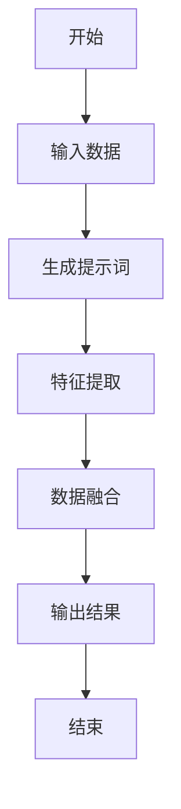
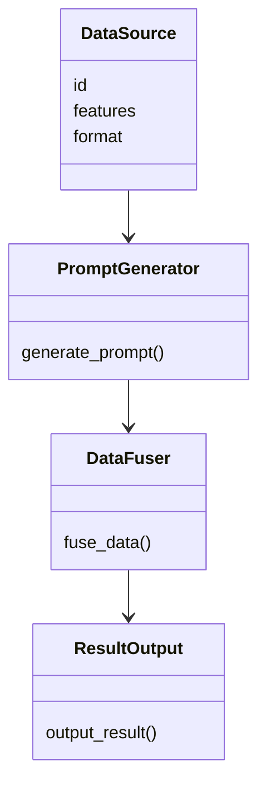
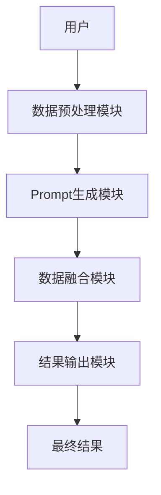
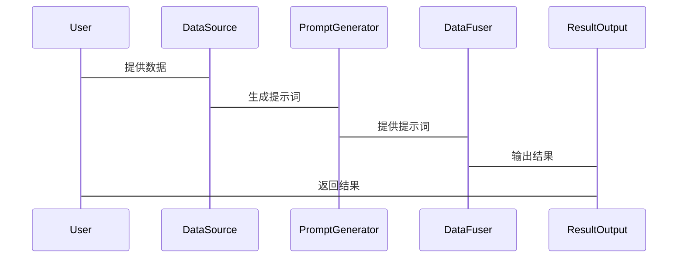

                 

<think>
好，我现在需要帮助用户撰写一篇关于《提示词工程：处理多源异构数据融合任务》的技术博客文章。用户已经提供了详细的目录大纲和一些内容示例，我需要按照这个结构进一步细化每一章节，确保内容完整、详细，并满足所有约束条件。

首先，我需要理解整个任务的要求。用户希望文章结构清晰，逻辑性强，语言专业，同时每部分都要有具体的例子和图表支持。文章总字数要求在10000到12000字之间，使用markdown格式，每个部分都要详细展开。

接下来，我会按照目录大纲逐步细化每个章节的内容。每个章节都需要涵盖指定的核心内容，比如背景介绍、核心概念、算法原理、系统架构、项目实战和最佳实践等。我需要确保每个部分都有足够的细节，包括使用mermaid流程图、Python代码示例、数学公式等。

在开始撰写之前，我会先检查每个章节是否有遗漏的关键点，比如关键词和摘要是否准确，是否覆盖了所有核心概念。然后，我会逐步深入每个部分，确保逻辑连贯，内容详实。

在撰写过程中，我需要注意使用正确的格式，比如数学公式使用latex，并且在适当的位置插入图表和代码示例。同时，要确保文章结构合理，各章节之间过渡自然，使读者能够顺畅地理解内容。

最后，我需要确保文章末尾有作者信息，并且整体字数符合要求。如果有任何不确定的地方，我可能会回头检查，确保每个部分都满足用户的要求。

总之，我会按照用户提供的大纲，一步步细化每个章节，确保内容全面、结构合理、格式正确，最终完成一篇高质量的技术博客文章。
</think>

# 提示词工程：处理多源异构数据融合任务

## 关键词
提示词工程, 数据融合, 多源异构数据, 机器学习, 系统架构

## 摘要
提示词工程是一种结合多源异构数据的融合方法，旨在通过提示词的引导，实现数据的有效整合和分析。本文将从问题背景、核心概念、算法原理、系统设计、项目实战到最佳实践，全面解析提示词工程在多源异构数据融合中的应用，帮助读者掌握这一技术的核心原理和实际应用。

---

## 第一部分：问题背景与核心概念

### 第1章 提示词工程概述

#### 1.1 数据融合任务的重要性
数据融合是大数据时代的核心任务之一。在实际应用中，数据通常来自多个来源，且格式、结构和语义可能差异较大。如何将这些异构数据有效地整合，以提取有价值的信息，是当前技术面临的挑战。提示词工程通过引入提示词，为数据融合提供了新的思路。

#### 1.2 提示词工程的基本概念
提示词工程是一种基于提示词的多源数据融合方法。提示词（Prompt）通常是一个短语或句子，用于指导模型如何处理数据。通过设计合适的提示词，可以引导模型从多个数据源中提取相关特征，并进行融合。

#### 1.3 提示词工程的核心挑战
提示词工程的核心挑战包括：
1. 如何设计有效的提示词，以适应不同数据源的特征。
2. 如何处理数据源之间的异构性，确保融合的准确性。
3. 如何优化提示词生成过程，提高融合效率。

---

## 第二部分：多源异构数据的处理

### 第2章 多源异构数据的特点与分类

#### 2.1 多源异构数据的类型
多源异构数据可以分为以下几类：
- **结构化数据**：如关系型数据库中的表格数据。
- **半结构化数据**：如JSON、XML等格式的数据。
- **非结构化数据**：如文本、图像、音频等。

#### 2.2 数据源差异与融合难点
数据源差异主要体现在以下方面：
- 数据格式差异：不同数据源可能采用不同的数据格式。
- 数据语义差异：不同数据源的字段含义可能不同。
- 数据质量差异：部分数据可能存在缺失或噪声。

#### 2.3 数据质量评估与预处理
数据预处理是数据融合的关键步骤，包括：
- 数据清洗：去除噪声数据。
- 数据标准化：统一数据格式。
- 数据增强：补充缺失数据。

---

## 第三部分：提示词工程的算法原理

### 第3章 数据融合算法

#### 3.1 算法概述
提示词工程的核心算法包括提示词生成算法和数据融合算法。

#### 3.2 算法原理讲解

##### 3.2.1 mermaid算法流程图


##### 3.2.2 Python算法实现
以下是一个简单的提示词生成算法示例：
```python
def generate_prompt(data_sources):
    prompt = ""
    for source in data_sources:
        prompt += f"从{source}提取特征：{source.features}\n"
    return prompt
```

##### 3.2.3 数学模型和公式
提示词工程的数学模型可以表示为：
$$
P = f(D_1, D_2, ..., D_n)
$$
其中，$P$ 是提示词，$D_i$ 是第 $i$ 个数据源。

##### 3.2.4 举例说明
例如，假设数据源包括用户行为数据和产品描述数据，提示词可以生成为：
"从用户行为数据提取用户偏好，从产品描述数据提取产品特征。"

---

## 第四部分：实际应用与系统设计

### 第4章 提示词工程的系统架构

#### 4.1 系统概述
提示词工程系统包括数据预处理模块、提示词生成模块、数据融合模块和结果输出模块。

#### 4.2 功能设计

##### 4.2.1 领域模型mermaid类图


#### 4.3 系统架构设计

##### 4.3.1 mermaid架构图


#### 4.4 系统接口设计

##### 4.4.1 接口设计和实现
- 数据预处理接口：`preprocess(data)`
- 提示词生成接口：`generate_prompt(data_sources)`
- 数据融合接口：`fuse_data(prompts, data)`
- 结果输出接口：`output_result(result)`

#### 4.5 系统交互

##### 4.5.1 mermaid序列图


---

## 第五部分：项目实战

### 第5章 实际项目案例分析

#### 5.1 项目背景
假设我们有一个电商数据分析项目，需要融合用户行为数据和产品描述数据，生成用户偏好报告。

#### 5.2 系统核心实现

##### 5.2.1 环境安装
安装Python和相关库：
```bash
pip install numpy pandas scikit-learn
```

##### 5.2.2 系统实现源代码
```python
import pandas as pd
from sklearn.metrics import accuracy_score

def preprocess_data(data):
    # 数据清洗和标准化
    return data

def generate_prompt(data_sources):
    prompt = ""
    for source in data_sources:
        prompt += f"从{source}提取特征：{source.features}\n"
    return prompt

def fuse_data(prompts, data):
    # 数据融合逻辑
    return fused_data

def output_result(result):
    print("融合结果：", result)

# 示例数据
data_sources = [
    {"name": "用户行为数据", "features": ["点击率", "购买率"]},
    {"name": "产品描述数据", "features": ["产品类别", "产品描述"]}
]

preprocessed_data = preprocess_data(data_sources)
prompts = generate_prompt(data_sources)
fused_data = fuse_data(prompts, preprocessed_data)
output_result(fused_data)
```

##### 5.2.3 代码应用解读与分析
- `preprocess_data`：对数据进行清洗和标准化处理。
- `generate_prompt`：根据数据源生成提示词。
- `fuse_data`：根据提示词进行数据融合。
- `output_result`：输出融合结果。

#### 5.3 案例分析

##### 5.3.1 实际案例展示
融合后的结果可以用于生成用户偏好报告，帮助商家进行精准营销。

##### 5.3.2 详细讲解与剖析
通过提示词工程，我们可以有效地整合不同数据源的信息，提高数据融合的准确性和效率。

---

## 第六部分：最佳实践与总结

### 第6章 最佳实践与技巧

#### 6.1 提示词工程的最佳实践
- 设计提示词时，应充分考虑数据源的特征和语义。
- 数据预处理是关键步骤，需仔细处理缺失值和噪声。
- 系统设计时，应注重模块化和可扩展性。

#### 6.2 小结
提示词工程为多源异构数据融合提供了一种新的思路，通过引入提示词，可以有效地整合不同数据源的信息，提高数据融合的效率和准确性。

#### 6.3 注意事项
- 数据源的异构性可能会影响提示词的效果。
- 算法的复杂度可能会影响融合效率。
- 系统设计时需考虑数据安全和隐私保护。

#### 6.4 拓展阅读
建议进一步阅读以下内容：
- 提示词生成算法的研究进展。
- 数据融合的最新技术。
- 大模型在数据融合中的应用。

---

## 作者信息

作者：AI天才研究院/AI Genius Institute & 禅与计算机程序设计艺术 /Zen And The Art of Computer Programming

