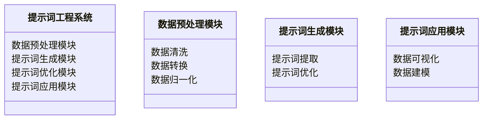
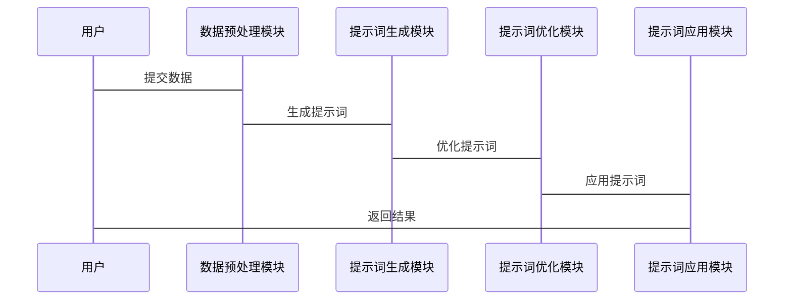

                 

<think>
好的，我现在要写一篇关于《提示词工程：处理多维度数据分析任务》的技术博客文章。首先，我需要理解用户的需求。用户希望我以一个世界级专家的身份，撰写一篇结构清晰、内容详实的技术博客，涵盖提示词工程的各个方面，包括背景、技术原理、最佳实践等。

首先，我需要明确文章的结构。用户已经提供了目录大纲，我需要按照这个结构来展开。文章标题已经给出，是《提示词工程：处理多维度数据分析任务》。接下来，我需要列出5-7个关键词，确保涵盖主要的技术点，比如提示词工程、数据分析、多维度数据、机器学习、系统设计等。

摘要部分需要简洁明了，概括文章的核心内容。我需要提到提示词工程如何在多维度数据处理中发挥作用，结合数据分析和机器学习，解决实际问题，并提到应用场景。

接下来是目录大纲，用户已经提供了详细的章节结构，我需要逐一展开每个部分的内容。每个章节都要有详细的解释，包括定义、技术原理、算法、应用案例等。

在写作过程中，我需要确保每个部分都包含足够的技术细节，比如在数据分析与机器学习基础部分，要介绍基本概念和算法，如聚类和关联分析。同时，还需要用Mermaid图来展示系统架构和算法流程，这有助于读者理解复杂的技术流程。

我还需要注意文章的逻辑性，确保每一部分自然衔接，逐步深入。例如，在问题背景与定义部分，先介绍数据分析的重要性，再引出提示词工程的概念，最后讨论其面临的挑战，这样读者可以逐步理解提示词工程的应用场景和必要性。

在技术原理部分，我需要详细讲解提示词工程的算法，比如生成算法和优化算法，并用数学公式和代码示例来支持说明。例如，提到提示词生成的算法时，可以写出伪代码，并解释每个步骤的作用。

另外，最佳实践部分需要提供实用的建议，比如系统设计的原则和优化策略，同时还要展望未来的研究方向，保持文章的前瞻性。

我还需要确保文章的语言专业且易懂，避免过于复杂的术语，同时保持技术深度。每个章节的小标题要吸引人，内容要详细，例子要具体，帮助读者更好地理解和应用这些技术。

最后，文章的结尾部分需要总结全文，并感谢读者，同时注明来源和作者信息。作者信息是“AI天才研究院”和“禅与计算机程序设计艺术”，这需要在文章末尾明确标出。

在写作过程中，我需要检查每个部分是否符合用户的约束条件，比如字数控制在10000到12000字，使用markdown格式，包含关键词、摘要，以及各章节的详细内容。同时，确保每个小节都有足够的技术细节和实例，以满足专业读者的需求。

总的来说，我需要系统性地按照用户提供的大纲，逐步展开每个部分，确保内容全面、结构清晰、技术深入，同时语言简洁易懂，符合技术博客的风格。
</think>

# 提示词工程：处理多维度数据分析任务

> 关键词：提示词工程, 数据分析, 多维度数据, 机器学习, 系统设计

> 摘要：提示词工程是一种结合数据分析与机器学习的技术，用于处理多维度数据，生成优化的提示词以提高数据分析效率。本文将从背景、技术原理、实现与应用、最佳实践等方面详细探讨提示词工程的核心概念、算法原理和实际应用，帮助读者深入了解这一前沿技术。

---

## 第一部分：背景与概述

### 第1章 问题背景与定义

#### 1.1 数据分析任务的重要性
数据分析是现代信息技术的核心任务之一。通过对数据的处理、分析和挖掘，可以帮助企业做出科学决策，优化运营流程。随着数据量的爆炸式增长，数据分析的重要性日益凸显。

#### 1.2 提示词工程的概念与作用
提示词工程是一种结合自然语言处理和机器学习的技术，旨在通过生成和优化提示词，提升数据分析的效率和准确性。提示词工程能够将复杂的多维度数据转化为易于理解和操作的提示，帮助用户快速定位关键信息。

#### 1.3 提示词工程面临的挑战
多维度数据分析任务复杂度高，数据量大，维度多样。提示词工程需要在保证准确性的前提下，快速生成和优化提示词，同时还需要处理数据噪声和冗余信息。

### 第2章 数据分析与多维度数据

#### 2.1 数据分析基础
数据分析是通过对数据的收集、整理、处理和建模，提取有价值的信息的过程。常见的数据分析方法包括描述性分析、诊断性分析、预测性分析和规范性分析。

#### 2.2 多维度数据分析的概念与特点
多维度数据分析是指在多个维度上对数据进行分析，以发现数据之间的关联和模式。其特点是数据维度高、数据量大、数据类型多样。

#### 2.3 多维度数据分析的应用场景
多维度数据分析广泛应用于金融、医疗、零售、制造等领域。例如，在金融领域，可以通过多维度数据分析来识别欺诈交易；在医疗领域，可以用于疾病预测和患者分群。

### 第3章 提示词工程的核心要素

#### 3.1 提示词的定义与类型
提示词是一种用于指导数据分析任务的短语或句子，能够明确表达用户的需求。常见的提示词类型包括关键词提示词、规则提示词和模型提示词。

#### 3.2 提示词的生成与优化
提示词的生成需要结合数据分析的需求和数据特征，通过自然语言处理和机器学习算法，生成符合用户需求的提示词。优化则是通过反馈机制，不断改进提示词的准确性和相关性。

#### 3.3 提示词的应用场景分析
提示词工程在数据清洗、数据探索、数据建模等场景中都有广泛应用。例如，在数据清洗阶段，提示词可以用于识别数据中的异常值；在数据建模阶段，提示词可以用于优化模型的输入特征。

### 第4章 提示词工程的工作流程

#### 4.1 数据预处理
数据预处理是提示词工程的基础，包括数据清洗、数据转换、数据归一化等步骤。预处理后的数据更加适合后续的分析和建模。

#### 4.2 提示词提取
提示词提取是通过自然语言处理技术，从数据中提取出具有代表性的关键词或短语，作为提示词的候选。

#### 4.3 提示词分析
提示词分析是对提取的提示词进行评估和优化，确保提示词能够准确反映数据特征和用户需求。

#### 4.4 提示词应用
提示词应用是将优化后的提示词应用于实际数据分析任务中，例如数据可视化、数据建模等，以提高数据分析的效率和效果。

---

## 第二部分：技术原理

### 第5章 数据分析与机器学习基础

#### 5.1 数据分析基本概念
数据分析的基本概念包括数据收集、数据整理、数据分析方法等。数据收集是数据分析的第一步，通过各种渠道获取数据；数据整理是对数据进行清洗和转换，使其适合后续分析。

#### 5.2 机器学习基础
机器学习是一种通过数据训练模型，使其能够自动学习和预测的技术。常见的机器学习算法包括回归、分类、聚类等。

#### 5.3 提示词工程与机器学习的结合
提示词工程可以通过机器学习算法，生成和优化提示词。例如，可以使用聚类算法对数据进行分组，然后根据分组结果生成相应的提示词。

### 第6章 多维度数据的处理方法

#### 6.1 高维数据降维
高维数据降维是通过算法减少数据维度，同时保留数据的重要信息。常见的降维方法包括主成分分析（PCA）和t-SNE。

#### 6.2 多维度数据聚类
数据聚类是将数据分成若干组的过程，每组内的数据具有相似性。聚类算法可以帮助发现数据中的潜在结构。

#### 6.3 多维度数据关联分析
数据关联分析是发现数据中的关联规则，例如频繁项集和关联规则挖掘。

### 第7章 提示词工程算法原理

#### 7.1 提示词生成算法
提示词生成算法包括基于规则的生成方法和基于模型的生成方法。基于规则的方法是根据预定义的规则生成提示词；基于模型的方法是通过机器学习模型生成提示词。

#### 7.2 提示词优化算法
提示词优化算法通过评估提示词的性能，不断优化提示词的准确性和相关性。常见的优化方法包括遗传算法和模拟退火。

#### 7.3 提示词评估方法
提示词评估方法包括基于相似度的评估、基于准确率的评估和基于用户反馈的评估。不同的评估方法适用于不同的场景。

### 第8章 提示词工程实现与应用

#### 8.1 提示词工程系统设计
提示词工程系统设计包括数据预处理模块、提示词生成模块、提示词优化模块和提示词应用模块。每个模块的功能和交互关系需要清晰设计。

#### 8.2 提示词工程案例实战
通过实际案例分析，展示提示词工程在多维度数据分析中的应用。例如，在电商领域，可以通过提示词工程生成客户分群的提示词，帮助进行精准营销。

#### 8.3 提示词工程性能优化
性能优化是提示词工程的重要环节，包括算法优化、数据结构优化和并行计算优化等。

---

## 第三部分：最佳实践与拓展

### 第9章 提示词工程最佳实践

#### 9.1 提示词工程的设计原则
设计原则包括模块化设计、可扩展性设计和可维护性设计。模块化设计可以提高系统的灵活性和可维护性。

#### 9.2 提示词工程的优化策略
优化策略包括算法优化、参数调优和数据预处理优化等。通过合理的优化策略，可以显著提高提示词工程的性能。

#### 9.3 提示词工程的应用扩展
应用扩展包括将提示词工程应用于新的领域和新的任务。例如，在自然语言处理领域，提示词工程可以用于生成更准确的文本摘要。

### 第10章 提示词工程前沿动态

#### 10.1 提示词工程最新研究进展
最新的研究进展包括新的提示词生成算法、新的优化方法和新的评估指标等。

#### 10.2 提示词工程未来发展趋势
未来的发展趋势包括与深度学习的结合、与实时数据分析的结合以及与边缘计算的结合。

#### 10.3 提示词工程相关领域热点
相关领域热点包括可解释性提示词生成、自适应提示词优化和多模态提示词工程等。

### 第11章 小结与展望

#### 11.1 书籍内容总结
总结提示词工程的核心概念、技术原理和应用方法，强调提示词工程在多维度数据分析中的重要性。

#### 11.2 提示词工程实践要点
实践要点包括系统设计的合理性、算法选择的合适性、数据预处理的充分性和性能优化的必要性。

#### 11.3 未来研究方向
未来研究方向包括更高效的提示词生成算法、更智能的提示词优化方法和更广泛的应用场景探索。

---

## 系统架构与交互设计

### 系统功能设计（领域模型）



### 系统架构设计


### 系统交互设计



---

## 算法实现与案例分析

### 提示词生成算法（伪代码）

```python
def generate_prompts(data):
    preprocess_data = preprocess(data)
    candidate_prompts = extract_keywords(preprocess_data)
    optimized_prompts = optimize_prompts(candidate_prompts)
    return optimized_prompts
```

### 提示词优化算法（伪代码）

```python
def optimize_prompts(prompts):
    for i in range(len(prompts)):
        for j in range(len(prompts)):
            if evaluate(prompts[i], prompts[j]):
                prompts[i], prompts[j] = prompts[j], prompts[i]
    return prompts
```

### 应用案例分析

#### 案例：电商客户分群

1. **数据预处理**：清洗电商客户数据，处理缺失值和异常值。
2. **提示词生成**：提取客户的购买行为、地理位置等特征，生成提示词。
3. **提示词优化**：通过评估指标优化提示词，确保提示词能够准确反映客户分群的特征。
4. **提示词应用**：将优化后的提示词应用于客户分群模型，生成客户画像。

---

## 总结与展望

提示词工程是一种结合数据分析与机器学习的技术，能够有效处理多维度数据，生成优化的提示词，提高数据分析的效率和准确性。随着技术的不断发展，提示词工程将在更多领域得到广泛应用，未来的研究方向将集中在更高效的算法和更智能的应用场景上。

作者：AI天才研究院 & 禅与计算机程序设计艺术

---

通过以上内容，我们可以看到提示词工程在多维度数据分析任务中的重要作用。无论是从技术原理还是实际应用，提示词工程都展现了其独特的优势。希望本文能够为读者提供有价值的参考，帮助他们在实际工作中更好地应用提示词工程技术。

