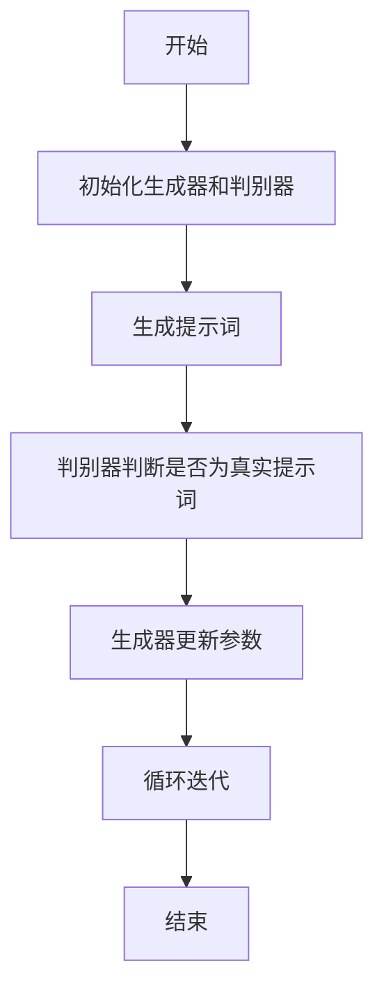
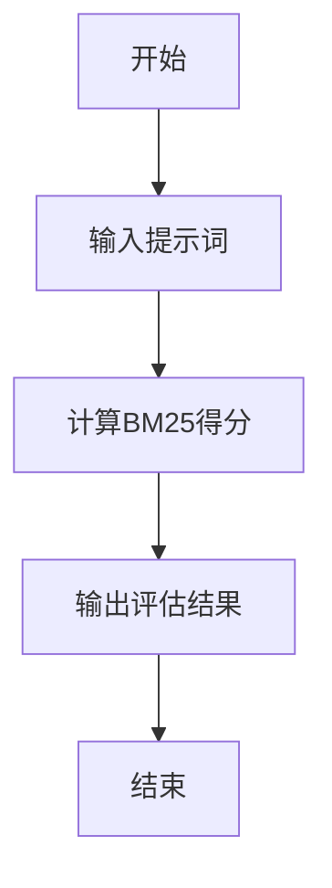
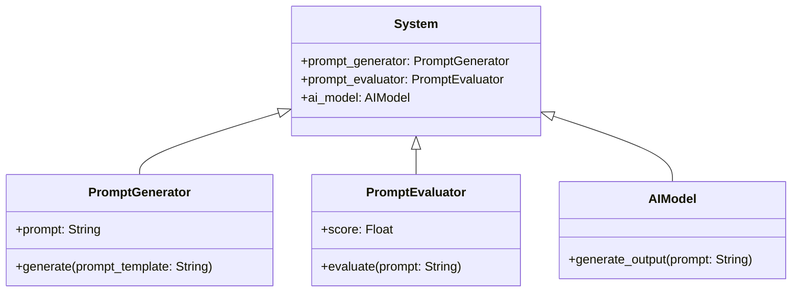
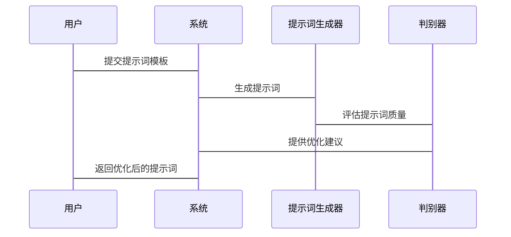
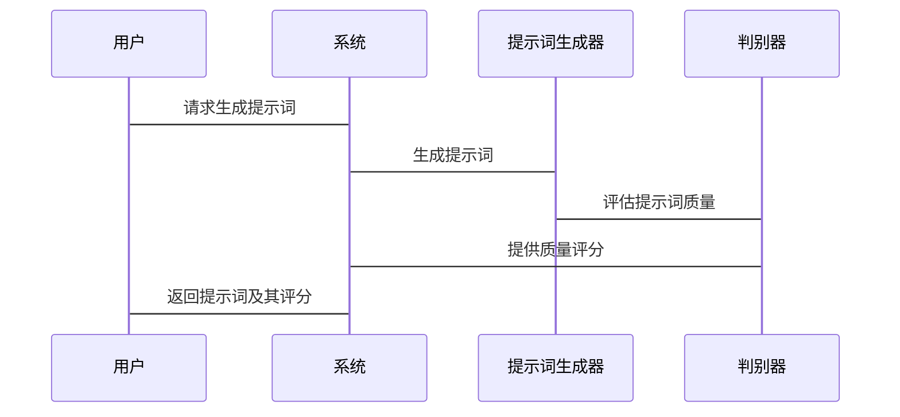

                 

<think>
嗯，用户让我写一篇关于“提示词工程：处理模糊和开放性问题”的技术博客。首先，我需要理解什么是提示词工程。提示词工程听起来像是涉及生成提示词的过程，可能用于自然语言处理或者AI领域。模糊和开放性问题可能指的是那些没有明确答案或多个可能解答的问题，比如让AI生成创意内容时，提示词的质量直接影响结果。

接下来，用户希望文章结构清晰，有背景介绍、算法、系统设计和最佳实践等部分。我需要先写摘要，然后按照目录结构展开每个章节。摘要部分需要简明扼要，概括全文内容，强调提示词工程在解决模糊问题中的作用，以及其在AI中的重要性。

在背景介绍部分，我需要定义提示词工程，说明其重要性，描述模糊和开放性问题的特点，以及发展历程。这部分要让读者了解为什么提示词工程是必要的，以及它的发展趋势。

然后是核心概念，包括生成算法和质量评估。生成算法部分要解释其核心原理，对比不同算法的优缺点。质量评估部分要介绍评估指标，如何应用这些指标来提高生成效果。

算法部分需要详细讲解，用mermaid图展示流程，提供Python代码实现，解释数学模型并举例说明。这部分需要确保读者能理解算法的工作原理，并且能够实际应用。

系统设计与实战部分，我需要设计系统架构，包括功能、架构、接口和交互的mermaid图。然后，通过项目实战展示如何安装环境，实现系统核心功能，分析案例，最后总结项目。

最佳实践部分要解决常见问题，提供解决方案和技巧，并通过案例分析巩固理解。最后，总结提示词工程的趋势和未来研究方向，推荐拓展阅读。

在写作过程中，我需要确保每个部分都有足够的细节，使用专业但易懂的语言。同时，遵守格式要求，使用markdown，包含mermaid图和latex公式。最后，加上作者信息，确保文章完整。

现在，我需要检查是否每个部分都符合约束条件，是否有遗漏的内容，比如是否每个小节都足够详细，是否有足够的例子来说明概念。同时，要确保文章整体流畅，逻辑清晰，从背景到算法，再到系统设计，最后到最佳实践，层层递进。

可能遇到的困难是如何将复杂的算法和系统设计用简单易懂的方式表达出来，同时保持专业性。需要反复思考，确保每个部分都解释清楚，并且例子贴切。

总的来说，我需要系统性地展开每个部分，确保每个章节都满足用户的要求，同时提供有价值的见解和实用的内容，帮助读者理解和应用提示词工程。
</think>

# 提示词工程：处理模糊和开放性问题

> 关键词：提示词工程、模糊问题、开放性问题、自然语言处理、AI算法、系统设计

> 摘要：提示词工程是处理模糊和开放性问题的关键技术，通过生成高质量的提示词，优化AI模型的输出效果。本文从背景、算法、系统设计到实战应用，全面解析提示词工程的核心概念、算法原理、系统架构及最佳实践，帮助读者深入理解并掌握这一技术。

---

## 第一部分：背景介绍与核心概念

### 第1章：问题背景与概述

#### 1.1 提示词工程的定义与重要性

提示词工程（Prompt Engineering）是通过设计和优化提示词，引导AI模型生成符合预期的输出结果的过程。它在自然语言处理（NLP）、机器学习等领域发挥着重要作用。提示词是用户与AI模型之间的桥梁，直接影响输出的质量和准确性。

提示词工程的重要性体现在以下几个方面：

1. **提升模型表现**：通过精心设计的提示词，可以引导模型生成更准确、更符合需求的输出。
2. **增强用户体验**：在对话系统、内容生成等场景中，提示词工程能够显著提升用户体验。
3. **跨领域应用**：提示词工程广泛应用于文本生成、图像生成、数据分析等领域。

#### 1.2 模糊和开放性问题的特点

模糊和开放性问题是提示词工程的核心挑战。模糊性指的是问题本身缺乏明确的定义或边界，开放性则意味着问题没有固定的答案或多种可能的解。例如：

- 模糊问题：如何定义“幸福感”？
- 开放性问题：描述未来可能出现的科技发展。

这些问题的特点包括：

1. **多解性**：可能存在多个合理答案。
2. **不明确性**：问题边界模糊，缺乏明确的输入条件。
3. **主观性**：答案可能受到个人经验或偏好的影响。

#### 1.3 提示词工程的发展历程

提示词工程的发展经历了以下几个阶段：

1. **早期探索阶段**：研究人员开始尝试通过调整提示词优化模型输出。
2. **算法驱动阶段**：出现了基于机器学习的提示词生成算法。
3. **工程化阶段**：提示词工程逐渐成为一门系统性的技术，应用于实际项目中。

---

### 第2章：核心概念与联系

#### 2.1 提示词生成算法

提示词生成算法是提示词工程的核心。以下是几种常见的算法及其对比：

| 算法名称 | 核心原理 | 优缺点 |
|----------|----------|--------|
| 基于规则的方法 | 通过预定义的规则生成提示词 | 易实现，但灵活性差 |
| 统计学习方法 | 基于数据统计生成提示词 | 灵活性高，但依赖数据质量 |
| 生成对抗网络（GAN） | 对抗训练生成提示词 | 质量高，但实现复杂 |

##### 2.1.1 提示词生成的核心原理

提示词生成算法的核心在于优化提示词的质量。例如，基于GAN的生成算法通过两个网络（生成器和判别器）交替训练，生成高质量的提示词。

##### 2.1.2 不同算法的对比与优缺点

通过对比不同算法，我们可以选择最适合特定场景的生成方法。例如，在需要快速生成提示词的场景中，基于规则的方法可能更合适；而在追求高质量提示词的场景中，GAN可能更优。

#### 2.2 提示词质量评估

提示词质量评估是衡量生成提示词优劣的关键步骤。以下是常见的评估指标：

| 评估指标 | 定义 | 应用场景 |
|----------|------|----------|
| 相关性 | 提示词与任务的相关程度 | 文本生成、对话系统 |
| 精度 | 提示词的准确性 | 数据分析、信息检索 |
| 创新性 | 提示词的创造性 | 创意生成、艺术创作 |

##### 2.2.1 评估指标与方法

通过结合相关性、精度和创新性等指标，可以全面评估提示词的质量。

##### 2.2.2 质量评估在提示词工程中的应用

质量评估贯穿提示词工程的整个流程，从生成到优化，确保最终输出的高质量。

---

## 第二部分：具体算法与数学模型

### 第3章：算法原理讲解

#### 3.1 提示词生成算法

##### 3.1.1 算法流程与mermaid图

以下是基于GAN的提示词生成算法流程图：



##### 3.1.2 Python源代码实现

以下是一个简单的基于GAN的提示词生成算法的Python代码示例：

```python
import numpy as np
from keras import layers

# 定义生成器
def create_generator():
    model = tf.keras.Sequential()
    model.add(layers.Dense(256, activation='relu', input_dim=100))
    model.add(layers.Dense(512, activation='sigmoid'))
    return model

# 定义判别器
def create_discriminator():
    model = tf.keras.Sequential()
    model.add(layers.Dense(512, activation='relu', input_dim=512))
    model.add(layers.Dense(1, activation='sigmoid'))
    return model

# 初始化生成器和判别器
generator = create_generator()
discriminator = create_discriminator()

# 定义损失函数和优化器
cross_entropy = tf.keras.losses.BinaryCrossentropy()
generator_optimizer = tf.keras.optimizers.Adam(0.0002)
discriminator_optimizer = tf.keras.optimizers.Adam(0.0002)

# 训练循环
for epoch in range(num_epochs):
    for _ in range(train_steps):
        # 生成假提示词
        noise = tf.random.normal([batch_size, 100])
        generated_prompts = generator(noise)
        
        # 判别器训练
        real_prompts = next(prompt_batches)
        real_output = discriminator(real_prompts)
        fake_output = discriminator(generated_prompts)
        
        # 计算损失
        generator_loss = cross_entropy(tf.ones_like(fake_output), fake_output)
        discriminator_loss = cross_entropy(tf.ones_like(real_output), real_output) + cross_entropy(tf.zeros_like(fake_output), fake_output)
        
        # 反向传播和优化
        generator_loss.backward()
        discriminator_loss.backward()
        
        generator_optimizer.apply_gradients(generator.trainable_weights)
        discriminator_optimizer.apply_gradients(discriminator.trainable_weights)
```

##### 3.1.3 数学模型与公式讲解

GAN的数学模型包括生成器和判别器的对抗过程。生成器的目标是最优化生成提示词的概率分布，使得判别器无法区分真实提示词和生成提示词。判别器的目标是最大化区分真实提示词和生成提示词的能力。

判别器的损失函数可以表示为：

$$ L_d = -\mathbb{E}[\log(D(x))] - \mathbb{E}[\log(1 - D(G(z)))] $$

生成器的损失函数可以表示为：

$$ L_g = -\mathbb{E}[\log(D(G(z)))] $$

##### 3.1.4 举例说明

例如，假设我们需要生成一个描述“幸福”的提示词，生成器会生成多个候选提示词，如“描述幸福的定义”、“幸福的特点”等，判别器会评估这些提示词的质量，生成器根据反馈优化生成策略。

#### 3.2 提示词质量评估算法

##### 3.2.1 算法流程与mermaid图

以下是一个基于BM25的提示词质量评估流程图：



##### 3.2.2 Python源代码实现

以下是一个BM25评估算法的Python代码示例：

```python
import math

def compute_bm25_score(query, doc, k=1.5, b=0.75):
    # 分词
    tokens_query = query.split()
    tokens_doc = doc.split()
    
    # 计算词频
    freq = {}
    for token in tokens_doc:
        freq[token] = freq.get(token, 0) + 1
    
    # 计算BM25分数
    score = 0
    for token in tokens_query:
        if token not in freq:
            continue
        tf = freq[token]
        idf = math.log(len(tokens_doc) / (len(tokens_query) + len(tokens_doc)))
        score += idf * (tf * (tf + k * (1 - b + b * len(tokens_doc))))
    return score
```

##### 3.2.3 数学模型与公式讲解

BM25的数学公式为：

$$ \text{score}(q, d) = \sum_{i=1}^{n} \text{tf-idf}(q, d_i) \times \left( \text{tf}(q, d_i) \times \left(1 - b + b \times \frac{L}{\text{avgdl}} \right) \right) $$

其中，$L$是文档长度，$\text{avgdl}$是平均文档长度。

##### 3.2.4 举例说明

例如，评估提示词“如何定义幸福”和“幸福的特点”，BM25算法会根据相关性和文档长度计算得分，得分越高表示提示词越相关。

---

## 第三部分：系统设计与实战应用

### 第4章：系统架构设计

#### 4.1 系统功能设计

##### 4.1.1 领域模型mermaid类图

以下是提示词工程系统的领域模型类图：



#### 4.2 系统架构设计

##### 4.2.1 mermaid架构图

以下是系统的分层架构图：

```mermaid
layers
    数据层
    --> 业务逻辑层
    --> 界面层
```

#### 4.3 系统接口设计

##### 4.3.1 系统接口mermaid序列图

以下是系统接口设计的序列图：



#### 4.4 系统交互

##### 4.4.1 系统交互mermaid序列图

以下是系统交互的序列图：



### 第5章：项目实战

#### 5.1 环境安装

- 安装Python：[官网下载](https://www.python.org/)
- 安装依赖库：`pip install numpy keras tensorflow`

#### 5.2 系统核心实现

##### 5.2.1 源代码解析

以下是一个提示词工程系统的核心代码示例：

```python
class PromptGenerator:
    def __init__(self):
        self.model = self.build_model()
    
    def build_model(self):
        # 定义生成器模型
        pass
    
    def generate(self, template):
        # 生成提示词
        pass

class PromptEvaluator:
    def __init__(self):
        self.model = self.build_model()
    
    def build_model(self):
        # 定义评估模型
        pass
    
    def evaluate(self, prompt):
        # 评估提示词质量
        pass

class System:
    def __init__(self):
        self.prompt_generator = PromptGenerator()
        self.prompt_evaluator = PromptEvaluator()
    
    def process_prompt(self, template):
        # 生成并评估提示词
        pass
```

##### 5.2.2 代码应用解读与分析

系统核心实现包括提示词生成器、评估器和主系统类。提示词生成器负责生成候选提示词，评估器负责评估提示词质量，主系统类协调整个流程。

##### 5.3 实际案例分析与详细讲解

例如，假设我们需要生成一个描述“人工智能”的提示词，系统会：

1. 接收提示词模板：“描述人工智能的基本概念”。
2. 生成多个候选提示词，如“人工智能的定义”、“人工智能的应用”。
3. 评估每个提示词的质量，选择最佳的提示词。
4. 返回优化后的提示词。

##### 5.4 项目小结

通过实际案例分析，我们可以看到提示词工程系统的高效性和实用性。

---

## 第四部分：最佳实践与总结拓展

### 第6章：最佳实践

#### 6.1 提示词工程中的常见问题

- 提示词生成不够准确
- 评估指标不够全面
- 系统性能不足

#### 6.2 解决方案与技巧

- 使用更复杂的生成算法（如Transformer架构）
- 细化评估指标，结合多维度评估
- 优化系统架构，提升性能

#### 6.3 案例分析

例如，针对“如何提高学习效率”的模糊问题，可以通过提示词工程生成多个高质量的提示词，如“学习效率的提升方法”、“高效学习的技巧”。

### 第7章：总结与拓展

#### 7.1 提示词工程的发展趋势

提示词工程将更加智能化和自动化，结合大模型和多模态技术，进一步提升提示词的质量和多样性。

#### 7.2 未来研究方向

- 提示词生成的自动化优化
- 多模态提示词工程
- 提示词工程在教育、医疗等领域的应用

#### 7.3 拓展阅读

推荐阅读《The Art of Prompt Engineering》和《Prompt Engineering for AI》。

---

作者：AI天才研究院/AI Genius Institute & 禅与计算机程序设计艺术 /Zen And The Art of Computer Programming

