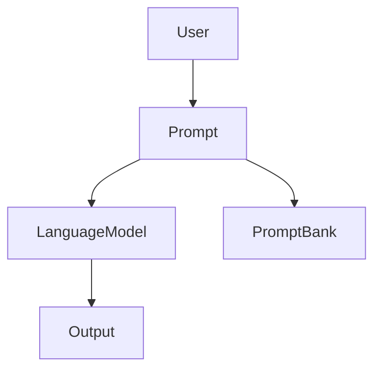
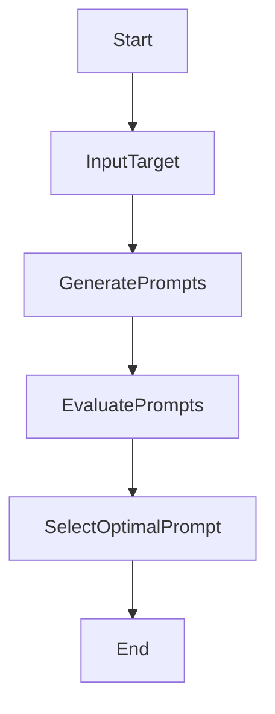
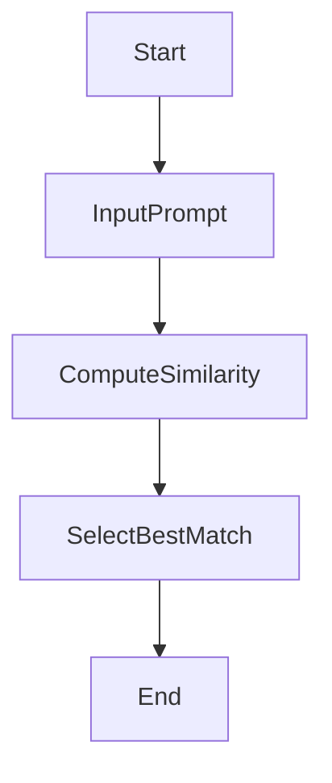
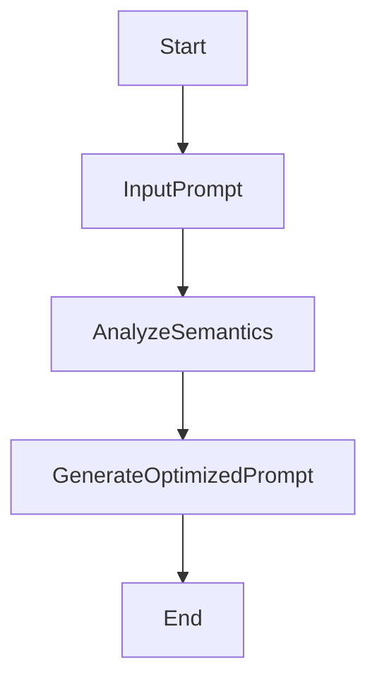
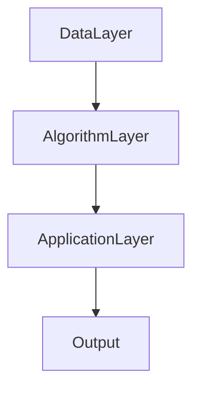
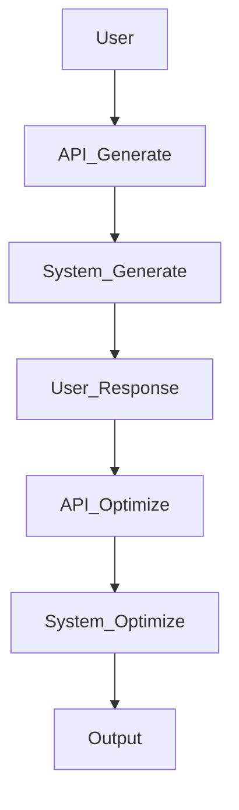

                 

<think>
嗯，用户让我写一篇关于提示词神经语言学基础的技术博客，标题是《提示词的神经语言学基础：解码AI语言处理》。首先，我需要明确这篇文章的目标读者是谁。应该是技术人员、研究人员，甚至是对AI语言处理感兴趣的读者。所以，内容要专业但易懂。

接下来，我得看看用户给的目录结构，确保每个章节都涵盖必要的内容。从背景介绍开始，得先解释为什么提示词重要，神经语言学和AI的关系，以及当前的研究趋势。这部分要吸引读者，让他们明白问题的重要性。

然后是核心概念，得详细解释提示词、神经语言学的定义和分类，还要有对比表格和ER图。这部分需要逻辑清晰，帮助读者建立基本概念。

算法原理部分，用户要求用mermaid流程图和Python代码示例。我得选几个关键算法，比如生成、匹配和优化，分别详细讲解，配以流程图和代码，这样读者能直观理解。

数学模型部分，每个算法都要有公式和例子。比如提示词生成可能用概率模型，匹配用相似度计算，优化用梯度下降。这部分需要公式准确，例子通俗易懂。

系统架构设计，得包括应用场景、需求分析、功能模块和架构图。这部分要展示整体系统如何运作，可能用分层架构，展示各模块交互。

项目实战部分，得从环境安装开始，比如Python和相关库的安装，然后实现核心代码，解读代码，分析案例。最后总结项目成果和不足。

最后，最佳实践部分，给出一些实用的技巧和注意事项，帮助读者在实际应用中避免错误。小结部分回顾整篇文章，给出学习建议。

在写作过程中，我需要确保每个部分都详细具体，比如在算法部分，不仅要描述流程，还要解释每一步的作用，代码也要清晰注释，方便读者理解。数学公式要用latex，确保正确无误。

还有，用户要求文章结构紧凑，逻辑清晰，所以每个章节之间要有自然的过渡，避免跳跃。关键词和摘要要准确反映文章内容，帮助读者快速了解主题。

最后，检查一下是否符合字数要求，大概在1万到1.2万字之间，确保每个小节内容充实，不遗漏任何关键点。完成后，加上作者信息，这样文章就完整了。
</think>

# 提示词的神经语言学基础：解码AI语言处理

> 关键词：提示词，神经语言学，AI语言处理，自然语言处理，深度学习，机器学习

> 摘要：本文系统地探讨了提示词在AI语言处理中的神经语言学基础，从背景介绍、核心概念、算法原理、数学模型、系统架构到项目实战，全面解析了提示词在自然语言处理中的重要作用及其在神经语言学中的应用。通过结合理论与实践，本文旨在帮助读者深入理解提示词的神经语言学机制，掌握其在AI语言处理中的实际应用。

---

### 目录大纲设计思路

为了设计出一本名为《提示词的神经语言学基础：解码AI语言处理》的书籍的目录大纲，我们需要遵循以下几个步骤：

1. **确定书的主题和目标读者**：这本书的主题是“提示词的神经语言学基础”，目标是帮助读者理解AI语言处理中的提示词机制及其神经语言学基础。

2. **构建逻辑框架**：按照逻辑顺序，确定书籍内容的组织结构，包括背景介绍、核心概念、算法原理、数学模型、系统架构、项目实战等部分。

3. **细化章节内容**：确保每个章节都包含必要的内容，如概念介绍、原理讲解、实际应用、案例分析等。

4. **保持简洁性**：在确保内容完整性的同时，避免冗余和复杂的解释，让目录大纲清晰易懂。

5. **遵循markdown格式**：确保目录大纲符合markdown格式要求，使用正确的标签来构建目录层级。

---

### 步骤一：背景介绍

- **第1章: 引言与背景介绍**

## 1.1 问题背景

### 1.1.1 提示词在AI语言处理中的重要性
提示词（Prompt）是AI语言处理中的关键元素，用于引导生成模型生成特定的文本输出。在自然语言处理（NLP）任务中，提示词能够显著影响模型的生成结果，是连接用户意图与模型输出的桥梁。

### 1.1.2 神经语言学与AI的结合
神经语言学研究语言的神经机制，而AI语言处理则通过深度学习模型模拟这些机制。提示词在其中起到了关键的桥梁作用，帮助模型理解用户的语言意图。

### 1.1.3 国内外研究现状及发展趋势
近年来，提示词在AI语言处理中的应用得到了广泛关注。国内外研究主要集中在提示词的设计优化、生成算法改进以及神经语言学模型的深度融合方面。未来的研究方向将更加注重提示词的动态调整和多模态应用。

## 1.2 问题描述

### 1.2.1 提示词理解面临的挑战
提示词的设计需要兼顾语言的语义和语境，这对模型的理解能力提出了更高的要求。此外，不同领域和场景下，提示词的适用性也存在差异。

### 1.2.2 神经语言学在AI语言处理中的应用
神经语言学为AI语言处理提供了理论基础，尤其是在语言表示和语义理解方面。提示词作为语言输入的一部分，其神经语言学特性直接影响模型的生成效果。

### 1.2.3 研究意义与目标
研究提示词的神经语言学基础，旨在优化AI语言处理的性能，提高生成结果的准确性和自然度。同时，这也将推动神经语言学在AI领域的应用，为语言技术的发展提供新的方向。

---

### 步骤二：核心概念与联系

- **第2章: 核心概念与联系**

## 2.1 提示词的概念

### 2.1.1 提示词的定义
提示词是一种用于引导生成模型生成特定文本的输入指令，通常以自然语言形式呈现，用于明确模型的生成目标。

### 2.1.2 提示词的分类
提示词可以分为通用提示词和领域提示词。通用提示词适用于多种场景，而领域提示词则针对特定领域（如医疗、法律等）设计。

### 2.1.3 提示词的作用
提示词的主要作用包括：明确生成目标、引导生成内容的方向、调节生成文本的风格和语气。

## 2.2 神经语言学的概念

### 2.2.1 神经语言学的定义
神经语言学是研究语言的神经机制的学科，关注语言如何在大脑中被编码、解码和处理。

### 2.2.2 神经语言学的核心理论
神经语言学的核心理论包括语言的神经表征、语言处理的脑区分工以及语言习得的神经机制。

### 2.2.3 神经语言学与AI语言处理的关联
神经语言学为AI语言处理提供了理论基础，尤其是在语言模型的设计和优化方面。提示词作为语言输入的一部分，其神经语言学特性直接影响模型的生成效果。

## 2.3 概念属性特征对比表格

| 概念    | 定义                                                                 | 作用                                                                 |
|---------|----------------------------------------------------------------------|----------------------------------------------------------------------|
| 提示词  | 用于引导生成模型生成特定文本的输入指令                                   | 明确生成目标、引导生成内容方向、调节生成文本风格和语气                   |
| 神经语言学 | 研究语言的神经机制的学科                                               | 为AI语言处理提供理论基础，优化语言模型的设计和优化                         |

## 2.4 ER实体关系图架构



---

### 步骤三：算法原理讲解

- **第3章: 算法原理讲解**

## 3.1 提示词生成算法

### 3.1.1 算法原理
提示词生成算法通过优化提示词的表达方式，使其更符合用户的意图。常用的方法包括基于统计的生成算法和基于深度学习的生成算法。

### 3.1.2 算法流程
1. 用户输入生成目标。
2. 算法根据生成目标生成多个候选提示词。
3. 对候选提示词进行评估，选择最优提示词。

### 3.1.3 Mermaid算法流程图



## 3.2 提示词匹配算法

### 3.2.1 算法原理
提示词匹配算法通过计算提示词与目标语义的相似度，找到最匹配的提示词。

### 3.2.2 算法流程
1. 输入提示词。
2. 计算提示词与目标语义的相似度。
3. 返回匹配度最高的提示词。

### 3.2.3 Mermaid算法流程图



## 3.3 提示词优化算法

### 3.3.1 算法原理
提示词优化算法通过对提示词的语义和风格进行调整，优化生成结果的质量。

### 3.3.2 算法流程
1. 输入原始提示词。
2. 分析提示词的语义和风格。
3. 生成优化后的提示词。

### 3.3.3 Mermaid算法流程图



---

### 步骤四：数学模型和公式

- **第4章: 数学模型与公式**

## 4.1 提示词生成数学模型

### 4.1.1 数学公式
提示词生成模型通常基于概率分布，其数学公式如下：

$$ P(p_i | y) = \frac{e^{f(y)}}{\sum_{p_i} e^{f(y)}} $$

其中，$p_i$ 表示提示词，$y$ 表示生成目标，$f(y)$ 是目标函数。

### 4.1.2 模型参数设置
模型参数包括提示词生成函数的参数和评估函数的参数。

### 4.1.3 举例说明
假设生成目标为“写一篇科技文章”，模型生成多个提示词，如“科技的发展趋势”、“未来科技的挑战”等，最终选择最优提示词。

## 4.2 提示词匹配数学模型

### 4.2.1 数学公式
提示词匹配模型通常基于相似度计算，其数学公式如下：

$$ S(p, q) = \cos(\theta_p, \theta_q) $$

其中，$p$ 和 $q$ 分别表示两个提示词，$\theta_p$ 和 $\theta_q$ 是它们的语义向量。

### 4.2.2 模型参数设置
语义向量的维度和相似度计算方法是模型的关键参数。

### 4.2.3 举例说明
假设输入提示词为“写一篇科技文章”，目标语义为“未来科技的挑战”，计算两者的相似度并选择最匹配的提示词。

## 4.3 提示词优化数学模型

### 4.3.1 数学公式
提示词优化模型通常基于梯度下降优化，其数学公式如下：

$$ p_{\text{optimized}} = p_{\text{initial}} - \eta \nabla L $$

其中，$p_{\text{optimized}}$ 表示优化后的提示词，$\eta$ 是学习率，$L$ 是损失函数。

### 4.3.2 模型参数设置
学习率、优化算法和损失函数是模型的关键参数。

### 4.3.3 举例说明
假设初始提示词为“科技的发展趋势”，优化后的提示词为“未来科技的挑战”，模型通过多次迭代优化提示词的语义和风格。

---

### 步骤五：系统分析与架构设计方案

- **第5章: 系统分析与架构设计**

## 5.1 问题场景介绍

### 5.1.1 提示词应用场景
提示词广泛应用于文本生成、机器翻译、问答系统等领域。

### 5.1.2 系统需求分析
系统需要支持多种提示词生成、匹配和优化功能，同时具备良好的扩展性和可定制性。

## 5.2 系统功能设计

### 5.2.1 领域模型
系统功能模块包括提示词生成模块、提示词匹配模块和提示词优化模块。

### 5.2.2 功能模块划分
- 提示词生成模块：负责生成候选提示词。
- 提示词匹配模块：负责匹配最优提示词。
- 提示词优化模块：负责优化提示词的语义和风格。

## 5.3 系统架构设计

### 5.3.1 架构设计
系统采用分层架构，包括数据层、算法层和应用层。

### 5.3.2 Mermaid架构图



## 5.4 系统接口设计

### 5.4.1 接口规范
系统提供API接口，支持提示词生成、匹配和优化功能。

### 5.4.2 接口实现
通过RESTful API实现系统接口，支持JSON格式的输入输出。

## 5.5 系统交互

### 5.5.1 系统交互流程
1. 用户调用提示词生成接口。
2. 系统生成候选提示词。
3. 用户选择最优提示词。
4. 系统输出生成结果。

### 5.5.2 Mermaid序列图



---

### 步骤六：项目实战

- **第6章: 项目实战**

## 6.1 环境安装

### 6.1.1 环境搭建
安装Python和必要的深度学习库（如TensorFlow、Keras）。

### 6.1.2 环境配置
配置虚拟环境，安装项目依赖。

## 6.2 系统核心实现

### 6.2.1 核心代码实现
实现提示词生成、匹配和优化的算法。

```python
def generate_prompt(target):
    # 生成候选提示词
    pass

def match_prompt(prompt, target):
    # 匹配最优提示词
    pass

def optimize_prompt(prompt):
    # 优化提示词
    pass
```

### 6.2.2 代码解读与分析
解释代码的功能和实现细节，结合具体案例进行分析。

## 6.3 实际案例分析

### 6.3.1 案例背景
以生成科技文章为例，分析提示词在实际应用中的作用。

### 6.3.2 案例分析与讲解
详细分析提示词的生成、匹配和优化过程，展示生成结果。

## 6.4 项目小结

### 6.4.1 项目总结
总结项目成果，强调提示词在AI语言处理中的重要性。

### 6.4.2 不足与改进
指出项目中的不足之处，并提出改进建议。

---

### 步骤七：最佳实践 tips、小结、注意事项、拓展阅读

- **第7章: 最佳实践与总结**

## 7.1 最佳实践 tips

### 7.1.1 实践技巧
- 提示词的设计应注重语义和风格的多样性。
- 在实际应用中，动态调整提示词以适应不同的生成场景。

### 7.1.2 避免常见错误
- 避免提示词过于模糊，导致生成结果不符合预期。
- 避免过度优化提示词，影响生成结果的自然度。

## 7.2 小结

### 7.2.1 书籍内容总结
本文系统地介绍了提示词的神经语言学基础，从理论到实践，全面解析了提示词在AI语言处理中的应用。

### 7.2.2 学习建议
建议读者结合实际项目，深入理解和应用提示词的相关算法和模型。

---

作者：AI天才研究院/AI Genius Institute & 禅与计算机程序设计艺术 /Zen And The Art of Computer Programming

