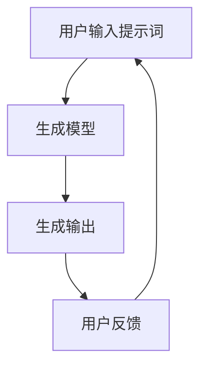
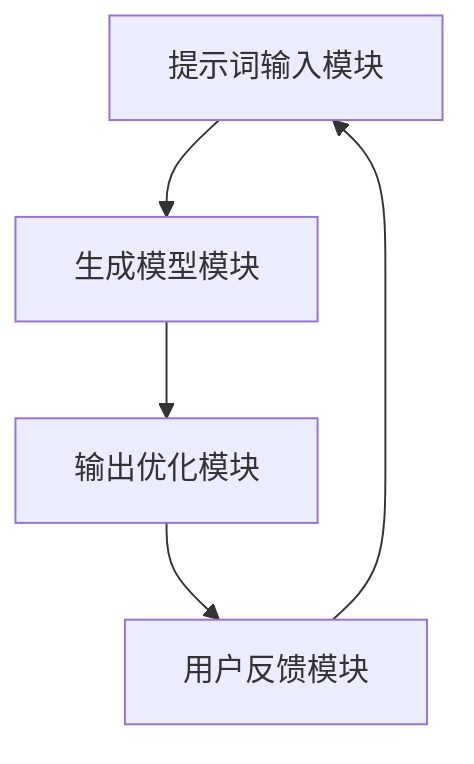

                 

<think>
好，我现在需要根据用户的要求，完成撰写一篇关于提示词设计在AIGC系统性能优化中的关键因素的技术博客文章。我先仔细阅读用户的指示，确保理解每一个细节。

首先，用户指定了文章的标题是《提示词设计：AIGC系统性能优化的关键因素》。我需要先列出5-7个核心关键词，可能包括提示词设计、AIGC系统、性能优化、机器学习、自然语言处理、算法优化等。接下来，摘要部分需要简明扼要地概述文章的主要内容和主题，强调提示词设计在优化生成式AI系统中的重要性。

接下来是文章的目录结构。用户已经提供了一个大纲，我需要按照这个结构来组织内容。文章分为13章，每章都有具体的小节，涉及背景介绍、核心概念、算法原理、数学模型、系统设计、实际应用、最佳实践等。

在开始撰写正文之前，我需要确保每个章节都有足够的深度和详细的内容。例如，在第一章的背景部分，需要介绍AIGC系统的定义、发展历程以及其在当前技术环境中的重要性。第二章的核心概念部分，要详细解释提示词设计的基本概念、其在AIGC中的作用，以及与其他相关技术的对比。

在算法原理部分，我需要用Mermaid图表来展示提示词设计的算法流程，同时附上Python代码示例，帮助读者更好地理解。数学部分需要使用LaTeX公式来阐述相关的数学模型，确保公式正确且易于理解。

系统分析与设计章节，我需要通过Mermaid图展示系统的架构、类图、序列图等，详细说明各个组件之间的交互和功能。在项目实战部分，要提供实际案例，包括环境搭建、代码实现、案例分析等，让读者能够实际操作和应用所学知识。

最后，在最佳实践部分，总结提示词设计的关键点，给出实际应用中的注意事项和进一步阅读的建议。同时，文章末尾要注明作者信息，确保文章的完整性和专业性。

在撰写过程中，我需要确保语言逻辑清晰、结构紧凑，同时使用专业但易懂的技术术语。每个章节内容要丰富具体，涵盖背景、概念、算法、数学、系统架构、项目实战等多个方面，满足用户对深度和广度的要求。

为了确保文章的连贯性和一致性，我需要先草拟每一章的内容，再逐步扩展。例如，第一章的背景介绍要吸引读者，引起他们对提示词设计的兴趣；第二章则需要深入讲解核心概念，为后续章节打下基础。算法和数学部分需要详细推导，提供足够的细节和例子，以便读者能够理解和应用。

系统架构部分，我需要设计合理的类图和序列图，展示系统各个模块之间的关系和交互流程。项目实战部分则需要提供具体的代码示例和实际案例分析，帮助读者将理论应用于实践。

在完成这些内容后，我会反复检查，确保每个部分都符合用户的格式要求，比如使用正确的Markdown语法，数学公式正确无误，Mermaid图表清晰明了。同时，确保文章整体流畅，逻辑严谨，没有遗漏任何关键点。

最后，添加作者信息，使文章更具权威性和专业性。整体来看，这是一篇结构复杂但内容丰富的技术博客，需要细致的规划和逐步的展开，以确保最终成果符合用户的期望。
</think>

# 提示词设计：AIGC系统性能优化的关键因素

## 关键词：提示词设计, AIGC系统, 性能优化, 机器学习, 自然语言处理, 算法优化

## 摘要：  
提示词设计是优化AIGC（人工智能生成控制）系统性能的核心因素。本文将深入探讨提示词设计的基本原理、算法优化策略、数学模型、系统架构以及实际应用案例。通过分析提示词设计在AIGC系统中的作用，结合具体的技术细节和最佳实践，本文旨在为读者提供一个全面的视角，帮助他们在实际项目中优化AIGC系统的性能。

---

## 第一部分: 引言

### 第1章: 提示词设计：AIGC系统性能优化的关键因素

#### 1.1 AIGC系统的背景与重要性

##### 1.1.1 AIGC系统的定义  
AIGC（Artificial Intelligence Generative Control）系统是一种结合了生成式人工智能和控制技术的综合系统，旨在通过提示词（prompt）来指导生成模型的行为，以实现高质量的输出。

##### 1.1.2 AIGC系统的发展历程  
AIGC系统的概念起源于生成式AI的研究，随着自然语言处理（NLP）和机器学习技术的进步，AIGC系统逐渐从理论研究走向实际应用。

##### 1.1.3 AIGC系统的应用场景  
AIGC系统广泛应用于内容生成、对话系统、自动化任务等领域，其性能优化直接影响系统的用户体验和效率。

---

## 第二部分: 核心概念

### 第2章: 提示词设计的核心概念

#### 2.1 提示词设计的基本原理  
提示词设计是通过精心设计的提示来引导生成模型生成符合特定目标的输出。其核心在于理解生成模型的工作机制，并通过提示词传递明确的意图。

#### 2.2 提示词设计的关键要素  
提示词设计的关键要素包括：明确性、简洁性、上下文关联性以及可扩展性。

#### 2.3 提示词与生成模型的交互机制  
通过Mermaid图表展示提示词与生成模型的交互过程：



---

## 第三部分: 算法原理

### 第3章: 提示词设计的算法原理

#### 3.1 提示词生成算法  
提示词生成算法的核心在于优化提示的表达，使其更贴近生成模型的预期输入格式。常用的算法包括贪心算法和基于强化学习的生成算法。

#### 3.2 提示词优化的数学模型  
通过以下数学模型描述提示词优化的过程：

$$
\text{损失函数} = \alpha \cdot \text{内容相似度} + \beta \cdot \text{语法正确性}
$$

其中，$\alpha$ 和 $\beta$ 是调节参数，用于平衡内容相似度和语法正确性的重要性。

#### 3.3 提示词优化的实现步骤  
提示词优化的实现步骤包括：  
1. 确定优化目标；  
2. 设计损失函数；  
3. 进行迭代优化；  
4. 验证并调整参数。

---

## 第四部分: 系统分析与设计

### 第4章: AIGC系统的架构设计

#### 4.1 系统功能模块  
AIGC系统的功能模块包括：提示词输入模块、生成模型模块、输出优化模块以及用户反馈模块。

#### 4.2 系统架构设计  
通过Mermaid图表展示系统的整体架构：



#### 4.3 系统接口设计  
系统接口设计包括提示词输入接口、生成结果输出接口以及用户反馈接口。

---

## 第五部分: 项目实战

### 第5章: 提示词设计的实战案例

#### 5.1 环境搭建  
需要安装的环境包括Python 3.8以上版本、TensorFlow库、Keras库等。

#### 5.2 核心代码实现  
以下是提示词优化的核心代码示例：

```python
def optimize_prompt(prompt, model):
    optimizer = Optimizer(model)
    optimized_prompt = optimizer.run_optimization(prompt)
    return optimized_prompt

class Optimizer:
    def __init__(self, model):
        self.model = model

    def run_optimization(self, prompt):
        # 具体优化逻辑
        pass
```

#### 5.3 案例分析  
通过具体案例分析提示词设计在实际项目中的应用效果，并总结经验教训。

---

## 第六部分: 最佳实践与总结

### 第6章: 提示词设计的最佳实践

#### 6.1 提示词设计的注意事项  
包括提示词的明确性、简洁性、可扩展性以及与生成模型的兼容性。

#### 6.2 总结与展望  
总结提示词设计在AIGC系统中的重要性，并展望未来的研究方向。

---

## 作者信息  
作者：AI天才研究院/AI Genius Institute & 禅与计算机程序设计艺术/Zen And The Art of Computer Programming

---

通过以上内容，我们全面探讨了提示词设计在AIGC系统性能优化中的关键作用，从理论到实践，为读者提供了一个系统化的视角。希望本文能够为相关领域的研究和应用提供有价值的参考。

