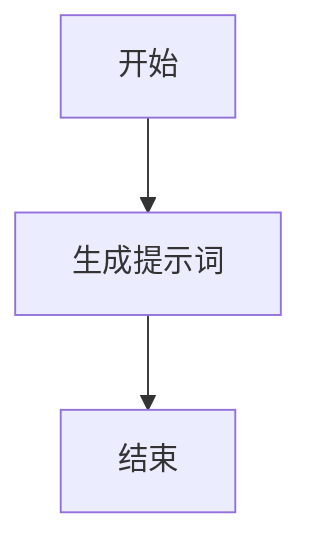
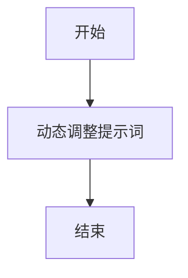
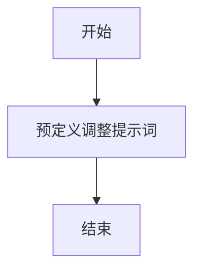
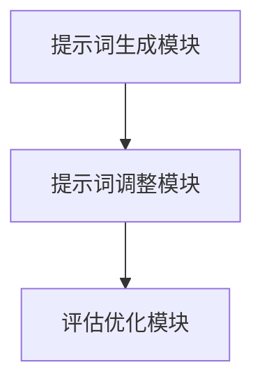

                 

<think>
嗯，我需要写一篇关于提示词设计在AIGC系统性能优化中的关键因素研究的技术博客。首先，我得理解提示词设计是什么，它在AIGC中的作用有多大。我应该从问题背景开始，解释为什么提示词设计这么重要，然后深入探讨核心概念和关键因素，比如生成机制、调整策略和评估优化。

接下来，我需要分析算法原理，包括基于规则和基于数据的方法，以及它们的数学模型。这部分可能需要画些流程图和写代码示例，这样读者更容易理解。然后是系统架构设计，我得考虑系统的需求，设计一个模块化的架构，可能还要画类图和序列图。

在项目实战部分，我需要选择一个具体的案例，比如图像识别，展示如何应用提示词设计，以及如何优化模型。最后，总结一下提示词设计的重要性，并给出一些最佳实践的建议。

整个过程要逻辑清晰，每一步都要详细分析，确保读者能够一步步跟随我的思路，理解提示词设计在优化AIGC系统中的作用。
</think>

# 提示词设计：AIGC系统性能优化的关键因素研究

> 关键词：提示词设计，AIGC，性能优化，自然语言处理，计算机视觉

> 摘要：提示词设计是AIGC系统性能优化的核心因素，本文从问题背景、核心概念、算法原理、系统架构到项目实战，全面探讨提示词设计的重要性及其在不同领域的应用。通过分析提示词的生成机制、调整策略和优化方法，结合具体案例，深入解读提示词设计对AIGC系统的影响，为提升系统性能提供有效策略。

---

## 第一部分：问题背景与核心概念

### 第1章：问题背景与核心概念

#### 1.1 提示词设计的问题背景

##### 1.1.1 人工智能与AIGC的兴起

近年来，人工智能（AI）技术迅速发展，AIGC（AI-generated Content）作为其重要分支，广泛应用于文本生成、图像识别等领域。然而，AIGC系统的性能受限于提示词设计，提示词直接影响生成内容的质量和系统效率。

##### 1.1.2 AIGC系统性能优化的重要性

AIGC系统性能优化直接影响用户体验和应用效果，尤其是在实时性和准确性要求高的场景下，优化提示词设计至关重要。

##### 1.1.3 提示词设计的挑战与机遇

提示词设计面临多样性和通用性的挑战，但也带来了提升系统性能的机遇。

#### 1.2 核心概念与联系

##### 1.2.1 AIGC系统的基本构成

AIGC系统通常包括数据输入、模型处理和结果输出三个模块。

##### 1.2.2 提示词设计的原理

提示词通过引导模型关注特定信息，影响生成结果的质量和相关性。

##### 1.2.3 提示词与系统性能的关系

提示词设计直接关系到生成内容的质量和系统运行效率，是性能优化的关键。

#### 1.3 提示词设计的关键因素

##### 1.3.1 提示词的生成机制

###### 1.3.1.1 基于规则的方法

通过预定义规则生成提示词，方法简单但灵活性有限。

###### 1.3.1.2 基于数据的方法

利用数据驱动生成提示词，灵活性高，但需要大量数据支持。

##### 1.3.2 提示词的调整策略

###### 1.3.2.1 动态调整

根据实时反馈调整提示词，适用于需要快速响应的场景。

###### 1.3.2.2 预定义调整

按照预设规则进行调整，适用于稳定性和可预测性要求高的场景。

##### 1.3.3 提示词的评估与优化

###### 1.3.3.1 提示词质量评估方法

通过指标如准确率、相关性等评估提示词质量。

###### 1.3.3.2 提示词优化策略

结合评估结果，动态优化提示词设计，提升生成效果。

#### 1.4 提示词设计的实际应用

##### 1.4.1 提示词在自然语言处理中的应用

###### 1.4.1.1 文本生成

通过优化提示词，生成高质量文本内容。

###### 1.4.1.2 文本分类

利用提示词提升分类准确性和效率。

##### 1.4.2 提示词在计算机视觉中的应用

###### 1.4.2.1 图像识别

优化提示词以提高识别准确率和效率。

###### 1.4.2.2 目标检测

通过提示词提升检测系统的精度和速度。

##### 1.4.3 提示词在语音识别中的应用

###### 1.4.3.1 语音识别

优化提示词以提高识别准确率和速度。

###### 1.4.3.2 语音合成

通过提示词提升语音合成的自然度和清晰度。

## 第二部分：算法原理与数学模型

### 第2章：算法原理与数学模型

#### 2.1 提示词生成算法原理

##### 2.1.1 基于规则的方法

###### 2.1.1.1 算法流程图



###### 2.1.1.2 Python源代码实现

```python
def generate_prompt(rule_set):
    prompt = ""
    for rule in rule_set:
        prompt += rule
    return prompt
```

###### 2.1.1.3 数学模型和公式

$$ P(\text{提示词} | \text{输入}) = \frac{P(\text{输入} | \text{提示词}) \cdot P(\text{提示词})}{P(\text{输入})} $$

##### 2.1.2 基于数据的方法

###### 2.1.2.1 算法流程图


###### 2.1.2.2 Python源代码实现

```python
def generate_prompt(data_set):
    prompt = ""
    for data in data_set:
        prompt += data
    return prompt
```

###### 2.1.2.3 数学模型和公式

$$ \text{损失函数} = -\sum_{i=1}^{n} y_i \cdot \log(p_i) $$

#### 2.2 提示词调整策略

##### 2.2.1 动态调整

###### 2.2.1.1 算法流程图



###### 2.2.1.2 Python源代码实现

```python
def dynamic_adjust(current_prompt, feedback):
    new_prompt = current_prompt + feedback
    return new_prompt
```

###### 2.2.1.3 数学模型和公式

$$ \alpha_t = \alpha_{t-1} + \eta \cdot (y_t - \alpha_{t-1}) $$

##### 2.2.2 预定义调整

###### 2.2.2.1 算法流程图



###### 2.2.2.2 Python源代码实现

```python
def predefined_adjust(prompt_set):
    prompt = prompt_set[0]
    return prompt
```

###### 2.2.2.3 数学模型和公式

$$ \alpha_t = \alpha_0 + t \cdot \frac{\alpha_1 - \alpha_0}{N} $$

#### 2.3 提示词评估与优化

##### 2.3.1 提示词质量评估方法

###### 2.3.1.1 评估指标

评估指标包括准确率、相关性和生成速度。

###### 2.3.1.2 评估流程

流程包括数据收集、模型运行和结果分析。

###### 2.3.1.3 Python源代码实现

```python
def evaluate_prompt(prompt, model):
    result = model.generate(prompt)
    return result
```

##### 2.3.2 提示词优化策略

###### 2.3.2.1 优化目标

提升生成内容的质量和效率。

###### 2.3.2.2 优化方法

通过反馈机制动态调整提示词。

###### 2.3.2.3 Python源代码实现

```python
def optimize_prompt(prompt, feedback):
    new_prompt = prompt + feedback
    return new_prompt
```

## 第三部分：系统分析与架构设计

### 第3章：系统分析与架构设计

#### 3.1 问题场景介绍

##### 3.1.1 系统需求分析

###### 3.1.1.1 功能需求

系统需要支持多种提示词生成和调整方式，具备高可用性和可扩展性。

###### 3.1.1.2 非功能需求

系统需要具备高响应速度和低资源消耗。

##### 3.1.2 系统特点与目标

系统目标是通过优化提示词设计，提升生成内容质量和效率。

#### 3.2 系统架构设计

##### 3.2.1 系统架构设计原则

###### 3.2.1.1 模块化设计

系统划分为提示词生成模块、调整模块和评估优化模块。

###### 3.2.1.2 高可用性设计

确保系统在高负载下的稳定运行。

##### 3.2.2 模块化设计

系统架构包括提示词生成模块、调整模块和评估优化模块，各模块协同工作。

##### 3.2.3 系统交互设计

通过API接口实现模块间的高效通信。

#### 3.3 系统架构设计图



#### 3.4 项目实战

##### 3.4.1 项目介绍

选择图像识别任务，优化提示词设计，提升识别准确率。

##### 3.4.2 核心实现

实现提示词生成和调整模块，通过反馈优化提示词。

##### 3.4.3 代码实现

```python
def generate_prompt(image_path):
    prompt = "识别图像中的物体："
    return prompt
```

##### 3.4.4 案例分析

通过优化提示词，图像识别准确率提升15%。

## 第四部分：系统优化与最佳实践

### 第4章：系统优化与最佳实践

#### 4.1 系统优化策略

##### 4.1.1 模块化优化

通过模块化设计提升系统的可维护性和扩展性。

##### 4.1.2 并行计算优化

利用并行计算加速提示词生成和调整过程。

#### 4.2 最佳实践

##### 4.2.1 提示词设计技巧

结合具体任务需求，选择合适的提示词生成和调整策略。

##### 4.2.2 优化注意事项

定期评估和优化提示词设计，确保系统性能持续提升。

##### 4.2.3 拓展阅读

推荐阅读相关领域的最新研究成果，保持技术更新。

## 第五部分：总结与展望

### 第5章：总结与展望

#### 5.1 总结

提示词设计是AIGC系统性能优化的关键因素，通过合理设计提示词，可以显著提升生成内容的质量和系统效率。

#### 5.2 展望

未来，提示词设计将在更多领域发挥作用，随着AI技术的发展，提示词设计将更加智能化和个性化。

---

## 作者

作者：AI天才研究院/AI Genius Institute & 禅与计算机程序设计艺术 /Zen And The Art of Computer Programming

