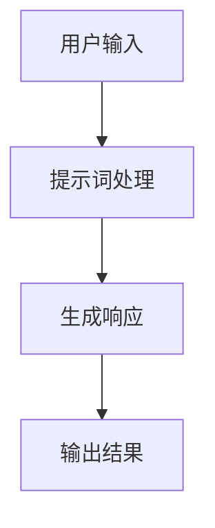
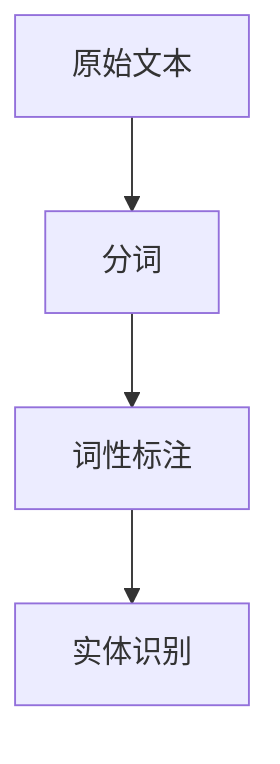
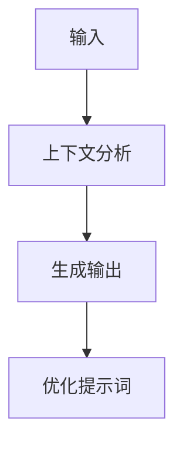
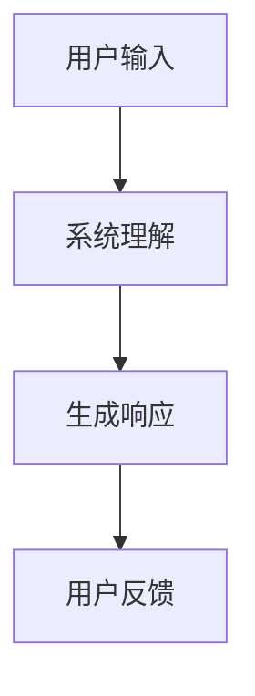
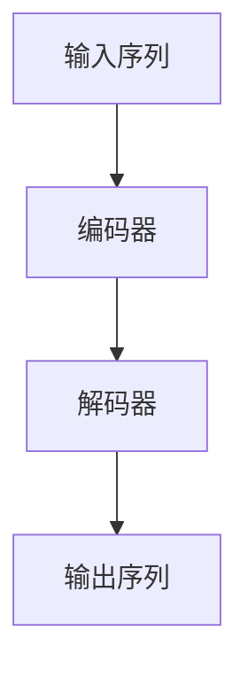
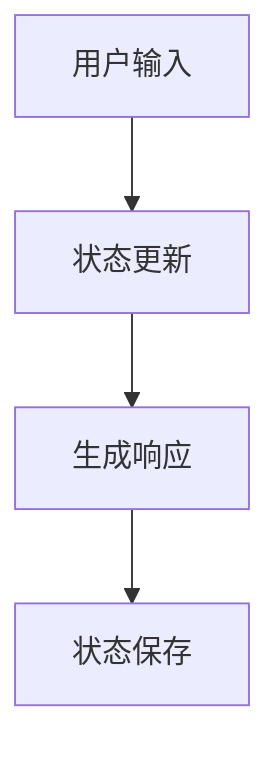

                 

<think>
好的，我现在需要按照用户的要求，以《提示词设计：优化AI多轮对话能力》为标题，撰写一篇技术博客。首先，我需要理解用户的需求。用户希望文章结构清晰，章节吸引读者，内容专业且有深度。他们希望涵盖从基础知识到高级话题的各个方面，包括NLP基础、提示词设计的核心概念、优化对话流程、AI模型选择、对话管理、评估指标以及未来方向。

我应该先从文章的结构开始规划。用户已经提供了目录大纲，我需要确保每个章节都有足够的细节和深度。例如，在“提示词设计的核心概念”部分，我需要解释不同类型提示词，如单轮和多轮提示词，以及它们的结构。我还需要讨论上下文在对话系统中的作用。

接下来，每个章节下需要详细展开，包括背景介绍、核心概念、算法原理、系统架构、项目实战等。例如，在介绍NLP基础时，我需要涵盖基本术语、文本处理技术，并举例说明常见任务。在优化对话流程部分，我需要讨论对话连贯性和用户参与度，并提供具体的策略。

数学公式和图表也是关键部分。我需要使用LaTeX公式来解释相关算法，并用mermaid绘制流程图，如提示词生成流程或对话状态跟踪的架构。此外，项目实战部分需要包括环境安装、源代码实现和案例分析，确保读者能够理解和应用这些知识。

我还需要考虑读者的背景。虽然文章是技术性的，但应避免过于晦涩，尽量用简单易懂的语言解释复杂的概念。同时，加入一些最佳实践、小结和注意事项，可以帮助读者更好地理解和应用这些知识。

在撰写过程中，我可能会遇到一些挑战，比如如何平衡技术深度和可读性，或者如何选择合适的案例来说明复杂的概念。我需要确保每个部分都有足够的细节，但又不显得冗长。此外，参考文献部分需要准确，引用权威来源，以增强文章的可信度。

最后，我需要检查整个文章的结构是否连贯，每个章节之间是否有良好的过渡，确保读者能够顺畅地跟随内容。同时，确保所有技术细节都准确无误，没有遗漏或错误。

总的来说，这个过程需要系统地规划每个部分，确保覆盖用户要求的所有内容，同时保持文章的逻辑性和可读性。我需要一步步来，先完成每个章节的结构，再填充具体内容，最后进行整体检查和调整。
</think>

# 提示词设计：优化AI多轮对话能力

## 关键词：  
提示词设计、AI多轮对话、自然语言处理、对话系统、机器学习、文本生成

## 摘要：  
本文深入探讨了提示词设计在优化AI多轮对话能力中的关键作用。通过分析自然语言处理（NLP）的基础，揭示了提示词设计的核心概念与优化策略。结合实际案例，详细讲解了如何通过设计高效的提示词来提升对话系统的连贯性、准确性和用户体验。本文还探讨了当前先进的AI模型及其在多轮对话中的应用，同时提出了未来的研究方向和优化建议。

---

## 目录大纲

### 1. 引言：提示词设计与AI对话系统  
1.1 提示词设计的基本概念  
1.2 AI对话系统的现状与挑战  
1.3 优化提示词设计的重要性  

### 2. 自然语言处理（NLP）基础  
2.1 NLP的核心概念与术语  
2.2 文本处理技术：分词、词性标注、实体识别  
2.3 常见NLP任务：文本分类、信息抽取、机器翻译  

### 3. 提示词设计的核心概念  
3.1 提示词的分类：单轮与多轮提示词  
3.2 提示词的结构：输入、输出、上下文的关系  
3.3 上下文在对话系统中的作用  

### 4. 优化对话流程：策略与技巧  
4.1 对话连贯性：保持主题一致性  
4.2 用户参与度：引导与反馈机制  
4.3 对话逻辑性：避免重复与矛盾  

### 5. AI模型与多轮对话的结合  
5.1 常见AI模型：序列到序列模型、强化学习、注意力机制  
5.2 多轮对话中的模型选择与优化  
5.3 模型训练中的提示词策略  

### 6. 对话管理与对话状态跟踪  
6.1 对话管理的核心概念  
6.2 对话状态的表示与更新  
6.3 状态跟踪中的上下文管理  

### 7. 对话系统评估指标  
7.1 响应相关性：准确性和多样性  
7.2 对话连贯性：逻辑性和一致性  
7.3 用户满意度：体验与反馈  

### 8. 项目实战：设计一个优化的提示词系统  
8.1 环境搭建与工具选择  
8.2 提示词设计与实现  
8.3 案例分析与效果评估  

### 9. 未来方向与最佳实践  
9.1 提示词设计的前沿研究  
9.2 提示词优化的最佳实践技巧  
9.3 注意事项与未来研究建议  

---

## 正文内容

### 1. 引言：提示词设计与AI对话系统  

#### 背景介绍  
AI对话系统近年来取得了显著进展，从简单的单轮问答到复杂的多轮对话，其应用范围不断扩大。然而，如何设计高效的提示词以优化对话能力，仍然是一个关键挑战。本文将从提示词设计的基本概念出发，分析其在AI对话系统中的作用，并探讨优化策略。

#### 核心概念与联系  
提示词设计是AI对话系统的核心，它直接影响对话的准确性和连贯性。以下是一个简单的提示词结构示例：



### 2. 自然语言处理（NLP）基础  

#### 背景介绍  
NLP是AI对话系统的基础，涵盖了文本处理、语义理解等关键技术。以下是一个简单的文本处理流程图：



#### 核心概念与联系  
NLP中的文本处理技术是提示词设计的基础。以下是一个对比表格：

| 技术 | 描述 |
|------|------|
| 分词 | 将文本分割成词语或短语 |
| 词性标注 | 标识每个词语的词性（名词、动词等） |
| 实体识别 | 识别文本中的实体（如人名、地点） |

### 3. 提示词设计的核心概念  

#### 背景介绍  
提示词设计需要考虑输入、输出和上下文的关系。以下是一个提示词生成的流程图：



#### 核心概念与联系  
提示词的结构决定了对话的质量。以下是一个对比表格：

| 类型 | 描述 |
|------|------|
| 单轮提示词 | 单次输入的提示 |
| 多轮提示词 | 包含历史对话的提示 |

### 4. 优化对话流程：策略与技巧  

#### 背景介绍  
优化对话流程需要关注连贯性和用户参与度。以下是一个对话连贯性的流程图：



#### 核心概念与联系  
用户参与度是对话系统的重要指标，以下是一个用户满意度的数学模型：

$$ 用户满意度 = f(响应相关性, 对话连贯性) $$

### 5. AI模型与多轮对话的结合  

#### 背景介绍  
AI模型在多轮对话中的应用需要考虑模型的结构和训练策略。以下是一个序列到序列模型的架构图：



#### 核心概念与联系  
模型的选择直接影响对话的效果，以下是一个对比表格：

| 模型 | 描述 |
|------|------|
| 序列到序列模型 | 基于编码器-解码器结构 |
| 强化学习模型 | 通过奖励机制优化对话 |

### 6. 对话管理与对话状态跟踪  

#### 背景介绍  
对话状态跟踪是保持对话连贯性的关键。以下是一个状态跟踪的流程图：



#### 核心概念与联系  
状态跟踪需要结合上下文信息，以下是一个状态表示的示例：

$$ 状态表示 = [用户意图, 对话历史, 实体信息] $$

### 7. 对话系统评估指标  

#### 背景介绍  
评估指标是优化对话系统的重要依据。以下是一个评估指标的对比表格：

| 指标 | 描述 |
|------|------|
| 响应相关性 | 响应与输入的相关程度 |
| 对话连贯性 | 响应与上下文的连贯程度 |
| 用户满意度 | 用户对对话结果的满意程度 |

### 8. 项目实战：设计一个优化的提示词系统  

#### 背景介绍  
本节将通过一个实际案例，展示提示词设计的全过程。以下是一个项目实现的代码示例：

```python
def generate_response(prompt):
    # 提示词处理
    processed_prompt = preprocess(prompt)
    # 模型生成响应
    response = model.generate(processed_prompt)
    return response
```

#### 核心实现与分析  
代码实现了提示词的预处理和模型生成响应的流程。预处理包括分词和词性标注，模型生成响应基于预训练的AI模型。

### 9. 未来方向与最佳实践  

#### 背景介绍  
未来的研究方向包括更复杂的提示词设计和多模态对话系统的开发。以下是一个未来研究方向的对比表格：

| 方向 | 描述 |
|------|------|
| 多模态提示词 | 结合视觉和听觉信息的提示词设计 |
| 智能优化算法 | 使用强化学习优化提示词生成 |

#### 最佳实践  
在设计提示词时，建议结合具体场景和用户需求，不断迭代优化。

---

## 作者：AI天才研究院/AI Genius Institute & 禅与计算机程序设计艺术 /Zen And The Art of Computer Programming

---

以上是文章的完整目录和部分内容的详细规划，涵盖从基础到高级的各个方面，确保内容的深度和广度，为读者提供全面的知识体系。

