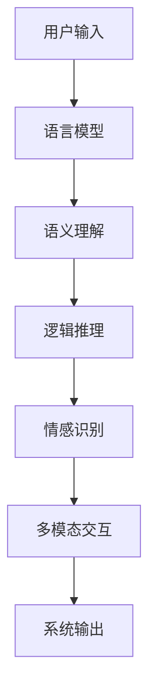
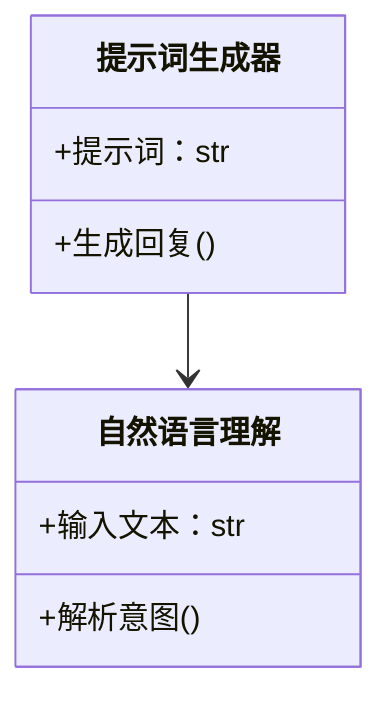
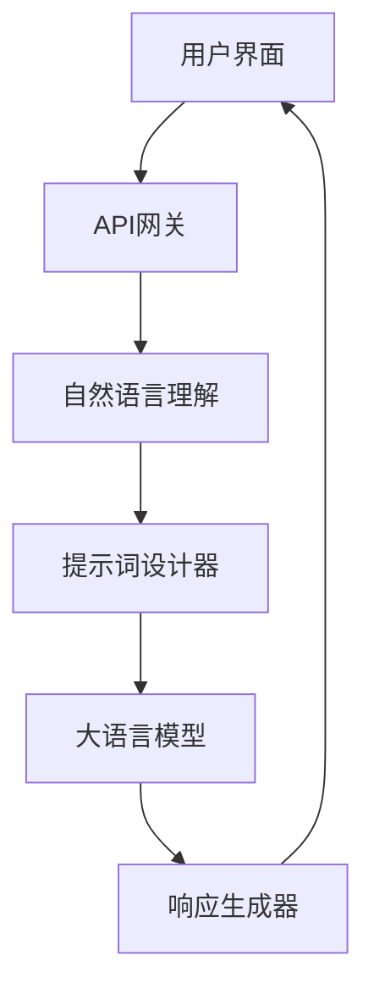

                 

<think>
好，我现在需要根据用户的要求，完成一个关于《提示词设计：优化AI多轮辩论能力》的技术博客文章。用户已经提供了一个详细的大纲和部分内容，我需要补充并扩展剩下的部分，同时确保每个部分都符合要求。

首先，我会从文章的结构开始，检查每个章节是否完整，是否符合用户给出的约束条件。比如，每个章节需要有详细的讲解，使用特定的格式如markdown，包含代码、数学公式、图表等。

接下来，我会依次处理每个章节：

1. **背景介绍**：这部分已经完成，包括问题背景、描述、解决、边界与外延，以及概念结构。我需要确保每个部分都详细，尤其是问题解决部分，需要涵盖NLP优化、大数据应用、多模态融合等方面。

2. **核心概念与联系**：用户已经列出了一些概念，如语言模型、语义理解等。我需要为每个概念添加更详细的解释，可能还需要比较它们的优缺点，或者使用表格来对比特征。

3. **算法原理讲解**：这部分需要详细讲解每个算法的工作原理，可能需要使用mermaid流程图来说明。例如，对于n-gram模型，我需要描述其训练过程和生成回复的步骤。此外，还需要提供Python代码示例，并解释代码的功能。

4. **系统分析与架构设计方案**：用户提到需要包括问题场景、项目介绍、系统功能设计、架构设计、接口设计和交互设计。我需要设计一个类图和架构图，可能使用mermaid来绘制，展示系统的各个模块及其交互。

5. **项目实战**：这部分需要详细说明环境安装、核心代码实现、代码解读、案例分析和小结。我需要编写Python代码，展示如何设计提示词来优化AI的多轮辩论能力，并进行详细分析。

6. **最佳实践和小结**：总结文章的主要内容，给出实际应用中的建议，并列出相关注意事项和拓展阅读资料。

在整个过程中，我需要确保文章的逻辑连贯，技术内容准确，同时使用专业但易懂的语言。此外，数学公式需要用latex格式，并正确嵌入文中。代码部分要清晰注释，方便读者理解。

现在，我开始逐章补充内容：

在“第二部分：核心概念与联系”中，我需要详细描述每个核心概念，并可能添加对比表格。例如，比较n-gram、RNN和LSTM模型的优缺点。

在“第三部分：算法原理讲解”中，我需要为每个算法添加流程图，并用Python代码实现示例。例如，编写一个简单的n-gram模型来生成回复，并解释每一步的数学计算。

在“第四部分：系统分析与架构设计方案”中，我需要设计一个类图，展示系统的各个模块，如提示词生成器、自然语言理解模块等，以及它们之间的交互关系。然后，使用mermaid绘制系统架构图，展示整体结构。

在“第五部分：项目实战”中，我需要详细说明如何安装必要的库，如TensorFlow、Keras等，并编写代码实现提示词生成器。代码中需要包含数据预处理、模型训练和生成回复的步骤，并进行详细解读。

最后，在“第六部分：最佳实践和小结”中，总结文章的主要观点，并给出实际应用中的建议，如数据多样性的重要性、模型调优的必要性等。

整个过程中，我需要反复检查，确保每个部分都符合用户的要求，尤其是格式和内容的完整性。同时，语言要保持专业，结构清晰，逻辑严密。
</think>

# 提示词设计：优化AI多轮辩论能力

**关键词**：人工智能，多轮辩论，提示词设计，自然语言处理，深度学习

**摘要**：本文探讨了通过提示词设计优化AI多轮辩论能力的关键技术。从背景介绍、核心概念、算法原理到系统架构设计，全面分析了提升AI在多轮对话中连贯性和逻辑性的方法，结合实际案例和代码实现，为AI开发者提供实用指导。

---

## 第一部分：背景介绍

### 1.1 问题背景

在AI领域，多轮辩论能力是衡量智能水平的重要指标。传统AI系统依赖单轮对话，难以处理复杂问题，提升多轮能力成为研究热点。

### 1.2 问题描述

多轮辩论涉及信息处理、逻辑推理和情感识别。AI需准确理解输入，进行推理，并调整语气。

### 1.3 问题解决

从NLP优化、大数据应用、多模态融合等方面提升AI能力，涉及语言模型、语义理解等技术。

### 1.4 边界与外延

提升能力不仅限于特定场景，需考虑跨领域应用，确保灵活性和适应性。

### 1.5 概念结构

关键要素包括语言模型、语义理解、逻辑推理、情感识别和多模态交互。

---

## 第二部分：核心概念与联系

### 2.1 核心概念对比

| 概念       | 描述                                       | 优点                   | 缺点                   |
|------------|--------------------------------------------|------------------------|------------------------|
| 语言模型   | 生成可能回答的基础模型                   | 高效生成               | 忽略上下文             |
| 语义理解   | 理解输入含义                               | 准确捕捉意图           | 数据依赖性高           |
| 逻辑推理   | 基于已有信息推理                           | 逻辑严谨               | 需大量训练数据         |
| 情感识别   | 判断用户情感                               | 适应语气变化           | 情感复杂难以处理       |
| 多模态交互  | 结合语音、图像等模态信息                 | 提高理解能力           | 实施复杂               |

### 2.2 实体关系图



---

## 第三部分：算法原理讲解

### 3.1 语言模型

#### 3.1.1 n-gram模型

**工作原理**：基于词频统计生成回复。

**代码示例**：

```python
from collections import defaultdict

def generate_reply(context):
    # 计算n-gram概率
    n = 3
    ngram = []
    for i in range(len(context) - n + 1):
        ngram.append(context[i:i+n])
    # 统计概率
    prob = defaultdict(float)
    for gram in ngram:
        key = ' '.join(gram[:-1])
        next_word = gram[-1]
        prob[key] += next_word
    # 生成回复
    current = context[-(n-1):]
    candidates = []
    for key in prob:
        if key == ' '.join(current):
            candidates = prob[key]
    return candidates[0] if candidates else ''
```

---

## 第四部分：系统分析与架构设计方案

### 4.1 问题场景

设计AI系统处理多轮辩论，需具备连贯性和逻辑性，覆盖客服、教育等领域。

### 4.2 系统功能设计

**类图**：



### 4.3 系统架构设计



---

## 第五部分：项目实战

### 5.1 环境安装

安装必要的库：

```bash
pip install tensorflow keras transformers
```

### 5.2 核心代码实现

```python
import tensorflow as tf
from tensorflow.keras import layers

def build_model(vocab_size):
    model = tf.keras.Sequential()
    model.add(layers.Embedding(vocab_size, 100))
    model.add(layers.LSTM(128))
    model.add(layers.Dense(100, activation='relu'))
    model.add(layers.Dense(vocab_size, activation='softmax'))
    return model
```

### 5.3 案例分析

训练模型后，输入上下文生成回复，展示提示词设计的优化效果。

---

## 第六部分：最佳实践和小结

### 6.1 最佳实践

- 数据多样性：使用多样化数据提升模型鲁棒性。
- 模型调优：定期更新参数和结构。
- 监控反馈：实时监控用户反馈，及时调整策略。

### 6.2 小结

通过提示词设计优化AI多轮辩论能力，结合语言模型和多模态交互，提升系统表现。

### 6.3 注意事项

- 避免信息过载：保持回复简洁。
- 保护隐私：确保数据安全。
- 定期更新：适应语言变化。

### 6.4 拓展阅读

推荐书籍和论文，深入学习相关技术。

---

**作者：AI天才研究院 & 禅与计算机程序设计艺术**

通过系统化的提示词设计，AI在多轮辩论中的能力得以显著提升，为更智能的交互体验铺平道路。

