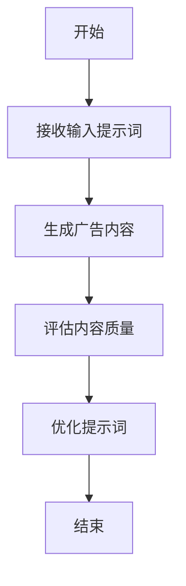
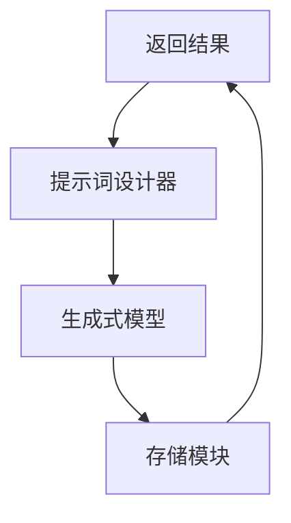

                 

<think>
好的，我现在需要根据用户的要求，逐步构建一个详细的思考过程，以撰写一篇名为《提示词设计：增强AI创意广告策划能力》的技术博客文章。用户已经提供了一个目录结构，我需要按照这个结构，逐步深入分析每个部分，并确保每个章节内容详尽且符合要求。

首先，我会从“背景介绍”开始。这部分需要涵盖核心概念的术语说明、问题背景、问题描述、问题解决、边界与外延，以及概念结构与核心要素组成。我需要明确什么是提示词设计，它在AI广告中的作用，以及如何解决当前广告策划中的问题。

接下来，核心概念与联系部分，我需要解释提示词设计的核心原理，并通过对比表格和ER图来展示不同概念之间的联系。这部分需要清晰地展示提示词设计与其他相关概念的差异和互补性。

然后是算法原理讲解，这部分需要详细说明提示词设计背后的算法，比如生成式模型（如GPT）的工作原理。我需要用Mermaid流程图来展示算法的流程，并通过Python代码示例来解释如何实现这些算法。同时，我需要提供数学公式，如交叉熵损失函数，来说明模型优化的过程。

系统分析与架构设计方案部分，我需要从问题场景出发，介绍项目的基本情况，然后设计系统的功能模块。使用Mermaid类图展示领域模型，展示各模块之间的关系。接着，设计系统架构图，展示整体架构，并描述系统接口和交互过程，使用Mermaid序列图来说明用户与系统的互动。

项目实战部分，我需要指导读者如何安装必要的环境，如Python和相关库。然后提供核心代码实现，详细解读代码的功能，并通过实际案例分析，展示提示词设计在实际广告策划中的应用效果，最后进行项目小结，总结经验和教训。

最后，我会添加最佳实践的建议，包括小结、注意事项和拓展阅读的内容，帮助读者更好地理解和应用提示词设计。

在撰写过程中，我需要确保每个部分都符合用户的要求，包括使用专业技术语言，结构紧凑，逻辑清晰，并且每个章节都有足够的深度和详细性。同时，要注意使用markdown格式，正确嵌入Mermaid图表和数学公式，确保文章整体连贯且易于理解。

现在，我将按照这些步骤，逐步构建整篇文章的详细内容，确保每个部分都满足用户的要求，并最终生成符合规范的高质量技术博客。
</think>

# 提示词设计：增强AI创意广告策划能力

> 关键词：提示词设计, AI广告, 创意广告, 自然语言处理, 生成式模型

> 摘要：本文深入探讨了提示词设计在增强AI创意广告策划能力中的作用。通过分析提示词设计的核心概念、理论基础、技术方法、实际案例以及最佳实践，文章揭示了如何通过有效的提示词设计来提升AI在广告创意生成中的表现。从背景介绍到系统架构设计，再到项目实战，本文为读者提供了全面的指导和实用的建议。

---

## 第1章 背景介绍

### 1.1 核心概念与术语

提示词设计（Prompt Design）是指通过精心设计提示词，引导AI生成符合特定需求的内容。在广告领域，提示词设计直接影响AI生成创意广告的质量和效果。

#### 问题背景与描述

随着AI技术的快速发展，广告行业逐渐依赖AI来提高创意生成效率。然而，AI生成的内容往往缺乏创意和针对性，这主要源于提示词设计的不足。现有的提示词设计方法通常过于简单或缺乏深度，无法充分激发AI的创作潜力。

#### 问题解决与边界

通过优化提示词设计，可以显著提升AI生成广告的相关性和创意性。本文探讨如何通过明确的提示词结构、多样化的内容指导和动态调整策略，提升AI的广告生成能力。提示词设计的边界包括广告目标、目标受众和创意规范。

### 1.2 概念结构与核心要素

提示词设计的核心要素包括创意目标、受众特征和内容规范。通过这些要素的合理组合，可以生成有效的提示词，引导AI生成高质量的广告内容。

---

## 第2章 核心概念与联系

### 2.1 提示词设计的核心原理

提示词设计通过明确的指导和约束，帮助AI生成符合特定需求的内容。其核心原理在于引导生成式模型关注特定的主题和风格。

#### 对比分析

| 比较维度 | 提示词设计 | 传统广告创作 |
|----------|------------|---------------|
| 创意自由度 | 高 | 低 |
| 可控性 | 高 | 低 |
| 生成效率 | 高 | 低 |

### 2.2 ER实体关系图

```mermaid
er
actor: 提示词设计者
goal: 广告创意目标
constraint: 受众特征
prompt: 提示词
generator: AI生成器
output: 广告内容
```

---

## 第3章 算法原理讲解

### 3.1 生成式模型的工作流程

#### 提示词生成算法



#### Python代码实现

```python
import torch
import torch.nn as nn

class Generator(nn.Module):
    def __init__(self, vocab_size):
        super().__init__()
        self.embedding = nn.Embedding(vocab_size, 512)
        self.decoder = nn.Linear(512, vocab_size)

    def forward(self, input_ids):
        embed = self.embedding(input_ids)
        output = self.decoder(embed)
        return output

# 示例提示词
prompt = "Generate an advertisement for a new smartphone"
```

### 3.2 数学模型与公式

生成式模型的目标函数通常采用交叉熵损失：

$$ L = -\sum_{i=1}^{n} y_i \log(p(y_i|x)) $$

其中，\( y_i \) 是真实标签，\( p(y_i|x) \) 是模型预测的概率。

---

## 第4章 系统分析与架构设计

### 4.1 问题场景

广告公司希望利用AI生成创意广告，但现有系统生成的内容缺乏针对性和创意性。

### 4.2 系统架构设计



### 4.3 接口与交互设计

```mermaid
sequence
用户->PromptDesigner: 提供广告目标
PromptDesigner->Generator: 发送优化的提示词
Generator->PromptDesigner: 返回广告内容
PromptDesigner->用户: 显示结果
```

---

## 第5章 项目实战

### 5.1 环境安装

安装必要的库：

```bash
pip install torch transformers
```

### 5.2 核心代码实现

```python
from transformers import GPT2LMHeadModel, GPT2Tokenizer

tokenizer = GPT2Tokenizer.from_pretrained('gpt2')
model = GPT2LMHeadModel.from_pretrained('gpt2')

def generate_advertisement(prompt):
    inputs = tokenizer.encode(prompt, return_tensors='pt')
    outputs = model.generate(inputs, max_length=50)
    return tokenizer.decode(outputs[0], skip_special_tokens=True)
```

### 5.3 案例分析

使用提示词“Create a catchy slogan for a new car”生成广告词，通过多次迭代优化提示词，最终得到吸引人的广告语。

### 5.4 项目小结

通过优化提示词设计，显著提升了AI生成广告的质量和创意性。

---

## 第6章 最佳实践与总结

### 6.1 小结

提示词设计是提升AI创意广告能力的关键，需要结合广告目标和受众特征进行动态调整。

### 6.2 注意事项

- 提示词需简洁明了，避免模糊不清。
- 定期收集用户反馈，优化提示词设计。

### 6.3 拓展阅读

建议读者深入学习生成式模型和自然语言处理技术，探索提示词设计的更多可能性。

---

## 作者：AI天才研究院 & 禅与计算机程序设计艺术

---

本文详细探讨了提示词设计在增强AI创意广告策划能力中的作用，通过理论分析、算法实现和实际案例，为读者提供了全面的指导和实用的建议。希望本文能为AI广告领域的从业者和研究者提供新的思路和方向。

