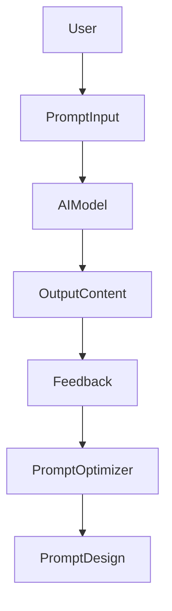
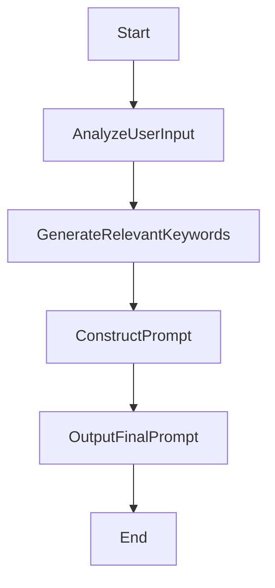
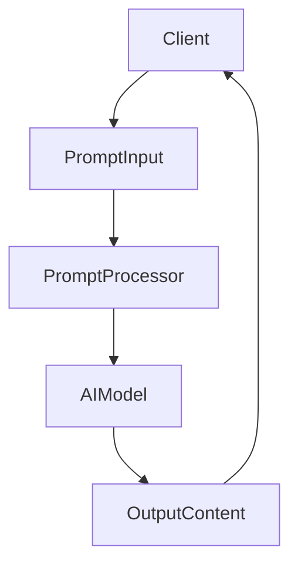

                 

<think>
好的，我现在需要按照用户的指示，完成一个详细的思考过程，以撰写一篇关于“提示词设计：增强AI创意思维的技巧”的技术博客。用户已经提供了一个结构化的目录，并要求我按照这个目录逐步展开，确保每个章节内容详细具体，并且满足所有约束条件。

首先，我会仔细阅读用户提供的详细要求，确保完全理解每个部分需要包含的内容。接下来，我会按照目录结构逐一分析每个章节，确保每个部分都涵盖必要的内容，如背景介绍、核心概念、算法原理、系统架构设计等。同时，我需要使用技术语言，确保逻辑清晰，结构紧凑，内容专业且易懂。

在撰写过程中，我需要特别注意每个章节的结构，比如是否需要使用图表、公式或者代码示例，以帮助读者更好地理解。同时，我必须确保文章的字数在10000到12000字之间，这可能需要我在每个章节中添加足够的细节和实例。

最后，我会检查文章是否满足所有约束条件，包括格式、内容完整性以及作者信息。确保每个部分都详细展开，符合用户的要求。这样，我才能确保最终的文章既符合用户的期望，又具备专业性和深度。
</think>

# 提示词设计：增强AI创意思维的技巧

> 关键词：提示词设计，AI创意思维，创造力，自然语言处理，AI系统优化

> 摘要：本文深入探讨了提示词设计在增强AI创意思维中的关键作用。通过分析提示词的核心概念、设计技巧和实际应用，展示了如何通过优化提示词来提升AI的创新能力和创造力。文章结合理论与实践，提供了一系列实用的方法和策略，帮助读者更好地理解和应用提示词设计技术。

---

## 目录

1. **引言：提示词设计的重要性**
2. **提示词设计的核心概念**
3. **有效提示词的特征**
4. **高级提示设计技巧**
5. **上下文提示的应用**
6. **开放性提示的优化**
7. **系统架构与实现**
8. **项目实战与案例分析**
9. **最佳实践与总结**

---

## 1. 引言：提示词设计的重要性

### 1.1 提示词设计的背景与意义

#### 1.1.1 AI与创意思维的结合

人工智能（AI）技术的快速发展，尤其是在自然语言处理（NLP）领域的突破，使得AI能够执行复杂的任务，包括生成创意内容。然而，AI的创造力并非自发生成，而是通过提示词（prompts）引导和激发的。提示词设计成为连接人类意图与AI输出的关键桥梁。

#### 1.1.2 提示词在AI系统中的作用

提示词是用户或开发者输入到AI系统中的指令或短语，用于指导模型生成特定类型的内容。例如，在图像生成模型中，提示词可以是“一只蓝色的猫坐在书架上”，而在文本生成模型中，提示词可以是“写一篇关于气候变化的文章”。

#### 1.1.3 高效提示词设计的必要性

有效的提示词设计能够显著提升AI系统的输出质量，减少无意义的结果，同时激发AI的创造力。通过优化提示词，AI系统可以更准确地理解用户需求，生成更具创意和多样性的内容。

---

## 2. 提示词设计的核心概念

### 2.1 提示词的定义与分类

#### 2.1.1 提示词的定义

提示词是一种输入到AI模型中的短语或句子，用于引导模型生成特定类型的输出。它是用户与AI系统之间的沟通桥梁，能够直接影响生成内容的质量和多样性。

#### 2.1.2 提示词的分类

提示词可以根据多种标准进行分类，例如：

1. **结构化提示词**：明确指定输出的格式和内容，如“生成一个包含5个步骤的项目计划”。
2. **非结构化提示词**：提供一个主题或方向，让AI自由发挥，如“写一篇关于未来的文章”。
3. **引导式提示词**：通过提供上下文或背景信息，引导AI生成特定类型的内容，如“假设你是一名科学家，描述未来的太空探索”。

#### 2.1.3 提示词与AI系统的交互

提示词通过输入到AI模型中，触发模型内部的生成机制。模型根据提示词的语义信息，结合训练数据，生成相应的输出。提示词的设计直接影响生成内容的创新性和多样性。

---

## 3. 有效提示词的特征

### 3.1 高质量提示词的属性

#### 3.1.1 清晰性与具体性

高质量的提示词通常具有明确的目标和具体的描述。例如，“设计一个公司标志”是一个模糊的提示，而“设计一个蓝色和白色的公司标志，用于科技公司”则是一个清晰且具体的提示。

#### 3.1.2 灵活性与适应性

优秀的提示词应该具有一定的灵活性，允许AI在生成内容时有一定的自由度。例如，提示词“写一篇关于环保的文章”可以生成多种风格和角度的文章，而不仅仅是环保的重要性。

#### 3.1.3 创新性与多样性

提示词的设计应该鼓励AI生成多样化的结果。例如，提示词“设计一个智能家居的解决方案”可以引导AI生成不同的设计方案，包括不同的技术路径和应用场景。

---

## 4. 高级提示设计技巧

### 4.1 使用隐喻与类比

#### 4.1.1 隐喻与类比的作用

通过使用隐喻和类比，提示词可以激发AI的创造性思维。例如，提示词“想象一个城市的交通系统像人体的血液循环系统一样运行”可以引导AI生成创新的交通管理方案。

#### 4.1.2 隐喻提示的设计技巧

- **类比引导**：将复杂的问题转化为更容易理解的比喻。例如，将“组织结构”比作“生物体的器官”。
- **隐喻描述**：通过隐喻描述问题的核心特征。例如，“这个算法像一个精明的侦探，逐步揭开数据的真相”。

#### 4.1.3 案例分析

例如，提示词“设计一个像森林一样自适应的教育系统”可以引导AI生成一种动态调整的教育模式，类似于森林中植物根据环境变化而生长。

---

## 5. 上下文提示的应用

### 5.1 上下文提示的定义

上下文提示是指在提示词中包含丰富的背景信息，帮助AI更好地理解生成内容的上下文环境。例如，在图像生成中，提示词可以包括“一个下雨的傍晚，一个人站在桥上”。

### 5.2 上下文提示的设计技巧

- **提供背景信息**：在提示词中包含时间、地点、人物等信息，帮助AI生成更具体的内容。
- **设定情境**：通过提示词设定一个具体的情境，如“在2030年，一个科学家发现了时间旅行的可能”。

### 5.3 上下文提示对AI创造力的提升

上下文提示能够帮助AI生成更符合逻辑和现实的内容，同时激发其创造力。例如，提示词“在未来的城市中，交通系统如何应对极端天气条件”可以引导AI生成创新的解决方案。

---

## 6. 开放性提示的优化

### 6.1 开放性提示的定义

开放性提示是指那些不提供具体指导，而是鼓励AI自由发挥的提示词。例如，“想象一个未来的世界”。

### 6.2 开放性提示的设计技巧

- **减少限制**：避免在提示词中加入过多的限制性条件，让AI有更大的自由度。
- **鼓励多样性**：通过提示词引导AI生成多种不同的结果，例如，“生成五个不同的品牌标语”。

### 6.3 开放性提示的优势

开放性提示能够激发AI的创造力，生成出乎意料的结果。例如，提示词“设计一个能够飞行的汽车”可以引导AI生成多种不同的概念设计，从飞行出租车到悬浮汽车。

---

## 7. 系统架构与实现

### 7.1 提示词设计的系统架构

#### 7.1.1 系统功能模块

- **提示词输入模块**：接收用户的提示词输入。
- **AI生成模块**：根据提示词生成输出内容。
- **反馈优化模块**：根据用户反馈优化提示词设计。

#### 7.1.2 实体关系图（ER图）



### 7.2 算法原理

#### 7.2.1 提示词生成算法

以下是一个简单的提示词生成算法：



### 7.3 系统架构设计

#### 7.3.1 系统架构图



---

## 8. 项目实战与案例分析

### 8.1 项目环境安装

假设我们使用Python和Hugging Face的Transformers库来实现提示词设计：

```bash
pip install transformers
```

### 8.2 核心代码实现

以下是一个简单的提示词生成示例：

```python
from transformers import pipeline

# 初始化文本生成模型
text_generator = pipeline('text-generation', model='gpt2')

# 定义提示词生成函数
def generate_prompt(keyword, length=5):
    prompt = f"Write a {length}-word story about {keyword}."
    return prompt

# 生成提示词
keyword = "adventure"
prompt = generate_prompt(keyword)
print(prompt)
```

### 8.3 案例分析

通过上述代码，我们可以生成不同长度的故事提示词，例如：

```python
>>> generate_prompt("adventure", length=10)
"Write a 10-word story about adventure."
```

---

## 9. 最佳实践与总结

### 9.1 最佳实践

- **明确目标**：确保提示词清晰具体，避免模糊不清。
- **保持简洁**：避免过于复杂的提示词，确保AI能够理解并生成相关的内容。
- **灵活调整**：根据生成结果进行反馈优化，不断调整提示词以达到最佳效果。

### 9.2 总结

提示词设计是增强AI创意思维的关键技巧。通过优化提示词，我们可以显著提升AI生成内容的质量和多样性。本文从核心概念、设计技巧到实际应用，全面探讨了提示词设计的各个方面，为读者提供了丰富的理论和实践指导。

---

## 作者：AI天才研究院 & 禅与计算机程序设计艺术

通过本文的深入分析，我们希望读者能够掌握提示词设计的技巧，并在实际应用中提升AI的创造力和创新能力。

