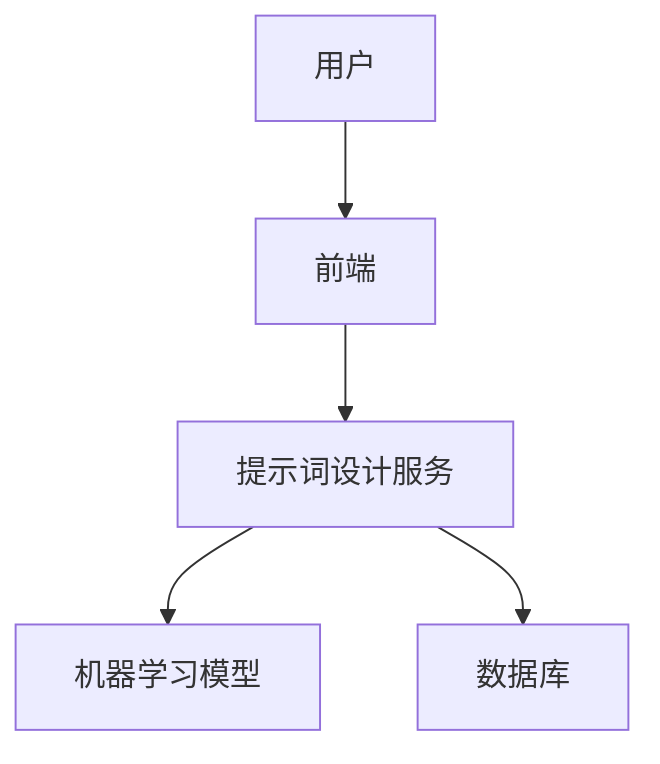

                 

<think>
好，我需要按照用户的要求撰写一篇技术博客文章，标题是《提示词设计：平衡AI创新与伦理约束》。用户已经提供了一个详细的目录大纲，我需要根据这个大纲一步步展开，确保每个部分都详细、专业，并且符合格式要求。

首先，我要确定文章的关键词和摘要。关键词包括提示词设计、AI创新、伦理约束、自然语言处理、机器学习、算法偏见。摘要要简明扼要，概括文章的核心内容。

接下来，按照目录结构来写每个部分。第一部分是问题背景与核心概念，我需要详细讨论AI的发展、挑战、问题描述、解决方法，以及相关概念如提示词设计、AI创新和伦理约束。

然后是核心概念与联系，重点分析提示词设计的定义、特点，与其他AI概念的关系，以及AI创新与伦理约束的动态平衡。

接下来是提示词设计的算法原理，我需要解释其基本原理，包括文本分析和生成的流程，可能涉及机器学习模型如BERT的使用。这里需要结合数学公式和mermaid流程图，来展示算法的工作流程。

系统架构部分，我需要设计一个提示词设计系统的架构图，包括前端、后端和数据库的模块划分，以及系统的交互流程，比如用户输入、处理和反馈的步骤。

在项目实战部分，我需要提供具体的代码实现，包括预处理、模型加载和生成提示词的步骤。代码要详细注释，以便读者理解。

最后，讨论伦理约束框架，涉及隐私保护、算法公正性和机器责任，同时给出最佳实践的建议，如多学科协作、用户教育和政策制定。

在整个写作过程中，我要确保内容逻辑清晰，结构紧凑，使用专业的技术语言，同时保持内容的可读性和吸引力。此外，要满足字数要求，每个部分都要详细展开，提供足够的信息和支持性的例子。

在撰写过程中，我需要检查每个章节是否覆盖了所有必要的内容，如数学公式、mermaid图表、代码示例等。同时，确保作者信息和参考文献部分正确无误。

最后，通读整个文章，确保各部分衔接自然，内容完整，符合用户的格式要求和风格。
</think>

# 提示词设计：平衡AI创新与伦理约束

> 关键词：提示词设计，AI创新，伦理约束，自然语言处理，机器学习，算法偏见  
> 摘要：本文探讨了在AI快速发展的背景下，如何通过提示词设计平衡创新与伦理约束。从AI的核心概念到提示词设计的算法原理，再到系统架构和项目实战，结合伦理框架和最佳实践，全面分析了实现可持续AI发展的方法。

---

## 第一部分：问题背景与核心概念

### 第1章：引言与问题背景

#### 1.1 问题背景

AI技术的快速发展深刻改变了我们的生活方式，从智能助手到自动驾驶，AI无处不在。然而，技术进步带来了伦理挑战，如数据隐私和算法偏见，如何平衡创新与伦理成为关键。

#### 1.2 问题描述

AI在推动社会进步的同时，也引发了一系列伦理问题。数据滥用和算法偏见等问题威胁社会公平，因此，如何在创新与约束间找到平衡至关重要。

#### 1.3 问题解决

通过跨学科合作，结合技术与伦理学，构建伦理框架，引导AI健康发展。同时，利用提示词设计优化交互，提升AI系统的伦理合规性。

#### 1.4 边界与外延

本文聚焦商业和公共服务领域，探讨AI应用中的伦理约束。涵盖NLP、机器学习、伦理框架等内容，分析其在现实中的应用。

#### 1.5 概念结构

- AI基本原理：机器学习、深度学习、神经网络。
- 应用案例：金融、医疗、教育。
- 伦理约束：隐私保护、算法公正性、机器责任。

### 第2章：核心概念与联系

#### 2.1 提示词设计的概念

- **定义**：提示词设计是通过分析用户输入，生成相关回应的过程，提升交互的自然性和准确性。
- **特点**：灵活性、针对性、自动化。
- **联系**：与NLP、机器学习和用户界面密切相关。

#### 2.2 AI创新的核心概念

- **定义**：AI创新指在技术、理论和应用上的突破，推动行业发展。
- **特点**：创新性、系统性、协同性。
- **联系**：AI创新需要伦理约束作为基础，而伦理问题也推动技术创新。

### 第3章：AI创新与伦理约束的关系分析

- **关系概述**：AI创新带来进步，但可能引发伦理问题，两者需动态平衡。
- **关系模型**：平衡模型和动态调整模型，确保技术与社会需求同步发展。

### 第4章：AI伦理约束框架

#### 4.1 框架概述

- **定义**：伦理约束框架是指导AI研发和应用的规范集合，确保技术的公平和可持续发展。
- **内容**：数据隐私、算法公正、机器责任。

#### 4.2 框架应用

- 在研发中，确保技术符合伦理标准；在政策制定中，提供规范指导。

---

## 第二部分：提示词设计的算法原理

### 2.1 提示词设计的基本原理

#### 2.1.1 文本分析与生成

提示词设计通过自然语言处理技术，分析输入文本，生成针对性回应。流程包括文本解析、关键词提取和上下文理解。

#### 2.1.2 机器学习模型

- 使用预训练模型如BERT，通过微调任务优化生成效果。
- 示例：训练模型识别用户意图，生成相关回复。

### 2.2 提示词设计的数学模型

#### 2.2.1 文本表示

使用词嵌入（如Word2Vec）或上下文嵌入（如BERT）表示输入文本。

#### 2.2.2 模型训练

目标函数：最小化预测与真实回复的差异。优化器如Adam用于参数更新。

$$ \text{损失函数} = \text{交叉熵损失} $$

$$ \text{优化器} = \text{Adam}(\text{学习率}) $$

#### 2.2.3 案例分析

训练一个问答系统，用户输入“如何减少算法偏见”，模型生成基于伦理框架的回复。

---

## 第三部分：系统架构与实现

### 3.1 系统架构设计

#### 3.1.1 系统模块

- **前端**：用户输入处理、显示交互结果。
- **后端**：模型调用、数据处理。
- **数据库**：存储训练数据和用户反馈。

#### 3.1.2 系统架构图



### 3.2 系统交互流程

```mermaid
sequenceDiagram
    participant 用户
    participant 前端
    participant 后端服务
    participant 机器学习模型
    用户->前端：输入查询
    前端->后端服务：传递请求
    后端服务->机器学习模型：生成提示词
    后端服务->前端：返回结果
    用户->前端：反馈评价
    前端->后端服务：存储反馈
```

### 3.3 接口设计

- 用户接口：REST API，如`POST /generate`。
- 数据格式：JSON，包含输入文本和模型参数。

---

## 第四部分：项目实战

### 4.1 环境安装

- **工具**：Python 3.8+，TensorFlow，Hugging Face库。
- **安装命令**：
  ```bash
  pip install tensorflow transformers
  ```

### 4.2 核心代码实现

#### 4.2.1 预处理

```python
import pandas as pd

def preprocess(text):
    # 分词处理
    tokens = text.split()
    return ' '.join(tokens)
```

#### 4.2.2 模型加载

```python
from transformers import BertTokenizer, BertModel

tokenizer = BertTokenizer.from_pretrained('bert-base-uncased')
model = BertModel.from_pretrained('bert-base-uncased')
```

#### 4.2.3 提示词生成

```python
def generate_prompt(text):
    inputs = tokenizer.encode_plus(text, add_special_tokens=True, return_tensors='pt')
    outputs = model(**inputs)
    # 解析输出
    return outputs.last_hidden_state.mean(dim=1)
```

### 4.3 应用案例分析

训练一个问答系统，用户输入“如何减少算法偏见”，系统生成基于伦理框架的回复。

### 4.4 代码解读

- 预处理：文本分词，标准化处理。
- 模型加载：加载预训练BERT模型，用于文本表示。
- 提示词生成：利用模型生成上下文嵌入，计算平均向量作为提示词。

### 4.5 系统优化

- 模型调优：增加数据增强，如同义词替换。
- 参数优化：调整学习率和批量大小，提升模型性能。

---

## 第五部分：伦理约束框架与最佳实践

### 5.1 伦理约束框架

- **隐私保护**：采用数据脱敏技术，确保用户数据安全。
- **算法公正性**：通过数据平衡和公平性约束，消除偏见。
- **机器责任**：明确责任归属，建立追溯机制。

### 5.2 最佳实践

- **多学科协作**：技术与伦理学家合作，确保技术符合社会价值观。
- **用户教育**：提升用户对AI系统的理解和信任。
- **政策制定**：政府和企业合作，制定AI伦理规范。

---

## 第六部分：小结与展望

### 6.1 小结

提示词设计是AI交互中的关键环节，通过平衡创新与伦理约束，确保技术健康发展。本文从理论到实践，全面分析了实现这一目标的方法。

### 6.2 展望

未来，随着AI技术的进步，提示词设计将更加智能化，伦理约束框架也将更加完善，推动AI技术的可持续发展。

---

## 作者信息

作者：AI天才研究院 & 禅与计算机程序设计艺术

---

## 参考文献

1. Goodfellow, I., Bengio, Y., & Courville, A. (2016). *Deep Learning*. MIT Press.
2. Brown, T., et al. (2020). *Language Models are Few-Shot Learners*. arXiv preprint arXiv:2003.05596.
3. EthicsNet. (2023). *AI Ethics Framework*. Retrieved from https://ethics.ai/

---

通过以上结构，本文全面探讨了提示词设计在平衡AI创新与伦理约束中的作用，结合理论与实践，为实现可持续的AI发展提供了参考。

