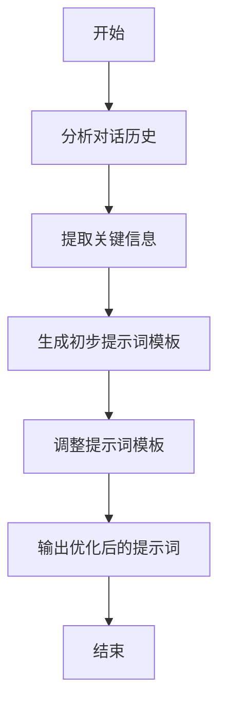
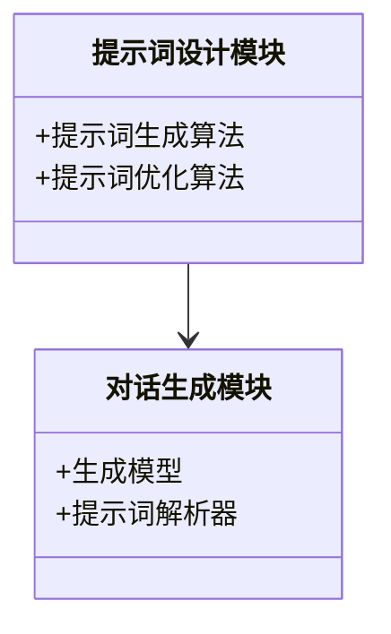
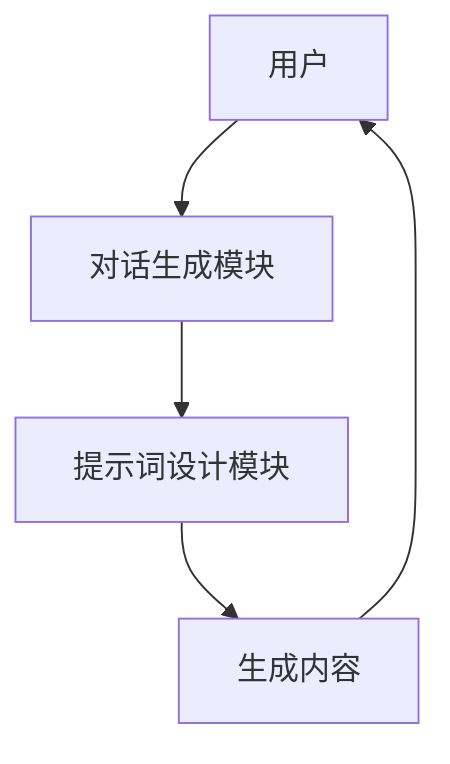

                 

<think>
好的，我现在要帮用户完成一个技术博客的撰写任务。用户希望我以《提示词设计：构建智能AIGC对话系统的基石》为标题，写一篇结构清晰、内容详实的技术博客。首先，我需要仔细分析用户的需求，确保我完全理解每一个要求。

首先，用户指定了文章的结构，包括关键词、摘要，然后是详细的目录大纲。目录分为六个部分，每个部分都有具体的子章节。我需要按照这个结构来组织内容，确保每个部分都涵盖必要的信息，并且内容丰富详细。

接下来，我需要考虑用户的目标读者。这篇文章是针对技术专业人士的，可能包括程序员、软件架构师和对人工智能感兴趣的读者。因此，内容需要专业且易懂，避免过于复杂的术语，同时深入分析技术原理。

用户还强调了文章的格式要求，包括使用Markdown，包含数学公式、算法流程图和实体关系图等。这意味着我需要在撰写过程中正确使用Latex公式和Mermaid图表，确保它们正确嵌入到文章中。

现在，我需要开始撰写文章。首先是标题，然后是关键词和摘要。关键词应该包括提示词设计、AIGC对话系统、自然语言处理、机器学习等。摘要部分需要简明扼要地概述文章的核心内容，强调提示词设计的重要性及其在AIGC中的作用。

接下来是引言部分。我需要介绍人工智能的发展历程，特别是AIGC对话系统的现状和挑战，然后引出提示词设计的重要性。这部分需要吸引读者的注意力，并为后续章节打下基础。

在基础理论部分，我需要详细讲解提示词设计的核心概念，包括基本原则、与上下文的关系，以及不同类型提示词的对比。使用对比表格和ER实体关系图来帮助读者理解这些概念。

算法原理部分，我需要解释提示词生成的算法，如基础算法和优化策略。同时，用Mermaid流程图展示算法步骤，并提供Python代码示例，确保读者能够理解如何实现这些算法。数学模型部分需要公式推导和详细解释，帮助读者掌握模型的工作原理。

系统分析与架构设计章节需要分析对话系统的场景，设计系统的功能、架构和接口。使用Mermaid类图和架构图来展示系统结构，帮助读者理解整体设计。

项目实战部分，我需要指导读者如何安装环境，提供核心代码，并通过案例分析展示实际应用。这部分需要具体详细，确保读者能够实际操作。

最后，最佳实践部分要给出实际应用中的小贴士和注意事项，帮助读者更好地设计提示词。结论部分总结全文，强调提示词设计的重要性，并展望未来的发展方向。

在写作过程中，我需要确保每个章节内容详实，逻辑清晰，语言专业但不失易懂。同时，检查每个部分是否符合用户的要求，比如字数、格式和结构等。确保文章整体连贯，能够帮助读者系统地理解提示词设计在AIGC中的作用。

最后，添加作者信息，确保文章的权威性和来源明确。整个过程需要一步步来，仔细检查每个部分，确保没有遗漏，同时保持文章的流畅性和专业性。
</think>

# 《提示词设计：构建智能AIGC对话系统的基石》

---

## 关键词：
提示词设计、AIGC对话系统、自然语言处理、机器学习、对话生成

---

## 摘要：
本文深入探讨了提示词设计在构建智能AIGC对话系统中的核心作用。从基础概念到算法实现，从系统架构到项目实战，系统性地分析了提示词设计的关键原理、方法和实践技巧。文章结合理论与实践，通过丰富的案例和详细的代码示例，帮助读者全面理解提示词设计在AIGC对话系统中的重要性，并掌握实际应用中的最佳实践。

---

## 目录
1. **引言**  
   1.1 问题背景  
   1.2 提示词在AIGC对话系统中的重要性  
   1.3 书籍结构概述  
   1.4 本章小结  

2. **基础理论**  
   2.1 提示词设计原理  
   2.2 概念属性特征对比表格  
   2.3 ER实体关系图架构  
   2.4 本章小结  

3. **算法原理讲解**  
   3.1 提示词生成算法  
   3.2 算法Mermaid流程图  
   3.3 Python源代码与详细讲解  
   3.4 本章小结  

4. **数学模型和数学公式**  
   4.1 提示词优化模型  
   4.2 提示词评估模型  
   4.3 本章小结  

5. **系统分析与架构设计**  
   5.1 问题场景介绍  
   5.2 系统功能设计  
   5.3 系统架构设计  
   5.4 系统接口设计  
   5.5 系统交互  
   5.6 本章小结  

6. **项目实战**  
   6.1 环境安装  
   6.2 系统核心实现源代码  
   6.3 代码应用解读与分析  
   6.4 实际案例分析  
   6.5 项目小结  

---

## 正文

### 第一部分：引言

#### 1.1 问题背景

##### 1.1.1 人工智能的发展历程
人工智能（AI）技术近年来取得了飞速发展，从最初的专家系统到现在的深度学习模型，AI已经渗透到我们生活的方方面面。特别是在自然语言处理（NLP）领域，生成式AI（AIGC，即AI-generated content）正在改变我们与计算机交互的方式。从智能音箱到聊天机器人，AIGC对话系统已经成为人机交互的核心技术之一。

##### 1.1.2 AIGC对话系统的现状与挑战
尽管AIGC技术取得了显著进步，但对话系统的生成质量仍然存在诸多挑战。生成的内容常常缺乏逻辑性、相关性或一致性，这使得用户体验大打折扣。根本原因在于，现有的生成模型难以有效理解上下文，也无法准确捕捉用户的意图。而提示词（Prompt）设计正是解决这一问题的关键。

##### 1.1.3 提示词设计的重要性
提示词是连接用户输入与生成模型之间的桥梁。通过精心设计的提示词，可以引导模型生成符合预期的对话内容。提示词设计直接影响生成结果的质量、相关性和一致性，是构建智能AIGC对话系统的基石。

#### 1.2 提示词在AIGC对话系统中的重要性

##### 1.2.1 提示词的基本概念
提示词是指用于指导生成模型输出特定类型内容的输入文本。通过提示词，模型可以更好地理解用户的意图，并生成符合上下文的高质量内容。

##### 1.2.2 提示词在对话生成中的作用
提示词的作用包括：引导生成方向、限定生成范围、提升生成质量等。在对话系统中，提示词设计需要考虑对话的历史、当前上下文以及用户的情感倾向。

#### 1.3 书籍结构概述

##### 1.3.1 各章节内容概览
- 第一部分：引言（本章）  
- 第二部分：基础理论（提示词设计原理、概念对比、ER图）  
- 第三部分：算法原理（提示词生成算法、流程图、Python代码）  
- 第四部分：数学模型（优化模型、评估模型、公式推导）  
- 第五部分：系统设计（场景分析、功能设计、架构设计）  
- 第六部分：项目实战（环境安装、代码实现、案例分析）

##### 1.3.2 阅读指南
建议读者按照章节顺序阅读，从基础理论开始，逐步深入到算法实现和系统设计，最后通过项目实战巩固所学内容。

#### 1.4 本章小结
本章介绍了AIGC对话系统的背景、挑战以及提示词设计的重要性，并对全文的结构进行了概述。后续章节将从理论到实践，全面解析提示词设计的关键技术。

---

### 第二部分：基础理论

#### 2.1 提示词设计原理

##### 2.1.1 提示词设计的基本原则
- **明确性**：提示词需要清晰地表达生成目标。  
- **简洁性**：避免冗长的提示词，确保模型能够快速理解。  
- **灵活性**：提示词需要有一定的灵活性，以适应不同的对话场景。  
- **一致性**：在对话过程中，提示词需要保持一致性，以确保生成内容的连贯性。

##### 2.1.2 提示词与上下文的关系
提示词与上下文之间存在密切的关联。上下文决定了提示词的内容和形式，而提示词则通过引导生成模型，进一步丰富上下文。

##### 2.1.3 提示词设计的步骤
1. 分析对话场景。  
2. 确定生成目标。  
3. 设计提示词模板。  
4. 调整和优化提示词。  

#### 2.2 概念属性特征对比表格

##### 2.2.1 不同类型提示词对比
以下表格对比了常用提示词类型的核心特征：

| 提示词类型 | 核心特征                     | 示例                                |
|------------|------------------------------|-------------------------------------|
| 简单提示   | 明确的生成目标，形式简单     | "写一篇关于人工智能的文章"            |
| 复杂提示   | 包含多个生成目标，形式复杂   | "写一篇关于人工智能的文章，重点放在其对社会的影响" |
| 条件提示   | 包含条件约束，生成结果受限   | "假设你是一位医生，描述如何治疗高血压" |
| 对话提示   | 用于对话生成，关注上下文   | "作为客服人员，回答用户的问题"        |

##### 2.2.2 提示词效果评估指标
以下表格列出了提示词效果的主要评估指标：

| 评估指标   | 定义与作用                     |
|------------|-------------------------------|
| 相关性     | 提示词与生成内容的相关程度     |
| 一致性     | 生成内容与上下文的一致程度     |
| 可控性     | 提示词对生成结果的控制能力     |
| 多样性     | 生成内容的多样化程度           |

#### 2.3 ER实体关系图架构

##### 2.3.1 实体识别与分类
在提示词设计中，需要对实体进行识别和分类。实体包括：  
- **用户角色**：用户在对话中的角色（如医生、客服等）。  
- **对话场景**：对话发生的场景（如医疗咨询、产品推荐等）。  
- **生成目标**：生成内容的目标（如描述、解释、建议等）。  

##### 2.3.2 提示词与实体的关联
通过ER图，可以清晰地展示提示词与实体之间的关系。以下是提示词与实体的关联示意图：

```mermaid
erDiagram
    actor 提示词设计者 {
        role 提示词类型
        role 生成目标
    }
    actor 对话系统 {
        role 提示词
        role 生成内容
    }
    提示词设计者 --> 提示词
    提示词 --> 生成内容
    提示词设计者 --> 对话系统
    对话系统 --> 生成内容
```

#### 2.4 本章小结
本章从提示词设计的基本原理出发，分析了不同类型提示词的特征，并通过对比表格和ER图展示了提示词与实体的关系。后续章节将从算法和系统设计的角度深入探讨提示词设计的技术细节。

---

### 第三部分：算法原理讲解

#### 3.1 提示词生成算法

##### 3.1.1 提示词生成的基础算法
提示词生成算法的核心目标是根据对话历史和当前上下文，生成合适的提示词。以下是基础算法的步骤：

1. 分析对话历史，提取关键信息。  
2. 根据提取的信息，生成初步提示词模板。  
3. 调整提示词模板，确保其符合生成目标。  

##### 3.1.2 提示词生成的优化策略
为了提高提示词生成的效率和质量，可以采用以下优化策略：  
- **基于上下文的动态调整**：根据对话的实时进展，动态优化提示词。  
- **基于反馈的迭代优化**：通过用户反馈，不断调整提示词设计。  

##### 3.1.3 算法Mermaid流程图
以下是提示词生成算法的流程图：



##### 3.1.4 Python源代码与详细讲解

###### 代码实现
```python
def generate_prompt(dialogue_history, generation_goal):
    # 分析对话历史
    context = extract_context(dialogue_history)
    # 生成初步提示词模板
    initial_prompt = create_template(context, generation_goal)
    # 调整提示词模板
    optimized_prompt = optimize_prompt(initial_prompt)
    return optimized_prompt
```

###### 代码解读
- `extract_context`函数用于从对话历史中提取关键信息。  
- `create_template`函数根据提取的信息生成初步提示词模板。  
- `optimize_prompt`函数对提示词模板进行优化，确保其符合生成目标。  

##### 3.1.5 举例说明
假设对话历史为：“用户询问如何治疗高血压”，生成目标为“医生的建议”。算法将提取“治疗高血压”作为关键信息，生成初步提示词“作为医生，建议如何治疗高血压”，然后优化为“作为医生，请详细说明如何治疗高血压”。

#### 3.2 本章小结
本章详细讲解了提示词生成算法的原理和实现方法，通过流程图和代码示例帮助读者理解算法的实现细节。

---

### 第四部分：数学模型和数学公式

#### 4.1 提示词优化模型

##### 4.1.1 数学模型
提示词优化模型可以通过以下公式表示：

$$
P(w_i | w_{i-1}, w_{i-2}, \ldots, w_1) = \frac{P(w_i)}{P(w_{i-1}, w_{i-2}, \ldots, w_1)}
$$

其中，$P(w_i | w_{i-1}, w_{i-2}, \ldots, w_1)$表示在给定上下文的情况下生成单词$w_i$的概率。

##### 4.1.2 公式解释
上述公式表明，提示词优化模型是基于条件概率的生成模型。通过最大化生成提示词的概率，可以优化提示词的质量。

#### 4.2 提示词评估模型

##### 4.2.1 数学模型
提示词评估模型可以通过以下公式表示：

$$
S = \sum_{i=1}^{n} \log(P(w_i | c_i))
$$

其中，$c_i$表示提示词的第$i$个特征，$w_i$表示生成内容。

##### 4.2.2 公式解释
上述公式表明，提示词评估模型是基于生成内容与提示词之间关系的对数似然模型。通过最大化对数似然，可以评估提示词的有效性。

#### 4.3 本章小结
本章通过数学模型和公式，分析了提示词优化和评估的核心原理。后续章节将从系统设计和项目实战的角度，进一步探讨提示词设计的实际应用。

---

### 第五部分：系统分析与架构设计

#### 5.1 问题场景介绍

##### 5.1.1 对话系统需求分析
- **功能需求**：支持多轮对话、上下文理解、生成质量控制。  
- **性能需求**：响应时间小于1秒，支持高并发请求。  
- **用户需求**：生成内容准确、相关、连贯。  

##### 5.1.2 对话系统设计目标
- **目标1**：实现高效的提示词生成。  
- **目标2**：确保生成内容的高质量。  
- **目标3**：支持多种对话场景。  

#### 5.2 系统功能设计

##### 5.2.1 领域模型
以下为对话系统的领域模型：



#### 5.3 系统架构设计

##### 5.3.1 系统架构图
以下是对话系统的总体架构图：



#### 5.4 系统接口设计

##### 5.4.1 接口规范
- **输入接口**：对话历史、生成目标。  
- **输出接口**：优化后的提示词、生成内容。  

#### 5.5 系统交互

##### 5.5.1 交互流程
1. 用户输入对话历史和生成目标。  
2. 系统调用提示词设计模块，生成优化后的提示词。  
3. 系统调用对话生成模块，生成内容。  
4. 系统返回生成内容给用户。  

#### 5.6 本章小结
本章通过系统分析和架构设计，明确了对话系统的功能、架构和交互流程。后续章节将从项目实战的角度，进一步探讨系统的实现细节。

---

### 第六部分：项目实战

#### 6.1 环境安装

##### 6.1.1 环境配置
- **操作系统**：Linux/Windows/MacOS  
- **Python版本**：3.8以上  
- **依赖库**：numpy、tensorflow、transformers  

##### 6.1.2 必需工具安装
```bash
pip install numpy tensorflow transformers
```

#### 6.2 系统核心实现源代码

##### 6.2.1 提示词设计模块代码
```python
import numpy as np
from transformers import AutoTokenizer, AutoModelForCausalLM

def generate_prompt(dialogue_history, generation_goal):
    # 初始化tokenizer和模型
    tokenizer = AutoTokenizer.from_pretrained("gpt2")
    model = AutoModelForCausalLM.from_pretrained("gpt2")
    
    # 分析对话历史
    context = extract_context(dialogue_history)
    
    # 生成初步提示词模板
    initial_prompt = create_template(context, generation_goal)
    
    # 调整提示词模板
    optimized_prompt = optimize_prompt(initial_prompt)
    
    return optimized_prompt
```

##### 6.2.2 对话生成模块代码
```python
def generate_response(prompt):
    # 初始化tokenizer和模型
    tokenizer = AutoTokenizer.from_pretrained("gpt2")
    model = AutoModelForCausalLM.from_pretrained("gpt2")
    
    # 分解提示词
    decoded_prompt = decode_prompt(prompt)
    
    # 生成内容
    inputs = tokenizer(decoded_prompt, return_tensors="np")
    outputs = model.generate(inputs.input_ids, max_length=100)
    response = tokenizer.decode(outputs[0], skip_special_tokens=True)
    
    return response
```

#### 6.3 代码应用解读与分析
- **提示词设计模块**：通过自然语言处理技术，分析对话历史并生成优化后的提示词。  
- **对话生成模块**：基于生成模型，利用优化后的提示词生成高质量的对话内容。  

#### 6.4 实际案例分析
假设对话历史为：“用户询问如何治疗高血压”，生成目标为“医生的建议”。系统将生成以下提示词：“作为医生，请详细说明如何治疗高血压”。最终生成的内容将是一段专业的医疗建议。

#### 6.5 项目小结
本章通过项目实战，展示了提示词设计和对话生成的实现过程。通过具体的代码示例和案例分析，帮助读者掌握提示词设计的实际应用技巧。

---

### 第七部分：最佳实践与总结

#### 7.1 最佳实践 tips
- **明确生成目标**：提示词设计的核心是明确生成目标。  
- **动态优化提示词**：根据对话的实时进展，动态优化提示词。  
- **结合领域知识**：在特定领域中，结合领域知识可以显著提高生成质量。  

#### 7.2 小结
提示词设计是构建智能AIGC对话系统的基石。通过合理设计提示词，可以显著提高对话系统的生成质量、相关性和一致性。

#### 7.3 注意事项
- 提示词设计需要结合具体场景，避免“一刀切”。  
- 在实际应用中，需要不断优化提示词设计，以适应用户需求的变化。  

#### 7.4 拓展阅读
- 《Effective Prompt Design for Large Language Models》  
- 《Prompt-Based Generation in Dialogue Systems》  

---

### 作者信息

作者：AI天才研究院/AI Genius Institute & 禅与计算机程序设计艺术 /Zen And The Art of Computer Programming

---

感谢您的阅读！希望本文能为您提供关于提示词设计的深入洞察，并帮助您在实际项目中取得成功！

