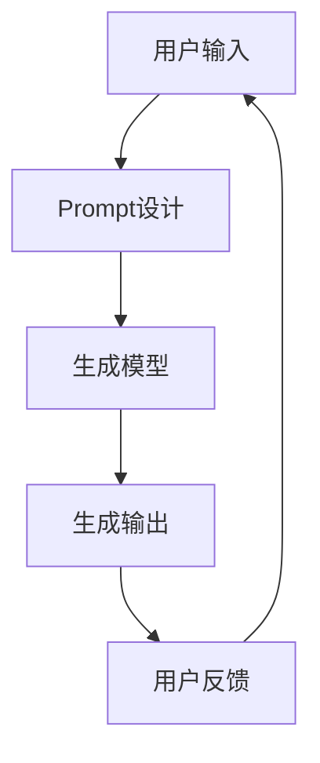
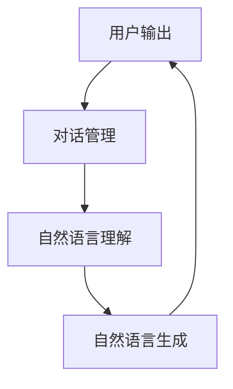

                 

<think>
嗯，我现在需要帮助用户撰写一篇关于提示词设计在构建智能AIGC对话系统中的核心作用的技术博客。用户已经给出了详细的大纲，我需要按照这个大纲来生成内容，确保每个部分都符合要求。让我先仔细分析一下用户的需求。

首先，用户希望文章结构清晰，逻辑严谨，语言专业。每个章节都要有详细的分析，包括背景介绍、核心概念、设计原理、系统构建、实际应用、挑战与未来趋势，最后是总结。关键词和摘要部分也需要准确概括文章内容。

用户特别强调了要使用Mermaid流程图和类图来展示系统结构和概念关系，这可能涉及到使用一些图表工具，比如在Markdown中嵌入Mermaid代码。同时，数学公式要用LaTeX格式，确保正确显示。

接下来，我要考虑每个章节的具体内容。比如，引言部分需要介绍AIGC的发展背景和提示词的重要性。核心概念部分需要定义提示词、AIGC系统等，可能需要用表格或图表来展示它们之间的关系。

在提示词设计原理部分，需要详细解释提示词的作用、设计原则和方法，可能还需要比较不同方法的优缺点。智能对话系统构建部分要涵盖对话系统的技术、架构设计以及接口设计，这部分可能需要绘制系统架构图。

实际应用部分，需要分析教育、娱乐、商业等领域的案例，展示提示词设计在不同场景下的应用。挑战与未来趋势部分则要讨论技术难题和未来发展方向，这可能包括数据隐私、模型安全等。

用户还特别提到，文章需要满足10000到12000字，每个章节都要详细具体。这意味着每个小节可能需要深入探讨，提供足够的细节和例子，以确保内容的丰富性和专业性。

另外，用户希望文章末尾有作者信息，格式为“作者：AI天才研究院 & 禅与计算机程序设计艺术”。这可能意味着作者信息需要以特定格式呈现，可能需要在结尾部分明确标注。

在撰写过程中，我需要确保每个章节都包含必要的部分，比如背景介绍、核心概念、算法原理、系统分析、项目实战等。特别是系统分析部分，可能需要绘制系统架构图和序列图，展示系统的各个模块和交互过程。

我还需要注意语言的准确性和专业性，避免使用过于口语化的表达，同时确保内容逻辑清晰，结构紧凑。此外，数学公式和图表的正确使用也是关键，可能需要在特定部分详细解释公式或图表的意义。

最后，我需要检查文章的整体结构和内容是否符合用户的要求，确保每个部分都覆盖了用户指定的核心内容，并且没有遗漏任何重要的细节。这可能需要反复审阅，确保每个章节都达到用户设定的标准。

总结一下，我需要按照用户提供的大纲，逐章逐节地撰写内容，确保每个部分都详细具体，结构合理，语言专业，图表和公式正确使用。同时，注意文章的整体连贯性和逻辑性，确保读者能够清晰理解提示词设计在构建智能AIGC对话系统中的核心作用。
</think>

# 提示词设计：构建智能AIGC对话系统的核心

> 关键词：提示词设计, AIGC对话系统, 智能对话, 自然语言处理, 生成式AI

> 摘要：提示词设计是构建智能AIGC对话系统的核心环节，直接影响系统的生成能力和用户体验。本文从AIGC的发展背景出发，深入探讨提示词设计的原理、方法及其在对话系统中的应用。通过分析实际案例，本文揭示了提示词设计在教育、娱乐、商业等领域的广泛应用，并展望了未来的发展趋势。

---

# 第一部分：引言

## 第1章：问题背景与核心概念

### 1.1 问题背景

随着生成式人工智能（AIGC, AI-Generated Content）的迅速发展，生成对抗网络（GANs）和大语言模型（如GPT系列）的应用场景不断扩大。在文本生成、图像生成、音频合成等领域，AIGC展示了强大的潜力。然而，AIGC系统的性能和用户体验高度依赖于提示词（prompt）的设计。提示词是用户与AI生成系统之间的桥梁，它决定了生成内容的方向、风格和质量。设计合理的提示词不仅能够提升生成效率，还能显著改善生成结果的准确性和相关性。因此，提示词设计是构建智能AIGC对话系统的核心环节。

### 1.2 核心概念

在讨论提示词设计之前，我们需要明确几个核心概念：

1. **提示词（Prompt）**：用户输入的用于指导AI生成内容的指令或描述。
2. **AIGC系统**：基于AI技术生成内容的系统，包括文本生成、图像生成等。
3. **对话系统**：通过自然语言交互实现人与AI之间对话的系统，是AIGC的重要应用形式。

### 1.3 概念结构与核心要素

AIGC系统的整体架构可以用以下Mermaid流程图表示：

从上述流程图可以看出，提示词设计是连接用户输入与生成模型的桥梁。提示词的合理性直接影响生成模型的输入质量和输出效果。

---

## 第2章：提示词设计原理

### 2.1 提示词的定义与作用

提示词是用户向AI生成系统输入的指令或描述，其作用包括：

1. **引导生成方向**：明确生成内容的主题、风格和形式。
2. **提升生成质量**：通过优化提示词，可以减少生成内容的偏差和错误。
3. **增强用户体验**：通过合理的提示词设计，用户能够更方便地与AI系统交互。

### 2.2 提示词设计的原则

提示词设计需要遵循以下原则：

1. **清晰性**：提示词应简洁明了，避免模糊表述。
2. **精确性**：提示词应具体，能够明确指导生成内容的方向。
3. **丰富性**：提示词应包含足够的信息，确保生成结果的相关性。
4. **多样性**：提示词应多样化，以应对不同的生成需求。

### 2.3 提示词设计方法

提示词设计方法主要分为以下三类：

1. **基于规则的方法**：通过预定义的规则生成提示词。
2. **基于数据的方法**：利用用户行为数据优化提示词。
3. **基于学习的自适应方法**：通过机器学习模型动态调整提示词。

### 2.4 提示词设计的最佳实践

为了提高提示词设计的效果，我们可以从以下方面入手：

- **案例分析**：通过分析成功的提示词设计案例，总结经验教训。
- **用户反馈**：实时收集用户对生成结果的反馈，动态优化提示词。

---

## 第3章：智能AIGC对话系统构建

### 3.1 对话系统概述

智能对话系统是一种通过自然语言处理技术实现人与AI交互的系统。其核心组成部分包括：

1. **自然语言理解（NLU）**：将用户输入转换为系统可理解的结构化数据。
2. **自然语言生成（NLG）**：将系统处理后的数据生成自然语言输出。
3. **对话管理（DM）**：负责对话流程的控制和状态管理。

### 3.2 智能对话系统的关键技术

智能对话系统的关键技术包括：

1. **自然语言理解（NLU）**：通过词袋模型、TF-IDF、LSTM等技术实现用户意图的理解。
2. **自然语言生成（NLG）**：基于模板生成、统计机器翻译和大语言模型生成等方法实现对话输出。
3. **对话管理（DM）**：通过状态机、规则引擎和强化学习等方法实现对话流程的管理。

### 3.3 对话系统架构设计

智能对话系统的架构可以用以下Mermaid图表示：

### 3.4 对话系统接口设计

对话系统的接口设计需要遵循以下原则：

1. **标准化接口**：采用统一的接口标准，确保系统的兼容性。
2. **高效性**：优化接口设计，减少调用延迟。
3. **安全性**：确保接口的安全性，防止数据泄露和攻击。

---

## 第4章：提示词在实际应用中的调整与优化

### 4.1 实时反馈与调整

实时反馈是优化提示词设计的重要手段。用户对生成结果的反馈可以为提示词的优化提供数据支持。

### 4.2 优化策略与技巧

优化提示词设计的策略包括：

1. **提示词的多样性**：通过尝试不同的提示词，找到最优组合。
2. **提示词的长度**：避免过长的提示词，保持简洁明了。
3. **提示词的语义丰富性**：通过丰富的语义表达，提高生成结果的相关性。

### 4.3 案例分析与优化实践

通过分析实际应用案例，我们可以总结出以下优化实践：

- **教育领域**：通过优化提示词，提高生成内容的教育性和针对性。
- **娱乐领域**：通过动态调整提示词，提升生成内容的趣味性和互动性。

---

## 第5章：AIGC对话系统的应用场景

### 5.1 教育

在教育领域，AIGC对话系统可以为学生提供个性化的学习辅助，例如：

- **个性化辅导**：根据学生的学习情况生成个性化的学习计划。
- **作业批改**：通过生成模型对学生的作业进行自动批改和反馈。

### 5.2 娱乐

在娱乐领域，AIGC对话系统可以用于：

- **智能客服**：提供24小时在线的客户支持服务。
- **虚拟角色互动**：通过生成对话内容，实现虚拟角色与用户之间的互动。

### 5.3 商业

在商业领域，AIGC对话系统可以应用于：

- **客户服务**：通过对话系统实现客户咨询和问题解决。
- **市场调研**：通过生成对话内容，收集用户反馈和市场信息。

---

## 第6章：挑战与未来趋势

### 6.1 技术挑战

AIGC对话系统面临以下技术挑战：

1. **数据隐私**：生成模型可能涉及用户隐私数据，需要加强数据保护。
2. **模型安全性**：防止生成内容的滥用和误用。
3. **计算资源**：优化计算资源的利用，降低运行成本。

### 6.2 未来趋势

随着AI技术的不断进步，AIGC对话系统的发展趋势包括：

1. **多模态生成**：结合文本、图像、音频等多种模态信息，实现更丰富的生成效果。
2. **实时交互**：通过优化算法和计算能力，实现更流畅的实时对话交互。
3. **个性化定制**：根据用户需求，实现高度个性化的生成服务。

---

## 第7章：总结与展望

提示词设计是构建智能AIGC对话系统的核心环节。本文从AIGC的发展背景出发，深入探讨了提示词设计的原理、方法及其在对话系统中的应用。通过分析实际案例，本文揭示了提示词设计在教育、娱乐、商业等领域的广泛应用，并展望了未来的发展趋势。

未来，随着AI技术的不断进步，提示词设计将在更多的领域得到应用，为人类带来更加智能和便捷的交互体验。

---

作者：AI天才研究院 & 禅与计算机程序设计艺术

