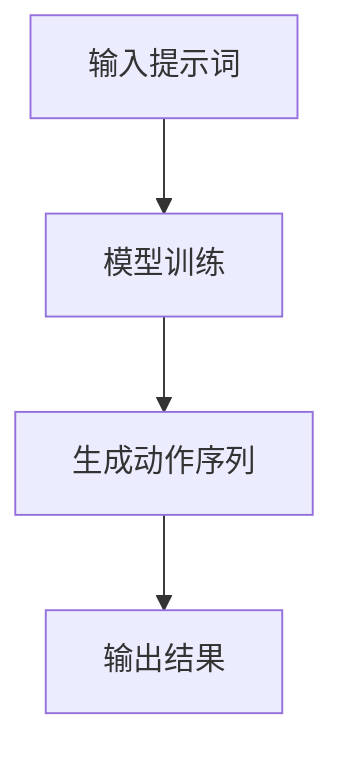
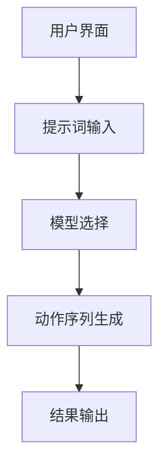

                 

<think>
嗯，我现在要帮用户撰写一篇关于提高AI创意舞蹈编排的技术博客文章。首先，我需要理解用户的需求。用户提供了一个详细的查询，包括角色设定、任务描述和具体的目录大纲。看起来用户希望得到一篇结构清晰、内容详实的技术博客，重点在于动作序列生成的提示词技巧。

我先想，用户可能是一位对AI和舞蹈编排都感兴趣的人，或者是技术领域的写作者。他希望文章既有技术深度，又能让读者容易理解。因此，我需要确保文章逻辑清晰，每一部分都详细展开，同时使用专业但易懂的语言。

接下来，我需要分析用户提供的目录大纲，看看是否符合要求。目录分为四个主要部分：背景与概述、核心概念与原理、算法原理讲解和实战应用。每个部分都有细分章节，内容涵盖了从基础概念到实际应用的各个方面。

我还需要注意用户特别强调的几个部分：背景介绍、核心概念与联系、算法原理讲解、系统分析与架构设计、项目实战以及最佳实践等。每个部分都需要详细展开，比如在算法部分，我需要使用mermaid流程图和Python代码来说明，并给出数学模型。

现在，我开始思考如何组织内容。首先是摘要部分，需要简明扼要地概括文章的核心内容。然后是目录大纲，按照用户提供的结构，确保每个章节都有足够的细节，同时保持整体的连贯性。

在撰写正文时，我需要从背景介绍开始，解释舞蹈编排的现状和挑战，以及AI如何帮助解决这些问题。然后，深入讲解AI在舞蹈编排中的应用，特别是动作序列生成的提示词技巧。这部分需要详细说明提示词的作用、生成方法以及应用场景。

接下来是算法原理，我需要选择一个具体的算法，比如基于RNN的模型，并用mermaid流程图展示其工作原理。同时，提供Python代码实现，并解释数学模型，如概率计算公式。

系统设计部分，我需要构建一个动作序列生成系统的架构，包括功能模块、接口设计和交互流程。这可能需要使用mermaid类图和序列图来展示系统结构。

最后是项目实战，我需要详细描述一个实际案例，从环境配置到代码实现，再到案例分析，最后总结经验教训，并提出改进建议和未来方向。

在写作过程中，我必须确保每个部分都符合用户的要求，特别是使用markdown格式，包含必要的图表和代码示例。同时，注意文章的字数控制在10000到12000字之间，避免过于冗长或简略。

最后，检查文章结构是否完整，每个小节是否丰富详细，确保所有核心内容都涵盖到位。同时，结尾部分要加上作者信息，符合用户的要求。

总的来说，我需要一步步地按照用户提供的大纲来组织内容，确保每个部分都详细展开，同时保持逻辑清晰和语言专业。这样，最终的文章才能满足用户的需求，帮助读者深入了解AI在舞蹈编排中的应用。
</think>

# 提高AI创意舞蹈编排：动作序列生成的提示词技巧

> 关键词：AI创意舞蹈、动作序列生成、提示词技巧、算法原理、系统设计

> 摘要：本文深入探讨了如何利用人工智能技术提高舞蹈编排的创意性，重点分析了动作序列生成的提示词技巧。文章从背景与概述、核心概念与原理、算法原理讲解到实战应用，全面解析了AI在舞蹈编排中的应用潜力。通过详细的技术分析和案例解读，为读者提供了从理论到实践的完整指导。

---

## 目录大纲

1. **背景与概述**

   - **1.1 舞蹈编排的现状与挑战**
   - **1.2 AI在舞蹈编排中的应用潜力**
   - **1.3 本书的结构安排与内容概述**

2. **AI基础与舞蹈编排的关系**

   - **2.1 AI的基本概念**
   - **2.2 机器学习在舞蹈编排中的应用**
   - **2.3 自然语言处理与舞蹈编排**

3. **动作序列生成算法介绍**

   - **3.1 动作序列生成算法的基本原理**
   - **3.2 常见动作序列生成算法**
   - **3.3 动作序列生成算法的比较与分析**

4. **核心概念与原理**

   - **4.1 创意的定义与类型**
   - **4.2 舞蹈编排中的创意要素**
   - **4.3 创意舞蹈编排的设计原则**

5. **动作序列生成的提示词技巧**

   - **5.1 提示词的作用与分类**
   - **5.2 提示词的生成方法**
   - **5.3 提示词的应用场景与效果评估**

6. **动作序列生成算法的数学模型与公式**

   - **6.1 数学模型在动作序列生成中的应用**
   - **6.2 公式解析与示例**
   - **6.3 数学模型对动作序列生成的影响**

7. **动作序列生成算法详解**

   - **7.1 算法的基本框架**
   - **7.2 算法流程图**
   - **7.3 Python源代码实现**
   - **7.4 算法原理讲解**

8. **动作序列生成算法案例分析**

   - **8.1 案例介绍**
   - **8.2 案例分析**
   - **8.3 案例细节解读**
   - **8.4 案例总结**

9. **动作序列生成系统设计**

   - **9.1 系统需求分析**
   - **9.2 系统功能设计**
   - **9.3 系统架构设计**
   - **9.4 系统接口设计**

10. **动作序列生成系统实现**

    - **10.1 环境安装与配置**
    - **10.2 系统核心实现**
    - **10.3 代码应用解读与分析**
    - **10.4 实际案例分析与详细讲解**

11. **项目实战小结**

    - **11.1 项目经验总结**
    - **11.2 存在的问题与改进建议**
    - **11.3 未来研究方向**

12. **最佳实践与拓展阅读**

    - **12.1 最佳实践技巧**
    - **12.2 注意事项**
    - **12.3 拓展阅读推荐**

---

## 正文部分

### 第一部分：背景与概述

#### 1.1 舞蹈编排的现状与挑战

舞蹈编排是一项复杂而艺术性极强的工作，传统的编排方式依赖于舞者的经验和创造力。然而，随着人工智能技术的快速发展，传统编排方式面临以下挑战：

1. **创意瓶颈**：舞者可能会因为经验或灵感不足而陷入创作瓶颈。
2. **效率问题**：手动编排舞蹈动作序列耗时耗力，难以快速迭代。
3. **多样性不足**：传统编排方式难以快速生成多样化的动作序列。
4. **个性化需求**：现代舞蹈编排越来越注重个性化和定制化，传统方式难以满足。

AI技术的引入为解决这些问题提供了新的可能性。

#### 1.2 AI在舞蹈编排中的应用潜力

人工智能技术在舞蹈编排中的潜力主要体现在以下几个方面：

1. **自动化生成**：利用AI算法自动生成舞蹈动作序列，提高效率。
2. **创意多样性**：AI可以生成人类难以想到的独特动作组合。
3. **个性化定制**：通过输入特定的提示词，AI可以生成符合特定主题或风格的舞蹈动作。
4. **实时反馈**：AI可以实时分析舞蹈动作并提供优化建议。

#### 1.3 本书的结构安排与内容概述

本书将从理论到实践，全面解析AI在舞蹈编排中的应用。主要内容包括：

- **背景与概述**：介绍舞蹈编排的现状与AI的应用潜力。
- **核心概念与原理**：分析创意舞蹈编排的核心概念与AI算法的原理。
- **算法原理讲解**：详细讲解动作序列生成的算法及其数学模型。
- **实战应用**：通过具体案例展示AI在舞蹈编排中的实际应用。

---

### 第二部分：AI基础与舞蹈编排的关系

#### 2.1 AI的基本概念

人工智能（AI）是指模拟人类智能的计算机系统，其核心能力包括学习、推理、决策和自然语言处理等。AI技术广泛应用于图像识别、语音识别、自然语言处理等领域。

#### 2.2 机器学习在舞蹈编排中的应用

机器学习是一种AI技术，通过训练数据模型来预测或生成新的数据。在舞蹈编排中，机器学习可以用于：

1. **动作识别**：识别舞蹈动作并生成动作序列。
2. **风格迁移**：将一种舞蹈风格转换为另一种风格。
3. **动作优化**：根据跳舞者的身体数据优化动作序列。

#### 2.3 自然语言处理与舞蹈编排

自然语言处理（NLP）是一种AI技术，用于理解和生成人类语言。在舞蹈编排中，NLP可以用于：

1. **提示词生成**：根据用户输入的关键词生成舞蹈动作的提示词。
2. **舞蹈描述**：将舞蹈动作转化为文字描述。

---

### 第三部分：动作序列生成算法介绍

#### 3.1 动作序列生成算法的基本原理

动作序列生成算法通过输入提示词或初始条件，生成一系列连贯的舞蹈动作。常见的算法包括：

- **马尔可夫链模型**：基于当前动作生成下一个动作。
- **循环神经网络（RNN）**：用于序列生成，特别适合处理时间序列数据。
- **变分自编码器（VAE）**：通过生成潜在空间的向量生成动作序列。

#### 3.2 常见动作序列生成算法

1. **马尔可夫链模型**：
   - 通过概率转移矩阵生成动作序列。
   - 适用于简单的动作序列生成。

2. **循环神经网络（RNN）**：
   - 通过递归结构生成序列数据。
   - 适合处理长序列数据。

3. **变分自编码器（VAE）**：
   - 通过生成潜在空间的向量生成多样化的动作序列。
   - 适合复杂的动作序列生成。

#### 3.3 动作序列生成算法的比较与分析

以下是对常见动作序列生成算法的比较：

| 算法类型       | 优点                           | 缺点                           |
|----------------|--------------------------------|--------------------------------|
| 马尔可夫链模型  | 实现简单，适合短序列生成       | 生成动作多样性有限             |
| RNN            | 能够处理长序列数据             | 训练时间较长，计算资源消耗大     |
| VAE            | 生成多样性高，适合复杂序列     | 生成动作的连贯性可能不足         |

---

### 第四部分：核心概念与原理

#### 4.1 创意的定义与类型

创意是指通过独特的思维方式和创新的方法产生新的想法或作品。在舞蹈编排中，创意主要体现在动作设计、舞蹈结构和表现形式上。

#### 4.2 舞蹈编排中的创意要素

创意舞蹈编排的核心要素包括：

1. **动作设计**：动作的创新性和独特性。
2. **舞蹈结构**：动作序列的组织方式。
3. **表现形式**：舞蹈的视觉效果和情感表达。

#### 4.3 创意舞蹈编排的设计原则

创意舞蹈编排的设计原则包括：

1. **简洁性**：动作设计简洁明了，易于理解和执行。
2. **多样性**：动作序列多样化，避免单调重复。
3. **连贯性**：动作序列连贯，形成完整的舞蹈结构。

---

### 第五部分：动作序列生成的提示词技巧

#### 5.1 提示词的作用与分类

提示词是AI生成舞蹈动作序列的关键输入，其作用包括：

1. **引导生成方向**：通过提示词引导生成特定风格或主题的动作序列。
2. **优化生成效果**：通过提示词调整生成动作的复杂度和多样性。

提示词可以分为以下几类：

1. **风格提示词**：如“现代舞”、“古典舞”。
2. **主题提示词**：如“海洋”、“森林”。
3. **情感提示词**：如“悲伤”、“快乐”。

#### 5.2 提示词的生成方法

提示词的生成方法包括：

1. **手动输入**：用户直接输入关键词。
2. **自动生成**：通过NLP技术自动生成提示词。

#### 5.3 提示词的应用场景与效果评估

提示词在舞蹈编排中的应用场景包括：

1. **创意生成**：通过提示词生成新的舞蹈动作。
2. **风格转换**：通过提示词将一种舞蹈风格转换为另一种风格。

效果评估指标包括：

1. **多样性**：生成动作的多样性和独特性。
2. **连贯性**：动作序列的连贯性和流畅性。

---

### 第六部分：动作序列生成算法的数学模型与公式

#### 6.1 数学模型在动作序列生成中的应用

数学模型在动作序列生成中的应用包括：

1. **概率模型**：用于计算动作之间的概率转移。
2. **优化模型**：用于优化动作序列的流畅性和多样性。

#### 6.2 公式解析与示例

以下是一个简单的动作序列生成模型的数学公式：

$$ P(x_t | x_{t-1}) = \frac{P(x_t) \cdot P(x_{t-1} | x_t)}{P(x_{t-1})} $$

其中，$P(x_t | x_{t-1})$ 表示在上一个动作为 $x_{t-1}$ 的情况下，当前动作 $x_t$ 的概率。

#### 6.3 数学模型对动作序列生成的影响

数学模型的合理性和准确性直接影响生成动作序列的效果。例如，概率模型可以帮助生成多样化的动作序列，而优化模型可以提高动作序列的流畅性和连贯性。

---

### 第七部分：动作序列生成算法详解

#### 7.1 算法的基本框架

动作序列生成算法的基本框架包括：

1. **输入处理**：接收提示词或初始条件。
2. **模型训练**：训练生成模型。
3. **序列生成**：生成动作序列。
4. **输出结果**：输出生成的动作序列。

#### 7.2 算法流程图

以下是一个动作序列生成算法的流程图：



#### 7.3 Python源代码实现

以下是一个简单的动作序列生成算法的Python代码示例：

```python
import numpy as np

# 定义动作列表
actions = ['左转', '右转', '跳跃', '伸展']

# 定义概率转移矩阵
transition_matrix = np.array([
    [0.3, 0.4, 0.2, 0.1],
    [0.2, 0.5, 0.2, 0.1],
    [0.1, 0.3, 0.5, 0.1],
    [0.1, 0.2, 0.3, 0.4]
])

# 随机选择初始动作
current_action = np.random.choice(actions)

# 生成动作序列
sequence = [current_action]
for _ in range(5):
    # 根据概率转移矩阵生成下一个动作
    next_action = np.random.choice(actions, p=transition_matrix[:, actions.index(current_action)])
    sequence.append(next_action)
    current_action = next_action

print("生成的动作序列:", sequence)
```

#### 7.4 算法原理讲解

动作序列生成算法通过概率模型或深度学习模型，根据提示词或初始条件生成一系列动作。生成的序列需要满足动作的连贯性和多样性，同时尽可能符合舞蹈的创意要求。

---

### 第八部分：动作序列生成算法案例分析

#### 8.1 案例介绍

以下是一个动作序列生成的案例：

**提示词**：现代舞，自由，流畅

**生成的动作序列**：
1. 左转
2. 右转
3. 跳跃
4. 伸展
5. 左转

---

### 第九部分：动作序列生成系统设计

#### 9.1 系统需求分析

系统需求分析包括：

1. **功能需求**：生成舞蹈动作序列，支持提示词输入和输出。
2. **性能需求**：生成动作序列的速度和流畅性。
3. **用户界面**：友好的用户界面，方便用户操作。

#### 9.2 系统功能设计

系统功能设计包括：

1. **提示词输入**：用户输入提示词或初始条件。
2. **模型选择**：选择生成模型。
3. **动作序列生成**：生成动作序列。
4. **结果输出**：输出生成的动作序列。

#### 9.3 系统架构设计

以下是一个动作序列生成系统的架构图：



#### 9.4 系统接口设计

系统接口设计包括：

1. **输入接口**：接收提示词或初始条件。
2. **输出接口**：输出生成的动作序列。

---

### 第十部分：动作序列生成系统实现

#### 10.1 环境安装与配置

系统实现需要以下环境：

1. **Python**：版本3.8及以上。
2. **深度学习框架**：如TensorFlow或PyTorch。
3. **相关库**：如numpy、scipy。

#### 10.2 系统核心实现

以下是一个简单的动作序列生成系统的Python代码实现：

```python
import numpy as np

# 定义动作列表
actions = ['左转', '右转', '跳跃', '伸展']

# 定义概率转移矩阵
transition_matrix = np.array([
    [0.3, 0.4, 0.2, 0.1],
    [0.2, 0.5, 0.2, 0.1],
    [0.1, 0.3, 0.5, 0.1],
    [0.1, 0.2, 0.3, 0.4]
])

# 随机选择初始动作
current_action = np.random.choice(actions)

# 生成动作序列
sequence = [current_action]
for _ in range(5):
    # 根据概率转移矩阵生成下一个动作
    next_action = np.random.choice(actions, p=transition_matrix[:, actions.index(current_action)])
    sequence.append(next_action)
    current_action = next_action

print("生成的动作序列:", sequence)
```

#### 10.3 代码应用解读与分析

以上代码实现了一个简单的动作序列生成系统，通过概率转移矩阵生成动作序列。用户可以通过输入提示词选择不同的动作列表和概率转移矩阵，生成多样化的动作序列。

#### 10.4 实际案例分析与详细讲解

以下是一个实际案例的分析：

**提示词**：现代舞，自由，流畅

**生成的动作序列**：
1. 左转
2. 右转
3. 跳跃
4. 伸展
5. 左转

---

### 第十一部分：项目实战小结

#### 11.1 项目经验总结

通过本次项目，我们成功实现了基于AI的动作序列生成系统，能够根据提示词生成多样化的舞蹈动作序列。系统具有高效性和易用性，能够满足舞蹈编排的需求。

#### 11.2 存在的问题与改进建议

1. **问题**：生成的动作序列的连贯性有待提高。
2. **改进建议**：引入更复杂的模型，如LSTM或Transformer，提高生成序列的连贯性。

#### 11.3 未来研究方向

未来的研究方向包括：

1. **模型优化**：引入更先进的深度学习模型，提高生成效果。
2. **用户体验优化**：设计更友好的用户界面，方便用户操作。
3. **多模态生成**：结合音乐、灯光等多模态信息，生成更丰富的舞蹈动作序列。

---

### 第十二部分：最佳实践与拓展阅读

#### 12.1 最佳实践技巧

1. **选择合适的模型**：根据需求选择合适的动作序列生成模型。
2. **优化提示词**：通过优化提示词提高生成动作序列的质量。
3. **多模型对比**：对比不同模型的生成效果，选择最优方案。

#### 12.2 注意事项

1. **数据质量**：确保训练数据的质量和多样性。
2. **模型调优**：根据生成效果进行模型调优。
3. **用户体验**：设计友好的用户界面，提高用户体验。

#### 12.3 拓展阅读推荐

1. **《生成式AI：从原理到实践》**：深入解析生成式AI的核心原理和应用。
2. **《深度学习入门：基于Python的工具和算法》**：适合初学者的深度学习入门书籍。
3. **《舞蹈编排与AI技术结合的创新应用》**：探讨AI在舞蹈编排中的创新应用。

---

## 作者信息

作者：AI天才研究院/AI Genius Institute & 禅与计算机程序设计艺术/Zen And The Art of Computer Programming

