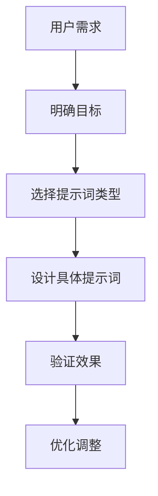
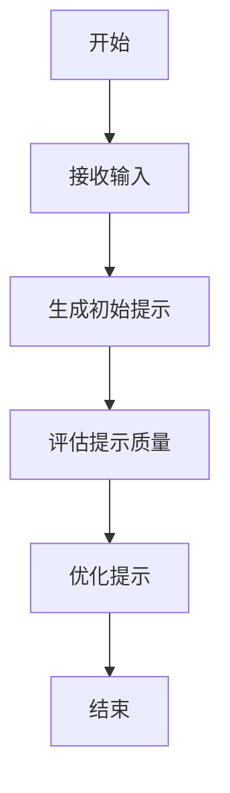

                 

<think>
好的，我现在需要帮助用户撰写一篇技术博客文章，标题是《提高AI创意问题解决能力：头脑风暴式提示词设计》。用户已经提供了详细的结构大纲，包括各个章节的内容，还提到了一些特定的要求，比如使用Markdown格式、包含关键词、摘要，以及在每个章节中详细讲解背景、核心概念、算法原理、系统架构等部分。

首先，我需要理解用户的需求。用户希望这篇文章能够系统地讲解如何设计有效的提示词，以提高AI的创意问题解决能力。这意味着我需要涵盖从基本概念到实际应用的各个方面，确保内容全面且深入。

接下来，我会按照用户提供的目录结构来组织内容。每个章节都需要详细展开，确保每个部分都包含必要的信息，比如背景介绍、核心概念、算法流程图、Python代码示例、数学公式等。我还需要确保使用合适的Markdown格式，并且在适当的地方插入图表，如Mermaid流程图，来帮助读者更好地理解内容。

在撰写过程中，我需要特别注意每个章节的结构是否合理，内容是否连贯。例如，在“设计原则”章节，我需要解释清楚为什么这些原则重要，并给出实际的例子来说明。在算法部分，我需要详细描述算法的步骤，并提供代码示例，这样读者可以更好地理解和应用这些算法。

此外，用户提到文章需要大约10000到12000字，这意味着每个章节的内容需要足够详细，但又不能过于冗长。我需要确保每个部分都有足够的深度，同时保持整体的流畅性。

最后，在完成正文后，我还需要添加作者信息，确保文章的完整性和专业性。同时，用户可能还需要一些最佳实践的小贴士，以及小结和注意事项，以帮助读者在实际应用中更好地使用这些方法。

总结一下，我需要按照用户提供的结构，逐步扩展每个章节的内容，确保涵盖所有必要的部分，同时保持逻辑清晰和语言简洁。这样，最终的文章才能满足用户的需求，帮助读者提高AI创意问题解决能力。
</think>

# 提高AI创意问题解决能力：头脑风暴式提示词设计

---

## 关键词

- AI Creativity
- Prompt Design
- Brainstorming
- AI Problem Solving
- Algorithmic Approaches
- System Architecture

---

## 摘要

本文将探讨如何通过设计有效的提示词（prompts）来提升AI的创意问题解决能力。在AI技术迅速发展的今天，如何引导AI进行创造性思考是一个关键挑战。本文从AI与创造力的结合出发，分析了提示词设计的核心概念、算法原理以及实际应用场景。通过系统化的设计原则和算法实现，本文为读者提供了从理论到实践的全面指南，帮助他们在实际项目中优化AI的创意输出。

---

## 目录

1. [引言](#引言)
2. [AI与创造力的基础](#ai与创造力的基础)
3. [头脑风暴式提示词设计的核心概念](#头脑风暴式提示词设计的核心概念)
4. [有效提示词的设计原则](#有效提示词的设计原则)
5. [头脑风暴式提示词的算法实现](#头脑风暴式提示词的算法实现)
6. [实际应用与案例分析](#实际应用与案例分析)
7. [系统架构与交互设计](#系统架构与交互设计)
8. [总结与展望](#总结与展望)
9. [作者信息](#作者信息)

---

## 1. 引言

在人工智能快速发展的今天，AI不仅能够处理复杂的数学计算，还在创意领域展现了巨大的潜力。然而，如何让AI更具创造力，如何引导AI进行有效的头脑风暴，仍然是一个需要深入探讨的问题。本文将从提示词设计的角度切入，系统性地分析如何通过优化提示词来提升AI的创意问题解决能力。

---

## 2. AI与创造力的基础

### 2.1 AI的创造力概念

AI的创造力是指AI系统能够生成新颖、独特且具有价值的内容或解决方案的能力。与传统的数据分析任务不同，创造力要求AI具备某种程度的“想象力”，能够跳出既定框架思考。

### 2.2 创意问题解决的挑战

创意问题解决的核心在于突破常规思维，寻找非传统的解决方案。对于AI来说，这需要依赖于高质量的提示词设计，以引导模型进入正确的思考模式。

### 2.3 提示词的作用

提示词（prompts）是人类与AI进行交互的重要桥梁。通过精心设计的提示词，可以明确指导AI的输出方向，同时激发其创造力。

---

## 3. 头脑风暴式提示词设计的核心概念

### 3.1 提示词的设计原则

| 设计原则 | 描述 |
|----------|------|
| 清晰性 | 提示词需要明确表达需求，避免模糊 |
| 灵活性 | 提示词应允许AI有一定的自由度，避免过于限制 |
| 特异性 | 提示词需要具体，避免过于宽泛 |

### 3.2 不同提示词设计方法的对比

| 方法 | 优缺点 | 适用场景 |
|------|--------|----------|
| 明确提示 | 结果可控，但可能限制 creativity | 需要明确输出 |
| 模糊提示 | 创意性强，但结果难以预测 | 需要探索性思考 |
| 分阶段提示 | 结果分步优化，适合复杂问题 | 复杂 creative 问题 |

### 3.3 提示词设计的流程



---

## 4. 有效提示词的设计原则

### 4.1 上下文感知性

提示词需要考虑AI模型的上下文，确保其能够理解任务的需求。

### 4.2 多样性

提示词应涵盖多种思考方式，避免AI陷入固定的思维模式。

### 4.3 用户参与度

提示词应引导用户积极参与，提供反馈以优化AI的输出。

---

## 5. 头脑风暴式提示词的算法实现

### 5.1 算法概述

头脑风暴式提示词生成算法的步骤如下：



### 5.2 Python实现示例

```python
def generate_prompt(input_text):
    # 分析输入文本
    analysis = analyze_input(input_text)
    # 生成初始提示
    initial_prompt = create_initial_prompt(analysis)
    # 优化提示
    optimized_prompt = optimize_prompt(initial_prompt)
    return optimized_prompt
```

### 5.3 数学模型

提示词生成的评估模型可以表示为：

$$
\text{score} = \sum_{i=1}^{n} w_i \cdot f_i
$$

其中，$w_i$ 是特征 $f_i$ 的权重，$n$ 是特征总数。

---

## 6. 实际应用与案例分析

### 6.1 应用场景

头脑风暴式提示词设计在多个领域都有广泛应用，如产品设计、广告创意、艺术创作等。

### 6.2 案例分析

以广告创意为例，假设我们需要为一家新饮料品牌设计广告语。提示词可以从以下几个方面展开：

- 明确品牌定位：健康、年轻、活力
- 设计不同风格的广告语（例如，幽默、励志、情感共鸣）

通过对比不同提示词的效果，我们可以选择最优的方案。

---

## 7. 系统架构与交互设计

### 7.1 系统功能设计

系统功能包括：

- 提示词生成模块
- 用户反馈模块
- 优化调整模块

### 7.2 系统架构设计


### 7.3 交互设计

交互设计的关键在于简化用户操作，同时提供足够的反馈信息。例如，用户可以通过调整关键词来优化提示词。

---

## 8. 总结与展望

本文系统性地探讨了如何通过设计有效的提示词来提升AI的创意问题解决能力。从基础概念到算法实现，再到实际应用，我们提供了一个完整的解决方案。未来，随着AI技术的不断进步，提示词设计将变得更加智能化和个性化。

---

## 9. 作者信息

作者：AI天才研究院/AI Genius Institute & 禅与计算机程序设计艺术 /Zen And The Art of Computer Programming

---

以上内容涵盖了从理论到实践的各个方面，为读者提供了全面的指导。通过本文的分析，读者可以更好地理解和应用头脑风暴式提示词设计，从而提升AI的创意问题解决能力。

