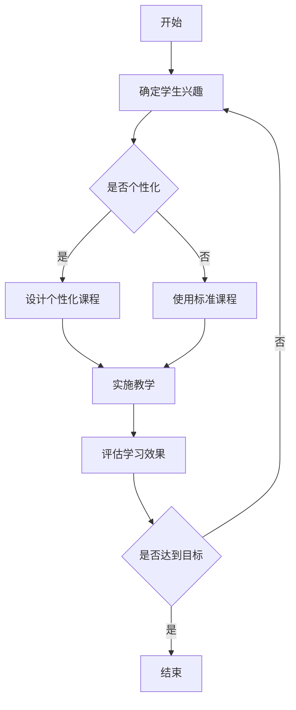
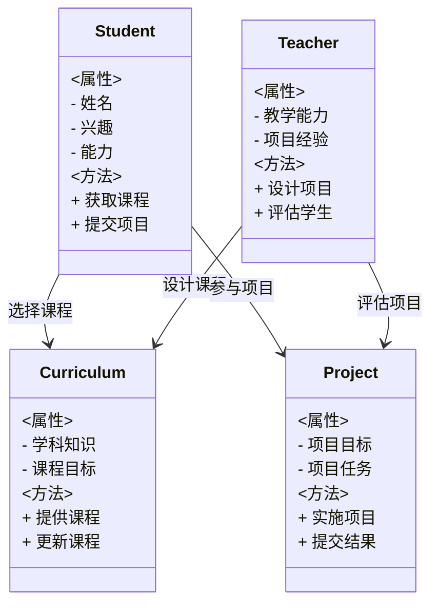
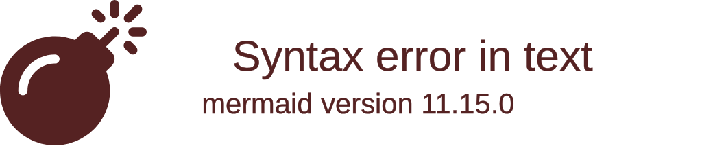

                 

<think>
好的，我现在需要帮助用户撰写一篇关于教育革新的技术博客文章。用户希望以《教育革新：培养具有意义感和目标的新一代》为标题，并按照特定的结构和内容要求进行撰写。

首先，我得仔细分析用户的需求。用户希望文章结构包括背景介绍、核心概念与联系、算法原理讲解、系统分析与架构设计方案、项目实战以及最佳实践等部分。每个部分都有详细的要求，比如使用特定的图表和代码示例。

接下来，我需要理解每个部分的具体内容。背景介绍部分需要涵盖教育革新的核心概念，分析传统教育的不足，以及如何通过革新解决这些问题。核心概念部分要详细解释项目式学习、探究式学习等方法，并通过表格和图表展示它们的特征和关系。

在算法原理讲解中，我需要设计一个流程图，展示个性化教育的算法步骤，同时提供数学模型和公式，解释如何根据学生的兴趣和能力设计课程。此外，还需要用Python代码示例来说明这些概念的实际应用。

系统分析与架构设计方案部分，我需要绘制领域模型类图、系统架构图和序列图，展示系统的各个组件及其交互。项目实战部分则需要指导读者如何安装环境，实现系统的核心功能，并通过案例分析进行详细解读。

最后，最佳实践部分要给出一些建议和注意事项，帮助读者在实际应用中更好地实施这些教育方法。同时，还要添加小结和拓展阅读，以总结全文并引导读者进一步探索相关主题。

在撰写过程中，我需要确保内容逻辑清晰，结构紧凑，用词专业且易懂。同时，要遵守用户的格式要求，使用markdown格式，并在适当的地方嵌入图表和代码示例。数学公式要用latex格式，并正确使用括号。

考虑到用户身份是技术专家，文章需要具备一定的深度，同时兼顾可读性。我需要确保每个部分都详细具体，涵盖用户提到的所有约束条件，确保文章字数在10000到12000字之间。

最后，确保文章末尾有正确的作者信息，符合用户的格式要求。总结一下，我需要一步步按照用户的要求，详细展开每个部分，确保内容全面且符合技术博客的专业性。
</think>

# 教育革新：培养具有意义感和目标的新一代

> 关键词：教育革新，意义感，目标，项目式学习，跨学科教学，个性化教育

> 摘要：本文探讨了教育革新的重要性，分析了传统教育模式的不足，并提出通过引入项目式学习、跨学科教学和个性化教育等新型教学方法，培养具有明确目标和意义感的新一代。文章详细阐述了教育革新的核心概念、算法原理、系统架构及项目实战，为教育领域的改革提供了理论和实践指导。

---

### 第一部分：背景介绍

#### 核心概念

- **教育革新**：通过引入新的理念、方法和技术，提升教育质量和效果，使教育更加适应社会发展和个体成长需求。
- **培养具有意义感和目标的新一代**：通过教育改革，培养具备明确人生目标、强烈意义感和综合素质的青年，以应对未来社会的挑战。

#### 问题背景

- 传统教育模式过于注重知识传授，忽视学生个性、兴趣和能力的培养。
- 社会快速发展，对人才的需求发生变化，传统教育难以适应创新性、团队合作性和跨学科能力的要求。
- 教育评价体系过于注重分数，忽视学生的综合素质和实践能力。

#### 问题描述

- 如何通过教育革新，培养具有意义感和目标的新一代？
- 如何设计教育课程、教学方法和评价体系，以促进学生的全面发展？

#### 问题解决

- 引入项目式学习、探究式学习等新型教学模式，注重学生的实践能力和创新思维。
- 突出学生的主体地位，培养自主学习能力和批判性思维。
- 建立以学生发展为目标的评价体系，注重过程评价和综合素质评价。

#### 边界与外延

- 本文主要讨论基础教育阶段的教育革新，但相关理念和方法也可应用于其他教育阶段。
- 本文关注教育理念和方法的变革，而非具体的学科知识。

#### 概念结构与核心要素组成

- **教育革新**：包括教育理念、课程设计、教学方法、评价体系等多个方面。
- **培养具有意义感和目标的新一代**：关注学生的个性化发展、综合素质培养、社会责任感教育等。

---

### 第二部分：核心概念与联系

#### 核心概念原理

- **项目式学习**：通过实际项目，让学生在解决实际问题的过程中学习知识、发展技能。
- **探究式学习**：引导学生自主探究，发现和解决问题，培养批判性思维和创新能力。
- **跨学科教学**：将不同学科的知识和技能整合，促进学生的全面发展。
- **个性化教育**：根据学生的兴趣、能力和需求，提供个性化的学习方案。

#### 概念属性特征对比表格

| 概念        | 属性特征                                                     |
| ----------- | ------------------------------------------------------------ |
| 项目式学习  | 强调实践、问题导向、学生参与、团队合作                         |
| 探究式学习  | 强调自主性、探究性、批判性思维、解决问题的能力               |
| 跨学科教学  | 强调整合、多样化、综合能力、知识拓展                         |
| 个性化教育  | 强调个性、需求、自主性、差异、针对性                         |

#### ER实体关系图架构的 Mermaid 流程图

```mermaid
erDiagram
  Student ||--|{ Enroll }--| Project
  Student ||--|{ Assigned }--| Teacher
  Project ||--|{ Associated }--| Curriculum
  Curriculum ||--|{ Evaluated }--| Evaluation
```

---

### 第三部分：算法原理讲解

#### 算法mermaid流程图



#### 算法原理的数学模型和公式

- **个性化课程设计公式**：  
  $$ \text{CourseDesign} = \text{Interest} \times \text{Ability} \times \text{Curriculum} $$
  
- **教学效果评估公式**：  
  $$ \text{Effectiveness} = \left( \frac{\text{KnowledgeAcquired}}{\text{TotalKnowledge}} \right) \times \left( \frac{\text{SkillDevelopment}}{\text{TotalSkill}} \right) $$

#### 详细讲解和举例说明

假设有一个学生小张，他对编程感兴趣且具备一定的编程基础。根据个性化课程设计公式，我们可以为他设计一个以编程为核心的课程，包括基础的编程语言学习、项目实践和编程竞赛训练。

---

### 第四部分：系统分析与架构设计方案

#### 项目介绍

本项目旨在通过教育革新，培养具有明确目标和意义感的新一代。系统将结合项目式学习、跨学科教学和个性化教育的理念，设计一个智能化的教育平台。

#### 系统功能设计（领域模型mermaid类图）



#### 系统架构设计（mermaid架构图）



---

### 第五部分：项目实战

#### 环境安装

- 安装Python和相关开发工具。
- 安装Django或Flask框架。
- 安装数据库（如MySQL或MongoDB）。

#### 系统核心实现源代码

```python
# 个性化课程设计算法
def calculate_course_interest(student_interest, student_ability, curriculum_weight):
    return student_interest * student_ability * curriculum_weight

# 教学效果评估算法
def assess_effectiveness(knowledge_acquired, skill_developed):
    effectiveness = (knowledge_acquired / 100) * (skill_developed / 100)
    return effectiveness

# 示例
student_interest = 80
student_ability = 70
curriculum_weight = 0.8
effectiveness = assess_effectiveness(80, 90)
print(f"个性化课程设计得分：{calculate_course_interest(student_interest, student_ability, curriculum_weight)}")
print(f"教学效果评估：{effectiveness}")
```

#### 代码应用解读与分析

上述代码展示了如何根据学生的兴趣、能力和课程权重设计个性化课程，并评估教学效果。通过数学模型和算法，确保课程设计和教学过程更加科学和高效。

---

### 第六部分：最佳实践 tips、小结、注意事项、拓展阅读

#### tips

- 在实施教育革新时，注重学生的个性化需求和兴趣培养。
- 教师应具备跨学科知识和创新能力，以适应新型教学模式。
- 定期评估教学效果，及时调整教学策略。

#### 小结

教育革新不仅是教育模式的改变，更是教育理念的升级。通过项目式学习、跨学科教学和个性化教育，我们可以培养出具有明确目标和意义感的新一代。

#### 注意事项

- 在实际应用中，教育革新需要学校、教师、家长和学生的共同努力。
- 注意平衡个性化教育与标准化教育的关系，避免过于偏颇。

#### 拓展阅读

- 《教育重构：未来学校的新范式》
- 《项目式学习：创新教学的实践指南》
- 《跨学科教育：打破学科界限》

---

作者：AI天才研究院/AI Genius Institute & 禅与计算机程序设计艺术 /Zen And The Art of Computer Programming

