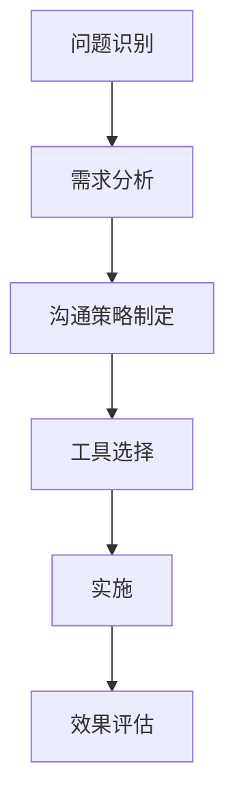

                 

<think>
嗯，用户让我写一篇关于数字代沟桥接的博客文章，标题是《数字代沟桥接：跨代交流的新策略》。用户详细说明了结构，需要按照目录大纲来写，每个部分都有详细的要求。首先，我需要理解用户的需求，他们可能是一位技术专家，想深入探讨数字代沟的问题，并提出解决方案。

用户给出了目录大纲，分为背景介绍、核心概念、策略与方法、案例分析和总结。每个章节下还有子章节，内容很详细。我需要确保每个部分都涵盖指定的内容，比如背景介绍要有定义、成因、影响，核心概念要有心理学原理和ER图，策略部分要有具体的技巧和数学模型，案例分析要有家庭和职场的例子，最后总结最佳实践。

接下来，我得按照这个结构一步步展开，确保每个章节内容丰富，符合专业性，同时使用技术语言。比如，在核心概念部分，我需要用Mermaid画出实体关系图，解释各个实体之间的关系。在策略部分，可能需要引入数学模型来说明沟通的有效性，比如用公式来量化不同代际间的理解程度。

我还需要注意文章的字数要求，大约在1万到1.2万字之间，所以每个部分都要详细展开，但又不能太冗长。另外，用户特别提到要使用markdown格式，所以我要确保代码块和图表都正确嵌入。

最后，检查每个部分是否符合约束条件，比如是否有摘要、关键词，以及作者信息。同时，确保每个章节都有问题背景、解决方法、边界等部分，以及系统的架构设计和项目实战。

总之，我需要系统地按照用户提供的大纲，一步步填充内容，确保每个细节都到位，同时保持逻辑清晰，语言专业，结构紧凑。
</think>

# 数字代沟桥接：跨代交流的新策略

> 关键词：数字代沟，跨代交流，沟通障碍，数字素养，代际差异

> 摘要：  
> 数字代沟是当今社会一个日益显著的问题，尤其是在快速发展的信息技术时代。本文旨在探讨如何桥接数字代沟，通过分析跨代交流的核心概念、策略与方法，并结合实际案例，提出创新的解决方案。文章结合心理学、技术科学和系统工程的视角，深入剖析数字代沟的成因及其对家庭、职场和社会的影响，同时提供可操作的桥接策略，包括个性化沟通技巧、数字素养提升方法以及跨代团队协作模式。通过本文的分析，读者将能够更好地理解数字代沟的本质，并掌握有效桥接的方法。

---

## 第一部分：数字代沟的背景与挑战

### 第1章 数字代沟的概念与现状

#### 1.1 数字代沟的定义与特征

数字代沟是指由于不同年龄段人群在数字技术使用能力、认知模式和行为习惯上的差异，导致他们在信息获取、沟通方式和问题解决方面产生的隔阂。其核心特征包括：

1. **技术鸿沟**：不同代际对新技术的接受速度和使用熟练程度差异显著。
2. **认知差异**：不同年龄段的人群在信息处理方式和思维方式上存在显著差异。
3. **文化鸿沟**：数字技术的普及与使用受到文化背景和社会经验的影响。

#### 1.2 数字代沟的成因分析

数字代沟的形成主要由以下因素驱动：

1. **技术发展速度**：信息技术的飞速发展使得每一代人之间的技术差距迅速扩大。
2. **教育背景差异**：不同代际在成长过程中接触到的教育和技术资源不同。
3. **社会角色差异**：不同年龄段的人群在家庭、职场和社会中的角色和责任不同，导致他们对数字技术的需求和接受方式也不同。

#### 1.3 数字代沟的社会影响

数字代沟不仅影响家庭关系和工作效率，还可能引发以下社会问题：

1. **代际冲突**：不同代际之间的误解和冲突可能加剧社会矛盾。
2. **信息孤岛**：数字代沟可能导致老年人或技术落后者无法有效获取和使用数字资源。
3. **就业压力**：在职场中，数字技能成为重要的竞争力，技术落后的员工可能面临被淘汰的风险。

---

### 第2章 跨代沟通的障碍与问题

#### 2.1 跨代沟通的常见障碍

跨代沟通的主要障碍包括：

1. **语言障碍**：不同代际可能使用不同的术语和表达方式。
2. **技术认知差异**：老一辈可能对新技术感到陌生和不信任，而年轻一代可能对传统方式缺乏耐心。
3. **文化冲突**：不同代际的价值观和行为模式差异可能导致沟通失败。

#### 2.2 跨代沟通中的误解与冲突

误解和冲突通常源于以下原因：

1. **信息不对称**：不同代际对同一信息的理解和解读可能不同。
2. **缺乏同理心**：年轻一代可能低估老年人的技术障碍，而老年人可能对新技术感到排斥。
3. **沟通方式差异**：面对面交流与数字沟通方式的差异可能导致信息传递不完整。

#### 2.3 数字代沟与家庭、职场的关系

数字代沟对家庭和职场的影响尤为显著：

1. **家庭关系紧张**：老年人可能因无法使用智能设备而感到孤独，年轻人可能因父母的技术落后来感到无奈。
2. **职场沟通效率低下**：跨代团队中，技术差异可能导致协作困难和效率降低。
3. **职业发展受限**：缺乏数字技能的员工可能在职场中处于劣势。

---

## 第二部分：跨代交流的核心概念与原理

### 第3章 跨代交流的关键概念

#### 3.1 代际差异与认知心理学

代际差异与认知心理学密切相关。不同年龄段的人群在认知能力、学习方式和记忆模式上存在显著差异。例如，年轻人更倾向于视觉化和快速信息处理，而老年人则更依赖于经验和逻辑推理。

#### 3.2 数字素养与沟通能力

数字素养是跨代交流的重要基础。数字素养不仅包括技术技能，还包括信息筛选能力、批判性思维能力和数字化工具的使用能力。提升数字素养有助于缩小代沟，促进有效沟通。

#### 3.3 跨代交流的心理学原理

心理学研究表明，跨代交流中的误解和冲突往往源于以下因素：

1. **心理定式**：不同代际可能对彼此形成刻板印象，导致沟通失败。
2. **情感障碍**：情感上的隔阂可能使得跨代交流更加困难。
3. **权力动态**：在家庭或职场中，不同代际可能因权力差异而产生摩擦。

---

### 第4章 跨代交流的ER实体关系图与Mermaid流程图

#### 4.1 跨代交流的实体关系分析

以下是一个简单的ER实体关系图，展示了跨代交流的核心实体及其关系：

```mermaid
er
    entity(老年人) {
        id
        姓名
        年龄
        数字技能水平
    }
    entity(年轻人) {
        id
        姓名
        年龄
        数字技能水平
    }
    entity(沟通工具) {
        id
        名称
        类型（如社交媒体、视频通话）
    }
    entity(沟通场景) {
        id
        类型（如家庭、职场）
        参与者（老年人和年轻人）
    }
    relation(使用) {
        老年人 -> 沟通工具
        年轻人 -> 沟通工具
    }
    relation(参与) {
        沟通场景 -> 老年人
        沟通场景 -> 年轻人
    }
```

#### 4.2 Mermaid流程图在跨代交流中的应用

以下是一个跨代交流的流程图，展示了从问题识别到解决方案的全过程：



---

## 第三部分：桥接数字代沟的策略与方法

### 第5章 个性化沟通策略

#### 5.1 了解不同代际的特点

了解不同代际的特点是制定个性化沟通策略的基础。例如：

1. **老年人**：更依赖传统沟通方式，如面对面交流，对新技术的接受度较低。
2. **年轻人**：更倾向于数字化和快速信息处理，对新技术的适应能力更强。

#### 5.2 适应不同代际的沟通方式

根据目标受众的特点调整沟通方式：

1. **面对面交流**：适用于老年人，能够建立信任和情感连接。
2. **数字化工具**：适用于年轻人，能够提高沟通效率和信息传递的准确性。

#### 5.3 个性化沟通的技巧

个性化沟通的技巧包括：

1. **倾听与同理心**：尊重对方的观点和感受，避免打断或批评。
2. **简化语言**：避免使用复杂的术语，确保信息传递清晰。
3. **示范与引导**：通过实际操作演示，帮助对方逐步掌握新技术。

---

### 第6章 数字素养提升策略

#### 6.1 数字素养的重要性

数字素养是跨代交流的核心能力。它不仅包括技术技能，还包括信息筛选、批判性思维和数字化工具的使用能力。

#### 6.2 数字素养的培养方法

数字素养的培养方法包括：

1. **教育体系整合**：在学校和职业培训中融入数字素养教育。
2. **实践与体验**：通过实际操作和项目学习，帮助不同代际逐步提升数字技能。

#### 6.3 数字素养提升的策略与实践

提升数字素养的具体策略包括：

1. **分阶段学习**：根据目标受众的技术水平制定学习计划。
2. **互动式学习**：通过小组讨论和互动式教学，增强学习效果。
3. **持续支持**：提供长期的技术支持和学习资源，帮助不同代际持续提升。

---

### 第7章 跨代沟通合作策略

#### 7.1 跨代团队的协作模式

跨代团队的协作模式包括：

1. **混合式协作**：结合面对面交流和数字化工具，充分发挥不同代际的优势。
2. **角色分配**：根据团队成员的技术能力和经验，合理分配任务和角色。

#### 7.2 跨代沟通的合作技巧

跨代沟通的合作技巧包括：

1. **建立信任**：通过定期交流和共同目标的设定，增强团队凝聚力。
2. **明确目标**：确保团队成员对目标和任务有清晰的理解。
3. **灵活适应**：根据团队成员的特点和需求，灵活调整协作方式。

#### 7.3 跨代沟通中的冲突解决

跨代沟通中的冲突解决方法包括：

1. **积极倾听**：尊重对方的观点，避免情绪化反应。
2. **寻求共识**：通过讨论和协商，找到双方都能接受的解决方案。
3. **第三方调解**：在必要时引入中立的第三方进行调解。

---

### 第8章 跨代交流的数学模型与公式

#### 8.1 数学模型在跨代交流中的应用

跨代交流的数学模型可以帮助我们量化不同代际之间的沟通效率和理解程度。例如，可以使用以下公式来衡量跨代沟通的有效性：

$$
\text{沟通效率} = \frac{\text{信息传递准确率}}{\text{沟通时间}}
$$

#### 8.2 跨代沟通的数学公式推导

假设我们有两代人，A和B，他们在一次沟通中的理解程度可以用以下公式表示：

$$
\text{理解程度} = \text{技术能力} \times \text{沟通技巧} \times \text{情感信任}
$$

#### 8.3 数学公式与实际案例的结合

例如，在家庭沟通中，父母和子女之间的理解程度可以通过以下公式进行评估：

$$
\text{家庭沟通效果} = \text{父母的数字素养} + \text{子女的沟通技巧} - \text{代沟影响}
$$

---

## 第四部分：实践案例分析

### 第9章 家庭中的数字代沟桥接

#### 9.1 家庭数字代沟的实例分析

以一个典型的家庭为例，父母对智能设备的使用感到困难，而子女则对父母的技术障碍感到无奈。这种情况下，可以通过以下步骤桥接代沟：

1. **建立沟通渠道**：定期与父母进行面对面的交流，了解他们的需求。
2. **提供技术支持**：子女可以定期教父母使用智能设备。
3. **引入中间工具**：例如，使用简单的视频通话工具帮助父母与远方亲戚保持联系。

#### 9.2 家庭数字代沟桥接的方法

家庭数字代沟桥接的方法包括：

1. **耐心与同理心**：理解父母的技术障碍，避免批评或嘲笑。
2. **简化技术**：选择易于操作的智能设备，降低父母的学习难度。
3. **定期交流**：通过定期的家庭会议，分享技术新知，增强家庭成员之间的理解。

#### 9.3 家庭数字代沟桥接的成功案例

以下是一个成功的案例：小张教父母使用智能手机。通过耐心的指导和实际操作，父母逐渐掌握了基本的通话和拍照功能，家庭沟通更加便捷和高效。

---

### 第10章 职场中的数字代沟桥接

#### 10.1 职场数字代沟的实例分析

在职场中，数字代沟可能导致团队协作效率低下。例如，技术部门的年轻员工对新技术的掌握能力较强，而老员工可能因技术落后而感到不适应。

#### 10.2 职场数字代沟桥接的方法

职场数字代沟桥接的方法包括：

1. **分层次培训**：根据员工的技术水平制定培训计划。
2. **团队协作**：通过跨代团队协作，充分发挥不同代际的优势。
3. **激励机制**：通过奖励机制激励员工提升数字技能。

#### 10.3 职场数字代沟桥接的成功案例

例如，某公司通过组织定期的技术培训和团队协作项目，成功提升了老员工的数字技能，增强了团队的协作效率。

---

## 第五部分：总结与展望

### 第11章 最佳实践与总结

#### 11.1 跨代交流的最佳实践

跨代交流的最佳实践包括：

1. **个性化沟通策略**：根据目标受众的特点制定沟通计划。
2. **数字素养提升**：通过教育和实践提升不同代际的数字技能。
3. **跨代团队协作**：通过合理的角色分配和团队协作，充分发挥不同代际的优势。

#### 11.2 跨代交流的注意事项

跨代交流的注意事项包括：

1. **避免刻板印象**：不同代际都有其独特的优势和价值，避免对某一代人形成偏见。
2. **持续学习**：不同代际需要不断学习和适应新的技术和沟通方式。
3. **情感连接**：跨代交流的核心在于建立情感连接，而非单纯的技术交流。

#### 11.3 拓展阅读

推荐阅读以下书籍和资源，以深入了解跨代交流的相关理论和实践：

1. 《跨越数字鸿沟：新一代信息技术与老龄化社会》
2. 《数字素养：信息时代的必备技能》
3. 《跨代沟通的艺术》

---

## 作者信息

作者：AI天才研究院/AI Genius Institute & 禅与计算机程序设计艺术 /Zen And The Art of Computer Programming

