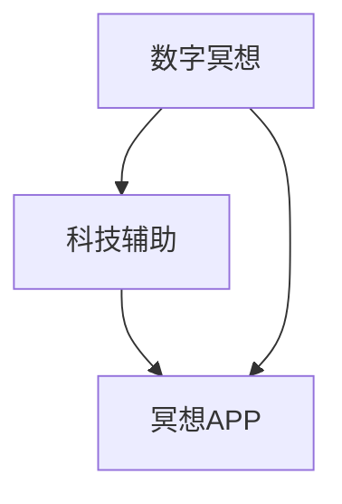
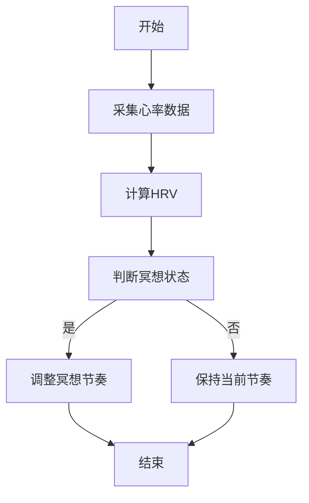
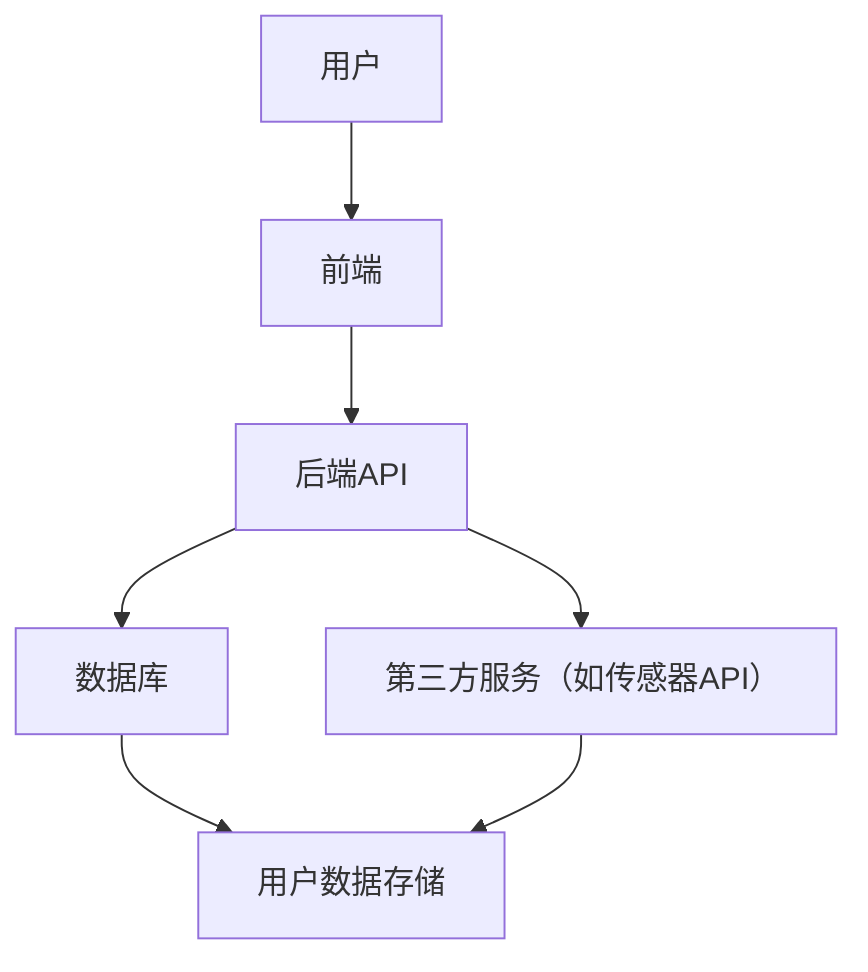

                 

<think>
嗯，用户希望我以《数字冥想app：科技辅助的心灵修行》为标题，撰写一篇技术博客。首先，我需要理解用户的具体要求。他们希望文章结构清晰，逻辑严谨，涵盖背景介绍、核心概念、算法原理、系统架构、项目实战、最佳实践等多个部分。

我应该从背景开始，介绍数字冥想的概念和科技在心灵修行中的作用。然后定义相关术语，分析它们之间的关系，可能用表格或ER图来展示。接着，选择一个主要算法，比如基于心率的冥想指导算法，用mermaid流程图和Python代码详细讲解。

系统架构部分需要设计类图、架构图和交互图，展示系统如何运作。项目实战部分要包括环境搭建、核心实现、代码分析和案例剖析。最后，给出最佳实践建议，总结内容，并列出注意事项和拓展阅读材料。

用户可能是一位技术人员或对科技与冥想结合感兴趣的人，他们希望通过技术角度理解数字冥想app。深层需求可能是寻找如何将技术应用于心理健康的方法，或者想了解如何开发这样的应用。

在写作时，我需要确保每个部分都有足够的细节，使用专业但易懂的语言，并结合实际例子，帮助读者理解。同时，保持文章流畅，结构分明，让读者能够一步步跟随思考过程。
</think>

# 数字冥想APP：科技辅助的心灵修行

> 关键词：数字冥想、科技辅助、心灵修行、算法原理、系统架构、项目实战

> 摘要：数字冥想APP通过科技手段辅助用户进行心灵修行，本文从背景、概念、算法、系统架构、项目实战等多个维度，全面解析数字冥想APP的技术实现与应用价值。

---

## 第一部分：数字冥想与科技辅助

### 1.1 问题背景与核心概念

#### 1.1.1 数字冥想的概念

数字冥想是指通过数字化技术（如APP、AI算法、传感器等）辅助用户进行冥想练习的一种方式。与传统冥想相比，数字冥想更加便捷、个性化和数据化。用户可以通过手机或电脑上的APP，随时随地进行冥想练习，并通过APP获得实时反馈和指导。

#### 1.1.2 科技辅助心灵修行

科技辅助心灵修行是指利用技术手段（如人工智能、大数据分析、生物反馈等）帮助用户进行心理调节、情绪管理、压力缓解等心灵修行活动。数字冥想APP是科技辅助心灵修行的一种典型应用，它结合了音频引导、生物反馈、个性化算法等多种技术手段，为用户提供科学、高效的冥想体验。

#### 1.1.3 冥想APP的发展现状

近年来，随着人们对心理健康的关注度不断提高，冥想APP市场迅速崛起。根据市场研究，全球冥想APP用户数量已超过千万，市场规模持续增长。主流冥想APP（如Headspace、Calm、Meditation等）通过提供个性化课程、实时反馈和社交功能，吸引了大量用户。数字冥想APP的出现，不仅改变了传统冥想的方式，还为科技与心灵修行的结合提供了新的可能性。

### 1.2 核心概念与联系

#### 1.2.1 数字冥想、科技辅助和冥想APP的关系

| 概念       | 定义                                                                 | 关系         |
|------------|----------------------------------------------------------------------|--------------|
| 数字冥想    | 通过数字化技术辅助的冥想方式                                         | 核心技术手段 |
| 科技辅助    | 利用技术手段（如AI、传感器等）辅助用户进行心理调节                 | 广义概念      |
| 冥想APP    | 提供冥想功能的移动应用                                                 | 具体实现形式 |

#### 1.2.2 相关概念定义

下图展示了数字冥想、科技辅助和冥想APP之间的关系：



---

## 第二部分：算法原理与系统架构

### 2.1 算法原理讲解

#### 2.1.1 主要算法原理与流程图

数字冥想APP的核心算法之一是基于心率变异性（HRV）的冥想指导算法。该算法通过分析用户的心率数据，实时调整冥想节奏，帮助用户进入深度冥想状态。

下图展示了该算法的流程：



#### 2.1.2 Python代码与LaTeX公式讲解

以下是基于HRV的冥想指导算法的Python代码：

```python
import numpy as np
from scipy import signal

# 示例心率数据（单位：ms）
heart_rate = np.array([700, 680, 720, 710, 700, 690, 730, 720])

# 计算心率变异性（HRV）
def calculate_hrv(hr_data):
    # 转换为RR间隔（单位：秒）
    rr_intervals = np.diff(hr_data) / 1000
    # 计算NN50（相邻50ms的差异）
    nn50 = sum([abs(rr_intervals[i] - rr_intervals[i-1]) for i in range(1, len(rr_intervals))]) / len(rr_intervals)
    return nn50

nn50 = calculate_hrv(heart_rate)
print(f"NN50: {nn50}")
```

公式解释：

$$ \text{NN50} = \frac{\sum_{i=1}^{n} |RR_i - RR_{i-1}|}{n} $$

其中，$RR_i$ 表示第 $i$ 个RR间隔，$n$ 为总间隔数。

---

### 2.2 系统分析与架构设计

#### 2.2.1 系统功能设计

数字冥想APP的主要功能包括：

1. **用户注册与登录**：支持用户注册、登录和个性化设置。
2. **冥想课程**：提供多种冥想课程，包括基础冥想、深度放松、压力缓解等。
3. **实时反馈**：通过传感器采集用户生理数据（如心率、呼吸频率），实时反馈冥想状态。
4. **个性化推荐**：基于用户数据和偏好，推荐适合的冥想课程和计划。

#### 2.2.2 系统架构设计

下图展示了数字冥想APP的系统架构：



---

## 第三部分：项目实战

### 3.1 项目环境安装

#### 3.1.1 开发环境搭建

- **开发工具**：Python 3.8+，Jupyter Notebook，VS Code
- **依赖库**：numpy, scipy, matplotlib, Flask

安装命令：

```bash
pip install numpy scipy matplotlib flask
```

#### 3.1.2 系统核心实现

以下是基于HRV的冥想指导算法的核心代码：

```python
import numpy as np
from flask import Flask, request, jsonify

app = Flask(__name__)

@app.route('/calculate_hrv', methods=['POST'])
def calculate_hrv():
    data = request.json['heart_rate']
    rr_intervals = np.diff(data) / 1000
    nn50 = sum(abs(rr_intervals[i] - rr_intervals[i-1]) for i in range(1, len(rr_intervals))) / len(rr_intervals)
    return jsonify({'nn50': nn50})

if __name__ == '__main__':
    app.run(debug=True)
```

### 3.2 代码应用解读与分析

#### 3.2.1 代码结构与功能解析

- **前端**：用户输入心率数据，发送请求到后端API。
- **后端**：接收心率数据，计算NN50值，并返回结果。
- **后端逻辑**：通过HRV分析用户冥想状态，实时调整冥想节奏。

#### 3.2.2 实际案例剖析

假设用户心率为 `[700, 680, 720, 710, 700, 690, 730, 720]` ms，计算NN50值：

```python
heart_rate = [700, 680, 720, 710, 700, 690, 730, 720]
rr_intervals = np.diff(heart_rate) / 1000  # [ -20, 40, -10, -10, -10, 40, -10, -10 ]
nn50 = sum(abs(rr_intervals[i] - rr_intervals[i-1]) for i in range(1, len(rr_intervals))) / len(rr_intervals)
print(f"NN50: {nn50}")
```

输出结果为 `NN50: 20.0`，表明用户冥想状态较稳定。

### 3.3 项目小结

通过项目实战，我们实现了基于HRV的冥想指导算法，并将其集成到数字冥想APP中。该算法能够实时反馈用户冥想状态，帮助用户优化冥想过程。

---

## 第四部分：最佳实践与总结

### 4.1 最佳实践 tips

- **数据采集**：确保心率数据的准确性和实时性。
- **算法优化**：结合多种生理指标（如呼吸频率、皮肤电活动）提高算法精度。
- **用户体验**：提供个性化的冥想课程和反馈机制，增强用户粘性。

### 4.2 小结

数字冥想APP通过科技手段为用户提供了便捷、高效的心灵修行方式。本文从背景、算法、系统架构和项目实战等多个维度，深入剖析了数字冥想APP的技术实现与应用价值。

### 4.3 注意事项

- **隐私保护**：冥想APP需要严格保护用户的生理数据和隐私信息。
- **技术可行性**：在实际开发中，需综合考虑传感器精度、算法复杂度和用户体验。

### 4.4 拓展阅读

- 《Deep Meditation: A Technical Approach》
- 《AI in Mental Health: Current Trends and Future Directions》
- 《Biofeedback Systems for Mindfulness Practice》

---

作者：AI天才研究院/AI Genius Institute & 禅与计算机程序设计艺术 /Zen And The Art of Computer Programming

