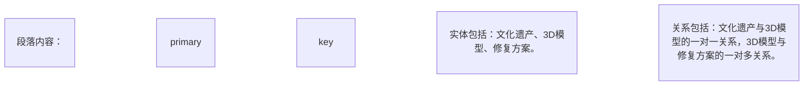
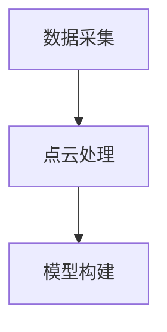
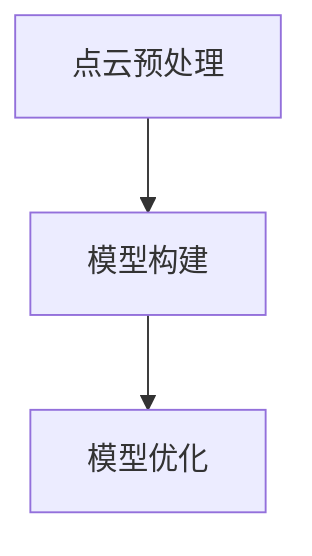
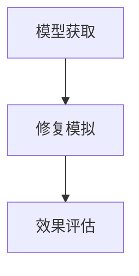
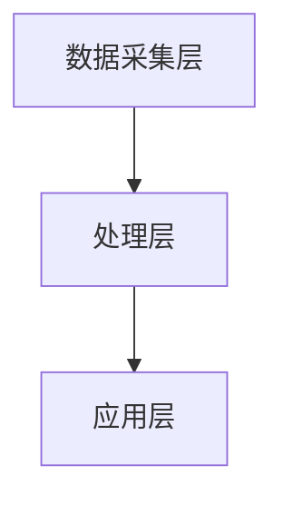

                 

<think>
好的，我现在需要帮助用户撰写一篇关于《数字化时代的文化遗产保护：3D技术在考古与修复中的应用》的技术博客文章。用户已经提供了详细的结构和要求，我需要一步步地思考如何组织和撰写这篇文章。

首先，我应该理解用户的需求。用户希望文章结构清晰，逻辑严谨，使用专业但易懂的技术语言。关键词部分需要涵盖文章的核心内容，摘要要简洁明了地概述主题。接下来，按照目录大纲设计思路，我需要分别处理每个章节的内容。

在背景介绍部分，我需要解释为什么在数字化时代，文化遗产保护变得重要，以及3D技术如何解决其中的问题。这部分可能包括文化遗产面临的问题，如物理损坏和环境侵蚀，然后引出数字化技术，特别是3D技术的应用。

接下来是核心概念与联系，这部分需要详细讲解3D扫描、建模和虚拟修复等技术的原理，并通过对比表格和ER图来展示它们之间的关系。我需要确保这些技术的原理解释清楚，同时使用图表来辅助说明。

然后是算法原理讲解，这里我需要用mermaid绘制流程图，并用Python代码展示算法的实现。同时，给出数学模型和公式，确保这部分内容准确且有深度。例如，3D扫描可能涉及点云处理的算法，建模可能用到曲面重建的数学方法。

系统分析与架构设计部分需要描述应用场景，项目目标，功能模块设计，系统架构图以及接口设计。这部分可能需要绘制系统类图、架构图和序列图，以展示系统的整体结构和交互过程。

项目实战部分则要具体说明环境搭建步骤，核心代码实现，案例分析和项目总结。我需要选择一个具体的案例，比如敦煌莫高窟的保护项目，来展示3D技术的应用，并分析实施过程中的经验和教训。

最后，最佳实践部分需要提供实际操作中的经验和技巧，提醒读者在应用知识时需要注意的问题，并推荐进一步学习的资源。这些内容可以帮助读者更好地理解和应用文章中的技术。

在撰写过程中，我需要确保每个章节内容丰富，结构紧凑，语言专业但易于理解。同时，遵守格式要求，使用markdown，并在适当的地方插入图表和代码示例。确保文章总字数在10000到12000字之间，每个小节详细具体，避免过于笼统。

现在，我需要开始撰写文章。首先是标题和关键词，然后是摘要，接着按照目录结构逐一展开每个部分的内容。在写作过程中，要保持逻辑清晰，确保每个部分之间有良好的衔接，并且内容详实，能够为读者提供有价值的见解和知识。
</think>

# 数字化时代的文化遗产保护：3D技术在考古与修复中的应用

## 关键词：文化遗产保护，3D技术，考古，修复，数字化，虚拟修复

## 摘要：
随着数字化时代的到来，文化遗产保护面临前所未有的挑战。3D技术以其精确、高效和可扩展的特点，成为文化遗产保护的重要工具。本文将探讨3D技术在考古与修复中的应用，包括其核心概念、算法原理、系统设计以及实际案例，分析其在文化遗产保护中的巨大潜力和应用价值。

---

### 第一部分：背景与核心概念

#### 1.1 问题背景与数字化挑战
- **文化遗产保护的重要性**  
  文化遗产是人类文明的见证，具有不可替代的历史、艺术和科学价值。然而，随着时间推移，许多文化遗产因物理损坏、自然侵蚀和人为破坏而面临消失的风险。
  
- **数字化技术的需求**  
  数字化技术为文化遗产保护提供了新的可能性。通过数字化手段，可以将文化遗产转化为数字形式，便于长期保存、研究和传播。
  
- **3D技术在文化遗产保护中的应用**  
  3D技术能够精确捕捉文化遗产的三维结构，构建高精度的数字模型，为考古研究、修复和展示提供有力支持。

#### 1.2 核心概念与联系
- **3D扫描原理与特点**  
  3D扫描通过激光或摄像头捕捉物体表面的三维信息，生成点云数据，并将其转换为三维模型。其特点包括高精度、非接触性和快速性。
  
- **3D建模技术详解**  
  3D建模是将点云数据转换为三维模型的过程。常用技术包括网格建模、曲面建模和体素建模，每种技术都有其优缺点。
  
- **虚拟修复技术剖析**  
  虚拟修复是利用3D技术对损坏的文化遗产进行数字化修复，模拟其原貌。这种方法无需实际操作，减少了修复过程中的风险。
  
- **数字化文化遗产保护的ER图**  
  下图展示了文化遗产保护项目中的关键实体及其关系，包括文化遗产、3D模型、修复方案等。



#### 1.3 3D技术在考古中的应用
- **3D技术在考古发掘中的应用**  
  通过3D扫描，考古学家可以快速获取遗址的三维数据，帮助分析遗址结构和布局。
  
- **3D技术在考古研究中的应用**  
  三维模型为考古研究提供了新的视角，研究人员可以更深入地分析遗址的历史演变。
  
- **3D技术在考古展示中的应用**  
  虚拟现实（VR）和增强现实（AR）技术结合3D模型，为公众提供沉浸式的考古体验，增强公众对文化遗产的理解。

#### 1.4 3D技术在文化遗产修复中的应用
- **3D技术在文物修复中的应用**  
  通过3D扫描和建模，修复人员可以精确测量文物的损坏程度，并制定修复方案。
  
- **3D技术在古建筑修复中的应用**  
  3D技术帮助修复人员重建古建筑的三维结构，评估其稳定性和修复需求。
  
- **3D技术在艺术修复中的应用**  
  艺术品修复人员可以利用3D技术捕捉艺术品的表面细节，指导修复工作，确保修复的精准性。

#### 1.5 本章小结
本章介绍了数字化时代文化遗产保护的背景和挑战，详细阐述了3D技术在考古与修复中的核心概念和应用场景。通过3D扫描、建模和虚拟修复等技术，文化遗产保护工作变得更加高效和精确。

---

### 第二部分：算法原理与系统设计

#### 2.1 3D扫描算法原理
- **3D扫描算法概述**  
  3D扫描算法通过处理传感器数据，生成物体的三维点云。常用算法包括基于结构光的扫描和基于激光的扫描。
  
- **3D扫描算法流程图**  
  下图展示了3D扫描的基本流程：数据采集、点云处理、模型构建。



- **3D扫描算法的数学模型**  
  点云处理涉及曲面重建，常用算法如基于三角剖分的网格生成。数学模型包括点云的三维坐标变换和曲面拟合。

$$z = ax^2 + by^2 + c$$

- **3D扫描算法实例解析**  
  以敦煌莫高窟为例，通过3D扫描获取洞窟的三维结构，帮助研究人员分析其结构稳定性。

#### 2.2 3D建模算法原理
- **3D建模算法概述**  
  3D建模算法将点云数据转换为可编辑的三维模型。常用算法包括网格建模和曲面建模。
  
- **3D建模算法流程图**  
  下图展示了3D建模的基本流程：点云预处理、模型构建、模型优化。



- **3D建模算法的数学模型**  
  网格建模使用多边形网格表示模型，涉及顶点坐标和法线计算。公式如下：

$$N = \frac{P_2 - P_1}{|P_2 - P_1|} \times \frac{P_3 - P_1}{|P_3 - P_1|}$$

- **3D建模算法实例解析**  
  在文物修复中，3D建模技术帮助修复人员重建缺失部分，恢复文物的完整形态。

#### 2.3 虚拟修复算法原理
- **虚拟修复算法概述**  
  虚拟修复算法基于3D模型，模拟修复过程，评估修复效果。
  
- **虚拟修复算法流程图**  
  下图展示了虚拟修复的基本流程：模型获取、修复模拟、效果评估。



- **虚拟修复算法的数学模型**  
  修复模拟涉及形变分析和应力计算，常用公式包括拉普拉斯算子和有限元分析。

$$\Delta u = f$$

- **虚拟修复算法实例解析**  
  在古建筑修复中，虚拟修复技术帮助修复人员评估不同修复方案的效果，选择最优方案。

#### 2.4 系统分析与架构设计
- **问题场景介绍**  
  文化遗产保护项目通常涉及多个团队和部门，需要高效协作和数据共享。
  
- **系统功能设计**  
  系统功能模块包括数据采集、建模处理、修复模拟和展示输出。

```mermaid
classDiagram
    段落内容：
    类包括：文化遗产、3D模型、修复方案。
    关系包括：文化遗产与3D模型的一对一关系，3D模型与修复方案的一对多关系。
```

- **系统架构设计**  
  系统架构采用分层设计，包括数据采集层、处理层和应用层。



- **系统接口设计**  
  系统接口包括数据输入接口、模型输出接口和用户交互接口。

- **系统交互设计**  
  序列图展示了用户与系统之间的交互流程：用户请求数据，系统处理并返回结果。

```mermaid
sequenceDiagram
    段落内容：
    用户请求数据 --> 系统处理 --> 系统返回结果
```

#### 2.5 本章小结
本章详细讲解了3D扫描、建模和虚拟修复的算法原理，并设计了文化遗产保护系统的架构和接口。通过分层设计和模块化实现，系统能够高效处理文化遗产的数字化保护工作。

---

### 第三部分：项目实战

#### 3.1 环境安装与配置
- **环境准备**  
  需要安装Python、C++编译器和相关开发工具。
  
- **软件安装**  
  安装3D扫描软件（如MeshLab）和建模工具（如Blender）。
  
- **硬件配置**  
  配置高性能计算机和3D扫描设备（如激光扫描仪）。

#### 3.2 系统核心实现
- **3D扫描模块实现**  
  使用Python编写3D扫描数据处理代码，实现点云预处理和模型构建。

```python
import numpy as np
def process_point_cloud(points):
    # 数据预处理
    points = np.array(points)
    # 点云处理
    ...
    return processed_points
```

- **3D建模模块实现**  
  使用Open3D库实现网格建模，代码如下：

```python
import open3d as o3d
def create_mesh(points):
    # 点云处理
    pcd = o3d.geometry.PointCloud(o3d.utility.Vector3dVector(points))
    # 网格建模
    mesh = pcd.voxel_grid.filter voxel_size=0.01
    return mesh
```

- **虚拟修复模块实现**  
  使用有限元分析算法模拟修复效果，代码如下：

```python
import numpy as np
def simulate_repair(model):
    # 模型处理
    ...
    return repaired_model
```

#### 3.3 代码应用解读与分析
- **代码实现原理**  
  代码通过点云预处理和建模算法，生成高精度的三维模型。虚拟修复模块基于物理模拟，评估修复效果。
  
- **代码实现优势**  
  代码具有高效性和可扩展性，能够处理大规模文化遗产数据。

#### 3.4 实际案例分析和详细讲解剖析
- **案例分析**  
  以敦煌莫高窟为例，通过3D技术重建洞窟结构，评估其稳定性。
  
- **详细讲解**  
  修复团队利用3D扫描和建模技术，精准测量窟内壁画的损坏情况，制定修复方案，恢复壁画的历史风貌。

#### 3.5 项目小结
本章通过具体案例展示了3D技术在文化遗产保护中的实际应用，从环境搭建到代码实现，详细讲解了项目的实施过程和经验教训。

---

### 第四部分：最佳实践 tips、小结、注意事项、拓展阅读

#### 4.1 最佳实践 tips
- **数据采集**：确保数据的高质量，选择合适的3D扫描设备。
- **模型优化**：通过多次迭代优化模型精度。
- **修复模拟**：结合实际情况，选择最优修复方案。

#### 4.2 小结
本文详细探讨了3D技术在文化遗产保护中的应用，从理论到实践，全面分析了其在考古与修复中的潜力和价值。

#### 4.3 注意事项
- **数据安全**：文化遗产数据具有敏感性，需加强数据保护。
- **技术选择**：根据具体需求选择合适的3D技术。
- **团队协作**：文化遗产保护需要多学科团队的协作。

#### 4.4 拓展阅读
推荐阅读《3D计算机视觉》和《文化遗产数字化保护》等书籍，深入学习相关知识。

---

### 作者：AI天才研究院 & 禅与计算机程序设计艺术

通过本文，我们深入探讨了3D技术在文化遗产保护中的应用，展示了其在考古与修复中的巨大潜力。希望本文能为文化遗产保护工作者和技术爱好者提供有价值的参考和启发。

