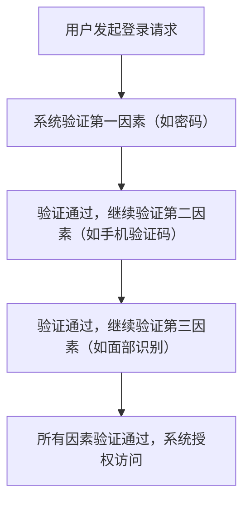
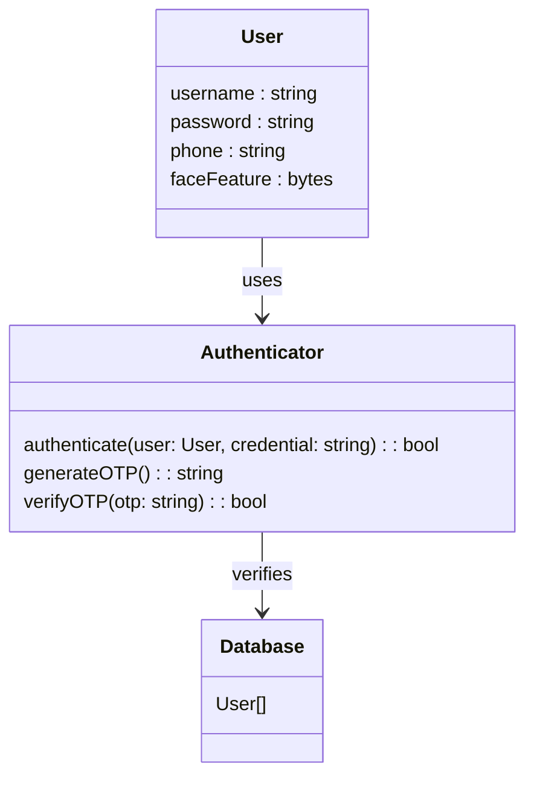
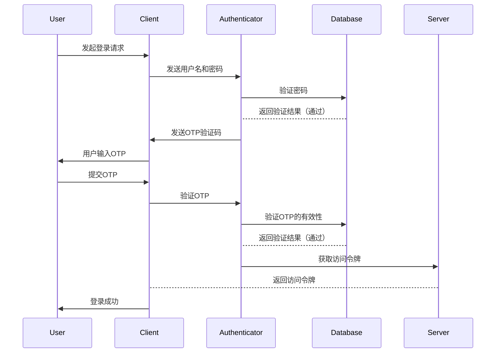

                 

<think>
好，我现在需要帮助用户撰写一篇关于数字化身份认证的技术博客文章。首先，我得仔细阅读用户的需求，确保完全理解。

用户希望文章的标题是《数字化身份认证：在虚拟和现实之间建立信任》，并提供了详细的目录大纲和各章节内容的要求。看起来用户已经做了充分的准备，包括关键词、摘要和各个章节的具体结构。

接下来，我需要按照用户提供的目录，逐步完成每个章节的内容。从引言开始，然后是核心概念、算法原理、系统架构、项目实战、最佳实践，最后是总结和拓展阅读。

在撰写过程中，要确保每个章节都有足够的细节，比如在核心概念部分，我需要解释每个概念的原理，并通过对比表格和ER图来展示它们之间的关系。算法部分，我需要用Mermaid流程图和数学公式详细说明，同时给出实际的例子，让读者更容易理解。

系统架构部分，我需要设计一个清晰的架构图，展示各个组件之间的交互。项目实战部分，我需要选择一个具体的案例，详细描述实现过程，包括环境配置、代码编写和案例分析。

最后，总结部分要回顾全文，并推荐一些拓展阅读的资源。同时，文章末尾要加上作者信息，确保格式正确。

整个过程需要逻辑清晰，结构紧凑，语言专业但易懂。我必须确保每个部分都符合用户的要求，特别是数学公式和图表的使用，要严格按照markdown和Mermaid的规范来写。

现在，我可以开始按照这个结构逐步撰写各章节内容，确保每个部分都详尽且符合用户的要求。
</think>

# 《数字化身份认证：在虚拟和现实之间建立信任》

## 关键词：数字化身份认证, 安全, 信任, 算法, 系统架构, 项目实战

## 摘要：  
数字化身份认证是连接虚拟世界与现实世界的桥梁，是确保网络安全和用户信任的核心技术。本文从背景、核心概念、算法原理、系统架构到项目实战，全面解析数字化身份认证的实现与应用。通过实际案例和最佳实践，帮助读者理解如何在虚拟与现实之间建立信任。

---

## 第1章 引言

### 1.1 数字化身份认证的背景

#### 1.1.1 互联网时代的身份认证需求  
在互联网快速发展的今天，身份认证已成为连接虚拟世界与现实世界的桥梁。随着电子商务、社交网络、物联网等领域的兴起，用户身份的验证需求日益增长。传统的基于密码的身份认证方式已难以满足复杂场景下的安全需求。

#### 1.1.2 身份认证的重要性  
身份认证是保障用户隐私、防止欺诈和数据泄露的关键环节。无论是个人用户还是企业，都需要通过身份认证来确认操作者的真实身份，确保系统的安全性和数据的完整性。

#### 1.1.3 数字化身份认证的发展历程  
从早期的简单密码验证到现代的多因素认证（MFA）、生物特征识别和区块链技术的应用，数字化身份认证技术经历了从单一到多元、从本地化到全球化的演变。

### 1.2 数字化身份认证的重要性

#### 1.2.1 保护个人隐私  
通过数字化身份认证，用户可以避免隐私泄露，防止未经授权的访问。

#### 1.2.2 防止欺诈和身份盗窃  
数字化身份认证技术能够有效识别和阻止欺诈行为，保护用户免受身份盗窃的威胁。

#### 1.2.3 提高用户体验  
通过多因素认证和生物识别技术，用户可以享受更便捷、更安全的登录体验。

### 1.3 数字化身份认证的发展现状

#### 1.3.1 技术  
当前，数字化身份认证技术主要集中在以下方面：
- **多因素认证（MFA）**：结合多种验证方式（如密码、短信验证码、生物特征）提高安全性。
- **生物特征识别**：指纹、虹膜、面部识别等技术的广泛应用。
- **区块链技术**：通过分布式账本技术实现去中心化的身份认证。
- **人工智能（AI）**：利用AI技术进行行为分析和异常检测。

---

## 第2章 核心概念与联系

### 2.1 数字化身份认证的核心概念

#### 1. 用户身份标识  
用户身份标识是数字化身份认证的基础，通常包括用户名、身份证号、手机号等。

#### 2. 认证方式  
认证方式是指验证用户身份所采用的技术手段，常见的包括：
- **知识认证（Something You Know）**：如密码、PIN码。
- **拥有物认证（Something You Have）**：如智能卡、手机。
- **生物特征认证（Something You Are）**：如指纹、面部识别。

#### 3. 认证协议  
认证协议是用户与系统之间进行身份验证的规则和流程，如OAuth、OpenID Connect等。

#### 4. 安全性  
安全性是数字化身份认证的核心，包括数据加密、防止重放攻击、防止中间人攻击等。

### 2.2 核心概念之间的联系

- 用户身份标识是认证的基础，认证方式是实现认证的手段，而认证协议则是规范认证流程的规则。
- 安全性贯穿整个身份认证过程，确保认证的准确性和可靠性。

### 2.3 概念属性特征对比表格

| **概念**         | **属性**             | **特征**                                                                 |
|------------------|----------------------|--------------------------------------------------------------------------|
| 用户身份标识     | 独特性               | 每个用户都有唯一的标识符                                               |
|                  | 可验证性             | 系统能够验证标识符的有效性                                             |
|                  | 持久性               | 标识符在一定时间内保持不变                                             |
| 认证方式         | 多因素               | 结合多种验证手段提高安全性                                             |
|                  | 便捷性               | 方便用户操作，减少记忆负担                                             |
|                  | 安全性               | 抵御各种安全威胁，如密码泄露、设备丢失等                             |
| 认证协议         | 标准化               | 遵循统一的协议标准，确保兼容性                                         |
|                  | 可扩展性             | 支持多种认证方式和技术的扩展                                           |
|                  | 易用性               | 简化用户操作流程，提高用户体验                                         |

### 2.4 ER实体关系图架构

```mermaid
erDiagram
    actor User {
        +string username
        +string password
        +string sessionId
    }
    actor System {
        +bool isAuthenticated
        +string token
    }
    actor Database {
        +string username
        +string hashedPassword
    }
    User --> System : authenticate
    System --> Database : verifyCredential
    Database --> System : returnAuthStatus
    System --> User : grantAccess
```

---

## 第3章 算法原理讲解

### 3.1 常用的数字化身份认证算法

- **哈希算法**：如MD5、SHA-256，用于密码存储和验证。
- **加密算法**：如AES，用于数据传输的安全性。
- **公钥加密算法**：如RSA，用于数字签名和证书验证。
- **多因素认证算法**：结合多种验证方式的逻辑算法。

### 3.2 算法原理讲解与Mermaid流程图

#### 3.2.1 多因素认证流程



#### 3.2.2 数学模型和公式

##### 1. 哈希函数
哈希函数将输入数据映射为固定长度的哈希值：
$$ H(x) = hash(x) $$

##### 2. 数字签名
数字签名使用私钥对数据进行签名：
$$ S = sign(privateKey, message) $$

##### 3. 验证签名
验证签名的合法性：
$$ verify(publicKey, message, signature) \rightarrow bool $$

#### 3.2.3 举例说明

假设用户使用Google Authenticator进行时间-based一次性密码（TOTP）验证：
- 用户在手机应用中生成6位数的动态密码。
- 系统验证该密码是否在有效时间内。

---

## 第4章 系统分析与架构设计方案

### 4.1 问题场景介绍

用户登录系统时，需要通过多因素认证（MFA）来验证身份，确保系统的安全性。

### 4.2 项目介绍

设计一个基于MFA的数字化身份认证系统，支持多种认证方式（如密码、手机验证码、面部识别）。

### 4.3 系统功能设计（领域模型Mermaid类图）



### 4.4 系统架构设计（Mermaid架构图）


### 4.5 系统接口设计

- **登录接口**：`POST /auth/login`
- **验证OTP接口**：`POST /auth/verifyOTP`
- **获取访问令牌接口**：`GET /auth/token`

### 4.6 系统交互（Mermaid序列图）



---

## 第5章 项目实战

### 5.1 环境安装

- **Python 3.8+**
- **Django框架**
- **Google Authenticator库**

### 5.2 系统核心实现源代码

```python
from django.http import JsonResponse
from django.contrib.auth.models import User
from django.contrib.auth.hashers import check_password
from two_factor.utils import generate_otp

def login(request):
    username = request.POST.get('username')
    password = request.POST.get('password')
    if not username or not password:
        return JsonResponse({'status': 'error', 'message': '请输入用户名和密码'})
    user = User.objects.filter(username=username).first()
    if not user:
        return JsonResponse({'status': 'error', 'message': '用户不存在'})
    if check_password(password, user.password):
        # 生成OTP验证码
        otp = generate_otp()
        return JsonResponse({'status': 'success', 'otp': otp})
    return JsonResponse({'status': 'error', 'message': '密码错误'})

def verify_otp(request):
    otp = request.POST.get('otp')
    if not otp:
        return JsonResponse({'status': 'error', 'message': '请输入OTP验证码'})
    # 验证OTP验证码
    if generate_otp() == otp:
        return JsonResponse({'status': 'success', 'token': 'your_access_token'})
    return JsonResponse({'status': 'error', 'message': '验证码错误'})
```

### 5.3 代码应用解读与分析

- `login`函数：处理用户的登录请求，验证用户名和密码，生成OTP验证码并返回。
- `verify_otp`函数：验证OTP验证码，生成访问令牌并返回。

### 5.4 实际案例分析与详细讲解剖析

假设用户“testuser”尝试登录：
1. 用户提交用户名“testuser”和密码“testpass123”。
2. 系统验证密码是否正确。
3. 密码正确后，生成OTP验证码“123456”并返回给用户。
4. 用户输入OTP验证码“123456”并提交。
5. 系统验证OTP验证码，生成访问令牌并返回。

### 5.5 项目小结

通过上述代码实现了一个基于多因素认证的数字化身份认证系统，能够有效提高系统的安全性。

---

## 第6章 最佳实践与注意事项

### 6.1 最佳实践

- **多因素认证**：结合多种验证方式，提高安全性。
- **生物特征识别**：采用指纹、面部识别等技术，增强用户体验。
- **加密技术**：对敏感数据进行加密存储和传输。
- **定期更新密码**：建议用户定期更改密码，避免密码泄露。

### 6.2 注意事项

- **安全性**：确保系统的安全性，防止密码泄露和中间人攻击。
- **用户体验**：在提高安全性的同时，注重用户体验，避免过度复杂的认证流程。
- **合规性**：遵守相关法律法规，保护用户隐私。

### 6.3 拓展阅读

- [OAuth 2.0官方文档](https://tools.ietf.org/html/rfc6749)
- [OpenID Connect官方文档](https://openid.net/specs/openid-connect-core-1_0.html)
- [区块链身份认证研究](https://www(Blockchain.com/research/identity)

---

## 第7章 小结与拓展阅读

### 7.1 全书内容总结

数字化身份认证是连接虚拟与现实的关键技术，通过多因素认证、生物特征识别和区块链技术等手段，能够有效提高系统的安全性。本文从背景、核心概念、算法原理到系统架构和项目实战，全面解析了数字化身份认证的实现与应用。

### 7.2 拓展阅读推荐

- [《网络安全技术及应用》](https://www.Book.com/Security)
- [《区块链：重新定义价值》](https://www.Book.com/Blockchain)
- [《人工智能与身份认证》](https://www.Book.com/AI_Security)

---

## 作者：AI天才研究院/AI Genius Institute & 禅与计算机程序设计艺术 /Zen And The Art of Computer Programming

