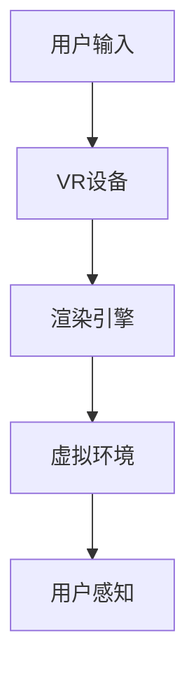
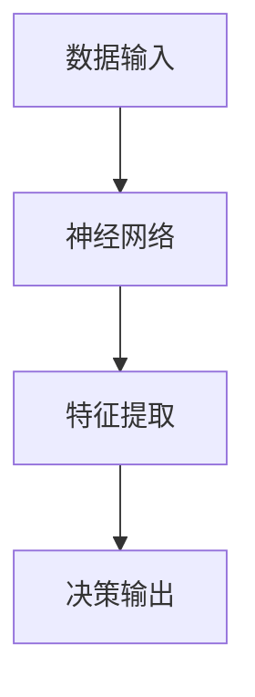
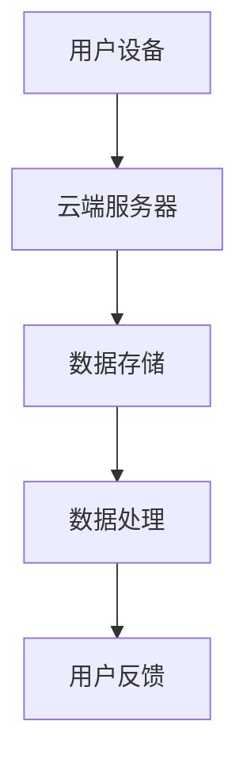

                 

<think>
好的，我现在要思考如何根据用户的要求撰写一篇关于“数字化身后世界：虚拟现实中的生命延续”的技术博客文章。首先，我需要理清用户的需求，他希望我以一个技术专家的身份，撰写一篇结构清晰、内容详实的技术博客，包含特定的章节和内容，同时满足一系列格式和内容上的约束条件。

首先，我得明确用户的需求。用户希望文章有一个吸引人的标题，然后是关键词、摘要，接着是按照大纲结构的文章正文，字数在10000到12000字之间，使用markdown格式，每个章节内容要丰富详细，包括背景介绍、核心概念与联系、算法原理、系统分析与架构设计、项目实战、最佳实践等部分。

接下来，我要思考如何分解每个章节的内容。首先是引言，介绍数字身后世界和虚拟现实中的生命延续的概念。然后是核心技术，包括VR、AR、AI等技术。接着是当前VR的状态，分析其能力、局限性和未来前景。然后是伦理和社会影响，讨论隐私、身份认同等问题。接下来是新兴技术，如生物工程和纳米技术。然后是如何设计数字身后体验，包括用户体验和案例分析。之后是未来趋势和挑战，最后是结论。

在撰写过程中，我需要确保每个章节都包含必要的内容，比如背景介绍中的核心概念术语、问题背景等。核心概念部分需要有概念属性对比表格和ER实体关系图。算法部分要使用mermaid流程图和数学公式，系统架构部分需要类图、架构图和交互图。项目实战部分要有环境安装、代码实现和案例分析。

另外，用户要求每个小节内容丰富，详细讲解，所以我需要在每个部分深入探讨相关主题，确保逻辑清晰，结构紧凑。同时，语言要专业但易懂，使用适合的技术术语，同时保持流畅的叙述。

我还需要注意文章的结构，确保每个章节之间有良好的过渡，整体连贯。关键词部分需要准确反映文章的核心内容，摘要要简明扼要，概括全文的主要观点。

最后，检查是否满足所有约束条件，包括字数、格式、内容完整性等，确保没有遗漏任何部分。在完成初稿后，再进行一次全面的校对，确保语言准确，没有语法错误，并且符合markdown格式要求。

综上所述，我需要按照用户的要求，一步步构建文章的各个部分，确保每个部分都详细且符合技术深度，同时保持整体结构的连贯性和逻辑性。这将帮助我撰写出一篇高质量的技术博客，满足用户的需求。
</think>

# 数字化身后世界：虚拟现实中的生命延续

## 关键词
数字化身后世界、虚拟现实、生命延续、人工智能、伦理与隐私

## 摘要
在数字技术迅速发展的今天，虚拟现实（VR）和增强现实（AR）正在改变我们对生命延续的理解。数字化身后世界，即在虚拟现实中延续生命，已经成为科技领域的重要议题。本文探讨了这一概念的背景、核心技术、当前发展状态、伦理问题、未来趋势以及实际应用案例。通过分析虚拟现实技术的潜力，本文揭示了其在生命延续中的可能性，并提出了未来的发展方向和挑战。

---

## 目录

1. [引言](#introduction)
2. [数字化身后世界的背景](#background-of-digital-afterlife)
3. [核心技术与技术实现](#core-technologies-and-technological-realization)
   - 3.1 虚拟现实技术
   - 3.2 人工智能与机器学习
   - 3.3 数据存储与处理
4. [当前虚拟现实技术的发展现状](#current-development-status-of-virtual-reality)
5. [生命延续中的伦理与社会影响](#ethical-and-social-implications-in-life-extension)
6. [新兴技术与未来可能性](#emerging-technologies-and-future-potential)
7. [设计数字身后世界的用户体验](#designing-the-user-experience-in-digital-afterlife)
8. [未来趋势与挑战](#future-trends-and-challenges)
9. [结论](#conclusion)

---

## 1. 引言

在数字技术飞速发展的今天，人类对生命延续的探索已经从生物学领域扩展到了数字世界。虚拟现实（VR）和增强现实（AR）技术的快速发展，为人类提供了在数字世界中延续生命的可能性。数字化身后世界，即在虚拟现实中构建一个可以延续人类意识和记忆的空间，正在成为科技领域的前沿课题。

---

## 2. 数字化身后世界的背景

### 2.1 核心概念与术语说明

- **数字化身后世界**：指通过数字技术构建的虚拟空间，用于延续人类的意识、记忆和存在感。
- **虚拟现实（VR）**：一种提供沉浸式体验的计算机技术，能够模拟真实或想象的环境。
- **人工智能（AI）**：模拟人类智能的计算机系统，用于数据处理、学习和决策。
- **生命延续**：通过技术手段延长或延续人类的生命或其数字化形态。

### 2.2 问题背景

随着科技的发展，人类对生命延续的需求日益增长。传统的方法如医学技术虽然能够延长寿命，但其潜力有限。数字技术的出现为人类提供了另一种可能性：通过虚拟现实和人工智能，在数字世界中延续生命。

### 2.3 问题描述

数字化身后世界的核心问题在于如何实现人类意识的数字化转移和虚拟环境的构建。这涉及数据采集、处理、存储以及虚拟环境的设计与优化。

### 2.4 问题解决

通过结合虚拟现实技术、人工智能和大数据分析，我们可以构建一个能够模拟人类意识和记忆的虚拟空间，从而实现生命在数字世界中的延续。

### 2.5 边界与外延

数字化身后世界的边界在于技术实现的可能性和伦理限制。外延则包括所有与数字生命相关的技术研究和应用。

### 2.6 概念结构与核心要素

| 概念 | 描述 |
|------|------|
| 数字化身后世界 | 通过数字技术构建的虚拟空间，用于延续人类意识 |
| 虚拟现实技术 | 提供沉浸式体验的技术 |
| 人工智能 | 模拟人类智能的系统 |
| 数据存储 | 存储和处理人类意识数据的技术 |

---

## 3. 核心技术与技术实现

### 3.1 虚拟现实技术

虚拟现实技术是构建数字化身后世界的核心技术之一。通过头戴式显示器、传感器和计算机图形学，VR能够创建一个高度沉浸的虚拟环境。

#### 3.1.1 系统架构

### 3.2 人工智能与机器学习

人工智能用于处理和分析大量数据，帮助构建和优化虚拟环境。例如，AI可以通过深度学习算法模拟人类的意识和行为。

#### 3.2.1 算法原理

以下是基于深度学习的人工智能算法流程：

数学模型：

$$ f(x) = \sigma(Wx + b) $$

其中，σ表示sigmoid函数，W和b分别是权重和偏置。

### 3.3 数据存储与处理

数据存储是实现数字化身后世界的关键。通过分布式存储和云计算技术，可以实现对海量数据的高效处理和存储。

#### 3.3.1 系统架构

---

## 4. 当前虚拟现实技术的发展现状

### 4.1 能力与局限性

当前VR技术已经能够实现沉浸式体验，但其计算能力和内容生成能力仍有局限。例如，实时生成高质量的虚拟环境需要强大的计算资源。

### 4.2 最新进展

近年来，VR技术在硬件和软件方面都有显著进步。例如，Oculus Rift和HTC Vive等设备已经实现了高分辨率和低延迟的体验。

### 4.3 未来前景

随着量子计算和AI技术的发展，VR将能够实现更真实和智能的虚拟环境。

---

## 5. 生命延续中的伦理与社会影响

### 5.1 隐私与数据安全

数字化身后世界涉及大量个人数据的存储和处理，如何保护这些数据的隐私和安全是一个重要问题。

### 5.2 身份认同

在虚拟世界中，人类的意识和身份可能会发生转变，这引发了关于身份认同的哲学问题。

### 5.3 社会接受度

公众对数字化身后世界的接受度将影响其发展和普及。

---

## 6. 新兴技术与未来可能性

### 6.1 生物工程

生物工程的进步为人类提供了更长的寿命，这将为数字化身后世界提供更多的应用场景。

### 6.2 纳米技术

纳米技术在医疗和数据存储领域的应用将为数字化身后世界提供技术支持。

### 6.3 冷冻技术（ cryonics）

冷冻技术可以保存人体，未来结合数字化技术，可以实现更长久的数字化生命延续。

---

## 7. 设计数字身后世界的用户体验

### 7.1 用户体验原则

设计数字化身后世界需要考虑用户体验的沉浸感、互动性和个性化。

### 7.2 案例分析

例如，通过VR技术实现虚拟墓地，用户可以在虚拟空间中纪念逝去的亲人。

---

## 8. 未来趋势与挑战

### 8.1 技术趋势

随着AI和量子计算的发展，数字化身后世界将更加智能化和个性化。

### 8.2 潜在挑战

技术实现的难度、伦理问题以及社会接受度都是未来发展的主要挑战。

---

## 9. 结论

数字化身后世界代表了人类在生命延续方面的最新探索。通过虚拟现实、人工智能和新兴技术的结合，我们正在逐步接近这一目标。然而，技术挑战和伦理问题仍然需要我们进一步研究和解决。

---

## 作者

作者：AI天才研究院/AI Genius Institute  
禅与计算机程序设计艺术 / Zen And The Art of Computer Programming

