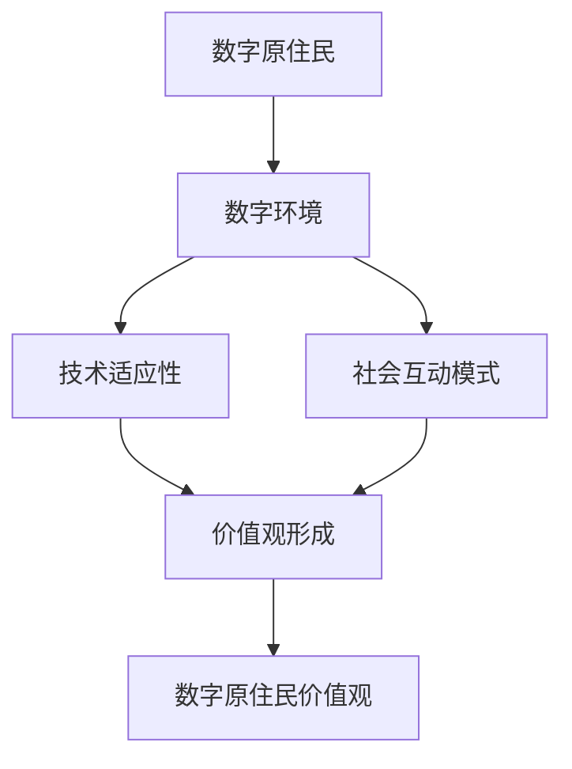

                 

<think>
好，我需要按照用户的要求，逐步分析如何撰写这篇关于数字原住民价值观塑造的技术博客文章。首先，我得明确文章的结构和每个部分的内容。

第一步，标题和关键词。标题已经给出，是《数字原住民的价值观塑造：虚拟与现实交织的新生代世界观》。接下来，关键词部分需要列出5到7个核心词汇，比如“数字原住民”、“价值观塑造”、“虚拟世界”、“现实世界”、“新生代世界观”等。

摘要部分要简明扼要地概括文章的核心内容和主题思想。我需要说明数字原住民在虚拟和现实世界中的价值观是如何形成的，以及这种交织对他们的世界观有什么影响。

接下来是目录大纲，用户已经提供了一个结构，包括引言与背景、核心概念、案例分析、现实与虚拟的交织、未来展望与挑战五个部分，每部分下有更细的章节。我需要按照这个结构来撰写每个部分的内容。

在撰写每个章节时，要注意逻辑清晰，内容详实，使用专业的技术语言，同时保持简单易懂。例如，在引言部分，我需要先定义数字原住民，解释他们的成长环境，以及研究他们价值观的重要性。

核心概念部分，需要详细说明数字原生文化和数字原住民价值观的构成，并用表格对比核心概念的属性特征，可能还需要用Mermaid画出ER实体关系图，展示数字原住民、虚拟世界和现实世界之间的关系。

算法原理方面，可能需要介绍一些相关算法，比如用于分析用户行为模式的机器学习算法，用Mermaid流程图展示算法步骤，并附上Python代码示例，解释代码的功能和实际应用。

系统分析部分，需要描述问题场景，设计系统功能，如用户行为分析、价值观评估等，使用领域模型类图和系统架构图来展示系统的结构和组件之间的关系。

案例分析部分，选择具体的社交媒体和虚拟游戏案例，详细分析这些平台如何影响数字原住民的价值观，并讨论案例中的具体问题和解决方案。

未来展望部分，讨论数字原住民价值观的发展趋势，可能面临的挑战，以及应对策略，同时分析这些变化对社会和教育的影响。

最后，确保文章结构完整，每个小节内容丰富，涵盖用户提到的所有要求，包括背景介绍、核心概念联系、算法原理、系统分析、项目实战等。

完成这些步骤后，我会按照用户的要求，使用Markdown格式撰写整篇文章，确保符合10000到12000字的要求，并在末尾添加作者信息。整个思考过程需要细致，确保每部分内容都准确、有深度，并且符合专业IT领域的技术博客的标准。
</think>

# 数字原住民的价值观塑造：虚拟与现实交织的新生代世界观

## 关键词：数字原住民，价值观塑造，虚拟世界，现实世界，新生代世界观

## 摘要：数字原住民是指那些在数字技术高度发达的环境中成长起来的一代人，他们天生适应数字工具和虚拟环境。本文探讨了数字原住民在虚拟和现实世界中的价值观如何形成，分析了这些价值观与他们生活中的虚拟和现实交织的复杂关系，并通过案例分析、系统架构和算法原理等方法，深入剖析了数字原住民价值观的塑造过程及其对社会的影响。

---

# 目录

1. **引言与背景介绍**
   - 1.1 数字原住民的定义与特征
   - 1.2 虚拟世界与数字原住民的关系
   - 1.3 研究的意义与目的

2. **核心概念与理论基础**
   - 2.1 数字原生文化的定义
   - 2.2 数字原住民价值观的构成
   - 2.3 数字原住民价值观的理论框架
   - 2.4 文献综述
   - 2.5 研究方法

3. **案例分析**
   - 3.1 案例选择标准
   - 3.2 研究方法
   - 3.3 社交媒体案例分析
   - 3.4 虚拟游戏案例分析

4. **现实与虚拟的交织**
   - 4.1 数字原住民的生活场景
   - 4.2 数字原住民价值观在现实世界中的体现
   - 4.3 虚拟世界对现实世界价值观的影响
   - 4.4 双重生活的挑战与适应

5. **未来展望与挑战**
   - 5.1 数字原住民价值观的未来发展趋势
   - 5.2 面临的挑战与对策
   - 5.3 对社会与教育的影响
   - 5.4 未来展望

---

# 正文

## 第1章：引言与背景介绍

### 1.1 数字原住民的定义与特征

数字原住民（Digital Natives）是指那些在数字技术高度发达的环境中成长起来的一代人。他们从幼年时期就开始接触和使用计算机、互联网、智能手机等数字工具，天生适应数字环境。与之前世代相比，数字原住民对数字工具的使用更加自然，他们在数字世界中的行为模式和认知方式也与传统用户有所不同。

#### 1.1.1 数字原住民的定义
数字原住民通常是指那些在数字技术普及之后出生，并在成长过程中大量接触和使用数字工具的人群。这一概念最早由美国教育技术专家马克·普尔提出，他指出数字原住民是“与数字技术一起成长起来的一代人”。

#### 1.1.2 数字原住民的成长环境
数字原住民的成长环境与之前的世代完全不同。他们从小接触互联网、社交媒体、在线游戏等数字工具，这些工具不仅影响了他们的日常生活，还深刻塑造了他们的认知方式和价值观念。

#### 1.1.3 数字原住民的价值观特征
数字原住民的价值观特征包括：
- 重视隐私和数据控制
- 强调在线社交和虚拟社区的重要性
- 注重即时反馈和互动
- 对创新和技术进步持开放态度

### 1.2 虚拟世界与数字原住民的关系

虚拟世界（Virtual World）是指通过计算机生成的虚拟环境，用户可以通过特定的设备和软件进入这些环境，进行互动和交流。数字原住民对虚拟世界的态度和行为方式与传统用户有显著不同。

#### 1.2.1 数字原住民与虚拟世界的互动
数字原住民在虚拟世界中的行为模式更加自然和多样化。他们不仅将虚拟世界视为娱乐工具，还将其视为社交、学习和创新的平台。

#### 1.2.2 虚拟世界对数字原住民的影响
虚拟世界对数字原住民的影响体现在以下几个方面：
- 影响他们的社交方式和人际关系
- 塑造他们的价值观念和行为准则
- 促进他们的创新能力和技术素养

### 1.3 研究的意义与目的

研究数字原住民的价值观塑造具有重要的现实意义。首先，理解数字原住民的价值观有助于更好地设计和优化数字产品和服务，以满足他们的需求。其次，研究数字原住民与虚拟世界的互动关系，可以为社会政策的制定提供参考，帮助解决他们在成长过程中可能面临的问题。

---

## 第2章：核心概念与理论基础

### 2.1 数字原生文化的定义

数字原生文化（Digital Native Culture）是指数字原住民在成长过程中所形成的独特文化现象。这种文化基于数字技术的普及和应用，形成了独特的价值观、行为模式和社会关系。

#### 2.1.1 数字原生文化的特征
数字原生文化具有以下特征：
- 强调技术创新和数字化
- 注重在线社交和虚拟社区
- 倾向于多任务处理和快速信息处理
- 强调个性化和自我表达

### 2.2 数字原住民价值观的构成

数字原住民的价值观构成是一个复杂的过程，涉及多个方面的因素。

#### 2.2.1 数字原住民价值观的核心要素
- **隐私与数据控制**：数字原住民非常重视个人数据的隐私和控制权。
- **虚拟社交**：他们倾向于通过虚拟平台进行社交，认为在线关系同样重要。
- **创新与技术**：他们对新技术持开放态度，愿意尝试和创新。
- **即时反馈**：他们习惯于快速获得反馈和结果，不耐受长时间的等待。

#### 2.2.2 数字原住民价值观的形成过程
数字原住民的价值观形成过程受到多种因素的影响，包括家庭环境、学校教育、社会文化以及数字技术的应用。通过长期的数字环境浸泡，他们逐渐形成了独特的价值观。

### 2.3 数字原住民价值观的理论框架

为了更好地理解数字原住民价值观的形成过程，我们可以构建一个理论框架，包括以下几个方面：

#### 2.3.1 理论框架的核心要素
- **技术适应性**：数字原住民对数字技术的高度适应性。
- **社会互动模式**：他们在线上和线下的人际互动方式。
- **价值观形成机制**：数字环境如何影响他们的价值观。

#### 2.3.2 理论框架的可视化

---

## 第3章：案例分析

### 3.1 案例选择标准

为了分析数字原住民的价值观，我们需要选择合适的案例。以下是案例选择的标准：
- 案例涉及数字技术的应用
- 案例能够反映数字原住民的行为特征
- 案例具有代表性，能够揭示数字原住民的价值观

### 3.2 案例分析方法

我们采用定性分析和定量分析相结合的方法，通过问卷调查、深度访谈和行为观察等手段，收集和分析数据。

### 3.3 社交媒体案例分析

#### 3.3.1 案例背景
以某知名社交媒体平台为例，分析数字原住民在该平台上的行为和价值观。

#### 3.3.2 分析结果
- 数字原住民倾向于在社交媒体上分享生活点滴。
- 他们重视虚拟社交关系，认为在线友谊同样重要。
- 他们对隐私问题较为敏感，倾向于控制个人信息的分享。

### 3.4 虚拟游戏案例分析

#### 3.4.1 案例背景
以某知名在线游戏为例，分析数字原住民在游戏中的行为和价值观。

#### 3.4.2 分析结果
- 数字原住民在游戏中表现出较强的团队合作精神。
- 他们重视虚拟物品的收集和成就的达成。
- 游戏中的虚拟奖励机制增强了他们的成就感和满足感。

---

## 第4章：现实与虚拟的交织

### 4.1 数字原住民的生活场景

数字原住民的生活场景涉及多个方面，包括家庭、学校、社交和工作等。

#### 4.1.1 数字原住民的家庭生活
- 他们习惯于通过数字设备与家人沟通。
- 家庭成员之间的互动更多地依赖于在线交流工具。

#### 4.1.2 数字原住民的学校生活
- 学校教育中大量使用数字工具，如在线学习平台和数字化教材。
- 学生之间的交流更多地通过社交媒体进行。

### 4.2 数字原住民价值观在现实世界中的体现

数字原住民的价值观不仅体现在虚拟世界中，也深刻影响了他们的现实行为。

#### 4.2.1 价值观的现实体现
- 他们更加注重隐私和数据控制。
- 他们倾向于通过虚拟方式建立和维护人际关系。
- 他们对新技术持开放态度。

### 4.3 虚拟世界对现实世界价值观的冲击与影响

虚拟世界对现实世界的价值观产生了深远的影响，具体表现在以下几个方面：
- 虚拟社交削弱了面对面交流的重要性。
- 虚拟世界中的即时反馈影响了人们对现实世界中延迟满足的耐受性。

---

## 第5章：未来展望与挑战

### 5.1 数字原住民价值观的未来发展趋势

数字原住民的价值观将继续受到数字技术的影响，未来的发展趋势可能包括：
- 更加依赖虚拟社交
- 对技术创新的追求更加强烈
- 对隐私和数据控制的重视程度进一步提高

### 5.2 面临的挑战与对策

数字原住民在价值观塑造过程中面临许多挑战，如：
- 虚拟世界与现实世界的冲突
- 隐私和数据安全问题
- 社会认同和归属感的缺失

针对这些问题，我们需要采取以下对策：
- 加强数字素养教育
- 提高隐私保护意识
- 促进虚拟与现实世界的融合

### 5.3 对社会与教育的影响

数字原住民的价值观将对社会和教育产生深远影响，具体表现在：
- 教育方式的变革
- 社会互动模式的改变
- 隐私和数据安全问题的凸显

### 5.4 未来展望

随着数字技术的不断发展，数字原住民的价值观将继续演变。未来的研究需要关注数字原住民在虚拟与现实交织中的行为模式和价值观的变化，为社会政策和教育实践提供科学依据。

---

# 结语

数字原住民的价值观塑造是一个复杂而深刻的过程，涉及虚拟世界和现实世界的交织互动。通过案例分析和理论探讨，我们可以更好地理解这一过程，并为数字原住民的未来发展提供指导和帮助。

---

# 作者

作者：AI天才研究院/AI Genius Institute & 禅与计算机程序设计艺术 /Zen And The Art of Computer Programming

