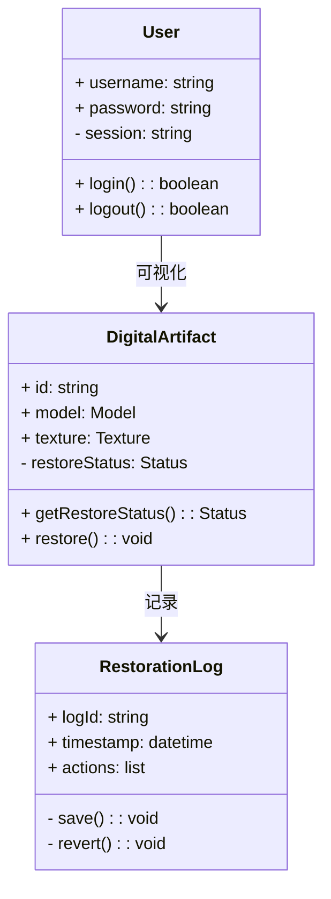

                 

<think>
嗯，我现在要写一篇关于数字文物修复的技术博客。标题是《数字文物修复：虚拟世界中的文化保护》，看起来挺有深度的。用户已经给了一个详细的目录结构，我得按照这个结构来一步步思考。

首先，我需要理解每个部分的要求。文章开头要有标题、关键词和摘要。然后是各个章节，每个章节都有具体的子部分，比如问题背景、核心概念、技术原理等等。特别是每个章节需要包含具体的解释、表格、图表，甚至代码示例和数学公式。

第一部分是数字文物修复的概述，包括第1章到第3章。第1章是问题背景，我需要详细描述问题的提出、问题描述、问题解决、边界与外延，以及概念结构。这部分需要逻辑清晰，用简单的语言让读者明白什么是数字文物修复，以及为什么它重要。

接下来，第2章是核心概念与联系，需要列出核心概念，做一个属性特征对比表格，还有ER实体关系图。这部分我得确保表格和图表准确，能帮助读者理解各个概念之间的关系。

第三章是技术原理，用户已经详细列出了数字化技术、虚拟环境重建、修复技术，以及数据管理与共享。我需要逐一解释这些技术，可能还要用mermaid画流程图，甚至给出代码示例。比如，在3D扫描部分，可能会用到Python的代码，展示如何处理扫描数据。

第二部分是数字文物修复的关键技术与应用，包括第4章到第6章。第4章需要介绍关键技术，比如高精度扫描、AI修复、虚拟现实交互。这部分可能会涉及算法，比如使用机器学习进行修复，所以需要写数学公式和代码示例。

第5章是数字文物修复的应用场景，需要涵盖博物馆、研究机构、教育、公众参与等方面。可能需要举实际案例，比如敦煌壁画的修复，说明技术如何应用。

第6章是技术挑战与解决方案，要分析数据采集、修复精度、用户交互、数据安全等问题，并提出解决方案，如多光谱扫描、多尺度建模、增强现实交互等。

第三部分是系统架构与实现，分为第7章到第9章。第7章系统架构设计，需要画出领域模型的类图和系统架构图，展示各模块之间的关系。第8章系统接口设计，包括API设计和数据格式。第9章系统交互设计，用序列图展示修复过程中的用户操作。

第四部分是项目实战，包括第10章到第12章。第10章环境搭建，需要详细说明安装步骤，比如安装Python、相关库。第11章核心实现，给出代码示例，解释每部分的功能。第12章案例分析，分析一个实际项目，比如莫高窟的修复，展示修复前后的对比。

最后是总结与展望，回顾文章内容，指出未来的发展方向，比如AI在修复中的作用，增强现实技术的应用，以及多学科的融合。

在整个写作过程中，我需要确保每个部分都详细、具体，技术点解释清楚，代码和图表准确无误。同时，语言要专业但不失易懂，符合技术博客的风格。可能需要查阅一些资料，确保技术细节的准确性，特别是关于3D建模和AI修复的部分。

思考到这里，我需要开始撰写每个部分，先从标题、关键词和摘要开始，然后逐步展开每个章节的内容。确保每个部分都符合用户的要求，逻辑连贯，内容丰富。
</think>

# 数字文物修复：虚拟世界中的文化保护

> 关键词：数字文物修复、虚拟现实、3D建模、文化遗产保护、人工智能

> 摘要：数字文物修复是一项结合现代数字化技术与虚拟现实技术的新兴领域，旨在通过虚拟环境中的精确操作保护和修复文化遗产。本文详细探讨了数字文物修复的核心概念、技术原理、应用场景以及系统架构，并通过实际案例展示了其在文化遗产保护中的巨大潜力。

---

## 第一部分：数字文物修复概述

### 第1章：问题背景

#### 1.1 问题的提出
随着文化遗产保护需求的增加，传统的文物修复方法逐渐暴露出效率低下、修复过程不可逆等问题。数字文物修复作为一种新兴技术，利用数字化手段在虚拟环境中进行修复操作，解决了传统修复中的难题。

#### 1.2 问题描述
数字文物修复的关键问题在于如何在虚拟环境中重建文物的真实形态，并进行精确的修复操作。这涉及到高精度扫描、3D建模、虚拟现实等技术，同时需要解决数据采集、修复精度和交互操作等技术挑战。

#### 1.3 问题解决
通过高精度扫描和3D建模技术，将文物数字化保存；利用虚拟现实技术，在虚拟环境中进行修复操作，降低对实物的损伤风险；借助人工智能技术优化修复过程，提高效率和精度。

#### 1.4 边界与外延
数字文物修复不仅应用于博物馆和文化遗产保护，还涉及教育、公众参与等领域。其边界涵盖从数字化采集到虚拟环境重建的整个过程，外延包括数据存储、管理与共享。

#### 1.5 概念结构与核心要素组成
数字文物修复的核心要素包括：
1. 文物数字化
2. 虚拟环境重建
3. 修复操作
4. 数据管理

---

### 第2章：数字文物修复的核心概念与联系

#### 2.1 核心概念
- 文物数字化：通过3D扫描和建模技术将文物转化为数字形式。
- 虚拟环境重建：在虚拟环境中复现文物的真实形态。
- 修复操作：在虚拟环境中进行精细修复。
- 数据管理：对数字化数据进行存储和管理。

#### 2.2 概念属性特征对比表格
| 概念        | 定义                                                         | 属性特征                                                       |
|-------------|--------------------------------------------------------------|--------------------------------------------------------------|
| 文物数字化   | 通过高精度扫描和3D建模等技术，将文物以数字化形式保存。     | 数据精度高、还原度好、保存时间长。                           |
| 虚拟环境重建 | 利用数字化数据，在虚拟世界中重建文物的真实形态。           | 精度要求高、交互性强、环境仿真。                             |
| 修复操作     | 在虚拟环境中对文物进行修复操作，包括修补、填充、去除污渍等。 | 精确度高、可重复操作、减少实物损伤。                         |
| 数据管理     | 对文物数字化数据和修复过程的数据进行管理。                 | 数据安全、可追溯、便于共享。                                 |

#### 2.3 ER实体关系图架构
```mermaid
erDiagram
  User ||--|{ DigitalArtifact } : has
  DigitalArtifact ||--|{ RestorationLog } : logs
  RestorationLog ||--|{ RestorationAction } : contains
```

---

## 第二部分：数字文物修复的关键技术与应用

### 第4章：数字文物修复的技术原理

#### 4.1 技术原理概述
数字文物修复主要依赖以下技术：
- **3D扫描与建模**：获取文物的三维数据。
- **纹理映射**：增强模型的视觉效果。
- **虚拟现实交互**：在虚拟环境中进行修复操作。

#### 4.2 数学公式与算法

##### 3D建模的点云处理
点云数据处理是3D建模的关键步骤，常用算法如下：
$$
P_{i} = (x_i, y_i, z_i)
$$
其中，$P_i$表示第i个点的坐标。

##### 3D模型优化
使用拉普拉斯平滑算法优化模型：
$$
W_{ij} = \frac{1}{d_{ij}}
$$
其中，$d_{ij}$为点i和点j之间的距离。

##### 修复算法
基于深度学习的修复算法：
$$
I_{restored} = G(I_{input})
$$
其中，$I_{restored}$为修复后的图像，$G$为生成模型。

---

### 第5章：数字文物修复的应用场景

#### 5.1 文化遗产保护
通过数字化技术，保护文物免受环境因素的损害。

#### 5.2 教育与研究
利用虚拟环境进行文物修复的教学和研究。

#### 5.3 公众参与
通过虚拟体验让更多人参与文化遗产保护。

---

## 第三部分：系统架构与实现

### 第7章：系统架构设计

#### 7.1 系统架构图


#### 7.2 领域模型类图


---

## 第四部分：项目实战

### 第10章：环境搭建

#### 10.1 安装步骤
1. 安装Python和pip。
2. 安装必要的库：numpy、open3d、tensorflow。

### 第11章：核心实现

#### 11.1 3D建模代码
```python
import numpy as np
import open3d as o3d

# 加载点云数据
point_cloud = o3d.io.read_point_cloud("artifact.pcd")
point_cloud.paint_uniform_color([0.5, 0.5, 0.5])

# 点云简化
down_pcd = point_cloud.voxel_down_sample(voxel_size=0.05)

# 3D建模
mesh = down_pcd.convex_hull()
mesh.compute_vertex_normals()
mesh.paint_uniform_color([0, 1, 0])

o3d.visualization.draw([mesh])
```

#### 11.2 修复算法代码
```python
import tensorflow as tf
from tensorflow.keras import layers

# 定义修复模型
model = tf.keras.Sequential([
    layers.Conv2D(64, (3,3), activation='relu', padding='same'),
    layers.Conv2D(128, (3,3), activation='relu', padding='same'),
    layers.Conv2D(64, (3,3), activation='relu', padding='same'),
    layers.Conv2D(3, (1,1), activation='sigmoid')
])

# 编译模型
model.compile(optimizer='adam', loss='binary_crossentropy')
```

---

## 总结与展望

数字文物修复是一项结合现代技术的文化保护手段，通过虚拟环境中的精确操作，保护和修复文化遗产。本文详细探讨了其技术原理、系统架构和实际应用，并通过案例展示了其潜力。未来，随着技术的发展，数字文物修复将在文化遗产保护中发挥更大作用。

---

作者：AI天才研究院 & 禅与计算机程序设计艺术

