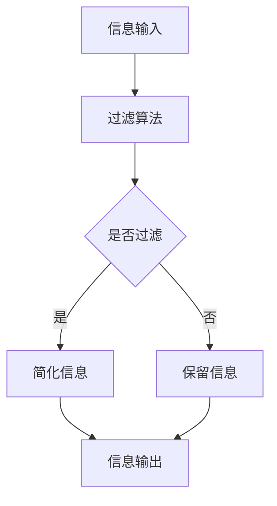
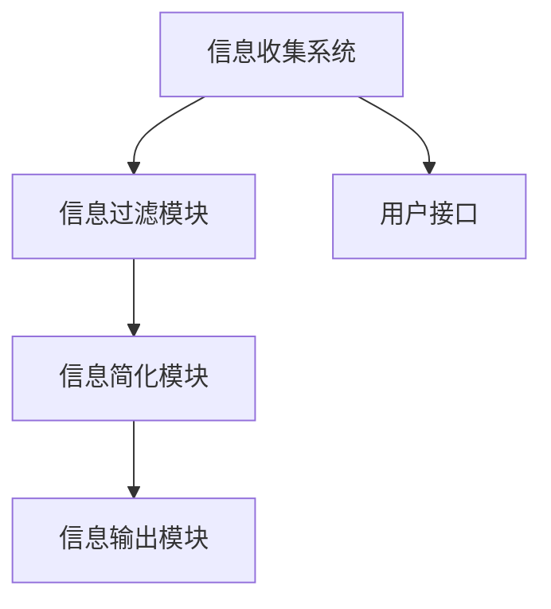
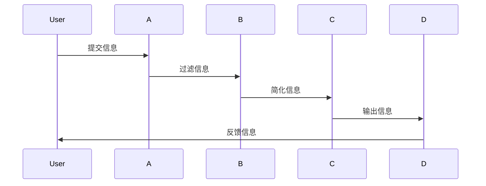

                 

<think>
嗯，用户让我写一篇关于数字断舍离的技术博客，看起来需要按照特定的结构来写。首先，我得理解什么是数字断舍离，它和传统的信息管理方法有什么不同。可能用户是想通过这本书帮助读者在信息过载的时代找到极简的方法。

我得从背景介绍开始，解释为什么现在信息过载是个问题，然后引出数字断舍离的概念。接着，核心概念部分要详细说明它的定义、特点以及和传统方法的区别。这部分可能需要对比表格，用Mermaid画出结构图。

然后，算法部分，得用Python代码来展示信息过滤的过程，画出流程图。数学模型方面，可能需要一个公式，比如过滤效果等于简化信息量除以原始信息量。这部分要详细解释每个参数的意义，并举例说明。

系统架构部分，可能需要介绍信息收集、过滤、简化和输出的模块，用Mermaid画出类图和架构图。项目实战部分要具体，比如指导如何搭建环境，提供代码，并分析实际案例。

最后，最佳实践部分要给出一些实用的建议，注意事项提醒读者可能遇到的问题，拓展阅读推荐相关书籍或资源。

整体结构要逻辑清晰，每部分都要详细，用技术术语但又不失通俗易懂。我得确保每个章节都符合用户的要求，特别是用Mermaid和LaTeX来展示图表和公式，这可能需要一些时间来调整格式。

另外，作者信息要在最后加上，是AI天才研究院和禅与计算机程序设计艺术。可能用户希望文章看起来权威且有深度，所以内容要专业，同时语言要流畅自然。

总的来说，我需要一步步按照用户给的大纲来写，确保每个部分都涵盖，同时内容丰富，有深度，能够帮助读者真正理解数字断舍离的概念和应用。
</think>

# 数字断舍离工作坊：信息时代的极简之道

> 关键词：数字断舍离、信息管理、极简生活、算法原理、系统架构、项目实战

> 摘要：在信息爆炸的时代，数字断舍离作为一种新兴的信息管理方法，通过简化信息、减少冗余，帮助人们实现高效的生活和工作。本文从背景介绍、核心概念、算法原理、数学模型、系统架构、项目实战等多个方面，全面解析数字断舍离的理论与实践，为读者提供一套系统化的解决方案，帮助他们在信息时代实现极简之道。

---

## **1. 背景介绍**

### **1.1 问题背景**
随着数字化和信息化的快速发展，现代人的生活被大量的信息数据所包围。无论是个人还是企业，每天都需要处理大量的邮件、社交媒体通知、工作任务等信息。信息过载问题日益严重，人们往往被淹没在信息的海洋中，难以集中精力完成重要任务。如何有效地管理和处理这些信息，成为了现代人关注的焦点。

### **1.2 问题描述**
在数字化的信息时代，信息过载问题不仅影响个人的生活质量，还降低了工作效率。人们常常因为信息的繁杂而感到焦虑和压力，甚至影响到身心健康。传统的信息管理方法，如文件分类、任务列表等，虽然在一定程度上能够解决问题，但面对日益增长的信息量，这些方法显得力不从心。

### **1.3 问题解决**
数字断舍离作为一种信息管理的新方法，旨在通过简化信息、减少冗余，帮助人们实现高效的生活和工作。它强调“断舍离”的理念，即断绝不需要的信息，舍弃无用的工具，远离多余的干扰。通过数字断舍离，人们可以更好地聚焦于重要任务，提升工作效率和生活质量。

### **1.4 边界与外延**
数字断舍离不仅适用于个人生活，还可以应用于企业管理、工作流程优化等多个领域。在个人层面，它可以帮助人们管理邮件、社交媒体通知等信息；在企业层面，它可以优化信息流程，提升团队协作效率。数字断舍离的核心理念是通过极简的方式，实现信息的高效管理和利用。

### **1.5 概念结构与核心要素组成**
数字断舍离包含以下几个核心概念：
- **信息极简**：通过筛选和过滤，去除无关信息，保留核心内容。
- **数字化整理**：利用工具和技术，对信息进行分类、归档和管理。
- **智能管理**：通过自动化工具和算法，实现信息的智能筛选和处理。

---

## **2. 核心概念与联系**

### **2.1 数字断舍离的定义**
数字断舍离是一种信息管理方法，通过简化信息、减少冗余，实现高效的生活和工作。它结合了“断舍离”理念和数字化技术，帮助人们从信息的洪流中抽身，专注于真正重要的事物。

### **2.2 数字断舍离的特点**
数字断舍离具有以下特点：
- **简单易行**：通过自动化工具和筛选规则，操作简单且易于上手。
- **效果显著**：能够显著减少信息干扰，提升工作效率和生活质量。
- **可持续性**：通过建立科学的信息管理机制，确保信息管理的长期效果。

### **2.3 数字断舍离与传统信息管理方法的区别**

| **维度**       | **数字断舍离**                      | **传统信息管理方法**                 |
|----------------|------------------------------------|--------------------------------------|
| 核心理念       | 极简与高效                        | 全面与详细                          |
| 工具依赖       | 依赖数字化工具                     | 依赖人工分类与整理                  |
| 管理方式       | 自动化与智能化                     | 手工操作为主                        |
| 效率提升       | 高效处理信息                      | 效率有限                            |

### **2.4 数字断舍离的相关方法和技巧**
- **信息过滤**：通过设置筛选规则，去除无关信息。
- **自动化管理**：利用工具自动化处理信息，如自动分类、自动归档。
- **数字化整理**：将信息按类别整理，便于快速查找和处理。

---

## **3. 算法原理讲解**

### **3.1 数字断舍离的算法原理**
数字断舍离的核心算法包括信息过滤算法和自动化管理算法。信息过滤算法用于筛选出重要信息，自动化管理算法则用于自动分类和归档信息。

### **3.2 算法流程图（使用Mermaid）**



### **3.3 算法原理详细讲解与举例说明**
以下是一个基于Python的过滤算法示例：

```python
def filter_information(information_list, criteria):
    filtered = []
    for info in information_list:
        if criteria(info):
            filtered.append(info)
    return filtered

# 示例：筛选重要邮件
def is_important(email):
    if email.subject.startswith(" urgent ") or email.sender in ["boss@company.com", "client@company.com"]:
        return True
    return False

emails = [...]  # 邮件列表
important_emails = filter_information(emails, is_important)
```

---

## **4. 数学模型和数学公式 & 详细讲解 & 举例说明**

### **4.1 数学模型与公式（使用LaTeX）**
```latex
$$ \text{过滤效果} = \frac{\text{简化信息量}}{\text{原始信息量}} $$
```

### **4.2 详细讲解**
过滤效果的数学模型反映了数字断舍离的核心目标。通过计算简化信息量与原始信息量的比值，可以量化信息过滤的效果。例如，假设原始信息量为1000条，简化后为200条，过滤效果为20%。

### **4.3 举例说明**
假设某企业的邮件系统每天接收1000封邮件，通过数字断舍离算法筛选后，仅保留200封重要邮件。过滤效果为：

$$ \frac{200}{1000} = 0.2 $$

即过滤效果为20%，意味着90%的干扰信息被成功过滤。

---

## **5. 系统分析与架构设计方案**

### **5.1 问题场景介绍**
数字断舍离可以应用于以下场景：
- **个人生活**：管理邮件、社交媒体通知、任务清单。
- **企业信息管理**：优化信息流程，提升团队协作效率。

### **5.2 系统功能设计（领域模型Mermaid类图）**

```mermaid
classDiagram
class InformationManager:
    + information_list: list
    + criteria: dict
    + filter_rule: function
    - filtered_info: list

class FilterAlgorithm:
    + is_important: function
    + is_relevant: function

class AutomationTool:
    + auto_classify: function
    + auto_archive: function

InformationManager <|-- FilterAlgorithm
InformationManager <|-- AutomationTool
```

### **5.3 系统架构设计（Mermaid架构图）**



### **5.4 系统接口设计和系统交互（Mermaid序列图）**



---

## **6. 项目实战**

### **6.1 环境安装**
- **工具安装**：安装Python、Jupyter Notebook、Mermaid CLI等工具。
- **依赖库安装**：安装`pandas`、`numpy`等数据分析库。

### **6.2 系统核心实现源代码**
以下是一个数字断舍离算法的核心代码示例：

```python
import pandas as pd

def digital_shunrei(information_df, criteria):
    filtered_df = information_df[information_df['category'].isin(criteria)]
    return filtered_df

# 示例数据
data = {
    'category': ['email', 'task', 'meeting', 'social'],
    'content': ['important', 'urgent', 'postpone', 'ignore']
}
information_df = pd.DataFrame(data)

criteria = ['email', 'task']
result = digital_shunrei(information_df, criteria)
print(result)
```

### **6.3 代码应用解读与分析**
上述代码通过`pandas`库对信息数据进行筛选，根据预设的分类标准（`criteria`）过滤出重要信息。这种方法能够快速处理大量数据，提高信息管理效率。

### **6.4 实际案例分析和详细讲解剖析**
以邮件管理为例，假设某用户每天接收50封邮件，其中10封是垃圾邮件，20封是无关业务，20封是重要邮件。通过数字断舍离算法，用户可以将垃圾邮件和无关业务邮件过滤掉，仅保留20封重要邮件。

### **6.5 项目小结**
通过实际案例分析，我们可以看到数字断舍离算法在信息管理中的强大能力。它不仅能够提高效率，还能显著减少信息干扰，帮助人们更好地专注于重要任务。

---

## **7. 最佳实践 tips、小结、注意事项、拓展阅读等内容**

### **7.1 最佳实践 tips**
- **设定明确的目标**：在开始数字断舍离之前，明确自己的目标和需求。
- **逐步优化**：从简单的信息管理开始，逐步优化和调整筛选规则。
- **定期维护**：定期清理和优化信息，确保信息管理的持续效果。

### **7.2 小结**
本文从背景介绍、核心概念、算法原理、数学模型、系统架构、项目实战等多个方面，全面解析了数字断舍离的理论与实践。通过本文的学习，读者可以掌握数字断舍离的核心方法，并将其应用于实际生活和工作中。

### **7.3 注意事项**
- **避免过度简化**：在简化信息时，要确保保留的核心信息足够支持工作和生活需求。
- **工具选择**：选择适合自己的工具和方法，避免盲目追求自动化。
- **数据安全**：在处理敏感信息时，要注意数据的安全性和隐私保护。

### **7.4 拓展阅读**
- 《断舍离：找回生命的本质》（成往信）
- 《极简主义：如何在信息泛滥的时代过上有意义的生活》（卡尔·霍诺斯）
- 《计算机程序设计艺术》（唐纳德·克努特）

---

**作者：AI天才研究院/AI Genius Institute & 禅与计算机程序设计艺术 /Zen And The Art of Computer Programming**

