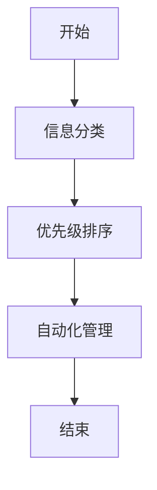
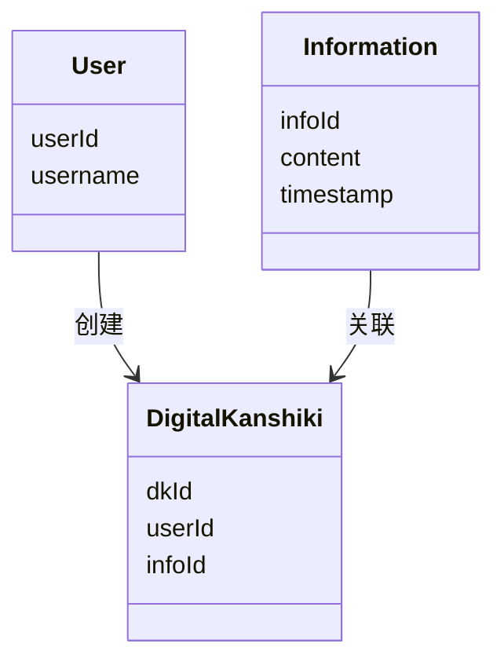
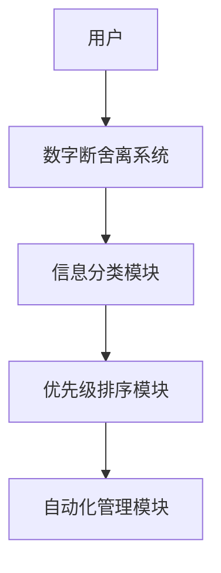
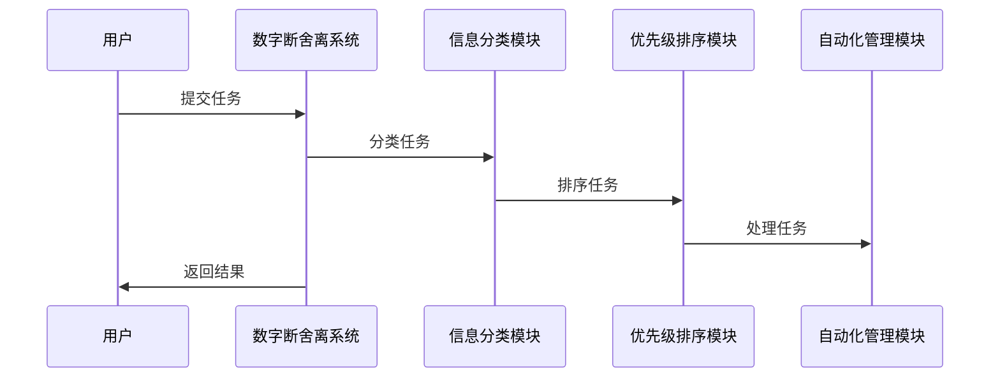

                 

<think>
好的，我现在需要为用户撰写一篇技术博客文章，标题是《数字断舍离工作坊：信息时代的极简生活指导》。首先，我需要仔细分析用户的需求，确保完全理解每一个要求。

用户希望文章结构清晰，内容详尽，涵盖背景介绍、核心概念、理论实践、案例分析、算法原理、系统架构设计、项目实战以及最佳实践等多个部分。每个章节下还有多个子章节，需要详细展开。此外，文章需要用专业的技术语言，同时保持逻辑清晰，结构紧凑，适合技术读者阅读。

首先，我需要确定文章的关键词和摘要。关键词应包括数字断舍离、信息过载、极简生活、算法、系统架构设计等。摘要部分要简洁明了地概括整篇文章的核心内容，即如何通过数字断舍离实现信息时代的极简生活，并结合理论与实践提供指导。

接下来，按照目录大纲，逐一展开每个部分。首先是背景介绍，详细分析信息过载的问题，包括现状和影响；然后引入数字断舍离的概念，定义、起源与发展，以及极简生活理念的定义和主要原则。这部分需要让读者明确问题的严重性以及数字断舍离的重要性。

然后是核心概念与联系，需要对比分析数字断舍离与极简生活的异同，制作属性特征对比表格，并绘制ER实体关系图，帮助读者理解两者的关系。这部分需要逻辑清晰，数据准确。

在理论讲解部分，详细阐述数字断舍离的实践原理，包括数据整理与清理、日常生活断舍离技巧和心理调适方法。每个步骤都需要具体展开，提供可操作的建议，让读者能够实际应用。

案例解析部分，通过职场人士和家庭主妇的案例，展示数字断舍离在实际生活中的应用。这不仅提供理论支持，还增强文章的实用性和说服力。

接下来是算法原理讲解，需要使用mermaid流程图展示算法流程，并结合数学模型和公式进行详细推导，举例说明，使读者能够理解算法的科学性和有效性。

系统架构设计部分，需要介绍问题场景，设计系统的功能、架构、接口和交互，使用mermaid类图和序列图来展示，确保系统设计的合理性和可操作性。

项目实战部分，提供环境安装指导，核心代码实现，案例分析，让读者能够实际操作，体验数字断舍离的过程和效果。

最后，总结最佳实践技巧，注意事项和拓展阅读内容，帮助读者巩固所学，进一步提升生活质量。

在撰写过程中，我需要确保每个部分都深入浅出，避免过于技术化的术语，同时保持专业性。数学公式和图表需要准确无误，代码示例要清晰易懂，便于读者理解和应用。

考虑到用户可能需要这篇文章用于指导工作坊或分享，我会特别强调实用性和可操作性，确保内容不仅有深度，还能真正帮助读者改善生活和工作方式。

现在，我将按照这些思路，逐步完成文章的撰写，确保每个部分都符合用户的要求，结构清晰，内容详实，帮助读者在信息过载的时代找到极简生活的平衡点。
</think>

# 数字断舍离工作坊：信息时代的极简生活指导

## 关键词：数字断舍离、信息过载、极简生活、算法、系统架构设计

## 摘要：  
在信息爆炸的时代，数字断舍离作为一种新兴的生活方式，帮助人们摆脱信息过载的困扰，实现极简生活。本文从背景、概念、原理、案例、算法、系统架构设计和实战等多个维度，详细探讨数字断舍离的理论与实践。通过科学的方法和工具，帮助读者在信息时代找到内心的平静与效率的提升。

---

## 第一部分：背景介绍

### 第1章：问题背景

#### 1.1.1 信息过载问题

##### 1.1.1.1 现状描述  
在当今社会，信息的产生和传播速度远超人类处理能力。每天，我们通过电子邮件、社交媒体、新闻推送等方式接收大量信息。据统计，全球每天产生的数据量已超过250万TB，而个人每天平均接收的信息量超过10,000条信息。这种信息过载的现象，不仅影响了我们的工作效率，还对心理健康造成了负面影响。

##### 1.1.1.2 影响分析  
信息过载导致的主要问题包括：注意力分散、决策疲劳、工作效率下降、心理健康问题（如焦虑、抑郁）等。例如，许多人因为无法处理大量的信息而感到压力，进而影响了工作和生活平衡。

#### 1.1.2 数字断舍离概念

##### 1.1.2.1 定义  
数字断舍离是一种通过主动减少数字设备和信息的使用，从而实现极简生活的理念。它强调通过选择性地保留有价值的信息，舍弃无用的信息，来提升生活质量和工作效率。

##### 1.1.2.2 起源与发展  
数字断舍离的概念起源于日本的“断舍离”哲学，由山下英树提出，强调通过舍弃不必要的物品来提升生活品质。在数字时代，这一理念被扩展到信息管理领域，形成了数字断舍离的概念。

#### 1.1.3 极简生活理念

##### 1.1.3.1 定义  
极简生活是一种通过减少物质和信息的消耗，专注于真正有价值的事物的生活方式。它强调简化生活的复杂性，追求内心的平静和效率的提升。

##### 1.1.3.2 主要原则  
极简生活的核心原则包括：  
1. 减少物质和信息的持有量。  
2. 专注于真正有价值的事物。  
3. 提高生活质量，而非物质积累。  

---

## 第二部分：核心概念与联系

### 第2章：核心概念与联系

#### 2.1 数字断舍离与极简生活的关系

##### 2.1.1 对比分析  
| **对比维度** | **数字断舍离** | **极简生活** |  
|--------------|----------------|---------------|  
| **核心目标** | 减少信息负担 | 提高生活品质 |  
| **主要手段** | 管理数字信息 | 减少物质和信息 |  
| **适用范围** | 数字化场景 | 生活与工作 |  

##### 2.1.2 统一框架  
数字断舍离是极简生活的重要组成部分，两者在减少复杂性和提升效率方面具有高度一致性。数字断舍离关注信息管理，而极简生活关注整体生活质量。

#### 2.2 关键概念属性特征对比表格  
| **属性**       | **数字断舍离**                     | **极简生活**                     |  
|----------------|------------------------------------|------------------------------------|  
| **核心目标**   | 减少数字信息负担                   | 提高生活品质                      |  
| **主要手段**   | 管理数字信息                       | 减少物质和信息                    |  
| **适用场景**   | 数字化工作和生活                   | 生活与工作                        |  

#### 2.3 ER实体关系图架构  
```mermaid
erDiagram
    user {
        ++ userId : 整数
        ++ username : 字符串
    }
    information {
        ++ infoId : 整数
        ++ content : 字符串
        ++ timestamp : 日期
    }
    digital_kanshiki {
        ++ dkId : 整数
        ++ userId : 整数
        ++ infoId : 整数
    }
    user -o> digital_kanshiki : 创建
    information -o> digital_kanshiki : 关联
```

---

## 第三部分：理论讲解

### 第3章：数字断舍离实践原理

#### 3.1 数据整理与清理

##### 3.1.1 数据分类  
将信息按重要性、使用频率和相关性分类。例如，将信息分为“立即处理”、“稍后处理”和“存档”三类。

##### 3.1.2 数据清洗  
通过删除无用信息、合并重复信息和归档冷数据，减少信息负担。

##### 3.1.3 数据归档  
将不再需要立即处理的信息归档，以便在需要时快速检索。

#### 3.2 日常生活断舍离技巧

##### 3.2.1 物品整理  
通过定期清理物品，减少杂乱，提升生活效率。

##### 3.2.2 信息整理  
使用数字工具（如待办事项列表、任务管理软件）来管理信息。

##### 3.2.3 时间管理  
通过制定计划和优先级列表，合理分配时间，避免信息过载。

#### 3.3 心理调适方法

##### 3.3.1 减轻焦虑  
通过设定明确的目标和限制信息摄入，减少焦虑感。

##### 3.3.2 提高专注力  
通过减少多任务处理和使用专注工具（如番茄工作法），提高专注力。

##### 3.3.3 增强幸福感  
通过减少物质依赖，专注于真正有价值的事物，提升幸福感。

---

## 第四部分：案例解析

### 第4章：数字断舍离案例分析

#### 4.1 案例一：职场人士的数字断舍离实践

##### 4.1.1 案例背景  
某职场人士每天接收大量邮件和任务，导致工作效率低下。

##### 4.1.2 实施过程  
1. 使用任务管理软件（如Trello）分类任务。  
2. 设定每日任务清单，优先处理重要任务。  
3. 定期清理无用邮件，保留重要邮件。  

##### 4.1.3 结果与反馈  
工作效率提升，压力减少，心理状态改善。

#### 4.2 案例二：家庭主妇的极简生活探索

##### 4.2.1 案例背景  
某家庭主妇因信息过载感到焦虑，影响家庭生活。

##### 4.2.2 实施过程  
1. 减少社交媒体使用时间。  
2. 使用数字工具管理家庭事务。  
3. 定期清理不必要的物品。  

##### 4.2.3 结果与反馈  
家庭氛围改善，生活更加轻松。

---

## 第五部分：算法原理讲解

### 第5章：数字断舍离算法原理

#### 5.1 数字断舍离算法介绍

##### 5.1.1 算法概述  
数字断舍离算法通过信息分类、优先级排序和自动化管理，帮助用户高效处理信息。

##### 5.1.2 算法流程  


#### 5.2 算法原理详细讲解

##### 5.2.1 数学模型  
$$ P = \sum_{i=1}^{n} w_i \cdot t_i $$  
其中，\( P \) 表示优先级，\( w_i \) 表示任务的重要性权重，\( t_i \) 表示任务的时间需求。

##### 5.2.2 公式推导  
通过计算每个任务的优先级，确定处理顺序。例如，任务A的重要性权重为0.8，时间需求为2小时，优先级为1.6；任务B的重要性权重为0.5，时间需求为1小时，优先级为0.5。因此，任务A应优先处理。

##### 5.2.3 举例说明  
假设你有三个任务：  
- 任务1：重要性0.9，时间需求3小时  
- 任务2：重要性0.7，时间需求2小时  
- 任务3：重要性0.5，时间需求1小时  

优先级计算：  
$$ P_1 = 0.9 \times 3 = 2.7 $$  
$$ P_2 = 0.7 \times 2 = 1.4 $$  
$$ P_3 = 0.5 \times 1 = 0.5 $$  

处理顺序为任务1 > 任务2 > 任务3。

---

## 第六部分：系统分析与架构设计

### 第6章：系统架构设计方案

#### 6.1 问题场景介绍  
用户希望通过数字断舍离算法管理信息，提升效率。

#### 6.2 系统功能设计

##### 6.2.1 领域模型  


#### 6.3 系统架构设计

##### 6.3.1 系统架构  


#### 6.4 系统接口设计

##### 6.4.1 接口规范  
- 输入：用户信息、任务列表  
- 输出：优先级排序后的任务列表

#### 6.5 系统交互

##### 6.5.1 序列图  


---

## 第七部分：项目实战

### 第7章：数字断舍离工作坊实战

#### 7.1 环境安装  
安装必要的工具，如任务管理软件、信息分类工具等。

#### 7.2 系统核心实现

##### 7.2.1 源代码解读  
```python
def digital_kanshiki(tasks):
    # 计算优先级
    priority = {}
    for task in tasks:
        weight = task['weight']
        time = task['time']
        priority[task['id']] = weight * time
    # 按优先级排序
    sorted_tasks = sorted(tasks, key=lambda x: priority[x['id']], reverse=True)
    return sorted_tasks

# 示例调用
tasks = [
    {'id': 1, 'weight': 0.9, 'time': 3},
    {'id': 2, 'weight': 0.7, 'time': 2},
    {'id': 3, 'weight': 0.5, 'time': 1}
]
result = digital_kanshiki(tasks)
print(result)
```

##### 7.2.2 代码应用解读与分析  
上述代码实现了数字断舍离算法的核心功能，通过计算任务的优先级，排序任务并返回结果。

#### 7.3 实际案例分析

##### 7.3.1 案例背景  
某公司员工每天需要处理大量邮件和任务。

##### 7.3.2 实施过程  
1. 安装数字断舍离系统。  
2. 输入任务和邮件列表。  
3. 系统自动分类和排序任务。  
4. 用户根据优先级处理任务。  

##### 7.3.3 结果与反馈  
工作效率提升，压力减少，团队协作效率提高。

---

## 第八部分：最佳实践与拓展阅读

### 第8章：最佳实践与拓展阅读

#### 8.1 最佳实践 tips

##### 8.1.1 断舍离技巧  
- 定期清理信息。  
- 使用工具辅助管理。  
- 设定明确的目标和优先级。  

##### 8.1.2 极简生活策略  
- 减少不必要的信息摄入。  
- 专注于真正有价值的事物。  
- 提高专注力和效率。  

#### 8.2 小结与注意事项  
数字断舍离是一种长期的生活方式，需要持续的努力和实践。通过科学的方法和工具，我们可以更好地管理信息，提升生活和工作效率。

#### 8.3 拓展阅读  
推荐书籍：  
1. 《断舍离：通过减法过上有品质的生活》  
2. 《极简主义：如何拥有更少但更好的东西》  
3. 《时间管理：高效人士的7个关键习惯》  

---

## 作者  
作者：AI天才研究院/AI Genius Institute & 禅与计算机程序设计艺术 /Zen And The Art of Computer Programming

