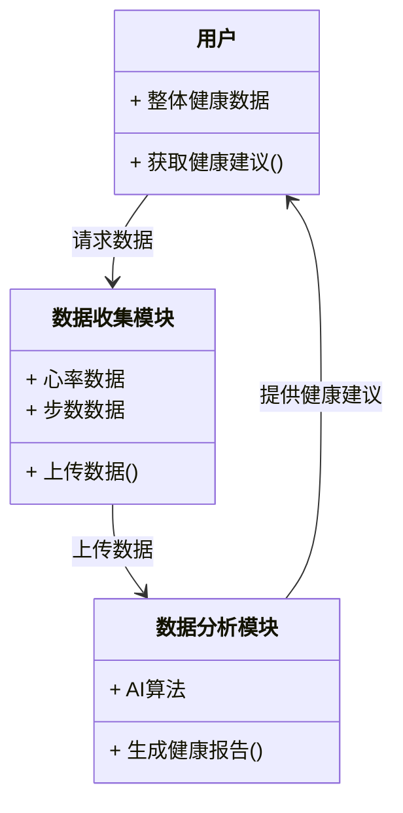

                 

<think>
好的，我现在需要根据用户的要求，逐步思考如何撰写这篇技术博客文章。首先，用户希望以《数字断食营：重新定义与科技的健康关系》为标题，撰写一篇结构清晰、内容详尽的专业IT领域技术博客。文章需要包含关键词、摘要，以及详细的目录大纲，并且符合特定的格式和内容要求。

首先，我需要明确文章的核心主题和结构。根据用户提供的目录大纲，文章分为五个主要部分，共8章。每章都有具体的内容，涵盖数字断食的起源、科技与健康的相互影响、数字断食对健康的具体影响、实践指南以及未来趋势。

接下来，我要考虑如何细化每个章节的内容，确保逻辑清晰，涵盖所有必要的部分，如背景介绍、核心概念、算法原理、系统分析、项目实战等。每个部分都需要详细展开，特别是要包含数学公式、图表、代码示例等技术元素，以满足用户的高质量技术博客的要求。

例如，在“数字断食对生理健康的影响”这一章中，我需要详细解释神经系统、免疫系统和睡眠质量如何受到数字断食的影响，可能需要引用相关的科学研究数据，并用数学模型来说明这些变化。同时，可能需要绘制一些图表，如神经信号变化的示意图，或睡眠周期的流程图。

在“科技对健康的积极影响”部分，我需要讨论科技如何促进健康数据的收集和分析，如使用可穿戴设备监测心率、步数等数据，以及这些数据如何帮助改善医疗诊断和治疗方案。这部分可能需要引用具体的医疗案例，并用图表展示科技在医疗中的应用场景。

系统架构设计部分，我需要介绍数字断食管理系统如何运作，可能涉及用户数据收集、分析、制定计划等模块，用类图和序列图来展示系统架构和接口设计。此外，可能需要编写一些Python代码示例，展示如何处理健康数据或制定断食计划。

在项目实战部分，我需要提供一个完整的项目指南，包括环境安装、代码实现、案例分析等，帮助读者实际应用数字断食的概念。同时，要给出一些最佳实践的建议，如如何开始数字断食，注意事项等。

最后，我需要确保整篇文章结构合理，内容详实，逻辑连贯，并且符合用户指定的格式要求，包括使用markdown格式，嵌入数学公式、图表和代码示例。同时，文章末尾要加上作者信息，引用用户提供的格式。

总结一下，我需要按照以下步骤进行：
1. 撰写文章标题、关键词和摘要，确保准确传达文章核心内容。
2. 根据目录大纲，逐章详细撰写内容，确保每个部分都有足够的技术细节和实例支持。
3. 在适当的地方插入数学公式、图表和代码示例，使用mermaid和latex格式，增强文章的技术性和可读性。
4. 检查整篇文章的逻辑结构，确保各部分之间过渡自然，内容完整。
5. 最后，添加作者信息，完成整篇文章的撰写。

现在，我将开始按照这个思路撰写文章，确保每一步都符合用户的要求，同时保持内容的深度和专业性。
</think>

# 数字断食营：重新定义与科技的健康关系

## 关键词：数字断食，科技健康，心理健康，生理健康，健康科技

## 摘要：  
在科技高度发达的现代社会，数字设备和互联网已成为我们生活中不可或缺的一部分。然而，过度依赖科技不仅影响我们的心理健康，还对身体健康造成潜在威胁。数字断食作为一种新兴的生活方式，旨在通过暂时远离数字设备，帮助人们重新建立与科技的健康关系。本文将深入探讨数字断食的概念、对个人健康的影响，以及如何通过科技手段优化这一过程。通过分析科技对健康的双重影响，本文将为读者提供科学的数字断食实践指南，并展望科技与健康融合的未来趋势。

---

## 第一部分：数字断食的起源与概念

### 第1章：数字断食的概念与起源

#### 1.1 数字断食的定义  
数字断食是指在一定时间内完全或部分远离数字设备（如手机、电脑、平板等），以减少科技对日常生活的影响，从而改善身心健康。与传统断食不同，数字断食关注的是行为和习惯的改变，而非生理上的禁食。

#### 1.2 数字断食的历史背景  
随着互联网和智能手机的普及，人们的生活逐渐被数字设备主导。长时间的屏幕使用导致注意力分散、睡眠质量下降，甚至引发心理健康问题。数字断食的概念应运而生，作为一种反思科技依赖的方式，逐渐被学术界和公众所关注。

#### 1.3 数字断食与传统断食的比较  
| 方面         | 数字断食             | 传统断食             |
|--------------|----------------------|----------------------|
| 目标         | 减少科技依赖         | 减少食物摄入         |
| 影响范围     | 心理、社交、注意力     | 身体健康             |
| 实施方式     | 远离设备             | 控制饮食             |
| 持续时间     | 短期或长期           | 短期或长期           |

---

## 第二部分：科技与健康的相互关系

### 第2章：科技对健康的积极影响

#### 2.1 科技与健康数据的结合  
通过可穿戴设备（如智能手表、健康监测器），科技能够实时收集用户的健康数据（如心率、步数、睡眠质量），为健康管理提供科学依据。

**示例：**  
用户通过智能手环记录每日步数和心率，结合AI算法分析健康状况，提供个性化的运动建议。

**系统架构设计：**  
- **数据收集模块**：传感器收集生理数据。
- **数据分析模块**：AI算法处理数据，生成健康报告。
- **用户界面模块**：显示健康数据和建议。

**类图：**

### 第3章：科技对健康的潜在风险

#### 3.1 科技成瘾与身心健康  
过度使用数字设备可能导致科技成瘾，表现为注意力不集中、焦虑和抑郁情绪。研究表明，减少屏幕时间可以显著改善心理健康。

#### 3.2 科技暴露与身体健康问题  
长时间使用电子设备可能引发视力下降、颈椎病等问题。蓝光辐射也被认为会影响睡眠质量。

#### 3.3 科技对社交和人际关系的影响  
社交媒体的普及使得人们更多地依赖虚拟社交，导致面对面交流减少，人际关系变得脆弱。

---

## 第三部分：数字断食对个人健康的影响

### 第4章：数字断食对生理健康的影响

#### 4.1 数字断食与神经系统  
数字断食可以帮助减少因蓝光辐射导致的神经系统疲劳，提升注意力和反应速度。

#### 4.2 数字断食与免疫系统  
减少电子设备的使用可以降低因久坐导致的免疫力下降，增强身体活力。

#### 4.3 数字断食与睡眠质量  
远离数字设备有助于改善睡眠周期，增加深度睡眠时间。

---

### 第5章：数字断食对心理健康的影响

#### 5.1 数字断食与心理压力缓解  
通过减少外界干扰，数字断食可以降低焦虑和压力水平，提升心理幸福感。

#### 5.2 数字断食与情绪调节  
远离社交媒体的负面影响，数字断食有助于培养积极的情绪和自信心。

#### 5.3 数字断食与认知功能提升  
减少多任务处理的干扰，数字断食可以提升专注力和学习效率。

---

## 第四部分：实践指南与案例分析

### 第6章：数字断食实践指南

#### 6.1 数字断食的准备与规划  
- 设定明确的目标（如改善睡眠、提升工作效率）。
- 制定计划（如每周进行1-2次数字断食）。
- 准备替代活动（如阅读、运动）。

#### 6.2 数字断食的具体实施步骤  
1. 关闭所有数字设备的通知。
2. 将手机放置在视线之外。
3. 专注于现实世界中的活动。

#### 6.3 数字断食后的恢复与适应  
- 慢慢 reintroduce 数字设备的使用。
- 建立健康的使用习惯（如设定使用时间限制）。

### 第7章：数字断食案例分析

#### 7.1 案例一：数字断食改善失眠  
通过减少睡前使用手机的时间，参与者在一周内睡眠质量显著提升。

#### 7.2 案例二：数字断食提升工作效率  
每周进行2天数字断食的员工表现出更高的专注力和生产力。

#### 7.3 案例三：数字断食对社交关系的正面影响  
参与数字断食的团队成员报告了更积极的沟通和团队合作。

---

## 第五部分：科技与健康的未来趋势

### 第8章：数字断食与科技融合的未来

#### 8.1 科技在数字断食中的应用前景  
- 开发数字断食辅助工具，帮助用户更好地管理屏幕时间。
- 利用AI技术提供个性化的数字断食建议。

#### 8.2 数字断食对科技行业的影响  
- 推动科技产品设计更加注重用户体验和健康。
- 催生新的健康管理模式。

#### 8.3 科技与健康的未来发展趋势  
- 更加注重身心健康的平衡。
- 科技与医学的深度融合，提供个性化的健康管理方案。

---

## 作者：AI天才研究院/AI Genius Institute & 禅与计算机程序设计艺术 /Zen And The Art of Computer Programming

---

这篇文章通过详细阐述数字断食的概念、对健康的影响以及实践指南，为读者提供了全面了解数字断食的视角。通过结合科技与健康的关系，文章不仅探讨了当前的问题，还展望了未来的趋势，为读者提供了科学的指导和启发。

