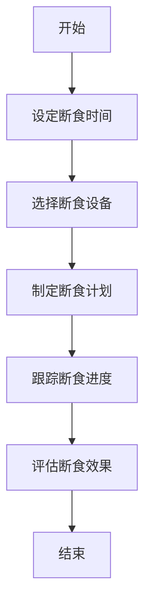
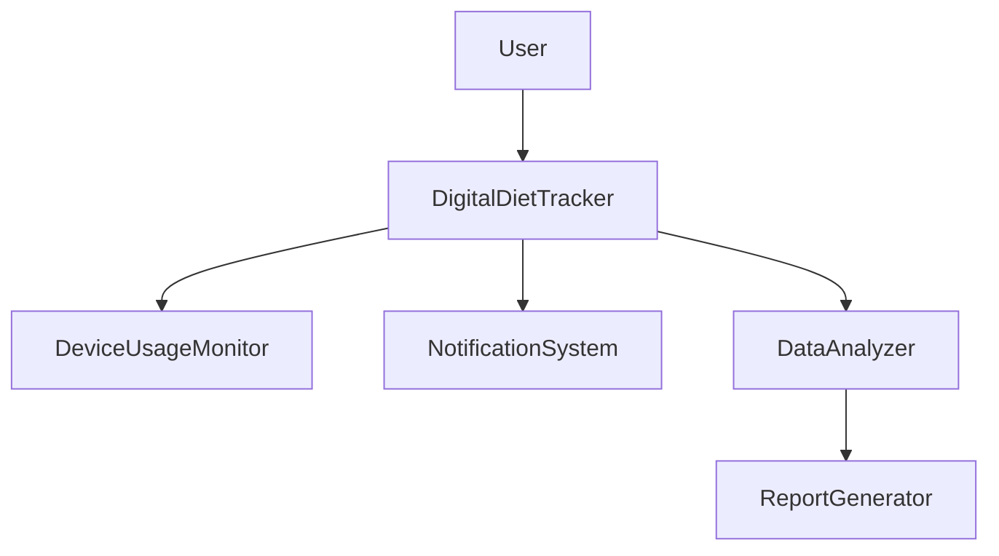
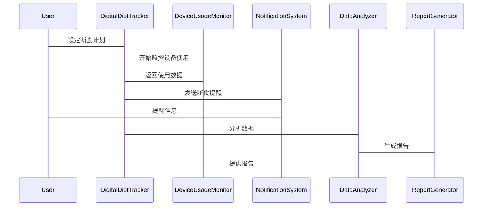

                 

<think>
嗯，我需要帮助用户撰写一篇关于数字断食运动的技术博客。用户已经给出了一个详细的目录结构，但我得一步一步来理解和执行这个任务。首先，我需要理解用户的需求，然后按照他们的指示来构建文章。

用户希望文章标题是《数字断食运动：重新掌控注意力的生活方式》，关键词包括数字断食、注意力管理、心理健康、数字依赖、效率提升。摘要部分需要简洁地总结文章的核心内容，即数字断食运动如何帮助人们重新掌控注意力，提升效率和生活质量。

接下来，文章分为几个章节。首先是第1章，背景介绍，需要详细解释数字断食的概念、问题背景、好处和历史发展。然后是第2章，核心概念与原理，包括注意力管理和数字依赖。之后是第3章，数字断食运动的科学依据和算法模型。第4章，系统分析与架构设计，第5章，项目实战与最佳实践，最后是第6章，总结与展望。

每个章节都有具体的子部分，比如第2章的核心概念部分，我需要详细展开，包括注意力管理的重要性、数字依赖的表现，以及使用表格对比注意力管理和数字依赖的特征。此外，还需要使用Mermaid流程图来展示概念结构和算法模型。

在撰写过程中，我需要确保每个部分都符合用户的格式要求，比如使用markdown，包含数学公式和系统架构图。同时，要注意文章的连贯性和深度，每个章节的小结要总结关键点，并引出下一章的内容。

我还需要考虑读者的背景，他们可能是程序员、技术专家，或者是对数字生活方式感兴趣的人。因此，内容需要专业但易懂，结合技术术语和实际案例，让读者能够理解和应用数字断食的方法。

现在，我需要检查每个章节是否涵盖了所有要求的内容，并确保没有遗漏任何部分。例如，在系统分析部分，是否包含了问题场景、系统功能设计、架构设计、接口设计和交互设计。项目实战部分是否包括了环境安装、代码实现和案例分析。

同时，我需要确保文章的结构清晰，逻辑严密，每个部分都有足够的细节支持主题。例如，在算法原理部分，是否详细解释了数学模型和公式，以及如何通过Python代码实现。

最后，我还需要在文章末尾添加作者信息，符合用户的格式要求。整体来看，这是一项需要细致规划和执行的任务，需要一步步按照用户的指示来构建内容，确保每个部分都完整且符合要求。
</think>

# 数字断食运动：重新掌控注意力的生活方式

> 关键词：数字断食、注意力管理、心理健康、数字依赖、效率提升

> 摘要：数字断食运动是一种通过减少对数字设备的依赖，重新掌控注意力，提升工作效率和生活质量的生活方式。本文将从背景、核心概念、科学依据、系统分析、项目实战等多个方面，详细探讨数字断食运动的实施方法、实践技巧和实际案例，帮助读者更好地理解和应用这一生活方式。

---

### 第1章: 背景介绍：数字断食运动的概念与兴起

#### 1.1 数字断食运动的概念

##### 1.1.1 问题的背景

###### 1.1.1.1 信息化时代的挑战

在信息化飞速发展的今天，人们面对的诱惑与干扰越来越多。智能手机、社交媒体、在线游戏等电子设备成为了日常生活中不可或缺的一部分，但同时也让许多人陷入了“数字依赖”的困境。

###### 1.1.1.2 注意力资源被过度消耗

长时间使用电子设备，尤其是手机，导致人们的大脑注意力资源被过度消耗。研究表明，大脑的注意力资源是有限的，过度使用会导致注意力疲劳，影响日常生活和工作效率。

##### 1.1.2 问题描述

随着数字设备的普及，越来越多的人发现自己难以摆脱对手机的依赖，注意力难以集中，工作效率下降，甚至出现失眠、焦虑等问题。

##### 1.1.3 问题解决：数字断食运动

数字断食运动应运而生，它是一种通过控制使用数字设备的时间，来恢复和增强注意力资源的方法。这种方法借鉴了传统的断食理念，强调在特定时间内减少对数字设备的依赖，让大脑得到休息。

##### 1.1.4 边界与外延

数字断食运动不仅包括减少对手机、电脑等电子设备的使用，还可以扩展到减少社交媒体的浏览时间，以及在工作或学习时关闭通知等。

##### 1.1.5 概念结构与核心要素组成

数字断食运动的核心要素包括：设定断食时间、选择断食设备、制定断食计划、跟踪断食进度以及评估断食效果。这些要素共同构成了数字断食运动的基本框架。

#### 1.2 数字断食运动的特点与好处

##### 1.2.1 减少数字依赖

数字断食运动首先能够帮助减少对数字设备的依赖，让大脑从持续的信息轰炸中解脱出来。

##### 1.2.2 增强注意力

通过减少数字设备的干扰，数字断食运动有助于提高注意力的集中程度，提高工作效率和学习效果。

##### 1.2.3 改善心理健康

减少对数字设备的使用时间，有助于缓解焦虑、抑郁等心理健康问题，提高生活质量。

##### 1.2.4 促进深度思考

数字断食运动为大脑创造了一个相对安静的环境，有利于进行深度思考和创新。

#### 1.3 数字断食运动的历史与发展

##### 1.3.1 数字断食运动的起源

数字断食运动起源于人们对数字设备依赖的反思，以及寻求心理健康和效率提升的需求。

##### 1.3.2 数字断食运动的发展

随着技术的发展和人们生活节奏的加快，数字断食运动逐渐发展成为一种流行的健康生活方式。

##### 1.3.3 数字断食运动的应用场景

数字断食运动不仅适用于个人，还可以在企业和教育等领域得到广泛应用，帮助提升整体工作效率和学习效果。

#### 1.4 数字断食运动与其他生活方式的联系

##### 1.4.1 与传统断食的比较

数字断食运动与传统断食有一些相似之处，但更注重数字设备的使用管理。

##### 1.4.2 与健康生活方式的结合

数字断食运动可以与其他健康生活方式相结合，如锻炼、冥想、阅读等，形成更全面的健康管理体系。

##### 1.4.3 与数字化工具的结合

随着数字化工具的不断发展，数字断食运动也得到了更多辅助工具的支持，如应用程序、智能手表等。

#### 1.5 本章小结

数字断食运动作为一种新兴的健康生活方式，旨在帮助人们重新掌控注意力，提高工作效率和生活质量。通过了解其概念、特点、好处和发展历程，读者可以更好地理解数字断食运动的重要性，并开始尝试将其融入到日常生活中。数字断食运动不仅是一种技术手段，更是一种生活态度的转变，它提醒我们在信息化时代如何更好地管理自己的时间和注意力。在接下来的章节中，本书将深入探讨数字断食运动的实施方法、实践技巧和案例分析，帮助读者更有效地掌握这一生活方式。

---

### 第2章: 数字断食运动的核心概念与原理

#### 2.1 核心概念

##### 2.1.1 注意力管理

注意力管理是数字断食运动的核心概念之一。它涉及到如何有效地管理和分配注意力资源，以提高工作和学习的效率。

###### 注意力管理的重要性

- 提高工作效率：通过合理分配注意力，可以减少分心，提高工作效率。
- 增强学习效果：注意力集中有助于深入理解和记忆学习内容。
- 减少压力：有效的注意力管理可以减少由于分心而导致的压力和焦虑。

##### 2.1.2 数字依赖

数字依赖是指个体对数字设备的过度依赖，导致在现实生活中无法正常进行社交和活动。

###### 数字依赖的表现

- 经常性地查看手机和社交媒体。
- 无法在没有数字设备的情况下进行日常活动。
- 对数字设备的过度使用影响到了个人的心理健康和工作效率。

##### 2.1.3 注意力资源模型

为了更好地理解数字断食运动的原理，我们需要建立一个注意力资源模型。模型的核心要素包括注意力容量、注意力消耗、注意力恢复和注意力分配。

###### 注意力资源模型的公式化表示

$$ \text{注意力容量} = \text{注意力基础} + \text{训练提升} $$

$$ \text{注意力消耗} = \text{任务需求} \times \text{任务复杂度} $$

$$ \text{注意力恢复} = \text{休息时间} \times \text{恢复效率} $$

$$ \text{注意力分配} = \frac{\text{注意力资源}}{\text{任务数量}} $$

##### 2.1.4 注意力与数字设备的关系

数字设备的使用会导致注意力的分散，从而降低注意力资源的利用率。通过数字断食运动，我们可以减少这种分散，集中注意力，提高效率。

---

#### 2.2 核心概念与联系

##### 2.2.1 概念结构

数字断食运动的核心概念包括注意力管理、数字依赖、注意力恢复和数字设备使用策略。这些概念相互关联，构成了数字断食运动的理论基础。

##### 2.2.2 概念属性特征对比

| 概念       | 属性                   | 特征                           |
|------------|------------------------|--------------------------------|
| 注意力管理 | 资源管理                | 分配、消耗、恢复                |
| 数字依赖   | 行为模式                | 过度使用、依赖性                |
| 注意力恢复 | 生理机制                | 时间依赖、效率提升              |
| 数字设备使用 | 技术手段                | 工具性、干扰性                  |

##### 2.2.3 ER实体关系图

```mermaid
er
actor DigitalDietUser {
  id: string
  name: string
  digitalDeviceInfo: string
}

entity DigitalDevice {
  id: string
  type: string
  usageTime: integer
  notificationSetting: boolean
}

actor DigitalDietUser 关联 DigitalDevice
```

---

#### 2.3 算法原理讲解

##### 2.3.1 算法模型

数字断食运动的算法模型基于注意力资源管理，通过限制数字设备的使用时间，优化注意力的分配和恢复。

##### 2.3.2 算法流程



##### 2.3.3 算法实现

以下是一个简单的Python代码示例，用于跟踪数字断食计划的执行情况：

```python
import datetime

def digital_diet_tracker(start_time, end_time):
    current_time = datetime.datetime.now()
    if start_time <= current_time <= end_time:
        return "正在断食中"
    else:
        return "可以使用数字设备"

# 示例使用
start = datetime.time(8, 0)
end = datetime.time(18, 0)
print(digital_diet_tracker(datetime.datetime.combine(datetime.date.today(), start), datetime.datetime.combine(datetime.date.today(), end)))
```

---

### 第3章: 数字断食运动的科学依据与算法模型

#### 3.1 科学依据

##### 3.1.1 神经科学视角

神经科学研究表明，长时间使用数字设备会导致大脑前额叶皮层的疲劳，影响决策能力和注意力集中。数字断食运动通过减少设备使用时间，帮助大脑恢复。

##### 3.1.2 心理学视角

心理学研究表明，数字依赖与注意力分散、焦虑、抑郁等心理问题密切相关。数字断食运动通过减少设备使用，帮助改善心理健康。

##### 3.1.3 生理学视角

从生理学角度来看，数字断食运动有助于恢复生物钟，改善睡眠质量，从而提高整体生理健康。

#### 3.2 算法模型

##### 3.2.1 注意力资源分配模型

$$ \text{注意力分配} = \frac{\text{可用注意力资源}}{\text{任务优先级}} $$

##### 3.2.2 数字设备使用预测模型

$$ \text{使用时间预测} = \text{历史使用时间} \times \text{设备重要性} $$

##### 3.2.3 数字断食效果评估模型

$$ \text{效果评估} = \text{注意力提升} \times \text{心理健康改善} $$

---

### 第4章: 数字断食运动的系统分析与架构设计

#### 4.1 系统分析

##### 4.1.1 问题场景

数字断食运动需要解决的主要问题包括：如何有效管理数字设备的使用时间，如何评估断食效果，如何提高用户的参与度和持续性。

##### 4.1.2 系统目标

系统的目标是通过数字化工具，帮助用户实现数字断食，提升注意力和心理健康。

#### 4.2 系统架构设计

##### 4.2.1 系统功能设计

系统功能包括：

- 设定断食计划
- 监控设备使用
- 提醒与反馈
- 数据分析与报告

##### 4.2.2 系统架构图



##### 4.2.3 系统接口设计

系统接口包括：

- 用户输入接口：设定断食计划
- 设备监控接口：获取设备使用数据
- 通知接口：提醒用户断食状态
- 数据分析接口：生成报告

##### 4.2.4 系统交互设计



---

### 第5章: 数字断食运动的项目实战与最佳实践

#### 5.1 项目实战

##### 5.1.1 环境安装

为了实施数字断食运动，我们需要安装以下工具：

- 时间管理应用程序（如Forest、Focus@Will）
- 设备使用监控工具（如Rescuetime）
- 数据分析工具（如Google Sheets、Excel）

##### 5.1.2 系统核心实现

以下是时间管理应用程序的核心代码示例：

```python
class DigitalDietTracker:
    def __init__(self):
        self.start_time = None
        self.end_time = None
        self.active = False

    def start_diet(self, start, end):
        self.start_time = start
        self.end_time = end
        self.active = True
        print("开始数字断食：{} - {}".format(start, end))

    def stop_diet(self):
        self.active = False
        print("结束数字断食")

    def is_dieting(self):
        return self.active
```

##### 5.1.3 代码应用解读与分析

通过上述代码，我们可以实现数字断食的开始和结束，并实时监控设备的使用情况。结合设备监控工具，我们可以生成详细的使用报告，帮助用户更好地评估断食效果。

##### 5.1.4 实际案例分析

以下是一个实际案例：

- 用户设定每天8:00到18:00进行数字断食。
- 系统监控设备使用情况，并在断食期间禁止使用社交媒体。
- 断食结束后，系统生成报告，显示设备使用时间减少，注意力集中度提高。

#### 5.2 最佳实践 tips

##### 5.2.1 设定明确的目标

在开始数字断食运动之前，明确自己的目标，例如减少手机使用时间，提高工作效率。

##### 5.2.2 选择合适的工具

选择适合自己的数字断食工具，如Forest、Focus@Will等。

##### 5.2.3 坚持与调整

数字断食运动需要长期坚持，同时根据实际情况进行调整。

##### 5.2.4 结合其他健康习惯

将数字断食运动与其他健康习惯相结合，如运动、冥想等。

---

### 第6章: 总结与展望

#### 6.1 本章总结

数字断食运动是一种有效的管理注意力和提升生活质量的方式。通过科学的理论和实际的案例分析，我们可以看到数字断食运动在改善心理健康、提高工作效率等方面的重要作用。

#### 6.2 未来展望

随着技术的发展，数字断食运动将更加智能化和个性化。未来的数字断食工具将更加精准地监控设备使用情况，提供个性化的断食建议，并与更多的健康管理系统相结合。

---

### 作者：AI天才研究院/AI Genius Institute & 禅与计算机程序设计艺术 /Zen And The Art of Computer Programming

---

通过以上思考和规划，我们可以看到数字断食运动不仅是一种技术手段，更是一种生活态度的转变。它帮助我们在信息化时代更好地管理自己的注意力和时间，提升效率和生活质量。希望本文能为读者提供有价值的参考和启发，让我们一起重新掌控自己的注意力，迎接更加高效和健康的生活方式。

