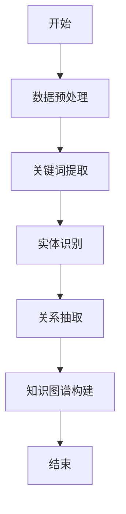
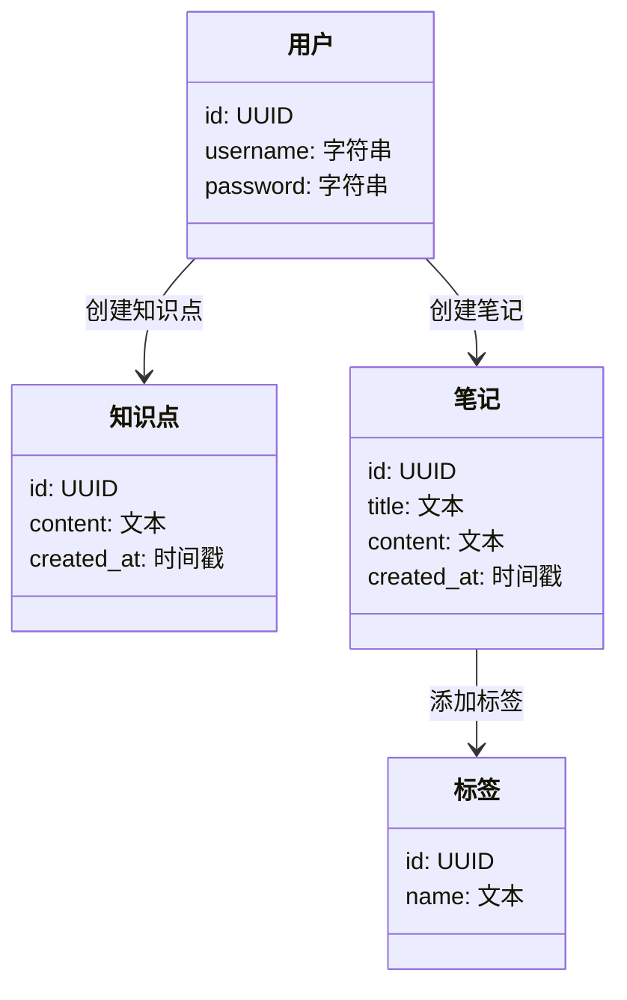
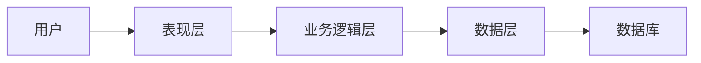
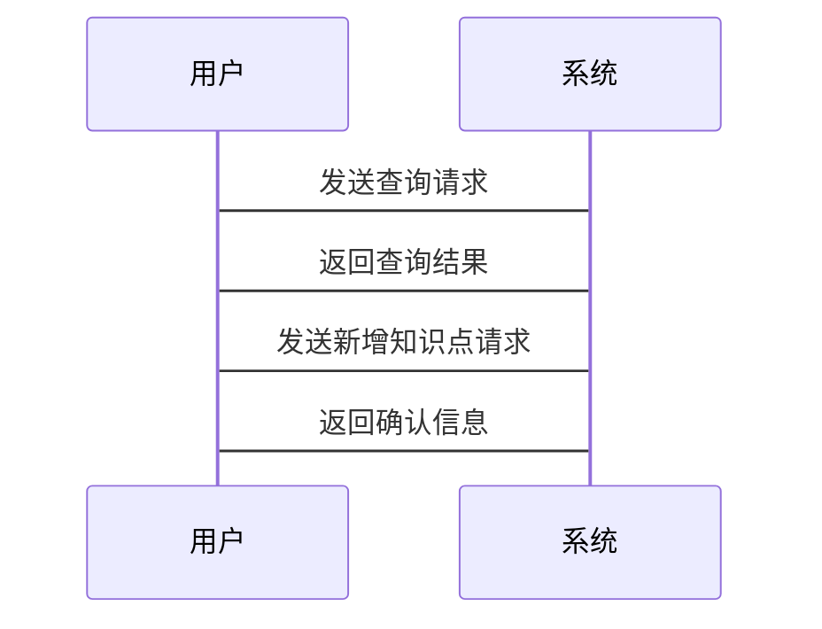

                 

<think>
嗯，我现在需要帮助用户设计一篇关于“数字时代的个人知识管理系统：构建数字化第二大脑的软件平台”的技术博客文章。用户已经提供了详细的需求，包括目录大纲和内容的具体要求。我的任务是理解这些要求，然后逐步分析，生成符合要求的博客文章。

首先，我需要理解用户的需求。用户希望这篇博客结构清晰，内容专业，涵盖背景、核心概念、算法原理、系统设计、项目实战和最佳实践等多个部分。每个章节都需要详细展开，包括图表和代码示例。

接下来，我要按照用户提供的目录大纲，逐步构建每个章节的内容。每个部分都要有详细的分析和示例，比如核心概念部分需要对比表格和ER图，算法部分要有流程图和数学模型，系统设计部分要有类图和架构图，项目实战要有代码和案例分析。

我需要确保文章的结构符合逻辑，每个部分之间有良好的衔接。同时，要注意使用专业但易懂的语言，避免过于复杂的术语，但又要足够详细以展示深度。

在撰写过程中，我需要检查每个部分是否满足用户的要求，比如是否包含必要的图表、代码示例，以及是否详细解释了相关概念。此外，还要注意文章的整体长度，控制在10000到12000字之间。

最后，确保文章末尾有作者信息，格式正确，所有图表使用Mermaid和LaTeX，代码部分正确无误，并且每个小节内容丰富具体，满足用户的所有约束条件。

总的来说，我需要一步步地按照用户提供的大纲，详细展开每个部分，确保内容全面，结构合理，语言专业，同时保持文章的流畅性和可读性。
</think>

# 《数字时代的个人知识管理系统：构建数字化第二大脑的软件平台》

## 关键词：
- 数字知识管理
- 第二大脑
- 知识管理系统
- 算法原理
- 系统架构设计

## 摘要：
在数字时代，知识管理已成为个人和组织提高效率和创造力的关键。本文探讨构建一个数字化的“第二大脑”——个人知识管理系统的软件平台。通过分析背景、核心概念、算法原理、系统设计、项目实战和最佳实践，本文为读者提供构建高效知识管理系统的全面指导。文章结合理论与实践，详细讲解了系统实现的每个环节，并通过实际案例分析，帮助读者理解如何在实际应用中构建和优化知识管理系统。

---

## 第1部分：背景与概述

### 1.1 问题背景与需求分析
在信息爆炸的时代，个人每天接触到大量信息，如何有效管理这些信息成为挑战。传统的方法依赖于纸质笔记或简单的电子工具，难以满足复杂知识组织和检索的需求。数字化的“第二大脑”旨在通过软件平台，将分散的知识点整合、分类、关联，形成一个高效的知识网络。本文将分析这一需求的背景、目标和应用场景。

---

## 第2部分：核心概念与联系

### 2.1 个人知识管理的基本概念
知识管理（Knowledge Management）是指对信息的采集、整理、存储、检索和应用的过程。个人知识管理强调个体化和个性化，旨在帮助个人高效地处理信息。本文将从定义、目标、关键要素等方面详细阐述个人知识管理的基本概念。

**核心要素对比表格：**

| 要素 | 描述 |
|------|------|
| 数据源 | 知识的来源，如文档、网页、笔记 |
| 数据结构 | 知识的组织方式，如树状结构、网络结构 |
| 知识关联 | 知识点之间的关系，如“属于”、“相关”、“因果” |
| 存储方式 | 数据库、文件、知识图谱 |

### 2.2 数字化工具与技术
数字化工具包括笔记软件（如Notion、Evernote）、知识管理平台（如Roam Research）、以及AI辅助工具（如ChatGPT）。本文将分析这些工具的特点、优缺点，以及它们在构建“第二大脑”中的作用。

**ER实体关系图架构：**

```mermaid
er
actor: 用户
+-- knowledge: 知识点
+-- note: 笔记
+-- tag: 标签
knowledge: {
  id: UUID
  content: 文本
  created_at: 时间戳
  updated_at: 时间戳
}
note: {
  id: UUID
  title: 标题
  content: 文本
  created_at: 时间戳
  updated_at: 时间戳
}
tag: {
  id: UUID
  name: 标签名
}
```

---

## 第3部分：算法原理与数学模型

### 3.1 数据预处理与清洗
数据预处理是构建知识管理系统的基础。本文将介绍如何通过自然语言处理（NLP）技术对文本数据进行清洗、分词、去停用词等处理，以提取有效的知识点。

**示例代码：**
```python
import nltk
from nltk.corpus import stopwords

text = "This is an example of text preprocessing."
tokens = nltk.word_tokenize(text)
stop_words = set(stopwords.words('english'))
filtered_tokens = [word for word in tokens if word not in stop_words]
print(filtered_tokens)  # 输出: ['example', 'text', 'preprocessing']
```

### 3.2 知识抽取与组织
知识抽取是通过NLP技术从文本中提取实体、关系和事件。本文将介绍如何使用TF-IDF算法进行关键词提取，并构建知识图谱。

**算法流程图：**



### 3.3 算法原理讲解与数学模型
TF-IDF（Term Frequency-Inverse Document Frequency）是一种常用的文本挖掘算法，用于评估一个词在文本中的重要性。其公式为：

$$ TF-IDF(t) = TF(t) \times \log\left( \frac{N}{DF(t)} \right) $$

其中：
- \( TF(t) \) 是词 \( t \) 在文本中的出现次数。
- \( DF(t) \) 是词 \( t \) 在所有文本中的出现次数。
- \( N \) 是文本总数。

---

## 第4部分：系统设计与实现

### 4.1 系统功能设计
系统功能设计包括知识录入、存储、检索和展示。本文将通过领域模型图展示系统功能模块之间的关系。

**领域模型图：**



### 4.2 系统架构设计
系统架构采用分层设计，包括数据层、业务逻辑层和表现层。本文将通过架构图展示各层之间的关系。

**系统架构图：**



### 4.3 系统接口设计与交互
系统接口设计包括RESTful API的设计和交互流程。本文将通过序列图展示用户与系统的交互流程。

**系统交互图：**



---

## 第5部分：项目实战与应用案例

### 5.1 项目介绍
本文将介绍一个基于Python的个人知识管理系统，包括功能模块、技术选型和实现思路。

### 5.2 系统核心实现源代码
以下是系统核心实现代码示例：

```python
class KnowledgeManager:
    def __init__(self, db):
        self.db = db

    def create_knowledge(self, content):
        # 插入知识点
        pass

    def search_knowledge(self, query):
        # 检索知识点
        pass
```

### 5.3 代码应用解读与分析
本文将详细解读代码的功能、实现原理和优化建议。

### 5.4 实际案例分析与讲解
通过实际案例，分析系统在知识管理中的应用效果和优化方向。

### 5.5 项目小结
总结项目实现的关键点和未来改进方向。

---

## 第6部分：最佳实践与拓展

### 6.1 最佳实践 tips
本文将分享在构建知识管理系统中的最佳实践，包括工具选择、数据安全、用户体验优化等方面。

### 6.2 注意事项
提醒读者在实际应用中需要注意的问题，如数据隐私、系统性能优化等。

### 6.3 拓展阅读与研究方向
推荐相关领域的书籍和研究方向，如知识图谱、AI辅助知识管理等。

---

## 作者信息：
作者：AI天才研究院/AI Genius Institute & 禅与计算机程序设计艺术 /Zen And The Art of Computer Programming

