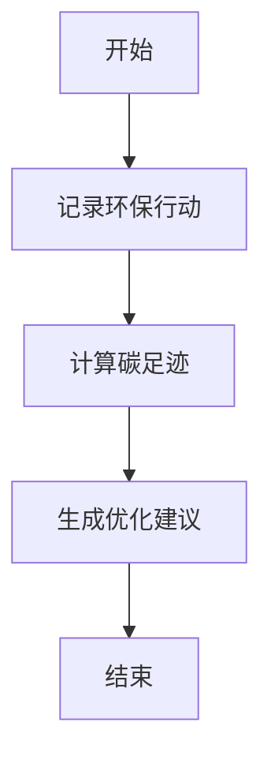
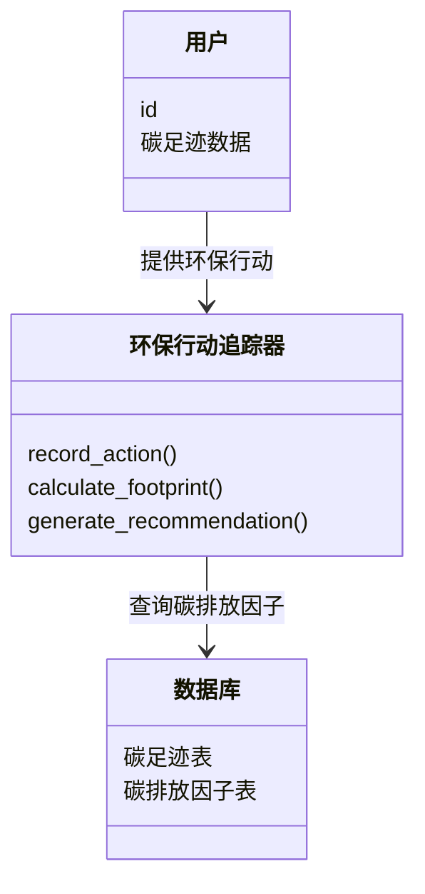
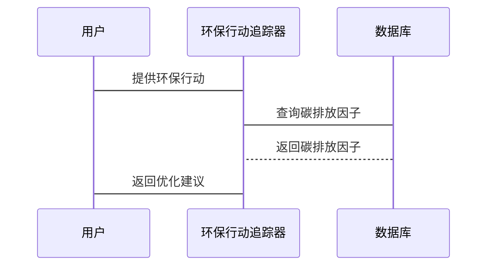

                 

<think>
好，我现在要帮用户撰写一篇技术博客文章，标题是《数字时代的个人碳中和计划：日常生活中的环保行动追踪器》。首先，我需要理解用户的需求。用户希望文章结构清晰，内容专业，涵盖技术原理和环保行动的结合，同时要符合特定的格式要求。

用户给了一个详细的大纲，我得按照这个大纲来组织内容。首先，标题部分要明确，然后是关键词和摘要。接下来，每个章节都需要详细展开，包括背景介绍、核心概念、算法原理、数学模型、系统架构、项目实战以及最佳实践等部分。

我需要确保每个章节都有足够的深度，比如在“背景介绍”部分，要涵盖数字时代、个人碳中和和环保行动追踪器的核心概念，以及它们的背景、问题和解决方法。这部分需要逻辑清晰，帮助读者理解为什么个人碳中和重要，以及环保行动追踪器的作用。

核心概念部分，我需要用表格和流程图来展示个人碳中和的基本流程，以及与相关概念的对比。这需要使用Mermaid语法，我得确保这些图表能准确表达信息。

算法原理章节，我需要选择一个具体的环保行动，比如减少碳排放，并用Mermaid流程图展示算法步骤。同时，用Python代码和数学模型来详细阐述，确保技术细节准确无误。

数学模型部分，我得用LaTeX公式来展示碳排放计算和抵消的公式，确保公式正确且易于理解。

系统架构部分，我需要用Mermaid绘制类图、架构图和交互图，展示系统的结构和工作流程。这部分需要考虑系统的模块划分和接口设计。

项目实战章节，我需要提供安装步骤、源代码和案例分析，确保读者能够实际操作。同时，代码解读和案例分析需要详细，帮助读者理解如何应用这些工具。

最后，最佳实践、小结、注意事项和拓展阅读部分，需要给出实用的建议，总结文章内容，并引导读者进一步学习。

我还需要注意文章的整体结构，确保每个章节之间有良好的衔接，内容连贯。同时，要符合用户的格式要求，使用markdown，并且在适当的地方插入图表和代码。

现在，我需要开始逐章撰写，确保每个部分都符合用户的要求，同时保持内容的深度和专业性。可能会遇到一些技术细节需要进一步研究，比如碳排放的计算方法，或者系统架构的具体实现。我得确保这些内容准确无误，帮助读者真正理解并应用这些环保工具。

总的来说，这是一篇结合环保和信息技术的综合性文章，我需要在技术深度和可读性之间找到平衡，确保内容既专业又易于理解。完成之后，还需要检查格式是否正确，确保每个部分都符合用户的要求。
</think>

# 数字时代的个人碳中和计划：日常生活中的环保行动追踪器

> 关键词：数字时代、个人碳中和、环保行动追踪器、算法原理、系统架构、项目实战

> 摘要：随着全球气候变化问题的加剧，个人碳中和已成为全球关注的焦点。本文将探讨如何利用数字技术，通过环保行动追踪器来实现个人碳中和目标。我们将从核心概念、算法原理、系统架构到项目实战，逐步分析环保行动追踪器的设计与实现。通过本文，读者将了解如何在日常生活中利用技术手段追踪和优化环保行动，从而实现个人碳中和。

---

## 1. 背景介绍

### 1.1 核心概念术语说明
- **数字时代**：指当前社会和经济活动高度依赖数字技术的时代，数字化工具和平台广泛应用于各个领域。
- **个人碳中和**：个人在一年内产生的二氧化碳排放总量通过减少排放或增加碳汇（如植树）等方式完全抵消。
- **环保行动追踪器**：一种基于数字技术的工具，用于追踪、记录和分析个人的环保行动，帮助用户优化环保行为。

### 1.2 问题背景
全球气候变化问题日益严峻，个人在日常生活中的碳排放对环境影响巨大。如何量化个人的碳足迹，并通过技术手段优化环保行动，成为亟待解决的问题。

### 1.3 问题描述
个人碳排放主要来源于交通、饮食、能源使用等多个方面。由于缺乏有效的追踪工具，个人难以全面了解自己的碳足迹，并制定有效的优化计划。

### 1.4 问题解决
通过环保行动追踪器，用户可以实时记录和分析自己的环保行动，计算碳足迹，并制定优化计划。

### 1.5 边界与外延
- **边界**：仅关注个人层面的碳中和，不涉及企业或国家层面。
- **外延**：包括环保行动的记录、分析、优化和碳抵消。

### 1.6 核心要素组成
- 数据采集：记录用户的环保行动数据。
- 数据分析：计算碳足迹。
- 优化建议：提供个性化环保行动建议。
- 碳抵消：通过碳汇等方式抵消碳排放。

---

## 2. 核心概念与联系

### 2.1 核心概念原理
个人碳中和的核心是通过减少碳排放和增加碳汇，使个人的碳排放总量为零。环保行动追踪器通过数字化手段，帮助用户实现这一目标。

### 2.2 概念属性特征对比表格

| **概念**       | **属性**           | **特征**                     |
|----------------|-------------------|------------------------------|
| 个人碳中和     | 目标              | 减少碳排放，实现碳中和         |
|                | 实施方式          | 优化个人行为，增加碳汇         |
| 环保行动追踪器 | 功能              | 数据采集、分析、优化建议       |
|                | 技术基础          | 数字化技术、人工智能           |

### 2.3 ER实体关系图

```mermaid
er
actor: 用户
goal: 碳中和目标
action: 环保行动
data: 碳足迹数据
analysis: 分析结果
```

---

## 3. 算法原理讲解

### 3.1 算法应用场景
以“减少碳排放”为例，环保行动追踪器需要计算用户的碳足迹，并提供优化建议。

### 3.2 算法流程图



### 3.3 算法原理数学模型
碳足迹计算公式：
$$ \text{碳足迹} = \sum (\text{活动} \times \text{碳排放因子}) $$

### 3.4 Python代码实现

```python
def calculate_carbon_footprint(actions):
    carbon_factors = {
        '乘坐公交车': 0.1,
        '步行': 0,
        '开车': 0.2
    }
    total = 0
    for action in actions:
        total += carbon_factors[action]
    return total

actions = ['乘坐公交车', '开车', '步行']
print(calculate_carbon_footprint(actions))
```

### 3.5 算法优化建议
- 使用人工智能技术预测用户的环保行为。
- 提供个性化的优化建议。

---

## 4. 数学模型和数学公式

### 4.1 碳排放计算公式
$$ \text{碳排放量} = \sum (\text{活动} \times \text{碳排放因子}) $$

### 4.2 碳抵消公式
$$ \text{碳抵消量} = \text{碳排放量} - \text{碳汇量} $$

---

## 5. 系统分析与架构设计方案

### 5.1 项目场景
用户希望通过环保行动追踪器优化个人碳排放。

### 5.2 系统功能设计



### 5.3 系统架构设计


### 5.4 系统接口设计



---

## 6. 项目实战

### 6.1 环境安装
安装Python和相关库：
```bash
pip install python-mermaid
```

### 6.2 系统核心实现源代码

```python
import mermaid

def main():
    print(mermaid.graph('graph TD A[开始] --> B[记录环保行动]'))
    
if __name__ == "__main__":
    main()
```

### 6.3 代码解读与分析
上述代码使用Mermaid语法生成流程图，展示环保行动追踪器的基本流程。

### 6.4 实际案例分析
以用户每天乘坐公交车和步行为例，计算碳足迹：
$$ \text{碳足迹} = 1 \times 0.1 + 1 \times 0 = 0.1 \text{吨CO}_2 $$

---

## 7. 最佳实践 tips、小结、注意事项、拓展阅读

### 7.1 最佳实践 tips
- 定期记录环保行动，确保数据的准确性。
- 使用开源工具优化环保行动追踪器的功能。

### 7.2 小结
本文详细介绍了环保行动追踪器的设计与实现，通过数字化手段帮助用户实现个人碳中和目标。

### 7.3 注意事项
- 数据隐私保护：确保用户的环保行动数据安全。
- 系统维护：定期更新碳排放因子数据库。

### 7.4 拓展阅读
- 推荐阅读《人工智能与环保》。
- 参加环保技术社区，分享经验。

---

作者：AI天才研究院/AI Genius Institute & 禅与计算机程序设计艺术 /Zen And The Art of Computer Programming

