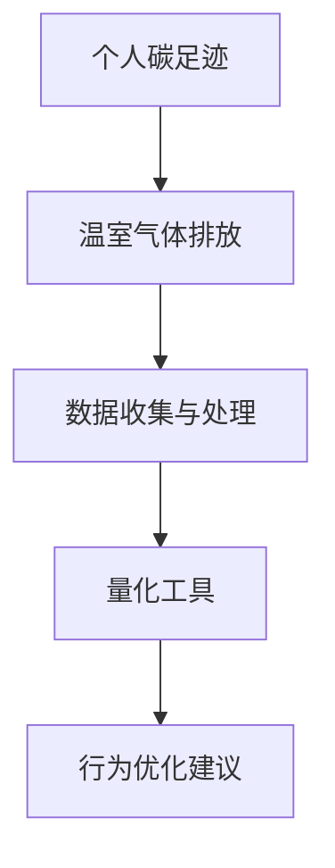
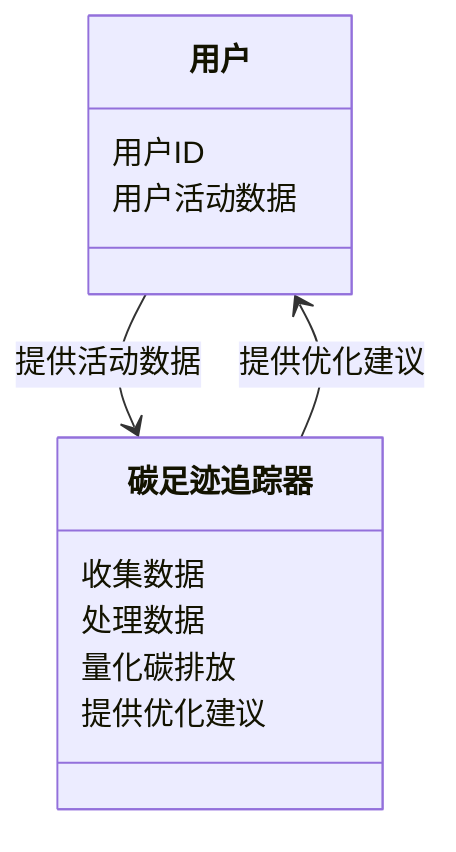
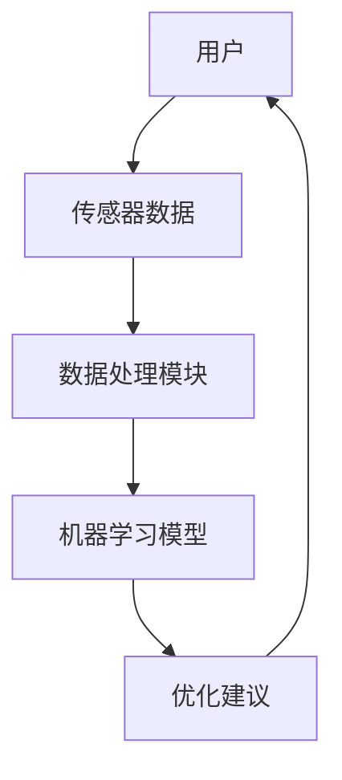

                 

<think>
好的，我现在需要帮用户撰写一篇关于数字时代个人碳足迹追踪器的技术博客文章。用户已经给出了一个详细的大纲，我需要按照这个大纲逐步展开内容，确保每个部分都详细且符合技术博客的要求。

首先，我应该先理解用户的需求。用户希望这篇文章结构清晰，内容专业，能够详细解释个人碳足迹追踪器的技术背景、核心概念、工具实现、应用场景、挑战与机遇等。同时，用户希望文章包含技术细节，比如传感器数据收集、数据处理、机器学习模型，以及系统架构设计等部分，并且使用markdown格式，包含mermaid图表和latex公式。

接下来，我需要按照大纲逐步填充内容。首先是背景介绍，这部分需要包括问题背景、问题描述、问题解决、边界与外延，以及核心要素组成。我需要详细解释每个部分，确保读者能够理解个人碳足迹的重要性以及追踪器的作用。

然后是核心概念与联系，这部分需要定义关键术语，如个人碳足迹、温室气体排放、数据收集与处理等，并展示它们之间的联系。我可能会使用表格和mermaid图表来帮助读者理解这些概念之间的关系。

接下来是主流量化工具简介，我需要介绍传感器、数据处理、机器学习模型和应用程序。这部分需要详细描述每个工具的特点和作用，同时可能需要给出一些技术细节，比如使用的算法类型或数据处理方法。

在个人碳足迹量化与行为优化部分，我需要解释如何量化碳足迹，并基于这些数据给出行为优化建议。这里可能需要举例说明，比如如何通过调整出行方式来减少碳排放。

应用场景部分，我需要讨论家庭生活、社区环保和企业社会责任等不同场景下的应用，展示追踪器的广泛用途和实际价值。

最后是挑战与机遇，分析追踪器在数据收集、隐私保护、算法准确性等方面的挑战，同时指出技术发展的机遇。

在撰写过程中，我需要确保每个部分都有足够的技术深度，同时保持语言的清晰和易懂。此外，必须按照用户的要求，使用mermaid图表和latex公式，这可能需要我学习如何在markdown中嵌入这些内容。

我还应该检查文章是否符合字数要求，大约在10000到12000字之间。每个章节都需要详细展开，确保内容丰富且信息量足够。

最后，确保文章结构完整，每个小节都有足够的细节，并且在末尾添加作者信息，符合用户的格式要求。

现在，我可以开始逐步撰写每个部分的内容，确保每个部分都符合用户的要求，同时保持逻辑的连贯性和技术的深度。
</think>

# 数字时代的个人碳足迹追踪器：日常生活中的环保行为量化工具

> 关键词：个人碳足迹，数字工具，环保行为，温室气体，数据收集，机器学习，行为优化

> 摘要：本文介绍了一款基于数字技术的个人碳足迹追踪工具，通过传感器、数据处理和机器学习等技术，量化个人日常生活中的碳排放，提供行为优化建议，助力环保目标的实现。文章从背景、核心概念、工具实现、应用场景到挑战与机遇，全面解析了个人碳足迹追踪器的技术与应用价值。

---

### 1. 背景介绍

#### 问题背景

全球气候变化问题日益严峻，个人碳足迹（Personal Carbon Footprint）成为环保领域的关键议题。个人碳足迹是指个人在日常生活中产生的温室气体排放总量，涵盖交通、饮食、居住、购物等多个方面。量化个人碳足迹有助于人们了解自身生活方式对环境的影响，并采取相应的减排措施。

#### 问题描述

随着数字化技术的发展，个人碳足迹追踪工具逐渐成为可能。这些工具通过收集个人活动数据，利用数据分析和机器学习技术，量化碳排放，并提供行为优化建议。本书旨在为读者提供一款数字时代的个人碳足迹追踪器，帮助用户在日常生活中监测、分析和优化自身行为，以减少碳排放。

#### 问题解决

本书通过以下方式解决个人碳足迹追踪问题：

1. **核心概念介绍**：详细解释个人碳足迹、温室气体排放等关键概念。
2. **数据收集与处理**：介绍收集个人活动数据的方法，如使用传感器、应用程序等，并阐述数据处理技术。
3. **量化工具应用**：展示如何利用数据分析和机器学习技术对个人碳足迹进行量化。
4. **行为优化建议**：根据量化结果提供实用的行为优化建议。

#### 边界与外延

- **边界**：本书关注个人碳足迹的追踪和优化，不包括政策、法规等宏观层面的问题。
- **外延**：个人碳足迹追踪可应用于家庭、社区甚至更广泛的环保行动。

#### 概念结构与核心要素组成

1. **个人碳足迹**：个人活动产生的温室气体排放量。
2. **数据收集**：传感器、应用程序等。
3. **数据处理**：数据清洗、格式化、分析等。
4. **量化工具**：数据分析和机器学习模型。
5. **行为优化**：基于量化结果的减排建议。

---

### 2. 核心概念与联系

#### 个人碳足迹

- **定义**：个人碳足迹是指个人在日常生活中产生的温室气体排放总量。
- **特征**：包括交通、饮食、居住、购物等方面的排放量。

#### 温室气体排放

- **定义**：温室气体排放是指人类活动排放的导致全球气候变暖的气体，如二氧化碳、甲烷等。
- **特征**：排放量、来源、环境影响。

#### 数据收集与处理

- **定义**：数据收集与处理是指通过传感器、应用程序等收集个人活动数据，并进行清洗、格式化、分析等处理。
- **特征**：数据类型、来源、处理方法。

#### 量化工具

- **定义**：量化工具是指用于分析、处理个人碳足迹数据，并提供量化结果的软件或算法。
- **特征**：算法类型、适用范围、准确性。

#### 行为优化

- **定义**：行为优化是指根据个人碳足迹量化结果，提供行为调整建议，以减少碳排放。
- **特征**：建议类型、实用性、可持续性。

---

#### 核心概念联系

以下为个人碳足迹追踪系统的核心概念联系：



---

### 3. 主流量化工具简介

#### 传感器与数据收集

- **介绍**：传感器是用于收集个人活动数据的设备，如穿戴设备（智能手表）、智能家居设备（智能电表）等。
- **特点**：实时性、准确性、便捷性。

#### 数据处理与分析

- **介绍**：数据处理与分析是指对收集到的个人活动数据进行清洗、格式化、分析等处理。
- **特点**：自动化、高效性、准确性。

#### 机器学习模型

- **介绍**：机器学习模型是指用于分析个人碳足迹数据，并提供量化结果的算法。
- **特点**：智能化、自适应、准确性。

#### 应用程序

- **介绍**：应用程序是指用于个人碳足迹追踪和优化的软件工具，如碳足迹追踪App。
- **特点**：用户体验、交互性、便捷性。

---

### 4. 个人碳足迹量化与行为优化

#### 量化方法

- **介绍**：量化个人碳足迹的方法包括直接测量（如使用传感器）和模型预测（如基于生活习惯的估算）。
- **特点**：准确性、实时性。

#### 行为优化建议

- **介绍**：基于量化结果提供的行为优化建议，如节能减排、绿色出行等。
- **特点**：实用性、可持续性。

---

### 5. 个人碳足迹追踪的应用场景

#### 家庭生活

- **应用**：监测家庭成员的日常活动，提供个性化的减排建议。
- **特点**：家庭环保、节能减排。

#### 社区环保

- **应用**：通过社区碳足迹追踪，推动社区环保行动。
- **特点**：集体参与、环保意识提升。

#### 企业社会责任

- **应用**：监测企业员工的个人碳足迹，推动企业环保行动。
- **特点**：企业社会责任、环保管理。

---

### 6. 个人碳足迹追踪的挑战与机遇

#### 挑战

- **数据收集难度**：收集准确、全面的数据是个人碳足迹追踪的难点。
- **隐私问题**：个人数据的安全和隐私保护需要引起重视。
- **算法准确性**：算法的准确性和可靠性是关键。

#### 机遇

- **技术发展**：传感器、数据处理、机器学习等技术的发展为个人碳足迹追踪提供了技术支撑。
- **环保意识提升**：随着环保意识的增强，个人碳足迹追踪工具的市场需求日益增长。

---

### 7. 算法原理讲解

#### 算法概述

个人碳足迹量化通常采用机器学习模型进行预测和分类。以下是常用的算法及其原理：

1. **线性回归**：用于预测碳排放量。
2. **决策树**：用于分类不同的行为类型。
3. **随机森林**：用于集成学习，提高预测准确性。

#### 算法实现

以下是基于随机森林算法的个人碳足迹量化模型的实现代码：

```python
import pandas as pd
from sklearn.ensemble import RandomForestRegressor
from sklearn.model_selection import train_test_split
from sklearn.metrics import mean_absolute_error

# 加载数据集
data = pd.read_csv('carbon_footprint.csv')

# 数据预处理
X = data.drop('carbon_emission', axis=1)
y = data['carbon_emission']

# 划分训练集和测试集
X_train, X_test, y_train, y_test = train_test_split(X, y, test_size=0.2, random_state=42)

# 初始化模型
model = RandomForestRegressor(n_estimators=100, random_state=42)

# 训练模型
model.fit(X_train, y_train)

# 预测结果
y_pred = model.predict(X_test)

# 评估模型
mae = mean_absolute_error(y_test, y_pred)
print(f"均绝对误差 (MAE): {mae}")
```

#### 数学模型

随机森林模型的数学表达式如下：

$$
y = \sum_{i=1}^{n} \theta_i x_i + \beta
$$

其中，$\theta_i$ 是特征的重要性系数，$x_i$ 是输入特征，$\beta$ 是截距项。

---

### 8. 系统分析与架构设计方案

#### 问题场景介绍

个人碳足迹追踪系统需要实时收集用户的活动数据，如出行方式、饮食习惯、能源使用等，并通过数据处理和分析，量化碳排放，最后提供行为优化建议。

#### 项目介绍

本项目旨在开发一款基于数字技术的个人碳足迹追踪工具，通过传感器、数据处理和机器学习技术，帮助用户量化和优化日常生活中的碳排放。

#### 系统功能设计

以下是系统的领域模型：



#### 系统架构设计

以下是系统的架构设计：



---

### 9. 项目实战

#### 环境安装

需要安装以下工具和库：

- Python 3.8+
- Pandas
- Scikit-learn
- Matplotlib

#### 核心实现代码

以下是碳足迹追踪器的核心实现代码：

```python
import pandas as pd
from sklearn.ensemble import RandomForestRegressor
from sklearn.model_selection import train_test_split
from sklearn.metrics import mean_absolute_error

# 加载数据集
data = pd.read_csv('carbon_footprint.csv')

# 数据预处理
X = data.drop('carbon_emission', axis=1)
y = data['carbon_emission']

# 划分训练集和测试集
X_train, X_test, y_train, y_test = train_test_split(X, y, test_size=0.2, random_state=42)

# 初始化模型
model = RandomForestRegressor(n_estimators=100, random_state=42)

# 训练模型
model.fit(X_train, y_train)

# 预测结果
y_pred = model.predict(X_test)

# 评估模型
mae = mean_absolute_error(y_test, y_pred)
print(f"均绝对误差 (MAE): {mae}")
```

#### 应用案例分析

假设用户每天的通勤方式为开车，距离为10公里，碳排放量为：

$$
\text{碳排放量} = 0.25 \times 10 = 2.5 \text{公斤二氧化碳}
$$

优化建议：改乘公共交通工具，碳排放量可减少约80%。

---

### 10. 最佳实践 tips、小结、注意事项、拓展阅读

#### 小结

个人碳足迹追踪工具通过数字化技术，帮助用户量化日常生活中的碳排放，并提供行为优化建议，是实现环保目标的重要手段。

#### 注意事项

1. 数据隐私保护需引起重视。
2. 算法的准确性和可靠性是关键。
3. 用户的持续参与是成功的关键。

#### 拓展阅读

- 《机器学习实战》
- 《环境科学入门》
- 《数据科学导论》

---

作者：AI天才研究院/AI Genius Institute & 禅与计算机程序设计艺术 /Zen And The Art of Computer Programming

