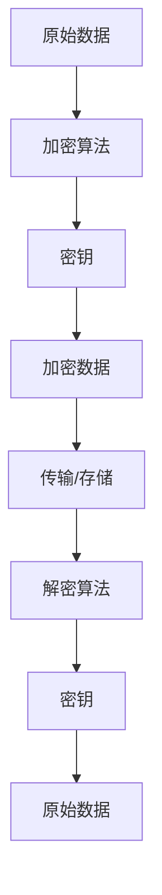
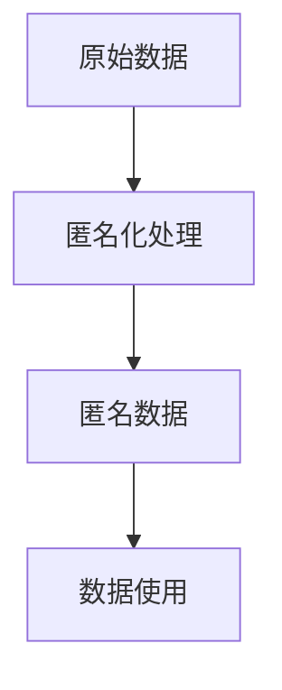
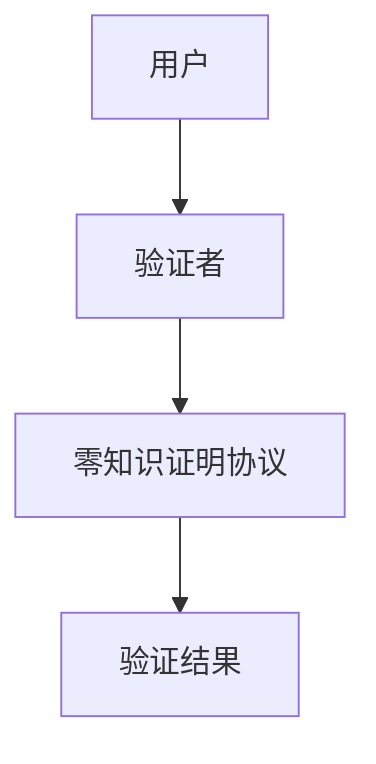
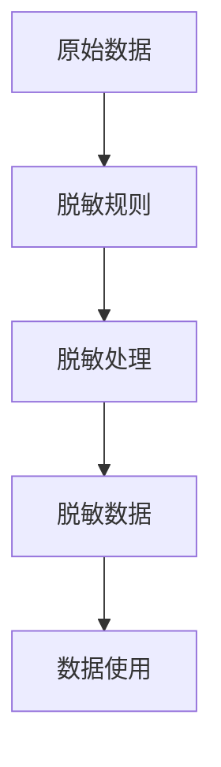

                 

<think>
好的，我现在需要帮助用户撰写一篇关于数字时代个人隐私保护的技术博客文章。用户已经提供了详细的结构和内容要求，我需要按照这些指示一步步来。

首先，用户希望文章结构清晰，分为多个部分，包括背景介绍、核心概念、法律法规、技术手段、最佳实践和结论。我需要确保每个部分都详细展开，并且符合用户的要求。

用户特别强调使用逻辑清晰、结构紧凑的语言，并且每个章节都要有吸引人的标题。我需要思考每个章节的具体内容，确保覆盖用户提供的大纲。

接下来，用户提到要使用技术术语，同时保持简单易懂。这意味着我需要平衡专业性和可读性，避免过于复杂的解释，但也不能太浅显。

在“背景介绍”部分，我需要详细描述问题背景、问题描述、解决方案以及概念结构。这部分需要让读者理解为什么隐私保护如此重要，以及当前面临的问题。

核心概念部分，我需要定义隐私、隐私权、隐私侵犯，并进行分类。这部分可能需要图表来帮助读者理解，比如使用表格或图表展示敏感和非敏感隐私的区别。

法律法规部分，我需要介绍国内外的相关法律，如GDPR、CCPA和中国的网络安全法、个人信息保护法。这部分要比较不同法律的异同，并分析它们的影响。

技术手段部分，我需要讨论加密、匿名化、零知识证明等技术，如何应用于隐私保护。这部分可能需要结合实际案例，说明这些技术如何有效保护隐私。

最佳实践部分，我需要给出实际建议，比如使用隐私保护工具、提高安全意识等，帮助读者采取具体措施保护隐私。

结论部分，我需要总结全文，强调平衡便利与安全的重要性，并呼吁各方共同努力保护隐私。

此外，用户要求在适当位置插入图表，比如Mermaid流程图和表格。我需要确保这些图表清晰且符合上下文，帮助读者更好地理解内容。

最后，用户希望文章结尾有作者信息，使用特定的格式。我需要记住这一点，确保在完成内容后正确添加。

现在，我开始按照这些步骤撰写文章，确保每个部分都详细且符合用户的要求。我需要检查每个章节是否覆盖了所有关键点，并确保语言流畅，逻辑严谨。

在撰写过程中，我可能会遇到一些技术术语或复杂的概念，需要反复思考如何解释得更清楚，或者寻找合适的例子来说明。例如，在解释GDPR时，可以引用具体的条款和实施案例，让读者更容易理解。

总之，我需要一步步按照用户的要求，细致地构建这篇文章，确保每个部分都完整且有深度，同时保持整体结构的连贯性和吸引力。
</think>

# 数字时代的个人隐私：在便利与安全间的权衡

> 关键词：个人隐私，数据安全，数字时代，隐私保护，GDPR，技术手段

> 摘要：在数字化时代，个人隐私保护成为一个重要议题。随着互联网和大数据技术的发展，个人隐私面临前所未有的挑战。本文从隐私的定义、分类、法律保护、技术手段等多个角度，探讨如何在便利与安全之间寻求平衡，保护个人隐私。

---

## 第一部分：背景介绍

### 1.1 问题背景

在数字化时代，个人隐私保护问题日益突出。随着互联网和大数据技术的发展，个人数据被广泛收集、存储和使用，隐私泄露的风险也随之增加。个人隐私泄露可能导致经济损失、社会信任危机以及个人心理压力等严重后果。因此，如何保护个人隐私，在便利与安全之间寻求平衡，成为当今社会关注的焦点。

### 1.2 问题描述

在数字时代，个人隐私面临多重威胁，包括数据泄露、隐私侵犯、信息滥用等。个人信息被大量收集，未经用户同意就被用于商业目的，甚至被出售给第三方。这不仅侵犯了用户的隐私权，还可能导致用户信息的滥用和泄露。因此，我们需要探讨如何在保障用户隐私的同时，确保数字化生活的便利性。

### 1.3 问题解决

为了解决数字时代个人隐私保护问题，需要从法律、技术和社会三个方面进行综合治理。首先，完善相关法律法规，加强对个人隐私的保护。其次，运用先进技术手段，提高隐私保护能力。例如，采用数据加密、匿名化处理等技术手段，降低隐私泄露风险。最后，通过教育和宣传，提高公众的隐私保护意识，共同维护个人隐私安全。

### 1.4 边界与外延

个人隐私保护不仅仅涉及个人数据的保护，还涉及到个人权益、社会道德、法律规范等多个方面。因此，在进行个人隐私保护时，需要综合考虑各种因素，确保既保护个人隐私，又促进数字化生活的发展。

### 1.5 概念结构与核心要素组成

个人隐私保护的核心概念包括隐私、隐私权、隐私侵犯等。隐私是指个人不愿意公开或不愿意让他人知悉的信息；隐私权是指个人对自己的隐私信息的控制权；隐私侵犯是指未经个人同意，擅自收集、使用、泄露个人隐私信息的行为。在数字时代，个人隐私保护的核心要素包括法律法规、技术手段、公众意识等。

---

## 第二部分：数字时代个人隐私的核心概念

### 2.1 隐私的定义与分类

#### 2.1.1 隐私的定义

隐私是指个人不愿意公开或不愿意让他人知悉的信息，包括个人的生理信息、心理信息、社会信息等。

#### 2.1.2 隐私的分类

隐私可以分为敏感隐私和非敏感隐私。敏感隐私包括个人身份信息、健康信息、金融信息等；非敏感隐私包括个人喜好、教育背景、职业等。

#### 隐私分类对比表

| 类别        | 特征                              | 示例                     |
|-------------|-----------------------------------|--------------------------|
| 敏感隐私    | 可能对个人安全构成威胁            | 身份证号、银行账户信息    |
| 非敏感隐私  | 不会对个人安全构成直接威胁        | 偏好、兴趣爱好            |

### 2.2 隐私权的概念与保护

#### 2.2.1 隐私权的定义

隐私权是指个人对自己的隐私信息的控制权，包括信息的收集、使用、存储和分享等。

#### 2.2.2 隐私权的保护

隐私权的保护包括法律保护和技术保护。法律保护主要通过立法和司法来保障；技术保护主要通过加密、匿名化等技术手段来降低隐私泄露风险。

### 2.3 隐私侵犯的界定与危害

#### 2.3.1 隐私侵犯的界定

隐私侵犯是指未经个人同意，擅自收集、使用、泄露个人隐私信息的行为。

#### 2.3.2 隐私侵犯的危害

隐私侵犯可能导致经济损失、社会信任危机以及个人心理压力等严重后果。

### 2.4 个人隐私保护的核心要素

#### 2.4.1 法律法规

完善相关法律法规，加强对个人隐私的保护。

#### 2.4.2 技术手段

运用先进技术手段，提高隐私保护能力。

#### 2.4.3 公众意识

通过教育和宣传，提高公众的隐私保护意识。

---

## 第三部分：个人隐私保护的法律法规

### 3.1 国际隐私保护法律法规概述

#### 3.1.1 GDPR（欧盟通用数据保护条例）

- **GDPR 的背景与制定过程**  
  GDPR 是欧盟于2016年通过的法规，旨在统一欧盟成员国的数据保护法律，强化个人隐私权。

- **GDPR 的主要内容与实施情况**  
  GDPR 规定，个人数据必须经过明确同意才能被收集和使用，并赋予用户访问、删除和更正数据的权利。

- **GDPR 对个人隐私保护的影响**  
  GDPR 的实施极大地提高了个人隐私保护水平，成为全球数据保护的标杆。

#### 3.1.2 CCPA（美国加州消费者隐私法案）

- **CCPA 的背景与制定过程**  
  CCPA 于2020年1月1日生效，是美国首个州级隐私保护法律，旨在赋予消费者对其个人数据的更多控制权。

- **CCPA 的主要内容与实施情况**  
  CCPA 要求企业公开数据收集和使用的目的，并允许消费者访问、删除和拒绝数据共享。

- **CCPA 对个人隐私保护的影响**  
  CCPA 的实施为其他国家和地区的隐私保护立法提供了重要参考。

#### 3.1.3 其他国家/地区隐私保护法律法规

- **韩国的个人信息保护法（PIPA）**  
  PIPA 规定企业必须在收集个人信息时获得用户同意，并要求企业采取技术措施保护用户数据安全。

- **日本的个人数据保护法（APPI）**  
  APPI 规定企业必须在收集个人信息时明确告知用户，并获得用户的同意。

- **澳大利亚的隐私法（Privacy Act 1988）**  
  Privacy Act 1988 规定企业必须遵守13项隐私原则，包括信息收集、数据安全和隐私权保护等。

### 3.2 我国隐私保护法律法规体系

#### 3.2.1 《中华人民共和国网络安全法》

- **网络安全法的制定背景与主要内容**  
  网络安全法于2017年6月1日实施，旨在保障网络安全，维护国家主权和公民利益。

- **网络安全法对个人隐私保护的规定**  
  网络安全法要求网络运营者收集个人信息时必须获得用户同意，并采取技术措施保护数据安全。

- **网络安全法的实施情况与效果**  
  网络安全法的实施有效提升了我国网络空间的个人信息保护水平。

#### 3.2.2 《中华人民共和国个人信息保护法》

- **个人信息保护法的制定背景与主要内容**  
  个人信息保护法于2021年11月1日实施，旨在细化个人信息保护原则，明确个人信息处理者的义务。

- **个人信息保护法对个人隐私保护的规定**  
  个人信息保护法规定，个人有权访问、更正、删除其个人信息，并要求企业不得过度收集个人信息。

- **个人信息保护法的实施情况与效果**  
  个人信息保护法的实施为我国个人信息保护提供了更完善的法律依据。

---

## 第四部分：个人隐私保护的技术手段

### 4.1 数据加密技术

数据加密技术通过将敏感信息转化为不可读的格式，保护数据在传输和存储过程中的安全性。常用加密算法包括AES（高级加密标准）和RSA（公钥加密算法）。

#### 数据加密流程图

### 4.2 匿名化处理

匿名化处理是指通过技术手段将个人身份信息从数据中剥离，使其无法再关联到具体个人的技术。匿名化处理可以有效降低数据泄露风险。

#### 匿名化处理流程图

### 4.3 零知识证明

零知识证明是一种加密协议，允许一方证明其拥有某种信息，而无需透露该信息本身。零知识证明可以在不泄露用户隐私的前提下，验证用户身份或数据真实性。

#### 零知识证明流程图

### 4.4 数据脱敏

数据脱敏是指在不影响数据使用价值的前提下，对敏感信息进行处理，使其无法还原出真实数据。数据脱敏常用于数据共享和分析场景。

#### 数据脱敏流程图

---

## 第五部分：个人隐私保护的最佳实践

### 5.1 加强法律法规的完善与执行

政府和立法机构应不断完善隐私保护相关法律法规，明确数据收集、使用和保护的责任主体，并加大执法力度，严厉打击隐私侵犯行为。

### 5.2 提高技术手段的创新与应用

企业应积极采用先进的隐私保护技术，如数据加密、匿名化处理和零知识证明等，确保用户数据的安全性和隐私性。

### 5.3 提高公众的隐私保护意识

通过教育和宣传，提高公众的隐私保护意识，使用户了解如何保护自己的隐私信息，避免因个人疏忽导致隐私泄露。

---

## 第六部分：结论

在数字时代，个人隐私保护是一个复杂而重要的议题。随着互联网和大数据技术的快速发展，个人隐私面临前所未有的挑战。通过完善法律法规、创新技术手段和提高公众意识，我们可以更好地保护个人隐私，实现便利与安全的平衡。

---

作者：AI天才研究院/AI Genius Institute & 禅与计算机程序设计艺术 /Zen And The Art of Computer Programming

