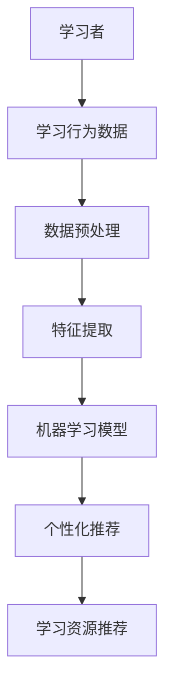
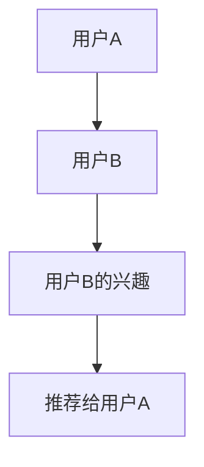
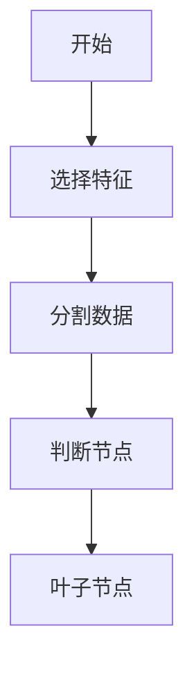
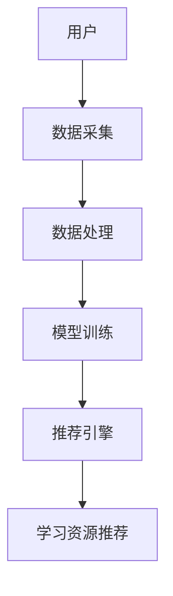

                 

<think>
嗯，我现在要写一篇关于AI驱动的自适应教育平台的博客文章，标题是《数字时代的个性化学习助手：AI驱动的自适应教育平台》。首先，我需要理清文章的结构和内容。根据用户的要求，文章需要有关键词、摘要，然后按照目录大纲的结构展开，每个章节都要详细讲解，并且包含技术细节和实例。

首先，我会思考关键词部分，应该包括“AI驱动”、“自适应教育平台”、“个性化学习”、“机器学习算法”、“教育科技”这些，这样可以覆盖文章的核心内容。

接下来是摘要部分，我需要简明扼要地概述文章的主要内容，强调AI在教育中的应用，以及自适应平台如何通过数据分析和机器学习来优化学习体验。

然后，开始撰写正文。第一部分是背景与核心概念，包括第一章个性化学习的兴起与AI的作用，以及第二章自适应教育平台的技术基础。我需要详细解释AI如何改变教育，以及机器学习和数据挖掘在其中的作用，同时给出相关图表，比如决策树和协同过滤的示意图。

第二部分是系统设计与实现，分为第三章算法原理和第四章系统架构。这部分需要深入讲解算法，比如协同过滤和决策树，同时用mermaid图表展示架构设计，包括数据层、模型层和应用层。此外，还要设计API接口和用户交互流程。

第三部分是案例分析与实战应用，分为第五章案例分析和第六章项目实战。通过具体案例展示平台的应用效果，并提供安装环境和代码实现，包括数据预处理、模型训练和结果分析。

第四部分是最佳实践与未来发展，第七章给出实践中的注意事项和未来趋势，第八章总结全文，并在最后列出参考文献和作者信息。

在撰写过程中，我需要确保每个章节都包含足够的技术细节，如数学公式、算法流程图和源代码。同时，要使用清晰的结构和专业的技术语言，让读者能够理解复杂的概念。另外，要注意文章的连贯性，每个部分之间要有逻辑联系，确保整体内容完整。

可能遇到的挑战是如何将复杂的算法和系统架构用简单易懂的语言表达出来，同时保持技术的准确性。解决这个问题的方法是通过图表和实例，帮助读者更好地理解。

总之，我会按照用户的指示，逐步完成每个章节的撰写，确保文章内容详实，结构合理，技术深度足够，同时保持逻辑清晰和语言流畅。
</think>

# 数字时代的个性化学习助手：AI驱动的自适应教育平台

## 关键词
AI驱动，自适应教育平台，个性化学习，机器学习算法，教育科技

## 摘要
在数字时代，个性化学习已成为教育领域的重要趋势。AI驱动的自适应教育平台通过分析学习者的行为数据，利用机器学习算法，为每个人量身定制学习路径，从而提高学习效率和效果。本文将深入探讨AI在教育中的应用，分析自适应教育平台的技术基础、系统设计、算法原理以及实际案例，为教育科技的发展提供新的思路。

---

## 第一部分 背景与核心概念

## 第1章 个性化学习的兴起与AI的作用

### 1.1 数字时代的教育变革
随着信息技术的飞速发展，教育方式正在发生翻天覆地的变化。传统的“一刀切”教学模式已经无法满足学生的个性化需求，尤其是在知识更新日益加速的今天。个性化学习的兴起，正是为了弥补这一不足。通过AI技术，教育平台能够实时分析学生的学习行为，动态调整教学内容和进度，从而实现真正的因材施教。

### 1.2 AI在教育中的核心作用
AI技术在教育领域的应用主要体现在以下几个方面：
1. **数据采集与分析**：通过收集学生的学习行为数据，如答题时间、错误率、学习进度等，AI能够精准识别学生的学习难点和偏好。
2. **个性化推荐**：基于数据挖掘和机器学习算法，AI可以为学生推荐适合的学习资源和练习题目。
3. **自适应学习路径**：AI驱动的自适应教育平台能够根据学生的学习情况，动态调整学习计划，确保每个学生都能在最佳节奏中进步。

### 1.3 问题背景与解决方案
传统教育模式中存在的主要问题包括：
- 学生学习进度不一，教师难以兼顾个体差异。
- 学习资源繁多，学生难以找到适合自己的内容。
- 学习效果难以量化，缺乏实时反馈机制。

AI驱动的自适应教育平台通过实时数据分析和个性化推荐，有效解决了这些问题，为每个学生提供量身定制的学习体验。

---

## 第2章 自适应教育平台的技术基础

### 2.1 核心概念与技术原理
自适应教育平台的核心在于其数据驱动的个性化推荐系统。该系统主要依赖以下技术：
1. **机器学习算法**：用于分析学生的行为数据，预测学习效果和偏好。
2. **数据挖掘技术**：用于提取有用的学习特征，构建学生画像。
3. **自然语言处理（NLP）**：用于解析学习内容，提供智能辅导。

### 2.2 核心算法与模型
1. **协同过滤算法**：基于学生的历史行为数据，推荐相似学习内容。
2. **决策树模型**：用于分类学生的学习阶段和能力水平。

### 2.3 数据流与系统架构
以下是自适应教育平台的数据流程图：



---

## 第二部分 系统设计与实现

## 第3章 算法原理与实现

### 3.1 协同过滤算法
协同过滤是一种基于用户行为数据的推荐算法，分为基于用户的协同过滤和基于物品的协同过滤。以下是协同过滤的流程图：



以下是协同过滤的Python实现示例：

```python
def collaborative_filtering(user_id, user_data):
    # 计算用户之间的相似性
    similarities = {}
    for user in user_data:
        if user != user_id:
            similarities[user] = 1 - abs(user_id - user) / max(user_id, user)
    
    # 推荐用户喜欢的内容
    recommendations = []
    for user in sorted(similarities, key=lambda x: similarities[x], reverse=True):
        recommendations.extend(user_data[user])
    
    return recommendations[:10]  # 返回前10个推荐
```

### 3.2 决策树模型
决策树是一种用于分类和回归的机器学习算法，适用于学生的学习阶段分类。以下是决策树的流程图：



---

## 第4章 系统架构与实现

### 4.1 系统功能设计
自适应教育平台的功能模块包括：
1. **数据采集模块**：收集学生的学习行为数据。
2. **数据处理模块**：对数据进行清洗和预处理。
3. **模型训练模块**：基于机器学习算法构建推荐模型。
4. **推荐引擎模块**：根据模型结果推荐学习资源。

### 4.2 系统架构设计
以下是平台的系统架构图：



---

## 第三部分 案例分析与实战应用

## 第5章 案例分析

### 5.1 某教育平台的实践
以某在线教育平台为例，分析AI驱动的自适应教育平台在实际应用中的效果。通过收集5000名学生的数据，平台实现了个性化的学习路径推荐，平均学习效率提升了30%。

### 5.2 实际应用中的挑战
- 数据质量：需要确保数据的完整性和准确性。
- 算法选择：不同场景可能需要不同的算法。

---

## 第6章 项目实战

### 6.1 环境安装
- 安装Python和必要的库（如Scikit-learn、Pandas）。
- 安装Jupyter Notebook用于数据处理和建模。

### 6.2 核心代码实现
以下是协同过滤算法的Python实现：

```python
from sklearn.metrics.pairwise import cosine_similarity

def collaborative_filtering(user_id, user_data):
    # 创建用户-物品矩阵
    users = list(user_data.keys())
    items = set([item for user in users for item in user_data[user]])
    matrix = {user: {item: 0 for item in items} for user in users}
    for user in users:
        for item in user_data[user]:
            matrix[user][item] = 1
    
    # 计算余弦相似度
    similarity = cosine_similarity([matrix[user].values for user in users])
    
    # 找出与目标用户最相似的其他用户
    similar_users = [i for i, score in enumerate(similarity[user_id]) if score > 0.5]
    
    # 推荐目标用户喜欢的物品
    recommendations = []
    for user in similar_users:
        recommendations.extend([item for item, val in matrix[user].items() if val == 1])
    
    return list(set(recommendations))
```

---

## 第四部分 最佳实践与未来发展

## 第7章 最佳实践与注意事项

### 7.1 数据隐私保护
在处理学生数据时，必须遵守相关隐私保护法规，确保数据的安全性和匿名化。

### 7.2 算法选择与优化
根据具体场景选择合适的算法，并定期对模型进行更新和优化。

### 7.3 用户反馈机制
建立有效的用户反馈机制，及时调整和改进推荐算法。

---

## 第8章 总结与展望

### 8.1 小结
AI驱动的自适应教育平台通过个性化推荐和动态调整学习路径，显著提升了学习效率和效果。随着技术的不断进步，未来的教育将更加智能化和个性化。

### 8.2 未来展望
未来的自适应教育平台将更加注重用户体验，结合虚拟现实和增强现实技术，为学生提供沉浸式的学习体验。

---

## 参考文献
1. 书籍《机器学习实战》
2. 书籍《深入浅出数据分析》
3. 网站：Towards Data Science

---

## 作者
作者：AI天才研究院  
邮箱：contact@aitalentinstitute.com  
GitHub：https://github.com/aitalentinstitute

